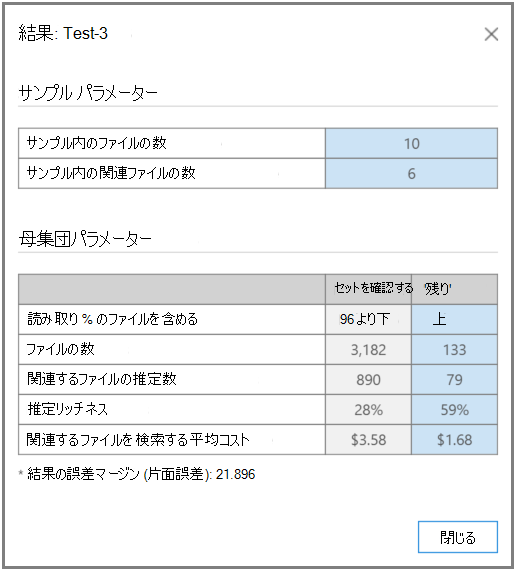

# テストの関連性分析 (Advanced eDiscovery
  
[テスト] タブAdvanced eDiscovery、処理の全体的な品質をテスト、比較、検証できます。 これらのテストは、バッチ計算後に実行されます。 コレクション内のファイルにタグを付け、専門家は、タグ付けされた各ファイルがケースに関連するかどうかを最終的に判断します。
  
単一および複数の問題のシナリオでは、通常、テストは問題ごとに実行されます。 各テストの後に結果を表示し、指定したサンプル テスト ファイルを使用してテスト結果を再作業できます。
  
## 残りのテスト

"残りのテスト" テストは、カリングの決定を検証するために使用されます。たとえば、最終結果に基づいて特定の関連性カットオフ スコアより上のファイルのみを確認Advanced eDiscoveryします。 エキスパートは、選択したカットオフ スコアの下にあるファイルのサンプルをレビューして、そのセット内の関連ファイルの数を評価します。
  
このテストでは、レビュー セットと残りの母集団の統計と比較を提供します。 レビュー セットの結果は、トレーニング中に関連性によって計算された結果です。 結果には、次のような設定と入力パラメーターに基づく計算が含まれます。
  
- サンプルおよび識別された関連ファイル内のファイル数のサンプル統計をテストします。

- レビュー セットの母集団パラメーターと残りの部分の表形式比較 (たとえば、ファイルの数、関連するファイルの推定数、推定リッチ度、および別の関連ファイルを検索する平均コストなど)。 コスト パラメーターの設定は、管理者が設定できます。

"残りのテスト" テストを実行するには、次のコマンドを実行します。

1. [関連性 **テスト] タブ \> を開** きます。

2. [テスト] **タブで** 、[新しいテスト] **をクリックします**。 次 **の例に示** すように、[テストの作成] ダイアログが表示されます。

    
  
3. [ **テスト名]** と [ **説明] に**、名前と説明を入力します。

4. [テストの **種類] ボックスの** 一覧で、[ **残りのテスト] を選択します。**

5. [問題 **/ カテゴリ] ボックスの** 一覧で、問題の名前を選択します。

6. [読み **込み] リスト** で、負荷を選択します。 

7. [ **読み取り %]** で、既定値を受け入れるか、カットオフ関連性スコアの値を選択します。 

8. [ **サイズの設定]** で、または既定値を受け入れる。 復元アイコンは既定値を復元します。

9. [タグ **付けの開始] をクリックします**。 テスト サンプルが生成されます。

10. [関連性タグ] タブの各ファイルを確認してタグ付 **けし、 \>** 完了したら、[計算] を **クリックします**。

11. [テスト] タブで、[結果の表示] **をクリックして** テスト結果を表示できます。 例を次のスクリーンショットに示します。

    
  
前のスクリーンショットでは、テーブルの **[サンプル** パラメーター] セクションには、エキスパートによってタグ付けされたサンプル内のファイルの数と、そのサンプルで見つかった関連ファイルの数に関する詳細が含まれています。
  
表 **の [母** 集団パラメーター] セクションには、選択したカットオフより下のスコアを持つファイルのレビュー セットの母集団、および選択したカットオフより上のスコアを持つファイルの "残りの" 母集団など、テスト結果が含まれます。 母集団ごとに、次の結果が表示されます。
  
- 読み取り % を含むファイルを含む - 指定されたカットオフ

- ファイルの総数

- 関連するファイルの推定数

- 推定豊富さ

- 別の関連ファイルを検索する平均レビュー コスト

## スライスのテスト

"Test the Slice" テストは、"Test the Rest" テストと同様のテストを実行しますが、関連度の読み取り % で指定されたファイル セットのセグメントに対して実行されます。

"Test the Slice" テストを実行するには、次のコマンドを実行します。
  
1. [関連性 **テスト] タブ \> を開** きます。

2. [テスト] **タブで** 、[新しいテスト] **をクリックします**。 [ **テストの作成]** ダイアログが表示されます。

3. [ **テスト名]** と [ **説明] に** 情報を入力します。

4. [テストの **種類] ボックスの一覧** で、[ **スライスのテスト] を選択します**。

5. [問題 **] ボックスの** 一覧で、問題の名前を選択します。

6. [読み **込み] リスト** で、負荷を選択します。

7. [ **読み取り % between]** で、既定の低範囲および高範囲の値を受け入れるか、カットオフ関連性スコアの値を選択します。

8. [ **サイズの設定]** で値を選択するか、既定値を受け入れる。

    復元アイコンは既定値を復元します。

9. [タグ **付けの開始] をクリックします**。 テスト サンプルが生成されます。

10. [関連性タグ] タブの各ファイルを確認してタグ付 **けし、 \>** 完了したら、[計算] を **クリックします**。

11. [テスト] タブで、[結果の表示] **をクリックして** テスト結果を表示できます。
