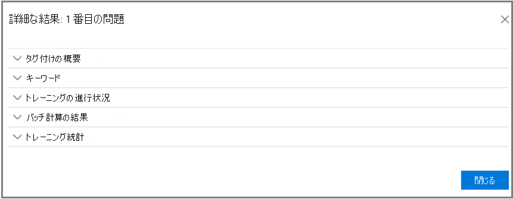

# 電子情報開示での関連性分析の追跡 (プレミアム)
  
Microsoft Purview 電子情報開示 (プレミアム) の [関連性追跡] タブには、[タグ] タブで実行された関連性トレーニングの計算された有効性が表示され、関連性の反復トレーニング プロセスで実行する次の手順が示されます。 
  
## 関連性トレーニングの状態を追跡する

1. 以下の問題 **名** ダイアログの次の例に示すように、ケースの問題の関連度トラックで次の詳細を表示します。

   - **評価**: この進行状況インジケーターは、この時点に対して実行された関連性トレーニングが、誤差のマージンの観点から評価目標を達成した度合いを示します。 関連性トレーニングの結果の豊富さも表示されます。

   - **トレーニング**: この色分けされた進行状況インジケーターとツール ヒントは、関連性トレーニング結果の安定性と、問題ごとにタグ付けされた関連性トレーニング サンプルの数を示す数値スケールを示します。 エキスパートは、反復的な関連性トレーニング プロセスの進行状況を監視します。 
  
   - **バッチ計算**: この進行状況インジケーターは、Batch 計算の完了に関する情報を提供します。
  
   - **次の手順**: 実行する次の手順の推奨事項を表示します。 
  
    この例では、問題に対して正常に完了した評価が、完了した色の進行状況インジケーターとチェックマークで示されています。 タグ付けは進行中ですが、ケースは依然として不安定と見なされます (ツール ヒントにも安定性の状態が表示されます)。 次の手順の推奨事項は、"トレーニング" です。 
  
    
  
    展開されたビューには、追加情報とオプションが表示されます。 表示される現在のエラー マージンは、既存の (既にタグ付けされている) 評価ファイルを考慮して、評価の現在の状態におけるリコールのエラー マージンです。
  
    > [!NOTE]
    >  評価ステージは、問題ごとに [ **評価** ] チェック ボックスをオフにしてから、"すべての問題" に対してバイパスできます。 ただし、その結果、この問題の統計情報はありません。 > 評価チェック ボックスのクリアは、 **評価** が実行される前にのみ実行できます。 1 つのケースに複数の問題がある場合、評価は、問題ごとにチェック ボックスがオフになっている場合にのみバイパスされます。 
  
    ファイルの最初のサンプル セットで評価が完了しない場合、評価は、より多くのファイルにタグを付ける次の手順になる可能性があります。
  
    **関連性** \> **トラック** では、トレーニング進行状況インジケーターとツール ヒントは、安定性に到達するために必要な追加のサンプルの推定数を示します。 この見積もりでは、必要な追加のトレーニングのガイドラインが提供されます。
  
    
  
2. タグ付けが完了し、トレーニングを続行する必要がある場合は、[ **トレーニング**] をクリックします。 ファイルの別のサンプル セットは、追加のトレーニングのために読み込まれたファイル セットから生成されます。 その後、[タグ] タブに戻り、追加のファイルにタグを付けてトレーニングします。

### 安定したトレーニング レベルに達する

評価ファイルが安定したレベルのトレーニングを達成すると、電子情報開示 (プレミアム) は Batch 計算の準備が整います。
  
> [!NOTE]
> 通常、3 つの安定したトレーニング サンプルの後、次の手順は "バッチ計算" です。 たとえば、以前のサンプルのファイルのタグ付けに変更があった場合や、シード ファイルが追加された場合など、例外が発生する可能性があります。 
  
### バッチ計算の実行

バッチ計算は、トレーニングが正常に完了した後の次のステップとして実行されます (進行状況バーに安定したトレーニング状態が表示されると、ツール ヒントにチェックマークと安定した状態が表示されます)。バッチ計算では、関連性トレーニング中に取得したナレッジをファイルの作成全体に適用し、ファイルの関連性を評価し、関連性スコアを割り当てます。
  
複数の問題がある場合、バッチ計算は問題ごとに実行されます。 バッチ計算中は、すべてのファイルの処理中に進行状況が監視されます。 
  
ここでは、推奨される次の手順は "None" です。これは、この時点で追加の反復的な関連性トレーニングは必要ないことを示します。 次のフェーズは、[ **関連性 \> の決定** ] タブです。 
  
Batch 計算後に新しいファイルをインポートする場合、管理者はインポートしたファイルを新しい読み込みに追加できます。
  
> [!NOTE]
> バッチ計算中に **[キャンセル]** をクリックすると、既に実行された内容がプロセスによって保存されます。 Batch 計算をもう一度実行すると、プロセスは最後に実行されたポイントから続行されます。 
  
### タグ付けの一貫性の評価

ファイルのタグ付けに不整合がある場合は、分析に影響を与える可能性があります。 電子情報開示 (プレミアム) のタグ付け整合性プロセスは、結果が最適でない場合や一貫性が不明な場合に使用できます。 一貫性のないタグ付けされた可能性のあるファイルの一覧が返され、必要に応じて確認および再タグ付けできます。
  
> [!NOTE]
> 評価後の 7 つ以上のトレーニング ラウンドの後、タグ付けの一貫性は **、関連性** \> **追跡** \> **の問題** \> **の詳細な結果** \> **トレーニングの進行状況** で表示できます。 このレビューは、一度に 1 つの問題に対して行われます。
  
1. **[関連性トラック] \>** で、問題の行を展開します。
  
2. **[次の手順**] の右側にある [**変更**] をクリックします。
  
3. **[次の手順**] オプションとして [**タグの不整合**] を選択し、7 つのトレーニング サンプルの後に **[OK]** をクリックします。
  
4. [ **タグの不整合**] を選択します。 [ **タグ]** タブが開き、必要に応じて再タグ付けする不整合の一覧が表示されます。
  
5. [ **計算** ] をクリックして変更を送信します。 不整合をタグ付けした後の次の手順は、"トレーニング" です。 
  
## 関連性の結果の表示と使用

[ **関連性 \> の追跡** ] タブで問題の行を展開し、[ **詳細な結果**] の横にある [ **表示**] をクリックします。 次に示すように、[詳細な結果] ウィンドウが表示されます。
  

  
### タグ付けの概要

 次に示す例では、 **タグ付けの概要** には、評価、トレーニング、およびキャッチアップファイルのタグ付けプロセスごとの合計が表示されます。
  

  
### キーワード

キーワードは、ファイルが関連しているかどうかを示す重要な指標として電子情報開示 (プレミアム) によって識別されるファイル内の一意の文字列、単語、語句、または単語のシーケンスです。 "含める" 列には、関連としてタグ付けされたファイル内のキーワードと重みが一覧表示され、[除外] 列には、関連しないとしてタグ付けされたファイル内のキーワードと重みが一覧表示されます。
  
電子情報開示 (プレミアム) では、負または正のキーワードの重み値が割り当てられます。 重みが高いほど、キーワードが表示されるファイルに、Batch 計算時に高い関連性スコアが割り当てられる可能性が高くなります。
  
キーワードの電子情報開示 (プレミアム) リストは、専門家によって構築されたリストを補完したり、ファイルレビュー プロセス内の任意の時点で間接的なサニティ チェックとして使用したりできます。
  
### トレーニングの進行状況

**[トレーニングの進行状況**] ウィンドウには、次の例に示すように、トレーニング進行状況グラフと品質インジケーターの表示が含まれています。
  

  
**トレーニング品質インジケーター**: タグ付けの一貫性の評価を次のように表示します。
  
- **適切**: ファイルは一貫してタグ付けされます。 (緑色のライトが表示されます)
  
- **中**: 一部のファイルに一貫性のないタグが付けられている可能性があります。 (黄色のライトが表示されます)

- **警告**: 多くのファイルに一貫性のないタグが付けられている可能性があります。 (赤色のライトが表示されます)

**トレーニング進行状況グラフ**: F メジャー値と比較して、多くの関連性トレーニング サイクル後の関連性トレーニングの安定性の度合いを示します。 グラフ全体で左から右に移動すると、信頼区間が狭く、F メジャーと共に電子情報開示 (プレミアム) 関連度によって使用され、関連性トレーニングの結果が最適化されたときに安定性が判断されます。
  
> [!NOTE]
> 関連性では、F メジャー メトリックである F2 が使用されます。ここで、Recall は精度の 2 倍の重みを受け取ります。 リッチ度が高い (25% を超える) 場合、関連性は F1 (1:1 の比率) を使用します。 F メジャー比は、 **関連性の設定** \> **の詳細設定** で構成できます。
  
### バッチ計算の結果

**[バッチ計算結果**] ウィンドウには、関連性のスコア付けされたファイルの数が次のように表示されます。 
  
- **Success**
  
- **空**: テキストを含まない (たとえば、スペース/タブのみ)
  
- **失敗:** サイズが大きすぎるか、読み取れませんでした
  
- **無視**: サイズが大きすぎるため
  
- **Nebulous**: 意味のないテキストが含まれているか、問題に関連する機能が含まれていない
  
> [!NOTE]
> 空、失敗、無視、または Nebulous は、-1 の関連性スコアを受け取ります。
  
### トレーニング統計

**[トレーニング統計**] ウィンドウには、電子情報開示 (プレミアム) 関連性トレーニングの結果に基づいて統計とグラフが表示されます。 
  

  
このビューには、次のものが表示されます。
  
- **校閲と再現率**: 仮説的に線形的なレビューにおける関連性スコアに従った結果の比較。 再呼び出しは、レビュー セットのサイズ セットによって推定されます。
  
- **パラメーター**: ケース全体のファイルの作成に関連して、レビュー セットに関連する累積計算統計。
  
- **レビュー**: このカットオフに基づいて確認するファイルの割合。
  
- **思い出す**: レビュー セット内の関連ファイルの割合。 
  
- **関連性スコアによる分布**: 左側の濃い灰色の表示のファイルは、カットオフ スコアの下にあります。 ツール ヒントには、合計ファイルに対するレビュー ファイル セット内の関連性スコアと関連するファイルの割合が表示されます。
