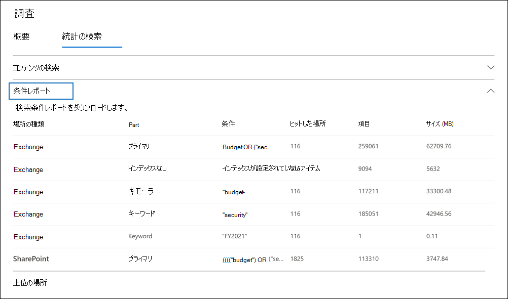

# 電子情報開示検索結果の統計情報を表示する

[!include[Purview banner](../includes/purview-rebrand-banner.md)]

Microsoft Purview 電子情報開示 (Standard) ケースに関連付けられたコンテンツ検索または検索を作成して実行すると、推定検索結果に関する統計情報を表示できます。 これには、検索結果の概要 (検索ポップアップ ページに表示される推定検索結果の概要と同様)、検索クエリに一致するアイテムを含むコンテンツの場所の数、最も一致するアイテムを含むコンテンツの場所の ID などのクエリ統計情報が含まれます。
  
さらに、キーワードリストを使用して、検索クエリ内の各キーワードの統計情報を返すように検索を構成できます。 これにより、クエリ内の各キーワードによって返される結果の数を比較できます。
  
検索統計情報を CSV ファイルにダウンロードすることもできます。 これにより、Excelのフィルター処理と並べ替え機能を使用して結果を比較し、検索結果のレポートを準備できます。
  
## 検索の統計情報を取得する

コンテンツ検索または電子情報開示 (Standard) ケースに関連付けられた検索の統計情報を表示するには::
  
1. Microsoft Purview コンプライアンス ポータルで、[ **すべて表示**] をクリックし、次のいずれかの操作を行います。

   - [ **コンテンツ検索** ] をクリックし、検索を選択してポップアップ ページを表示します。

     または

   - **[eDiscoveryCore** > ] をクリックしてケースを選択し、[**検索**] タブで検索を選択してポップアップ ページを表示します。

2. 選択した検索のポップアップ ページで、[ **検索統計** ] タブをクリックします。
  
   ![[検索統計] タブ。](../media/SearchStatistics1.png)

**[検索統計**] タブには、検索に関するさまざまな種類の統計情報を含む次のセクションが含まれています。

### コンテンツの検索

このセクションでは、検索によって返された推定アイテムの概要をグラフィカルに表示します。 これは、検索条件に一致するアイテムの数を示します。 この情報は、検索によって返されるアイテムの推定数に関するアイデアを提供します。

- **場所別の推定アイテム**: 検索によって返された推定アイテムの合計数。 メールボックス内およびサイト内にあるアイテムの特定の数も表示されます。

- **ヒットした推定場所**: 検索によって返されたアイテムを含むコンテンツの場所の合計数。 メールボックスとサイトの場所の特定の数も表示されます。

- **場所別のデータ 量 (MB 単位):** 検索によって返されたすべての推定アイテムの合計サイズ。 メールボックス アイテムとサイト アイテムの特定のサイズも表示されます。

### 条件レポート

このセクションでは、検索クエリに関する統計情報と、検索クエリのさまざまな部分に一致した推定アイテムの数を表示します。 これらの統計情報を使用して、検索クエリの各コンポーネントに一致する項目の数を分析できます。 これにより、検索条件を絞り込み、必要に応じてスコープの範囲を絞り込むことができます。 このレポートのコピーを CSV 形式でダウンロードすることもできます。

- **場所の種類**: クエリの統計情報が適用されるコンテンツの場所の種類。 **Exchange** の値はメールボックスの場所を示します。**SharePoint** の値はサイトの場所を示します。

- **パート**: 統計が適用される検索クエリの一部。 **プライマリは** 、検索クエリ全体を示します。 **キーワード** は、行内の統計が特定のキーワードに対する統計であることを示します。 検索クエリにキーワード リストを使用する場合、クエリの各コンポーネントの統計情報がこの表に含まれます。 詳細については、「 [検索のキーワード統計を取得する」を参照してください](#get-keyword-statistics-for-searches)。

- **条件**: 対応する行に表示される統計を返した検索クエリの実際のコンポーネント (キーワードまたは条件)。

- **ヒットした場所**: **条件** 列に一覧表示されているプライマリ クエリまたはキーワード クエリに一致するアイテムを含むコンテンツ **の場所 ([場所の種類**] 列で指定) の数。

- **アイテム**: **[条件** ] 列に一覧表示されたクエリと一致するアイテムの数 (指定したコンテンツの場所から)。 前述のように、検索対象のキーワードの複数のインスタンスがアイテムに含まれている場合は、この列に 1 回だけカウントされます。

- **サイズ (MB)**: **[条件** ] 列の検索クエリと一致する (指定されたコンテンツの場所で) 見つかったすべてのアイテムの合計サイズ。

### トップの場所

このセクションでは、検索によって返された最も多くのアイテムを含む特定のコンテンツの場所に関する統計情報を表示します。 上位 1,000 の場所が表示されます。 このレポートのコピーを CSV 形式でダウンロードすることもできます。

- 場所名 (メールボックスの電子メール アドレスとサイトの URL) の名前。

- 場所の種類 (メールボックスまたはサイト)。

- 検索によって返されたコンテンツの場所のアイテムの推定数。

- 各コンテンツの場所にある推定アイテムの合計サイズ。

## 検索のキーワード統計を取得する

前に説明したように、[ **条件] レポート** セクションには、検索クエリと、クエリに一致する項目の数 (およびサイズ) が表示されます。 検索クエリを作成または編集するときにキーワード リストを使用する場合は、各キーワードまたはキーワード フレーズに一致するアイテムの数を示す拡張統計を取得できます。 これにより、クエリのどの部分が最も効果的 (かつ最も効果的でない) かを迅速に特定できます。 たとえば、キーワードが多数のアイテムを返す場合、キーワード クエリを絞り込んで検索結果を絞り込むことができます。

キーワード リストを作成し、検索のキーワード統計を表示するには:
  
1. コンプライアンス ポータルで、新しいコンテンツ検索または電子情報開示 (Standard) ケースに関連付けられた検索を作成します。

2. 検索ウィザードの **[条件]** ページ。 **[キーワード リストの表示**] チェック ボックスをオンにします。

   ![[キーワード一覧を表示] チェック ボックス。](../media/SearchKeywordsList1.png)

3. キーワード テーブルの行にキーワードまたはキーワード フェーズを入力します。 たとえば、最初の行に **予算** を入力し、2 行目に **「セキュリティ** 」と入力し、3 行目に **「FY2021** 」と入力します。

   

   > [!NOTE]
   > 大規模なキーワード リストに起因する問題を軽減するために、検索クエリのキーワード リスト内の最大 20 行に制限されています。

4. 検索する一覧にキーワードを追加し、統計情報を取得した後、検索を実行します。

5. 検索が完了したら、それを選択してポップアップ ページを表示します。

6. [ **検索統計** ] タブで、[ **条件] レポート** をクリックして、検索のキーワード統計を表示します。

    
  
    前のスクリーンショットで示したように、各キーワードの統計情報が表示されます。次の情報が含まれます。

    - 検索に含まれるコンテンツの場所の各種類に対するキーワード統計。

    - インデックスが設定されていないメールボックス アイテムの数。

    - 検索クエリの条件を含む、各キーワードの実際の検索クエリと結果 (**[パーツ**] 列の **[キーワード**] として識別されます)。

    - 完全な検索クエリ (**パーツ** 列で **プライマリ** として識別) と、各場所の種類に対する完全なクエリの統計情報。 これらは、[ **概要** ] タブに表示されるのと同じ統計情報であることに注意してください。
