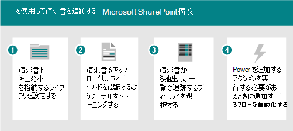

# Microsoft SharePoint Syntex のシナリオとユース ケース

次のシナリオの例を使用して、組織で使用する方法に関するSharePoint Syntexを確認します。

- [シナリオ: フォーム処理を使用して請求書からデータを追跡する](adoption-scenarios.md#scenario-track-data-from-invoices-with-form-processing)
- [シナリオ: ドキュメントを理解して契約からの情報を追跡する](adoption-scenarios.md#scenario-track-information-from-contracts-with-document-understanding)
- [シナリオ: レコード管理、ドキュメント ガバナンス、およびコンプライアンス プロセスを基にしたリスクを回避SharePoint Syntex](adoption-scenarios.md#scenario-avoid-risk-with-records-management-document-governance-and-compliance-processes-based-on-sharepoint-syntex)
- [シナリオ: 以前にアクセスできないドキュメントから情報をキャプチャする](adoption-scenarios.md#scenario-capture-information-from-previously-inaccessible-documents)
- [シナリオ: データ処理を改善して分析と分析を提供する](adoption-scenarios.md#scenario-improve-data-processing-to-provide-insights-and-analytics)
- [シナリオ: 注文処理の自動化](adoption-scenarios.md#scenario-automate-order-processing)
- [シナリオ: ビザの更新プロセスを簡素化する](adoption-scenarios.md#scenario-simplify-visa-renewal-process)

## シナリオ: フォーム処理を使用して請求書からデータを追跡する

たとえば、請求書を追跡および監視するために、SharePoint SyntexおよびPower Automate機能を使用してプロセスを設定できます。

1. 請求書ドキュメントを格納するライブラリを設定します。
1. ドキュメント内のフィールドを認識するようにモデルをトレーニングします。
1. 追跡するフィールドをリストに抽出します。
1. 次のような特定のイベントについて通知するフローを設定します。
    - 新しい請求書が追加されます。
    - 請求書が期日を過ぎた。
    - 請求書は、自動承認金額よりも大きい金額です。

このシナリオを自動化すると、次の操作を実行できます。

- 手動で行う代わりに、請求書からデータを自動的に抽出することで、時間と資金を節約できます。
- ワークフローを使用して請求書をチェックし、問題を通知することで、潜在的なエラーを減らし、コンプライアンスを強化します。

## シナリオ: ドキュメントを理解して契約からの情報を追跡する

別の例として、会社が他の会社や個人との契約を特定するプロセスを設定できます。 クライアント名、手数料、日付、その他の重要な情報など、それらの契約から重要な情報を抽出し、すぐに表示できるフィールドとしてライブラリに情報を追加するモデルを設定します。 ドキュメント ライブラリに保持ラベルを適用して、ビジネス規制に適切に準拠するために、特定の期間前に契約を削除できません。

1. コンテンツ センターから開始し、契約の新しいドキュメント理解モデルを作成します。
1. アップロード例のサンプル ドキュメントを作成し、トレーニングを実行して契約ドキュメントを特定し、結果を確認します。
1. 抽出プログラムをトレーニングして、クライアント名、手数料、日付などのコントラクト内のフィールドを識別し、抽出プログラムをテストします。
1. モデルが完了したら、契約書をアップロードできるライブラリにモデルを適用します。
1. 保持ラベルを日付フィールドに適用して、必要な期間、契約がライブラリに保持されます。

このシナリオを自動化すると、次の操作を実行できます。

- 手動で行う代わりに、契約からデータを自動的に抽出することで、時間と資金を節約できます。
- 保持ラベルを使用して、契約が適切に保持されるのを確認して、コンプライアンスを強化します。

## シナリオ: レコード管理、ドキュメント ガバナンス、およびコンプライアンス プロセスを基にしたリスクを回避SharePoint Syntex

リスクを減らすことは、ほとんどの企業にとって一般的な目標です。 以下が必要な場合があります。

- テナント全体に情報ガバナンスを提供/適用する優れた方法。
- プロジェクトの「レコード」と見なされるドキュメント、電子メール、その他のコミュニケーションの分類システムを改善する。
- 会社のポリシーに準拠するために、領収書、契約などについて監査する。
- コンプライアンスに必要なすべてのドキュメントがプロジェクトに含まれています。

より良いガバナンスを必要とするドキュメントSharePoint Syntexフォームをキャプチャし、適切に分類、監査、フラグを設定するために、コンプライアンスに関するプロセスを設定します。 エンド ユーザーが手動でタグSharePoint Syntex、コンプライアンス チームがガバナンス ルールとアーカイブを手動で適用するのではなく、コンテンツを自動分類する方法を利用できます。 また、簡単な検索エクスペリエンスを有効にし、データボリュームを管理し、レコード管理と保持ポリシーを適用し、コンプライアンスを確保し、ベスト プラクティスのアーカイブと削除を行います。

このシナリオを自動化すると、次のセキュリティを確保できます。

- コンプライアンスが支持され、リスクが軽減されます。
- 分類とレコード管理は、一貫して正確に適用されます。
- コンテンツ ボリュームが制御されます。
- 従業員は、適切なコンテキストで適切な情報を簡単に検出できます。

## シナリオ: 以前にアクセスできないドキュメントから情報をキャプチャする

ほとんどの組織には、法的ドキュメント、ポリシー、契約、人事ドキュメント、ガバナンス ガイドラインの大規模なリポジトリがあります。 これらのデータ ストアを採掘して、プロジェクト、セクター、テーマ、人、地理的領域などの貴重な情報を抽出します。

たとえば、人事担当ディレクターは、履歴書、人事ポリシー、その他のフォームを含むすべての人事ドキュメントにすばやくアクセスする必要があります。 また、ドキュメントを手動でふるいにかけることなく、履歴書や他の人事関連のドキュメントから必要な情報をすばやく特定したいと考える必要があります。 何千もの履歴書、人事ポリシー、および複数のサイトに広がる可能性があるその他のドキュメントを手動で確認することなく、必要な情報をすばやく見つけ出すソリューションを探しています。

このシナリオを自動化すると、次の操作を実行できます。

- デジタル コンテンツから知識のロックを解除します。
- 人事ポリシー、履歴書、販売ドキュメント、技術設計図、アカウントプランを分類し、情報を抽出します。
- 探している正しい情報やドキュメントをすばやく見つける。
- 最新情報に即座にアクセスできます。
- 検索時間を短縮します。

## シナリオ: データ処理を改善して分析と分析を提供する

たとえば、製薬会社は、SHAREPOINT SYNTEXを使用して、FDA ドキュメントから情報を抽出して、リーダーが持っている質問に答えます。 回答に簡単にアクセスできると、これらの回答を生成するために必要な時間が短縮され、データの可用性が向上して、リーダーシップに関する質問に対するより正確な回答が生成されます。

たとえば、プロジェクト マネージャーは、リーダーシップ チームからの製品関連の質問に対する回答をすばやく提供する必要があります。 1 つの統合ダッシュボードでクエリに関連する情報と指標を見つける必要があります。 製品ラベル、製品パンフレット、その他の資料から必要な情報を抽出し、リーダーシップ チームに報告する際に使用できる統合レポートを生成するソリューションを探しています。

このシナリオを自動化すると、次の操作を実行できます。

- 回答を生成する時間を短縮します。
- データの可用性を高める。
- より正確な回答を提供します。

## シナリオ: 注文処理の自動化

このSharePoint Syntex、顧客注文の手動処理の時間を短縮できます。 たとえば、OCR 処理を使用して FAX、電子メール、または紙から SharePoint に注文をアップロードし、それらの注文からメタデータを抽出して、自動化されたプロセスを使用して注文を満たします。

たとえば、サプライ チェーン マネージャーは、手動データ入力によるエラーを減らしたいと考しています。 ビジネス システムに入るエラーを減らすために、受信顧客注文 (紙、FAX、または電子メール) の手動レビューとデータ入力を回避したいと考えています。 AI と機械学習の手法を適用して、受信注文情報を検証し、コア データを抽出し、注文のフルフィルメントと調整のために ERP システムに自動的にプッシュするソリューションが必要です。

このシナリオを自動化する場合は、次の操作を実行できます。

- 注文と出荷の精度が向上します。
- 注文または出荷エラーに関連する手数料またはペナルティが軽減されます。
- 請求や支払いの遅延が減少します。
- 人件費が削減されます。

## シナリオ: ビザの更新プロセスを簡素化する

SharePoint Syntex契約情報のリマインダーと更新を自動化するのに役立ちます。 たとえば、人事担当ディレクターは、従業員のビザが最新の日付または期限内に更新される必要があります。 彼らは、人々に自分のビザを更新するための簡単で直感的なプロセスを提供したいと考っています。 契約から更新日を抽出し、更新日が近づいているときに従業員に自動的に通知を送信するソリューションが必要です。

このシナリオを自動化する場合は、次の操作を実行できます。

- コンプライアンス以外のレベルが低下します。
- 手動アラームの数が減ります。
- コンプライアンスに準拠しない場合の罰金の数を減らします。

## 関連項目

[ユーザーの導入を促進するSharePoint Syntex](adoption-getstarted.md)