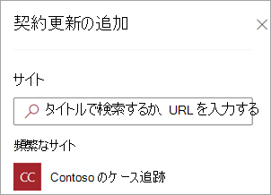

# Microsoft SharePoint Syntexのドキュメント理解モデルを適用する

 

> [!VIDEO https://www.microsoft.com/videoplayer/embed/RE4CSoL]

 

ドキュメント理解モデルを公開した後、、Microsoft 365 テナントの1つまたは複数の SharePoint ドキュメントライブラリに適用できます。

> [!NOTE]
> ユーザーがアクセスできるドキュメントライブラリにのみモデルを適用できます。

## モデルをドキュメントライブラリに適用します。

モデルをSharePointドキュメントライブラリに適用するには、次の操作を行います。

1. モデルのホームページの [**ライブラリにモデルを適用する** ]タイルの [**モデルの発行**]を選びます。 または、[**このモデルのあるライブラリ**]セクション の [**+ ライブラリの追加**] を選択します。  

     

2. モデルを適用するドキュメントライブラリが含まれている SharePoint サイトを選択できます。 リストにサイトが表示されない場合は、検索ボックスを使用して検索します。 

     

    > [!NOTE]
    > モデルを適用しようとしているドキュメントライブラリへの *リスト管理* 許可を持っているかまたは、*編集* 権限を持っていなければなりません。 

3. サイトを選択した後、モデルを適用するドキュメントライブラリを選択します。 このサンプルでは、*Contoso ケーストラッキング* サイトから *ドキュメント* ドキュメントライブラリ を選びます。 

     

4. モデルは、コンテンツタイプに関連付けられているため、ライブラリに適用すると、コンテンツタイプと、列として表示されている抽出したラベルのビューが追加されます。 このビューは既定ではライブラリの既定のビューですが、必要に応じて、[**詳細 設定**] を選択し、[**既定のビューとして設定**] 選択解除して、既定のビューから外すことができます。 

     

5. モデルをライブラリに適用するには、[ **追加** ] を選択します。 
6. モデルのホームページの [**このモデルのある の ライブラリ**] セクションに、表示されている SharePoint サイトの URL を確認します。 

     

7. ドキュメントライブラリに移動し、モデルのドキュメントライブラリビューに移動していることを確認します。 ドキュメント ライブラリ名の横にある [情報] ボタンを選択すると、ドキュメント ライブラリにモデルが適用されていることを示すメッセージが表示されます。

      

    [**アクティブなモデルの表示**] を選択すると、ドキュメント ライブラリに適用されているモデルに関する詳細を表示できます。

8. [**アクティブなモデル**] ウィンドウで、ドキュメント ライブラリに適用されているモデルを確認できます。 モデルを選択すると、モデルの説明、モデルの発行者、およびモデルが分類するファイルに保持ラベルを適用するかどうかなど、モデルに関する詳細が表示されます。

    ![[アクティブなモデル] ウィンドウ](../media/content-understanding/active-models.png)  

モデルをドキュメントライブラリに適用したら、サイトにドキュメントをアップロードし、結果を確認できます。

モデルは、モデルに関連付けられているすべてのファイルを特定し、ビューに表示します。 モデルにエクストラクターがある場合は、各ファイルから抽出したデータの列が表示されます。

### ドキュメントライブラリに既に存在するファイルにモデルを適用する

適用されたモデルが、ドキュメントライブラリにアップロードされたすべてのファイルを処理している場合は、次の操作を行って、モデルが適用される前に、ドキュメントライブラリ内に既に存在していたファイル上で実行することもできます。

1. ドキュメントライブラリで、モデルで処理するファイルを選択します。
2. ファイルを選択すると、 [ドキュメントライブラリ] リボンに **分類および抽出** が表示されます。 **分類および抽出** を選択します。
3. 選択したファイルが処理されるキューに追加されます。

        

> [!NOTE]
> 個々のファイルをライブラリにコピーしてモデルに適用することはできますが、フォルダーに適用することはできません。

### [分類日] フィールド

SharePoint Syntex 文書理解モデルまたはフォーム処理モデルをドキュメント ライブラリに適用すると、ライブラリ スキーマに <b> 分類日 </b> フィールドが含まれます。 既定では、このフィールドは空ですが、ドキュメントがモデルによって処理され分類されると、完了日時のタイム スタンプでこのフィールドが更新されます。 

   ![[分類日] 列](../media/content-understanding/class-date-column.png)  

[分類日] フィールドは、Syntex のコンテンツの解釈モデルがファイルの処理を完了し、[分類日] フィールドを更新したあとで、[<b>ファイルがコンテンツの解釈モデルで分類されたとき</b>トリガー](/connectors/sharepointonline/#when-a-file-is-classified-by-a-content-understanding-model) が Power Automate フローを実行するのに使用されます。

    

<b>ファイルがコンテンツの解釈モデルで分類されたとき</b>トリガーはさらに、ファイルから抽出された情報を使用して、別のワークフローを開始するためにも使用できます。

## 関連項目
[分類子を作成する](create-a-classifier.md)

[エクストラクターを作成する](create-an-extractor.md)

[ドキュメント理解の概要](document-understanding-overview.md)
