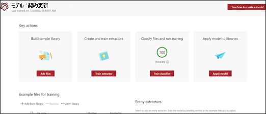
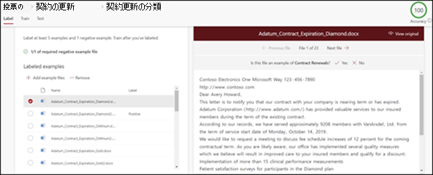
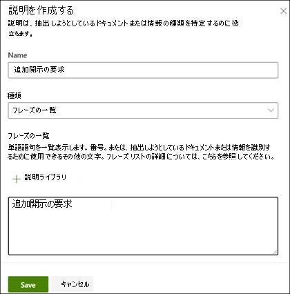
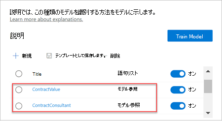

# Microsoft SharePoint Syntexで分類子を作成する

 

> [!VIDEO https://www.microsoft.com/videoplayer/embed/RE4CL0R]  

 

分類子は、ドキュメントの種類の識別および分類を自動化するために使用できるモデルの種類です。 たとえば、次の図に示すように、ドキュメントライブラリに追加されたすべての *契約更新* ドキュメントを特定することも可能です。

分類子を作成すると、モデルに関連付けられる新しい [SharePoint コンテンツの種類](/sharepoint/governance/content-type-and-workflow-planning#content-type-overview)を作成できます。

分類子を作成するときに、モデルを定義するために *説明* を作成する必要があります。 これにより、このドキュメントの種類に一貫して見つける共通のデータがあることが分かります。 

コンテンツタイプが同じファイルを特定できるように、モデルに "トレーニング" するには、ドキュメントの種類 ("ファイルの例") の例を使用します。

分類子を作成するには、次の操作を行う必要があります。
1. モデルに名前をつけます。
2. サンプルファイルを追加します。
3. サンプルファイルにラベルを付けます。
4. 説明を作成します。
5. モデルをテストします。

> [!NOTE]
> モデルでは、ドキュメントタイプを特定して分類するために分類子を使用していますが、モデルで識別された各ファイルから特定の情報を取得することもできます。 これを行うには、モデルに追加する **抽出機能** を作成します。 「[抽出機能を作成](create-an-extractor.md) 」を参照してください。

## モデルに名前を付けます

モデルを作成する最初の手順は、名前を付けることです。

1. コンテンツ センターで、**[新規]** を選択し、**[モデルを作成する]** を選択します。
2. [ **新しいドキュメント理解モデル** ] ウィンドウで、[ **名前** ] フィールドにモデル名を入力します。 たとえば、契約更新ドキュメントを特定する場合、モデルに *契約更新* と名前を付けます。
3. **[作成]** を選択します。 これにより、モデルのホームページが作成されます。 

    

モデルを作成するときに、新しいサイトコンテンツタイプも作成します。 コンテンツタイプは、共通の特徴を持つドキュメントのカテゴリを表し、特定のコンテンツの列またはメタデータプロパティのコレクションを共有します。 SharePoint コンテンツの種類は、[[コンテンツの種類ギャラリー]](https://support.microsoft.com/office/create-or-customize-a-site-content-type-27eb6551-9867-4201-a819-620c5658a60f) で管理されます。 この例では、モデルを作成するときに、新しい *契約更新* コンテンツタイプを作成します。

スキーマを使用するために、このモデルを SharePoint <a href="https://go.microsoft.com/fwlink/?linkid=2185074" target="_blank">コンテンツ タイプ ギャラリー</a>の既存のエンタープライズ コンテンツ タイプにマップする場合は、[**詳細設定]** を選択します。 エンタープライズコンテンツタイプは、SharePoint 管理センターのコンテンツタイプハブに格納され、テナントのすべてのサイトにシンジケートされます。 ただし、既存のコンテンツタイプを使用して、スキーマを利用し、特定および分類を行うことができますが、特定のファイルから情報を抽出するためにモデルをトレーニングする必要があります。 

## サンプルファイルを追加する

モデルホームページで、ドキュメントの種類を識別できるようにモデルをトレーニングするのに役立つサンプルファイルを追加します。  
 

> [!VIDEO https://www.microsoft.com/videoplayer/embed/RE4D0iX] 

 

> [!NOTE]
> 分類子と [抽出機能トレーニング](create-an-extractor.md)に同じファイルを使用する必要があります。 後で追加するオプションは常に用意されていますが、通常はサンプルファイルすべてを追加します。 モデルを学習させるためにラベルを付け、残りのラベルのないものをテストして、モデルの適合性を評価します。 

トレーニングセットについては、ポジティブなものとネガティブなものと両方のサンプルを使用します。
- ポジティブな例: ドキュメントの種類を表すドキュメント。 これらには、この種類のドキュメントに常に存在する文字列と情報が含まれます。
- ネガティブな例: 分類するドキュメントを表さない他のドキュメント。 

モデルをトレーニングする場合は、少なくとも1つのポジティブな例と少なくとも1つのネガティブな例を使用してください。  トレーニングプロセスの後にモデルをテストするために、追加の作成をするかもしれません。

サンプルファイルを追加するには:

1. [モデルのホーム] ページにある [**サンプルファイル の追加** タイル]で 、[**ファイルの追加**] をクリックします。
2. [ **モデル 用にサンプルファイルを選択してください**] ページで、コンテンツセンターのトレーニングファイルライブラリからサンプルファイルを選択します。 まだアップロードしていない場合は、[ **アップロード** ] をクリックして [アップロード] をクリックし、トレーニングファイルライブラリにコピーします。
3. モデルのトレーニングに使用するサンプルファイルを選択したら、[ **追加**] をクリックします。

     

## サンプルファイルにラベルを付ける

サンプルファイルを追加した後は、ポジティブまたはネガティブのラベルを付ける必要があります。

1. モデルのホームページの **[ファイルを分類してトレーニングを行う]** タイルで、**[分類子をトレーニングする**] をクリックします。
   これにより、サンプルファイル名の一覧が表示されるラベルページが表示され、最初のファイルがビューアーに表示されます。
2. 最初のサンプルファイルの一番上にあるビューアーで、作成したモデルの例として、そのファイルが適切かどうかをテキストを見て確認する必要があります。 この例がポジティブの場合は、[ **はい**] を選択します。 ネガティブの例の場合は、[ **いいえ**] を選択します。
3. 左側にある **ラベル付きのサンプル** リストで、サンプルとして使用する追加のファイルを選択し、ラベルを付けます。 

     

> [!NOTE]
> 少なくとも5個のポジティブな例にラベルを付けます。 少なくとも1つのネガティブな例にラベルを付けます。 

## 説明を作成する

次の手順では、トレーニングページに説明を作成します。 詳細を使用すると、モデルがドキュメントの識別をしやすくなります。 たとえば、契約更新ドキュメントには常に、テキスト文字列 *追加の開示要求* が含まれます。

> [!Note]
> エクストラクターを使用する場合、説明を使用すると、文書から抽出する文字列を特定します。 

説明を作成するには:

1. [モデルのホーム] ページで、[**トレーニング**] タブを選択し、[トレーニング] ページに移動します。 
2. [トレーニング] ページの [**トレーニング済みファイル**] セクション には、以前にラベルが付けられたサンプルファイルの一覧が表示されています。 一覧からいずれかのポジファイルを選び、viewer で表示します。
3. [説明] セクションで、[**新しい** ] を選択し、[**空** を選択し ます。
4. [ **説明を作成する** ] ページで： 
    a. **名前** を入力します (たとえば、"暴露ブロック")。 
    b. [ **種類**]を選びます。 この例では、文字列を追加するので、[ **語句のリスト**] を選択します。 
    c. [ **ここに入力してください**] ボックスに、文字列を入力します。 このサンプルには、"追加情報開示の要求" を追加します。 文字列に大文字と小文字を区別する必要がある場合は、**大文字と小文字の区別** を選択することができます。 
    d.  **[保存]** をクリックします。

     
    
5. コンテンツ センターでは、作成した説明がポジティブまたはネガティブの例として、残りのラベル付きファイルの例を正しく識別するのに適しているかどうかを確認するようになりました。 [**トレーニング済みファイル**] セクションで、トレーニングが完了した後で結果を確認するため、[**評価**] 列をチェックします。 ファイルには、ユーザーがポジティブまたはネガティブとラベルをつけたものと一致させるために作成した説明が適切であった場合、**一致** が表示されます。

     

    ラベルが付けられたファイルの **不一致** を受信した場合は、モデルがドキュメントの種類を識別できるように、追加の説明を作成し提供しなければならない場合があります。 この場合は、ファイルをクリックして、不一致が発生した理由に関する詳細情報を入手します。

エクストラクターをトレーニングしたら、そのトレーニング済みエクストラクターを説明として使用できます。 [**説明セクション**] では、これは [**モデル リファレンス**] として表示されています。

## モデルをテストする

ラベル付きのサンプルファイルに対して一致が返された場合は、このモデルがまだ扱っていないその他のラベルのないサンプルファイルで、モデルをテストできます。 これはオプションのですが、モデルを使用する前に、モデルが処理したことのないファイルでテストすることによって、モデルの「健全さ」をチェックし準備ができたかどうかを評価するのに便利な手順です。

1. [モデルのホーム] ページで、[**テスト**] タブを選択します。 ラベルなしのサンプルファイル上でモデルが実行されます。
2. [ **テストファイル** ] の一覧では、サンプルファイルが表示され、モデルがポジティブかネガティブであるかを予測します。 この情報を使用して、ドキュメントを特定するときの分類子の有効性を判断します。

     

## 関連項目

[エクストラクターを作成する](create-an-extractor.md)

[ドキュメント理解の概要](document-understanding-overview.md)

[説明の種類](explanation-types-overview.md)

[モデルを適用する](apply-a-model.md) 

[SharePoint Syntex アクセシビリティ モード](accessibility-mode.md)