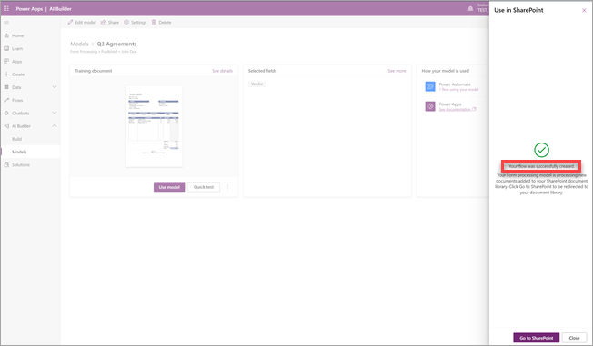

# Microsoft SharePoint Syntex でフォーム処理モデルを作成する

 

> [!VIDEO https://www.microsoft.com/videoplayer/embed/RE4GnhN]  

 

Microsoft PowerApps の機能である [AI ビルダー](/ai-builder/overview)を使用すると、SharePoint Syntex のユーザーは SharePoint ドキュメント ライブラリから直接[フォーム処理モデル](form-processing-overview.md)を作成できます。 

フォーム処理モデルの作成には、次の手順が含まれます。

 - [手順 1: フォーム処理モデルを作成する](create-a-form-processing-model.md#step-1-create-a-form-processing-model)
 - [手順 2: ドキュメントを追加して分析する](create-a-form-processing-model.md#step-2-add-and-analyze-documents)
 - [手順 3: フィールドとテーブルをタグ付けする](create-a-form-processing-model.md#step-3-tag-fields-and-tables)
 - [手順 4: モデルをトレーニングして発行する](create-a-form-processing-model.md#step-4-train-and-publish-your-model)
 - [手順 5: モデルを使用する](create-a-form-processing-model.md#step-5-use-your-model)

## 要件

フォーム処理モデルの作成は、それが有効になっている SharePoint ドキュメント ライブラリでのみ実行できます。 フォーム処理が有効になっている場合は、ドキュメント ライブラリに **[自動化]** > **[AI ビルダー]** > **[フォームを処理するモデルの作成]** メニューが表示されます。 ドキュメント ライブラリで処理を有効にする必要がある場合は、SharePoint 管理者にお問い合わせください。

 

## 手順 1: フォーム処理モデルを作成する

フォーム処理モデルを作成する最初の手順は、モデルに名前を付け、新しいコンテンツ タイプを定義して、そのための新しいドキュメント ライブラリ ビューを作成することです。

1. ドキュメント ライブラリで、**[自動化]** メニュー、**[AI ビルダー]**、**[フォームを処理するモデルの作成]** の順に選択します。

    ![[自動化] メニューと [フォームを処理するモデルの作成] オプションを示すスクリーンショット。](../media/content-understanding/create-ai-builder-model2.png)

2. **[フォームを処理するモデルの作成]** パネルで、**[名前]** フィールドにモデルの名前を入力します (*「発注書」* など)。

    ![[フォームを処理するモデルの作成] パネルを示すスクリーンショット。](../media/content-understanding/new-form-model2.png) 

3. これで、SharePoint ドキュメント ライブラリ内にある同じようなレイアウト (請求書や税務書類など) を共有する構造化ファイルの *コレクション* から、情報を自動的に抽出して保存できるようになります。 これにより、複数のモデルを 1 つのモデルとして作成し、特定のテーブルのアイテムの情報を抽出できます。

   コレクション名は、モデルが適用されるドキュメント ライブラリの専用列に保存されます。これにより、同じモデルによって処理される異なるファイル レイアウトを区別できます。

   さらに、抽出されたテーブルの情報は指定されたリストに保存され、アップロードされたファイルと関連付けられるため、簡単に表示し、ビジネス プロセスの自動化をさらに行うことができます。

   関連付けられているリストにテーブルの情報を抽出するには、次の操作を実行します。  

     1. **[テーブルから情報を抽出しますか?]** セクションで、**[はい]** を選択します。

      ![[フォームを処理するモデルの作成] パネルの [テーブルから情報を抽出しますか?] セクションを示すスクリーンショット。](../media/content-understanding/extract-info-from-tables.png) 

     2. **[テーブルの情報をどこに保存しますか?]** セクションで、次の操作を実行します。
 
        - **[新しいリスト]** (既定の設定) を選択すると、**[新しいリストの名前]** ボックスに名前の候補が自動的に提供されます。 名前は必要に応じて変更できます。 サイト ナビゲーションにリストを表示する場合、**[サイト ナビゲーションに表示する]** チェックボックスをオンにします。

        - **[選択したリスト]** ボックスで **[既存のリスト]** を選択した場合、使用するリストを選択します。

4. フォーム処理モデルを作成する場合は、新しい SharePoint コンテンツタイプを作成します。 SharePointコンテンツタイプは、共通の特徴を持つドキュメントのカテゴリを表し、特定のコンテンツの列またはメタデータプロパティのコレクションを共有します。 SharePoint コンテンツ タイプは、SharePoint 管理センターを通じて管理されます。

   このモデルを SharePoint コンテンツ タイプ ギャラリーの既存のコンテンツ タイプにマッピングするには、**[詳細設定]** を選択します。

    ![[フォームを処理するモデルの作成] パネルの [詳細設定] を示すスクリーンショット。](../media/content-understanding/new-form-model-advanced-settings.png) 

   1. **[コンテンツ タイプ]** セクションで、新しいコンテンツ タイプを作成するか、既存のコンテンツ タイプを使用するかを選択します。 

   2. 既存のコンテンツ タイプを使用するには、**[いずれかを選択]** を選択して、リストからコンテンツ タイプを選択します。

   3. モデルは、ドキュメント ライブラリに抽出されたデータの新しいビューを作成します。 既定のビューを使用しない場合は、**[このモデルのライブラリ ビュー]** セクションで、**[ビューを既定として設定]** チェックボックスをオフにします。

   4. ファイルに保持ラベルを適用するには、**[保持ラベル]** セクションで、使用する保持ラベルを選択します。

5. **[作成]** を選択します。

## 手順 2: ドキュメントを追加して分析する

新しいフォーム処理モデルを作成すると、ブラウザーに新しい PowerApps AI ビルダーフォームプロセスモデルページが開きます。 このページでは、サンプル ドキュメントを追加して分析できます。 

> [!NOTE]
> 使用するサンプル ファイルを探す場合、「[フォーム処理モデルの要件と最適化のヒント](/ai-builder/form-processing-model-requirements)」を参照してください。 
 
1. 最初に、**[抽出する情報の選択]** ページで、モデルの抽出対象に設定するフィールドおよびテーブルを定義します。 詳細な手順については、「[抽出するフィールドとテーブルを定義する](/ai-builder/create-form-processing-model#define-fields-and-tables-to-extract)」を参照してください。 

2.  モデルが処理するドキュメント レイアウトのコレクションは、必要なだけ作成することができます。 詳細な手順については、「[コレクションごとにドキュメントをグループ化する](/ai-builder/create-form-processing-model#group-documents-by-collections)」を参照してください。 

3. コレクションを作成し、それぞれにサンプル ファイルを追加したら、AI ビルダーはフィールドとテーブルを検出するためにアップロードされたドキュメントを確認します。 これには、通常、数分かかります。 分析が完了したら、ドキュメントのタグ付けに進むことができます。

## 手順 3: フィールドとテーブルをタグ付けする

モデルが抽出するフィールドとテーブル データを理解するよう設定するため、ドキュメントをタグ付けする必要があります。 詳細な手順については、「[ドキュメントにタグを付ける](/ai-builder/create-form-processing-model#tag-documents)」を参照してください。

## 手順 4: モデルをトレーニングして発行する

1. モデルを作成してトレーニングしたら、発行して SharePoint で使用できます。 詳細な手順については、「[フォーム処理モデルをトレーニングして発行する](/ai-builder/form-processing-train)」を参照してください。 

2. モデルを発行したら、**[モデルを使用]**、**[フローを作成]** の順に選択します。 これにより、SharePoint ドキュメント ライブラリで実行し、モデルで識別されたフィールドを抽出できる Power Automate フローが作成されます。

    ![[フローを作成] パネルを示す AI ビルダーのスクリーンショット。](../media/content-understanding/ai-builder-create-a-flow.png)
 
3. 完了すると、*"フローが正常に作成されました"* のメッセージが表示されます。

    

4. **[SharePoint に移動]** ボタンを選択して、モデルで更新されたドキュメント ライブラリを表示します。

## 手順 5: モデルを使用する

1. [ドキュメント ライブラリ モデル] ビューで、選択したフィールドが列として表示されるようになりました。

    

2. **[ドキュメント]** の横にある [情報] リンクで、フォーム処理モデルがこのドキュメント ライブラリに適用されていることが示されています。

    ![[情報] ボタン。](../media/content-understanding/info-button.png)  

3. ファイルをドキュメント ライブラリにアップロードします。 モデルがコンテンツ タイプとして識別するファイルには、ビュー内のファイルが一覧表示され、列に抽出されたデータが表示されます。

    ![[完了]。](../media/content-understanding/doc-lib-done.png) 

> [!NOTE]
> カスタム フォーム処理モデルとドキュメント理解モデルを同じライブラリに適用する場合、ファイルはドキュメント理解モデルと、そのモデルのトレーニング済みの抽出ツールを使用して分類されます。 フォーム処理モデルに一致する空の列がある場合、それらの抽出された値を使用して列が設定されます。

### フローを使用して情報を抽出する

2 つのフローを使用して、フォーム処理モデルが適用されたライブラリ内のファイルの選択したファイルまたはバッチを処理できます。

- **フォーム処理モデルを使用して** 画像または PDF ファイルから情報を抽出する - フォーム処理モデルを実行して、選択した画像または PDF ファイルからテキストを抽出します。 一度に 1 つの選択されたファイルをサポートし、PDF ファイルとイメージ ファイル (PNG、JPG、JPEG) のみをサポートします。 フローを実行するには、ファイルを選択し、[**AutomateExtract** **info** > ] を選択します。

    ![[抽出情報] が強調表示された [自動化] メニューを示すスクリーンショット。](../media/content-understanding/automate-extract-info.png)  

- **フォーム処理モデルを使用してファイル** から情報を抽出する - フォーム処理モデルと一緒に使用して、ファイルのバッチから情報を読み取り、抽出します。 一度に最大 5,000 SharePointファイルを処理します。 このフローを実行すると、設定できる特定のパラメーターがあります。 次の操作を行うことができます:

    - 以前に処理されたファイルを含めるかどうかを選択します (既定では、以前に処理されたファイルは含めなされません)。
    - 処理するファイルの数を選択します (既定値は 100 ファイルです)。
    - ファイルを処理する順序を指定します (選択項目は、ファイル ID、ファイル名、ファイル作成時刻、または最後に変更された時刻です)。
    - 順序の並べ替え方法 (昇順または降順) を指定します。

    ![パラメーター オプションが強調表示された [フローの実行] パネルを示すスクリーンショット。](../media/content-understanding/run-flow-panel.png)  

### [分類日] フィールド

フォーム処理SharePoint Syntexモデル (またはドキュメント理解モデル) をドキュメント ライブラリに適用すると、[分類日] フィールドがライブラリ  スキーマに含まれます。 既定では、このフィールドは空です。 ただし、ドキュメントがモデルによって処理および分類される場合、このフィールドは完了の日付/時刻スタンプで更新されます。 

モデルに分類日付がスタンプされている場合は、SharePoint Syntex がファイル フローを処理した後に電子メールを送信を使用して、**SharePoint** ドキュメント ライブラリ内のモデルによって新しいファイルが処理および分類されたとユーザーに通知できます。

フローを実行するには、次のコマンドを実行します。

1. ファイルを選択し、[統合] を **選択Power Automate** >  > **フローを作成します**。

2. [フローの **作成] パネルで**、[ファイルの処理後にSharePoint Syntex **を送信する] を選択します**。

    ![[フロー パネルとフローの作成] オプションが強調表示されているスクリーンショット。](../media/content-understanding/integrate-create-flow.png) 

## 関連項目
  
[Power 自動化 ドキュメント](/power-automate/)

[トレーニング: AI ビルダーを使用してビジネスの実績を高める](/learn/paths/improve-business-performance-ai-builder/?source=learn)