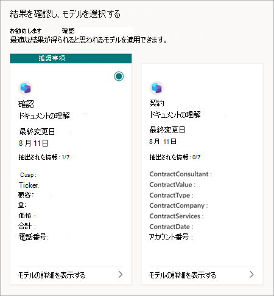

# Microsoft SharePoint Syntex でのモデルの公開と検出

学習済みの利用可能なドキュメント理解モデルを、他のユーザーが SharePoint ドキュメント ライブラリから直接表示して使用できるようにすることができます。 

また、組織内の他のユーザーが作成した他のコンテンツ センターでも学習済みのモデルを検索して評価できます。 ファイルを分類したり、ファイルから特定の情報を抽出したりするのに最も役立つモデルを選択します。 

> [!NOTE]
> この機能は、フォーム処理モデルではまだ利用できません。

## 他のユーザーがモデルを検出できるようにする

学習済みモデルを他のユーザーが使用できるようにするには、次の方法を使用します。

1. モデルの **[モデル]** ページで、**[モデル設定]** を選択します。

2. **[モデル設定]** パネルの **[このモデルが利用可能なサイト]** セクションで、**[編集]** を選択します。

3. この時点で、「**このモデルが利用可能なサイトを選択してください**」パネルは、ユーザーが管理者かどうかによって異なります。 

    SharePoint管理者の場合は、このビューが表示されます。

    ![他のユーザーに利用可能なモデルを使用する場所のオプションを示す [このモデルが利用可能なサイトを選択してください] パネルのスクリーンショット。](../media/content-understanding/select-sites.png)

    - **どのサイトでもご利用いただけません** - このモデルは、他のユーザーには利用できません。
    - **すべてのサイト** – このモデルは、他のユーザーが使用できるコンテンツ タイプ ギャラリーで使用できます。
    - **選択されたサイトのみ** – モデルを利用できるサイトを選択できます。 テキスト ボックスでクリックし、モデルを適用するサイトを検索して選択します。 ユーザーがアクセスできるサイトだけが表示されます。

    SharePoint管理者 *でない* 場合は、このビューが表示されます。

    ![利用可能なサイトが限られているエンドユーザー向けのオプションを示す [このモデルが利用可能なサイトを選択してください] パネルのスクリーンショット。](../media/content-understanding/select-site-user.png)

    既にアクセスできる特定のサイトにのみ可用性を追加または削除することができます。

4. モデルを他のユーザーが利用できるようにするサイトを選択して、**[保存]** を選びます。

## 他の学習済みモデルの検出

ユーザーのコンテンツに適した学習済みモデルを見つけるには、以下の操作を行います。

1. モデルのドキュメント ライブラリで、**[自動化]**  > > **[文書理解モデルの表示]** の順に選択します。

2. 「**モデルを確認し、新しいモデルを適用する**」ページでは、適用済みモデルと、利用可能でドキュメント ライブラリに適用されるモデルを確認できます。

    ![[適用済み] タブと [利用可能] タブを示す「モデルを確認し、新しいモデルを適用する」ページのスクリーンショット。](../media/content-understanding/review-models-apply-new-ones.png)

   - **[適用済み]** タブで、ライブラリに適用されているモデルを表示します。 **[モデルの詳細を表示]** を選択して、説明、抽出、その他の設定など、モデルに関する情報を表示します。
   
   - **[利用可能]** タブ で、ライブラリに適用できる利用可能な学習済みモデルを表示します。

### 学習済みモデルをライブラリに適用する

学習済みモデルをユーザーのコンテンツに対して評価することで、最も適切なモデルを見つけるのに役立てることができます。 ライブラリに適用するモデルを選択するには、以下の操作を行います。

1. 「**モデルを確認し、新しいモデルを適用する**」ページで、**[利用可能]** タブを選択して、リスト内のモデルを確認します。

    ![[利用可能] タブのモデルを示す「モデルを確認し、新しいモデルを適用する」ページのスクリーンショット。](../media/content-understanding/available-models-to-apply.png)

2. **[モデルの詳細を表示]** を選択してから、**[ライブラリに適用]** を選択して、最適の結果に導くと考えられるモデルを選びます。

### 学習済みモデルの推奨事項を取得する

ファイルに最適なモデルがわからない場合は、推奨事項を依頼することができます。 推奨事項には、最大 10 モデルが含まれる可能性があります。

1. 「**モデルを確認し、新しいモデルを適用する**」ページで、**[利用可能]** タブを選択します。

2. 最初のタイルで、**[推奨事項の取得]** を選択します。

    ![[利用可能] タブの [推奨事項の取得] オプションを示す「モデルを確認し、新しいモデルを適用する」ページのスクリーンショット。](../media/content-understanding/get-recommendation.png)

3. 「**分析用に 1 つ以上のモデルを選択する**」ページで、最適であると考えられるモデルを選択して、**[次へ]** を選択します。

    ![2 つのモデルが選択された推奨モデルを示す [1 つ以上のモデルを選択する] ページのスクリーンショット。](../media/content-understanding/recommendation-results.png)

4. **[ファイルを選択して分析する]** ページで、ライブラリに保存される同一または似た種類のファイルを選択します。 次に、**[選択]** を選びます。

    ![1 つのファイルが選択された利用可能なファイルを示す [ファイルを選択して分析する] ページのスクリーンショット。](../media/content-understanding/file-to-analyze.png)

5. 「**結果を確認し、モデルを選択する**」ページで、**[推奨事項]** の下に、推奨されるファイルが表示されます。 推奨モデルを適用する必要はありません。 別のモデルの方が適切だと思う場合は、別のモデルを適用できます。

    

6. 最適の結果に導くと考えられるモデルの場合は、**[モデルの詳細を表示]** を選択してから、**[ライブラリに適用]** を選択します。

7. 選択したファイルに基づいて推奨モデルが存在しない場合は、戻って別のファイルを選択するか、異なるモデルを選択できます。

### 適用済みモデルを削除する

ドキュメント ライブラリから適用されたモデルを削除するには、以下の操作を行います。

1. 「**モデルを確認し、新しいモデルを適用する**」ページの **[適用済み]** タブで、ライブラリに適用されているモデルを表示します。

2. 削除するモデルで、**[モデルの詳細を表示]** を選択し、**[ライブラリから削除]** を選択します。

## 関連項目

[ドキュメント理解モデルの適用](apply-a-model.md)

[ドキュメント理解の概要](document-understanding-overview.md)
