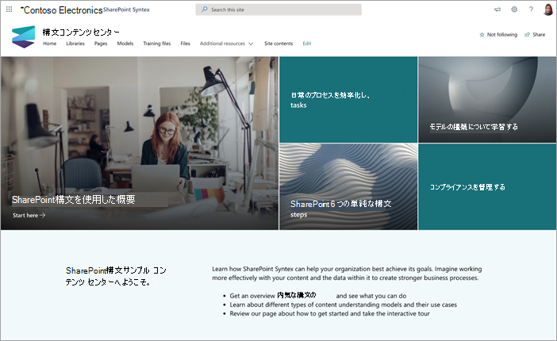
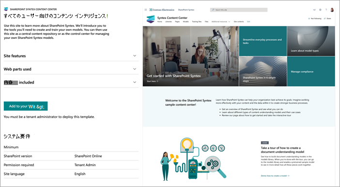

# Microsoft サイトのコンテンツ センター サイト テンプレートを使用SharePoint Syntex

コンテンツ SharePoint Syntexサイトは、ユーザーの機能をよりよく理解SharePoint、すぐに展開できるサイト テンプレートSharePoint Syntexです。

独自のモデルを作成してトレーニングするために必要なツールと情報について紹介します。 その後、このサイトを中央コンテンツ リポジトリとして、または独自のコンテンツ モデルを管理するためのコントロール センター SharePoint Syntexできます。

このサイトでは、独自のコンテンツを使用してモデルをトレーニングおよび評価できます。 ただし、ライブラリにモデルを適用するには、ライブラリのライセンスSharePoint Syntex必要です。  

## サイトのプロビジョニング

コンテンツ センター サイトは、コンテンツ センターの外観SharePoint[からプロビジョニングできます](https://lookbook.microsoft.com/)。

> [!NOTE]
> サイトをプロビジョニングするには、グローバル管理者SharePoint管理者Microsoft 365必要があります。

1. ページの外観ブックの [メイン ページSharePoint](https://lookbook.microsoft.com/)、[デザインの表示] メニューで、[コンテンツ センター]  >  SharePoint Syntex **SharePoint Syntex選択します**。

2. [コンテンツ **センター] ページで** 、[テナントに **追加] を選択します**。

    ![[コンテンツ センター サイト テンプレートプロビジョニング] ページの [テナントに追加] ボタンのスクリーンショット。](../media/content-understanding/content-center-site-add-to-your-tenant.png)

3. メール アドレス (サイトの使用準備が完了した場合の通知用)、使用するサイトの URL、サイトで使用するタイトルを入力します。 

    ![[コンテンツ センター サイト テンプレートプロビジョニング] ページの [テナントに追加] ボタンのスクリーンショット。](../media/content-understanding/content-center-email-and-url.png)

4. [**プロビジョニング**] を選択すると、すぐにサイトを使用する準備が整います。 コンテンツ センター サイト テンプレートの準備要求が完了したことを示すメール (指定したメール アドレスに送信) が届きます。

5. [ **サイトを開く**] を選択すると、コンテンツ センター サイトが表示されます。 ここから、サイトを探索し、サイトの詳細を確認SharePoint Syntex。 

新しいルック ブック サービスからのプロビジョニングのSharePointについては、「Provision [a new learning pathways solution」を参照してください](/office365/customlearning/custom_provision)。

## サイトを探索する

コンテンツ センター サイトには、組織内のユーザー設定の使用を開始する手順をSharePoint Syntexページが含まれています。 

### ユーザー設定のSharePoint Syntex

このページの概要SharePoint Syntex、組織で使用する方法について説明します。 概要を説明するビデオを見て、SharePoint Syntex役立つトレーニングを見つける。

### モデルの種類の詳細

3 種類のモデルについて説明し、それらを使用して検索、ビジネス プロセス、コンプライアンス、その他のビジネス上の問題を解決する方法について説明します。

### 対話型ツアーに参加してモデルを作成する

モデル ライブラリでドキュメント理解モデルを構築し、事前トレーニング済みのサンプル モデルを有効にする方法について説明します。

### SharePoint Syntex 6 つの簡単な手順で説明する

コンテンツ センターから始め、必要な情報を識別、分類、および抽出するモデルを作成する手順を順を見て学習します。

### 日常のプロセスとタスクを合理化する

ユーザー設定を使用して手動SharePoint Syntex、組織の自動化と合理化を行う方法について学習します。

### コンプライアンスの管理

リスクを軽減し、組織がキャプチャするデータと情報を安全で思慮深い方法で使用するための手順を実装します。

### モデル アクティビティの表示

モデルアクティビティの説明や、モデルの使用方法に関する詳細な情報を提供するために、コンテンツがどのように使用されるのかをご覧ください。

### その他のリソースの検索

この他のリソースとシナリオを見て、詳細を確認SharePoint Syntex。

