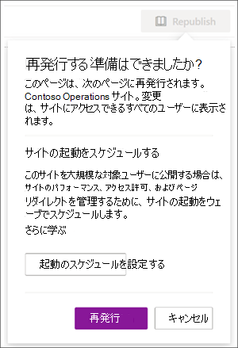

# <a name="launch-your-portal-using-the-sharepoint-portal-launch-scheduler"></a>ポータル起動スケジューラを使用してSharePointを起動する

ポータルは、トラフィックが多いイントラネット上の SharePoint コミュニケーション サイトです。数週間の間に 10,000 人から 100,000 人を超える視聴者が存在するサイトです。 ポータル起動スケジューラを使用してポータルを起動し、新しいポータルにアクセスするときにユーザーがスムーズに表示SharePointします。
<br>
<br>
ポータル起動スケジューラは、ウェーブでビューアーをバッチ処理し、新しいポータルの URL リダイレクトを管理することで、段階的なロールアウトアプローチに従うのに役立ちます。 各ウェーブの起動中に、ユーザーフィードバックを収集し、ポータルのパフォーマンスを監視し、起動を一時停止して問題を解決してから、次のウェーブに進みます。 ポータルの起動を計画[する方法の詳細については、SharePoint。](/microsoft-365/Enterprise/Planportallaunchroll-out)

**リダイレクトには、次の 2 種類があります。**

- **双方向**: 新しいモダン SharePointポータルを起動して、既存のSharePointまたはモダン ポータルを置き換える
- **一時ページへのリダイレクト**: 既存のポータルを使用SharePoint新しいモダン SharePointポータルを起動する

サイトのアクセス許可は、起動の一環としてウェーブとは別に設定する必要があります。 たとえば、組織全体のポータルをリリースする場合は、アクセス許可を "外部ユーザーを除くすべてのユーザー" に設定し、セキュリティ グループを使用してユーザーをウェーブに分けられます。 ウェーブにセキュリティ グループを追加しても、そのセキュリティ グループはサイトにアクセスできます。

> [!NOTE]
>
> - この機能は、2021 年 5 月からターゲット リリースのお客様向け SharePoint コミュニケーション サイトのホーム ページにある 設定 パネルからアクセス可能になり、2021 年 7 月までにはすべてのお客様が利用できる予定です。 
> - このツールの PowerShell バージョンは現在利用できます
> - この機能は、最新の通信サイトでのみSharePointできます。
> - ポータルの起動をカスタマイズおよびスケジュールするには、サイトのサイト所有者のアクセス許可が必要です
> - 起動は少なくとも 7 日前にスケジュールする必要があります。各ウェーブは 1 日から 7 日間続く場合があります。
> - 必要なウェーブの数は、予想されるユーザー数によって自動的に決定されます。
> - ポータルの起動をスケジュールする前[](https://aka.ms/perftool)SharePointページ診断ツールを実行して、サイトのホーム ページが正常な状態にあるか確認する必要があります。
> - 起動の最後に、サイトへのアクセス許可を持つすべてのユーザーが新しいサイトにアクセスできます
> - 組織で Viva [Connections](/SharePoint/viva-connections)を使用している場合、ユーザーは Microsoft Teams アプリ バーに組織のアイコンを表示する場合があります。ただし、アイコンが選択されている場合、ユーザーはウェーブが起動するまでポータルにアクセスできません。
> - この機能は、ドイツ、Office 365 21Vianet (中国Office 365)、米国政府の計画ではMicrosoft 365使用できません。

## <a name="understand-the-differences-between-portal-launch-scheduler-options"></a>ポータル起動スケジューラ オプションの違いを理解します。

以前は、ポータルの起動は PowerShell 経由でのみSharePointでした。 これで、ポータルの起動のスケジュールと管理に役立つ 2 つのオプションがあります。 両方のツールの主な違いについて説明します。

**SharePointPowerShell のバージョン:**

- PowerShell で管理者資格情報を使用[するにはSharePoint必要](/powershell/sharepoint/sharepoint-online/introduction-sharepoint-online-management-shell)
- 1 つのウェーブの最小要件
- 協定世界時 (UTC) タイム ゾーンに基づいて起動をスケジュールする

**製品内バージョン:**

- サイト所有者の資格情報が必要です
- 2 つのウェーブの最小要件
- 地域の設定に示されているポータルのローカル タイム ゾーンに基づいて起動をスケジュールする

## <a name="get-started-using-the-portal-launch-scheduler"></a>ポータル起動スケジューラの使用を開始する

1. ポータル起動スケジューラ ツールを使用する[](https://support.microsoft.com/office/share-a-site-958771a8-d041-4eb8-b51c-afea2eae3658)前に、サイトの所有者、サイト メンバー、または訪問者としてサイトのアクセス許可を使用して、このサイトにアクセスする必要があるすべてのユーザーを追加します。

2. 次に、ポータル起動スケジューラにアクセスして、次のいずれかの方法でポータルの起動のスケジュールを開始します。

   **オプション 1:** ホーム ページへの変更を編集して再発行する最初の数回 (またはホーム ページ バージョン 3.0 まで) は、ポータル起動スケジューラ ツールの使用を求めるメッセージが表示されます。 [起動 **のスケジュール] を** 選択して、スケジュールを進め続けろ。 または、[ **再公開] を選択** して、起動をスケジュールせずにページの編集内容を再発行します。

   

   **オプション 2:** いつでも、SharePoint コミュニケーション サイトのホーム ページに移動し **、[設定]** を選択し、[サイトの起動をスケジュールしてポータルの起動をスケジュールする] を選択できます。

   ![[サイトの起動を設定する] ウィンドウのイメージが強調表示されている](../media/portal-launch-settings-2.png)

3. 次に、ポータルが正常なスコアを受け取るまで [、SharePoint](https://aka.ms/perftool)ツールのページ診断ツールを使用して、ポータルの正常性スコアを確認し、必要に応じてポータルを **改善** します。 さらに **[次へ]** を選択します。

   

   > [!NOTE]
   > サイト名と説明をポータル起動スケジューラから編集することはできません。代わりに、ホーム ページから [設定] を選択し、[サイト情報] を選択して変更できます。

4. ドロップダウンから **[予想されるユーザー数** ] を選択します。 この図は、サイトへのアクセスが必要な可能性が高いユーザーの数を表しています。 ポータル起動スケジューラは、次のような予想されるユーザーに応じて、最適なウェーブ数を自動的に決定します。

   - 10k 未満のユーザー: 2 つのウェーブ
   - 10k ~ 30k のユーザー: 3 つの波
   - 30k 以上から 100k のユーザー: 5 つのウェーブ
   - 100,000 人を超えるユーザー: 5 つのウェーブと、100k を超えるユーザーを含むポータルの起動に記載されている手順に従って Microsoft に連絡します。

5. 次に、必要な **リダイレクトの種類を** 決定します。

   **オプション 1:** ユーザーを既存の SharePoint ページに送信する (双方向) – 新しいモダン SharePoint ポータルを起動して既存の SharePoint ポータルを置き換える場合に使用します。 アクティブなウェーブのユーザーは、古いサイトと新しいサイトに移動するかどうかに関係なく、新しいサイトにリダイレクトされます。 新しいサイトにアクセスしようとする起動されていないウェーブのユーザーは、ウェーブが起動されるまで古いサイトにリダイレクトされます。

   > [!NOTE]
   > 双方向オプションを使用する場合、起動をスケジュールするユーザーには、他のユーザーポータルに対するサイト所有者のアクセス許可SharePointがあります。

   **オプション 2: 自動** 生成された一時ページにユーザーを送信する (一時的なページ リダイレクト) – 既存のページ が存在しない場合は、一時的なページ リダイレクトSharePoint使用します。 ユーザーは新しいモダン SharePoint ポータルに移動され、ユーザーが起動されていないウェーブの場合は、一時的なページにリダイレクトされます。

   **オプション 3: ユーザーを外部ページ** に送信する – ユーザーのウェーブが開始されるまで、一時的なランディング ページ エクスペリエンスに外部 URL を提供します。

6. 対象ユーザーをウェーブに分割します。 ウェーブごとに最大 20 のセキュリティ グループを追加します。 ウェーブの詳細は、各ウェーブが起動するまで編集できます。 各ウェーブは、少なくとも 1 日 (24 時間) および最大 7 日間続きます。 これにより、SharePoint技術環境を利用して、大量のサイト ユーザーに順化して拡張できます。 UI を使用して起動をスケジュールする場合、タイム ゾーンはサイトの地域設定に基づいて行います。

   > [!NOTE]
   >
   > - ポータル起動スケジューラは、最小 2 ウェーブに自動的に既定で設定されます。 ただし、このツールの PowerShell バージョンでは、1 ウェーブが許可されます。
   > - Microsoft 365は、このバージョンのポータル起動スケジューラではサポートされていません。

7. サイトをすぐ表示する必要があるユーザーを特定し、[ウェーブから除外するユーザー] フィールドに情報 **を入力** します。 これらのユーザーはウェーブから除外され、起動前、起動中、または起動後にはリダイレクトされません。

    > [!NOTE]
    > 起動全体で最大 50 の異なるユーザーまたはセキュリティ グループを使用できます。 各起動は互いに独立しています。そのため、別のポータルで起動をスケジュールする場合は、その起動に最大 50 のユーザー/セキュリティ グループを使用できます。 さらに、ウェーブごとに最大 20 の異なるユーザーまたはセキュリティ グループを使用できます。 
    >
    > ポータル起動スケジューラは、セキュリティ グループとメールが有効なセキュリティ グループをサポートします。 

8. ポータルの起動の詳細を確認し、[スケジュール] を **選択します**。 起動がスケジュールされると、ポータルの起動が再開される前に、SharePoint ポータルのホーム ページに対する変更は正常な診断結果を受け取る必要があります。

### <a name="launch-a-portal-with-over-100k-users"></a>100k ユーザーを超えるポータルを起動する

100,000 人を超えるユーザーを含むポータルを起動する予定の場合は、以下の手順に従ってサポート要求を送信します。 要求された情報はすべて必ず含める必要があります。

> [!NOTE]
>
> - このプロセスは、次の要件を満たしている場合にのみ実行する必要があります。
> - 起動ページが完成しました。
> - [ポータルの正常性ガイダンス](https://aka.ms/portalhealth) に従っています。
> - 起動日は 14 日以内です。

**次の手順を実行します。**

1. <https://admin.microsoft.com>に移動します。
2. 新しい管理センター プレビューを使用している
3. 左側のナビゲーション ウィンドウで、[サポート] を **選択し**、[新しい **サービス要求] を選択します。**

   これにより、画面の右側にある [**ヘルプが必要ですか?**] ウィンドウがアクティブになります。

4. 問題 **を簡単に説明するには**、「100k ユーザー SharePointポータルを起動する」と入力します。</br>
5. 次に、[サポート **に問い合わせ] を選択します。**
6. [**説明]** で、「100k ユーザー SharePointポータルを起動する」と入力します。
7. 残りの情報を入力し、[連絡先] **を選択します。**
8. チケットを作成したら、次の情報をサポート エージェントに提供してください。
   - ポータル URL の
   - 予想されるユーザー数
   - 推定起動スケジュール

## <a name="make-changes-to-a-scheduled-portal-launch"></a>スケジュールされたポータルの起動に変更を加える

起動の詳細は、ウェーブの起動日までウェーブごとに編集できます。

1. ポータルの起動の詳細を編集するには、[サイトの **起動を** 設定] を選択 **します**。
2. 次に、[編集] **を選択します**。
3. 編集が完了したら、[更新] を **選択します**。

## <a name="delete-a-scheduled-portal-launch"></a>スケジュールされたポータルの起動を削除する

ポータル起動スケジューラ ツールを使用してスケジュールされた起動は、一部のウェーブが既に起動されている場合でも、いつでもキャンセルまたは削除できます。

1. ポータルの起動をキャンセルするには、[サイトの起動 **を設定]** に **移動します**。

2. 次に、[ **削除] を選択** し、下にメッセージが表示された場合は、[削除] を再度 **選択** します。

   

## <a name="use-the-powershell-portal-launch-scheduler"></a>PowerShell Portal 起動スケジューラを使用する

ポータルSharePoint起動スケジューラ ツールは、当初[は SharePoint PowerShell](/powershell/sharepoint/sharepoint-online/introduction-sharepoint-online-management-shell)経由でのみ利用可能であり、この方法を好むお客様には引き続き PowerShell を通じてサポートされます。 この記事の冒頭の同じメモは、ポータル起動スケジューラの両方のバージョンに適用されます。

> [!NOTE]
> PowerShell で使用するには、管理者SharePoint必要です。
> PowerShell で作成された起動のポータル起動の詳細が表示され、新しいポータル起動スケジューラ ツールで管理SharePoint。

### <a name="app-setup-and-connecting-to-sharepoint-online"></a>アプリのセットアップとオンラインへのSharePointする

1. [最新の SharePoint Online 管理シェルをダウンロードします](https://go.microsoft.com/fwlink/p/?LinkId=255251)。

    > [!NOTE]
    > SharePoint Online 管理シェルの以前のバージョンがインストールされている場合は、[プログラムの追加と削除] に移動して、"SharePoint Online 管理シェル" をアンインストールします。 <br>ダウンロード センター ページで言語を選択して、[ダウンロード] ボタンをクリックします。 x64 .msi ファイルまたは x86 .msi ファイルのどちらをダウンロードするかを選択するよう求められます。 Windows の 64 ビット版を実行している場合は x64 ファイルを、32 ビット版を実行している場合は x86 ファイルをそれぞれダウンロードします。 不明な場合には、「[実行している Windows オペレーティング システムの確認方法](https://support.microsoft.com/help/13443/windows-which-operating-system)」を参照してください。 ファイルをダウンロードしたら、それを実行して、セットアップ ウィザードの手順に従います。

2. Microsoft 365 の[グローバル管理者または SharePoint 管理者](/sharepoint/sharepoint-admin-role)として SharePoint Online に接続します。 方法の詳細については、「[SharePoint Online 管理シェルの使用を開始する](/powershell/sharepoint/sharepoint-online/connect-sharepoint-online)」を参照してください。

### <a name="view-any-existing-portal-launch-setups"></a>既存のポータル起動セットアップを表示する

既存のポータル起動構成がある場合は、次の情報を参照してください。

   ```PowerShell
   Get-SPOPortalLaunchWaves -LaunchSiteUrl <object> -DisplayFormat <object>
   ```

### <a name="schedule-a-portal-launch-on-the-site"></a>サイトでのポータルの起動をスケジュールする

必要なウェーブの数は、予想される起動サイズによって異なります。

- 10k 未満のユーザー: 1 ウェーブ
- 10k ~ 30k のユーザー: 3 つの波 
- 30k 以上から 100k のユーザー: 5 つのウェーブ
- 100,000 人を超えるユーザー: 5 つのウェーブと Microsoft アカウント チームに問い合わせ

#### <a name="steps-for-bidirectional-redirection"></a>双方向リダイレクトの手順

双方向リダイレクトでは、新しいモダン SharePointオンライン ポータルを起動し、既存の SharePointまたはモダン ポータルを置き換える必要があります。 アクティブなウェーブのユーザーは、古いサイトと新しいサイトに移動するかどうかに関係なく、新しいサイトにリダイレクトされます。 新しいサイトにアクセスしようとする起動されていないウェーブのユーザーは、ウェーブが起動されるまで古いサイトにリダイレクトされます。

古いサイトの既定のホーム ページと新しいサイトの既定のホーム ページとの間のリダイレクトのみをサポートします。 リダイレクトせずに古いサイトと新しいサイトにアクセスする必要がある管理者または所有者が必要な場合は、パラメーターを使用して一覧に表示 `WaveOverrideUsers` してください。

ユーザーを既存のサイトから新SharePointサイトにSharePointする方法は、次の方法で行います。

1. 次のコマンドを実行して、ポータル起動ウェーブを指定します。

   ```PowerShell
   New-SPOPortalLaunchWaves -LaunchSiteUrl <object> -RedirectionType Bidirectional -RedirectUrl <string> -ExpectedNumberOfUsers <object> -WaveOverrideUsers <object> -Waves <object>
   ```

   例:

   ```PowerShell
   New-SPOPortalLaunchWaves -LaunchSiteUrl "https://contoso.sharepoint.com/teams/newsite" -RedirectionType Bidirectional -RedirectUrl "https://contoso.sharepoint.com/teams/oldsite" -ExpectedNumberOfUsers 10kTo30kUsers -WaveOverrideUsers "admin@contoso.com" -Waves ' 
   [{Name:"Wave 1", Groups:["Viewers 1"], LaunchDateUtc:"2020/10/14"}, 
   {Name:"Wave 2", Groups:["Viewers 2"], LaunchDateUtc:"2020/10/15"},
   {Name:"Wave 3", Groups:["Viewers 3"], LaunchDateUtc:"2020/10/16"}]'
   ```

2. 完全な検証。 リダイレクトがサービス全体で構成を完了するには、5 ~ 10 分かかる場合があります。

#### <a name="steps-for-redirection-to-temporary-page"></a>一時ページへのリダイレクトの手順

一時ページリダイレクトは、既存のポータルが存在しないSharePoint使用する必要があります。 ユーザーは、新しいモダン SharePointオンライン ポータルに対して、ステージ上の方法で指示されます。 ユーザーが起動されていないウェーブの場合、ユーザーは一時ページ (任意の URL) にリダイレクトされます。

1. 次のコマンドを実行して、ポータル起動ウェーブを指定します。

   ```PowerShell
   New-SPOPortalLaunchWaves -LaunchSiteUrl <object> -RedirectionType ToTemporaryPage -RedirectUrl <string> -ExpectedNumberOfUsers <object> -WaveOverrideUsers <object> -Waves <object>
   ```

   例:

   ```PowerShell
   New-SPOPortalLaunchWaves -LaunchSiteUrl "https://contoso.sharepoint.com/teams/newsite" -RedirectionType ToTemporaryPage -RedirectUrl "https://portal.contoso.com/UnderConstruction.aspx" -ExpectedNumberOfUsers 10kTo30kUsers -WaveOverrideUsers "admin@contoso.com" -Waves ' 
   [{Name:"Wave 1", Groups:["Viewers 1"], LaunchDateUtc:"2020/10/14"}, 
   {Name:"Wave 2", Groups:["Viewers 2"], LaunchDateUtc:"2020/10/15"},
   {Name:"Wave 3", Groups:["Viewers 3"], LaunchDateUtc:"2020/10/16"}]'
   ```

2. 完全な検証。 リダイレクトがサービス全体で構成を完了するには、5 ~ 10 分かかる場合があります。

### <a name="pause-or-restart-a-portal-launch-on-the-site"></a>サイトでのポータルの起動を一時停止または再起動する

1. 進行中のポータルの起動を一時停止し、今後のウェーブの進行を一時的に防止するには、次のコマンドを実行します。

   ```PowerShell
   Set-SPOPortalLaunchWaves -Status Pause - LaunchSiteUrl <object>
   ```

2. すべてのユーザーが古いサイトにリダイレクトされるのを確認します。

3. 一時停止されているポータルの起動を再開するには、次のコマンドを実行します。

   ```PowerShell
   Set-SPOPortalLaunchWaves -Status Restart - LaunchSiteUrl <object>
   ```

4. リダイレクトが復元されたのを確認します。

### <a name="delete-a-portal-launch-on-the-site"></a>サイト上のポータルの起動を削除する

1. 次のコマンドを実行して、サイトのスケジュール済みまたは進行中のポータル起動を削除します。

   ```PowerShell
   Remove-SPOPortalLaunchWaves -LaunchSiteUrl <object>
   ```

2. すべてのユーザーに対してリダイレクトが実行されなかろうと検証します。

## <a name="learn-more"></a>詳細情報

[オンラインでポータルの起動ロールアウト計画をSharePointする](./planportallaunchroll-out.md)

[コミュニケーション サイトを計画する](https://support.microsoft.com/office/plan-your-sharepoint-communication-site-35d9adfe-d5cc-462f-a63a-bae7f2529182)
