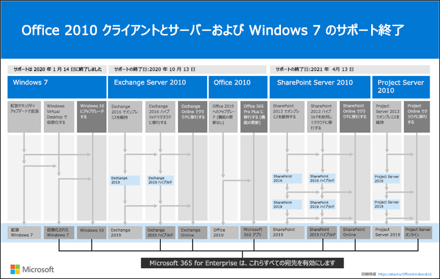

# クライアントおよびサーバー ソフトウェアのロードマップ (Microsoft 365

ほとんどのエンタープライズ組織には、オペレーティング システム、クライアント ソフトウェア、およびサーバー ソフトウェアの複数のリリースを含む異種環境があります。 Microsoft 365のEnterpriseには、IT インフラストラクチャの主要なコンポーネントの最も安全なバージョンが含まれています。 また、クラウド テクノロジを活用するように設計された生産性機能も含まれています。

統合された製品スイートのMicrosoft 365のEnterpriseを最大化するには、次のリリースを移行するための戦略の計画と実装を開始します。

- コンピューター Officeインストールされているクライアントを使用して、Microsoft 365 Apps for enterprise。
- サーバー Officeインストールされているサーバーと、サーバー内の同等のサービスMicrosoft 365。
- Windows 7 とWindows 8.1をデバイス上でWindows 10 Enterprise。

>[!Note]
>2020 Windows 7 のサポートは *2020 年 1 月 14 日に終了しました*。 詳細については、「サポート終了の [詳細」を参照してください](https://support.microsoft.com/help/4057281/windows-7-support-will-end-on-january-14-2020)。
>

これらの移行を時間の間に完了すると、組織は現代の職場のビジョンに [近づいています](https://www.microsoft.com/microsoft-365/blog/2018/04/27/making-it-simpler-with-a-modern-workplace/)。 この安全で統合された環境は、組織のチームワークと創造性のロックを解除するのに役立ちます。 Microsoft 365のEnterprise、すべてのユーザーを有効にし、権限を与える必要があります。

## クライアント製品Office移行

多くの場合、大小の組織では、Word、Office、およびアプリケーションなどの古いバージョンのクライアント製品を組み合わせてExcel使用PowerPoint。 これらの古いバージョン:

- 最新の [セキュリティ更新プログラム](https://support.office.com/article/install-office-updates-2ab296f3-7f03-43a2-8e50-46de917611c5) とサポート修正プログラムで更新できます。 ただし、このプロセスは手動であり、組織全体で拡張できない場合があります。
- ビジネスのデジタル変換に役立つ Microsoft クラウド テクノロジを使用するために最適化されていない。
- 最新の機能を提供しない。

Microsoft 365にはEnterpriseがMicrosoft 365 Apps for enterprise。 このバージョンのクライアントOfficeは、ライセンスのMicrosoft 365でEnterpriseできます。 Microsoft クラウドからインストールおよび更新されます。 Microsoft 365 Apps for enterprise には、セキュリティ更新プログラムおよび最新機能が含まれます。 詳細については、「概要[」 を参照Microsoft 365 Apps for enterprise。](/deployoffice/about-microsoft-365-apps)

### Office 2007

2007 OfficeリリースOfficeバージョンについては、サポートの終了が既に経過しています。 詳細については、「Office [2007 のサポート終了ロードマップ」を参照してください](/deployoffice/office-2007-end-support-roadmap)。

Office 2007 を実行しているコンピューターを Office 2010、Office 2013、または Office 2016 にアップグレードするのではなく、次の手順を実行してください。

1. ユーザーのライセンスを取得Microsoft 365割り当てる。
2. コンピューター Office 2007 をアンインストールします。
3. 個別Microsoft 365 Apps for enterpriseまたは IT ロールアウト中に、このファイルをインストールします。 詳細については、「[Microsoft 365 Apps の展開ガイド](/deployoffice/deployment-guide-microsoft-365-apps)」をご覧ください。

Microsoft 365 Apps for enterprise更新プログラムが自動的にインストールされます。 クラウドベースのサービスを利用して、セキュリティと生産性を向上させることができます。

### Office 2010

2010 OfficeリリースOfficeバージョンの場合、サポートは *2020 年 10 月 13* 日に終了しました。 詳細については、「Office [2010 のサポート終了ロードマップ」を参照してください](/deployoffice/office-2010-end-support-roadmap)。

2010 年から 2010 年Office 2013 年または 2016 年Office実行するOfficeがあります。 ただし、両方のバージョンを手動で更新する必要があります。 そのため、代わりに次の手順を実行してください。

1. ユーザーのライセンスを取得Microsoft 365割り当てる。
2. コンピューター Office 2010 をアンインストールします。
3. 個別Microsoft 365 Apps for enterpriseまたは IT ロールアウト中に、このファイルをインストールします。 詳細については、「[Microsoft 365 Apps の展開ガイド](/deployoffice/deployment-guide-microsoft-365-apps)」をご覧ください。

Microsoft 365 Apps for enterprise更新プログラムと新しい機能更新プログラムの両方が自動的にインストールされます。 クラウド ベースのサービスを利用して、セキュリティMicrosoft 365生産性を向上させることができます。

### Office 2013 および Office 2016

[2013 年のサポート終了ロードマップをOfficeしてください](/lifecycle/products/microsoft-office-2013)。 2016 Officeのサポートの終了はまだ決定されていません。 これらのバージョンでは、2010 Officeと同様に、セキュリティ更新プログラム[をインストールする必要があります](https://support.office.com/article/install-office-updates-2ab296f3-7f03-43a2-8e50-46de917611c5)。 組織のサイズによっては、このタスクがうまく拡張されない場合があります。

Office 2013 または Office 2016 の最新のセキュリティ更新プログラムを使用してコンピューターを最新の状態に保つか、Office 2013 から Office 2016 にコンピューターを更新するのではなく、次の手順を実行してください。

1. ユーザーのライセンスを取得Microsoft 365割り当てる。
2. コンピューター Office 2013 または Office 2016 をアンインストールします。
3. 個別Microsoft 365 Apps for enterpriseまたは IT ロールアウト中に、このファイルをインストールします。 詳細については、「[Microsoft 365 Apps の展開ガイド](/deployoffice/deployment-guide-microsoft-365-apps)」をご覧ください。

Microsoft 365 Apps for enterprise、セキュリティ更新プログラムと新機能更新プログラムの両方が自動的にインストールされます。 クラウド ベースのサービスを利用して、セキュリティMicrosoft 365生産性を向上させることができます。

## サーバー製品Office移行

大規模な組織と小規模組織の両方で、Office サーバー製品 (Exchange Server および SharePoint など) を使用します。 これらの古いバージョン:

- 最新のセキュリティ更新プログラムとサポート修正プログラムで更新する必要があります。場合によっては、これらの更新プログラムは毎月リリースされます。
- ビジネスのデジタル変換に役立つ Microsoft クラウド テクノロジを使用するために最適化されていない。
- 新しい生産性アプリケーション (例: Microsoft Teams) は含Microsoft Teams。
- 最新のセキュリティ機能を含めExchange Defender for Office 365。

Microsoft 365 Enterprise には、web ブラウザーや Outlook クライアントなど、オンプレミスバージョンの Office サーバー ソフトウェアと同じツールの一部を使用するクラウドベースのバージョンの Office サーバー サービスが含まれています。 これらのサービスは、セキュリティのために自動的に更新されます。 そのため、IT 担当者は、オンプレミス サーバーの保守と更新に要する時間を節約できます。 また、これらのサービスは、サーバー ソフトウェアにはない新機能Office提供します。

特定のワークロードのユーザーとデータを移行する方法については、次Microsoft 365してください。

- [メールボックスをオンプレミスのメールボックスからExchange ServerにExchange Online](/exchange/hybrid-deployment/move-mailboxes)
- [サーバー SharePointからオンラインにSharePointデータをSharePointする](/sharepointmigration/migrate-to-sharepoint-online)
- [オンラインSkype for Businessに移行Microsoft Teams](/microsoftteams/migration-interop-guidance-for-teams-with-skype)

### Office 2007 サーバー製品

2007 年 2007 Officeのサーバー製品の場合、サポートの終了は既に経過しています。 詳細については、次の記事を参照してください。

- [Exchange 2007 のサポート終了ロードマップ](exchange-2007-end-of-support.md)
- [SharePointServer 2007 のサポート終了ロードマップ](sharepoint-2007-end-of-support.md)
- [ProjectServer 2007 のサポート終了ロードマップ](project-server-2007-end-of-support.md)
- [OfficeCommunications Server のサポート終了ロードマップ](/skypeforbusiness/plan-your-deployment/upgrade)
- [PerformancePoint Server 2007 のサポート終了ロードマップ](pps-2007-end-of-support.md)

Office 2010、Office 2013、または Office 2016 のリリースでは、Office 2007 リリースでサーバー製品をアップグレードするのではなく、次の手順を実行してください。

1. 2007 年 2007 Officeにデータを移行Microsoft 365。 詳細またはヘルプについては、Microsoft パートナーを採用してください。
2. 新しい機能と作業プロセスをユーザーにロールアウトします。
3. 2007 サーバー製品を実行しているオンプレミス サーバー Office場合は、使用を停止します。

### Office 2010 サーバー製品

[2010 Exchange Serverサポートは 2020](exchange-2010-end-of-support.md)年 *10 月 13 日に終了しました*。

[SharePoint Server 2010](upgrade-from-sharepoint-2010.md) のサポートは、*2021 年 4 月 13 日* に終了します。

Office 2013 または Office 2016 のリリースのサーバー製品を使用して、Office 2010 リリースでこれらのサーバー製品をアップグレードするのではなく、次の手順を実行してください。

1. 2010 年 2010 年Officeにデータを移行Microsoft 365。 詳細については、「Microsoft パートナーの[FastTrack Microsoft 365」](https://fasttrack.microsoft.com/microsoft365)を参照してください。
2. 新しい機能と作業プロセスをユーザーにロールアウトします。
3. 2010 サーバー製品を実行しているオンプレミス サーバー Office場合は、使用を停止します。

### Office 2013 サーバー製品

2013 Officeリリースのサーバー製品では、サポートの終了は決定されていません。 Office 2016 リリースのサーバー製品を使用して Office 2013 リリースでサーバー製品をアップグレードするのではなく、次の手順を実行してください。

1. 2013 年 2013 年Officeにデータを移行Microsoft 365。 詳細については、「Microsoft パートナーの[FastTrack Microsoft 365」](https://fasttrack.microsoft.com/microsoft365)を参照してください。
2. 新しい機能と作業プロセスをユーザーにロールアウトします。
3. 2013 サーバー製品を実行しているオンプレミス サーバー Office場合は、使用を停止します。

### Office 2016 サーバー製品

2016 年Officeリリースのサーバー製品では、サポートの終了は決定されていません。 クラウド ベースのサービスと拡張機能を活用してビジネスをデジタル変換するには、次の手順を検討してください。

1. 2016 年 2016 年Officeサーバー上のデータを移行して、Microsoft 365。 詳細については、「Microsoft パートナーの[FastTrack Microsoft 365」](https://fasttrack.microsoft.com/microsoft365)を参照してください。
2. 新しい機能と作業プロセスをユーザーにロールアウトします。
3. 2016 サーバー製品を実行しているオンプレミス サーバーが不要になった場合Office使用を停止します。

## 7 および 8.1 Windows移行

*2020* 年 1 月 14 Windows 7 日にサポートが終了しました。 7 または 7 を実行するWindowsを移行Windows 8.1、インプレイス アップグレードを実行できます。

その他の方法については、「[Windows 10 展開シナリオ](/windows/deployment/windows-10-deployment-scenarios)」を参照してください。[Windows 10 の展開を計画](/windows/deployment/planning/)することもできます。

## Office 2010 のクライアントとサーバー、および Windows 7

2010 年 2010 年のクライアントとサーバーと 7 のアップグレード、移行、およびクラウドへの移行の各オプションのOffice概要をWindowsします。

この 1 ページのポスターは、Office 2010 クライアントおよびサーバー製品および Windows 7 のサポートの終了を管理するためのパスを簡単に理解するための方法です。 優先パスは、ユーザーのMicrosoft 365でEnterprise。

このポスター [をダウンロードして](https://github.com/MicrosoftDocs/microsoft-365-docs/raw/public/microsoft-365/downloads/Office2010Windows7EndOfSupport.pdf) 、レター サイズ、法的サイズ、またはタブロイド (11 x 17) サイズで印刷できます。

## 組織全体の移行

組織全体を組織内の製品とサービスに移動する方法の詳細を確認するには、Microsoft 365のEnterpriseをダウンロードします。

この2ページのポスターをご覧になると、既存のインフラストラクチャを簡単にインベントリできます。 このツールを使用して、製品またはサービスへの移行に関するガイダンスを受け取り、Microsoft 365をEnterprise。 デバイス管理Windows脅威Office情報とコンプライアンス保護など、製品、その他のインフラストラクチャおよびセキュリティ要素に関する情報とセキュリティ要素を表示します。

## Microsoft がユーザー向けMicrosoft 365移行Enterprise

Microsoft の IT 専門家が会社を移行して、次のMicrosoft 365移行Enterprise。

- [アプリケーションの展開と更新Microsoft 365 Apps for enterprise](https://www.microsoft.com/itshowcase/Article/Content/757/Deploying-and-updating-Microsoft-Office-365-ProPlus)
- [Microsoft では 150,000 のメールボックスを Exchange Online に移行](https://www.microsoft.com/itshowcase/Article/Content/577/Microsoft-migrates-150000-mailboxes-to-Exchange-Online)
- [SharePoint からクラウドへ: Microsoft が実施した移行方法](https://www.microsoft.com/itshowcase/Article/Content/691/SharePoint-to-the-cloud-Learn-how-Microsoft-ran-its-own-migration)
- [Microsoft における、Windows 10 のインプレース アップグレードとしての展開方法](https://www.microsoft.com/itshowcase/Article/Content/668/Deploying-Windows-10-at-Microsoft-as-an-inplace-upgrade)
- [Windows 10展開: microsoft IT ヒントの詳細とコツ](https://www.microsoft.com/itshowcase/Article/Content/951/Windows-10-deployment-tips-and-tricks-from-Microsoft-IT)(ビデオ)