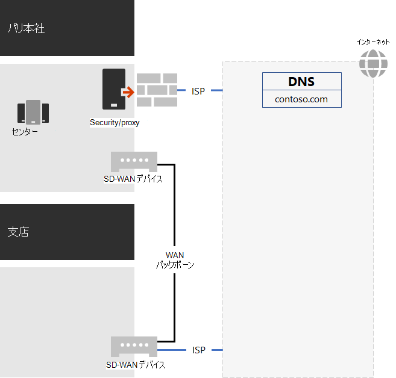
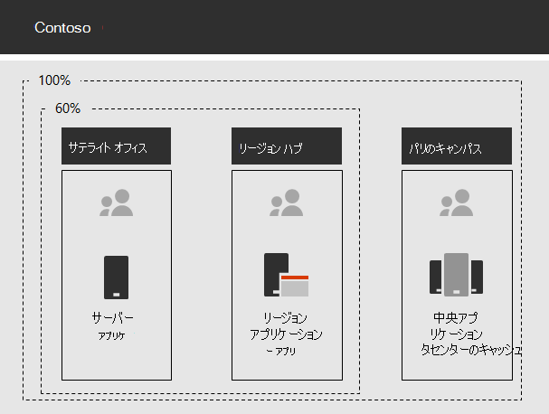

# Contoso Corporation のネットワーク

Contoso は、クラウドインクルーシブ インフラストラクチャを採用するために、クラウド サービスへのネットワーク トラフィックの移動方法の基本的なシフトを考案しました。 次のレベルのオフィス階層のネットワーク接続とトラフィックに焦点を当てた内部ハブ アンド スポーク モデルの代わりに、ユーザーの場所をローカル インターネットエグレスにマップし、ローカル接続をインターネット上の最も近いMicrosoft 365ネットワークの場所にマップしました。

## ネットワーク インフラストラクチャ

これらは、世界中の Contoso オフィスをリンクするネットワーク要素です。

- Multiprotocol Label Switching (MPLS) WAN ネットワーク

  MPLS WAN ネットワークは、パリ本社を地域オフィスと地域オフィスを、スポークアンドハブ構成のサテライト オフィスに接続します。 このネットワークを使用すると、ユーザーはパリ本社の基幹業務アプリケーションを構成するオンプレミス サーバーにアクセスできます。 また、一般的なインターネット トラフィックはパリオフィスにルーティングされ、ネットワーク セキュリティ デバイスによって要求がスクラブされます。 各オフィス内では、ルーターは、プライベート IP アドレス空間を使用するサブネット上の有線ホストまたはワイヤレス アクセス ポイントにトラフィックを配信します。

- Microsoft 365 トラフィック用のローカル の直接インターネット アクセス

  各オフィスには、プロキシ サーバー経由の独自のインターネット接続を備えた 1 つ以上のローカル インターネット ISP ネットワーク回線を備えたソフトウェア定義 WAN (SD-WAN) デバイスがあります。 これは通常、パブリック IP アドレスとローカル DNS サーバーも提供するローカル ISP への WAN リンクとして実装されます。

- インターネット プレゼンス

  Contoso は contosocom\. パブリック ドメイン名を所有しています。 製品を注文するための Contoso パブリック Web サイトは、パリのキャンパス内のインターネットに接続されたデータセンター内の一連のサーバーです。 Contoso は、インターネット上で /24 パブリック IP アドレス範囲を使用します。

図 1 は、Contoso ネットワーク インフラストラクチャとそのインターネットへの接続を示しています。

 
**図 1: Contoso ネットワーク**

## Microsoft への最適なネットワーク接続のための SD-WAN の使用

Contoso 社は次の [Microsoft 365 ネットワーク接続の原則](microsoft-365-network-connectivity-principles.md)に従いました。

- Microsoft 365 ネットワーク トラフィックを識別して区別する
- ネットワーク接続のローカルの出口を提供する
- ネットワーク ヘアピンを回避する
- 重複するネットワーク セキュリティ デバイスをバイパスする

Microsoft 365のネットワーク トラフィックには、*最適化*、*許可*、既定の 3 つのカテゴリ *があります*。 トラフィックの最適化と許可は、エンドポイントで暗号化およびセキュリティで保護され、Microsoft 365 ネットワーク宛ての信頼されたネットワーク トラフィックです。

Contoso は次のように決定しました。

- カテゴリ トラフィックを最適化および許可するために直接インターネット エグレスを使用し、すべての既定のカテゴリ トラフィックをパリベースの中央インターネット接続に転送します。

- これらの原則に従い、クラウド ベースのサービスMicrosoft 365最適なネットワーク パフォーマンスを実現する簡単な方法として、各オフィスに SD-WAN デバイスをデプロイします。

  SD-WAN デバイスには、ローカル オフィス ネットワーク用の LAN ポートと複数の WAN ポートがあります。 1 つの WAN ポートが、その MPLS ネットワークに接続します。 もう 1 つは、ローカル ISP 回線に接続します。 SD-WAN デバイスは、ISP リンクを介してカテゴリ ネットワーク トラフィックを最適化および許可します。

## Contoso 基幹業務アプリ インフラストラクチャ

Contoso は、次の目的で基幹業務アプリケーションとサーバー イントラネット インフラストラクチャを設計しました。

- サテライト オフィスは、ローカル キャッシュ サーバーを使用して、アクセス頻度の高いドキュメントおよび内部 Web サイトを格納します。
- 地域ハブは、地域オフィスおよびサテライト オフィスに地域アプリケーション サーバーを使用します。これらのサーバーは、パリ本社のサーバーと同期します。
- パリのキャンパス データセンターには、組織全体にサービスを提供する一元的なアプリケーション サーバーが含まれています。

図 2 は、Contoso イントラネット全体のサーバーにアクセスするときに使用されるネットワーク トラフィック容量の割合を示しています。

 
**図 2: 内部アプリケーション用の Contoso インフラストラクチャ**

サテライト ハブ オフィスまたは地域ハブ オフィスの場合、従業員が必要とするリソースの 60% をサテライト およびリージョンハブのオフィス サーバーで提供できます。 リソース要求のさらに 40% は、WAN リンクを経由してパリキャンパスに移動する必要があります。

## エンタープライズ向けのMicrosoft 365のネットワーク分析と準備

Contoso ユーザーがエンタープライズ サービスにMicrosoft 365を正常に導入するには、インターネットまたは Microsoft クラウド サービスへの高可用性とパフォーマンスの高い接続が必要です。 Contoso は、エンタープライズ クラウド サービスのMicrosoft 365への最適化された接続を計画して実装するために、次の手順を実行しました。

1. 計画に役立つ会社の WAN ネットワーク図を作成する

   Contoso は、ネットワーク計画を開始するために、オフィスの場所、既存のネットワーク接続、既存のネットワーク境界デバイス、ネットワーク上で管理されているサービスのクラスを示す図を作成しました。 ネットワーク接続の計画と実装の後続の手順ごとに、この図を使用しました。

2. エンタープライズ ネットワーク接続のMicrosoft 365の計画を作成する

   Contoso は[、Microsoft 365ネットワーク接続の原則](microsoft-365-network-connectivity-principles.md)と参照ネットワーク アーキテクチャのサンプルを使用して、SD-WAN をMicrosoft 365接続に適したトポロジとして識別しました。

3. 各オフィスのインターネット接続使用率と MPLS-WAN 帯域幅を分析し、必要に応じて帯域幅を増やす

   各オフィスの現在の使用状況が分析され、回線が増加し、クラウド ベースのトラフィックMicrosoft 365予測され、平均 20% の未使用容量で動作します。

4. Microsoft ネットワーク サービスのパフォーマンスを最適化する

   Contoso は、最適なパフォーマンスを実現するために、Office 365、Intune、Azure エンドポイントのセットと、構成されたファイアウォール、セキュリティ デバイス、およびその他のシステムをインターネット パスで決定しました。 Office 365最適化と許可カテゴリ のトラフィックのエンドポイントは、ISP 回線経由でルーティングするために SD-WAN デバイスに構成されました。

5. 内部 DNS を構成する

   DNS が機能し、Microsoft 365 トラフィックのためにローカルで検索対象になる必要があります。

6. ネットワーク エンドポイントとポートの接続を検証する

   Contoso は、エンタープライズ クラウド サービスのMicrosoft 365の接続を検証するために、Microsoft ネットワーク接続テスト ツールを実行しました。

7. ネットワーク接続のために従業員のコンピューターを最適化する

   個々のコンピューターがチェックされ、最新のオペレーティング システムの更新プログラムがインストールされ、エンドポイントのセキュリティ監視がすべてのクライアントでアクティブになっていることを確認しました。

## 次の手順

Contoso が従業員向けに[クラウドで オンプレミスの Active Directory Domain Services を活用し、](contoso-identity.md)顧客とビジネス パートナーの認証をフェデレーションする方法について説明します。

## 関連項目

[Microsoft 365のネットワーク ロードマップ](networking-roadmap-microsoft-365.md)

[Microsoft 365 for enterprise の概要](microsoft-365-overview.md)

[テスト ラボ ガイド](m365-enterprise-test-lab-guides.md)
