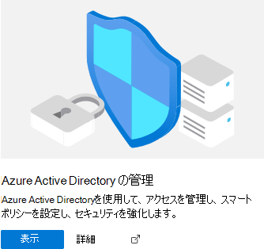
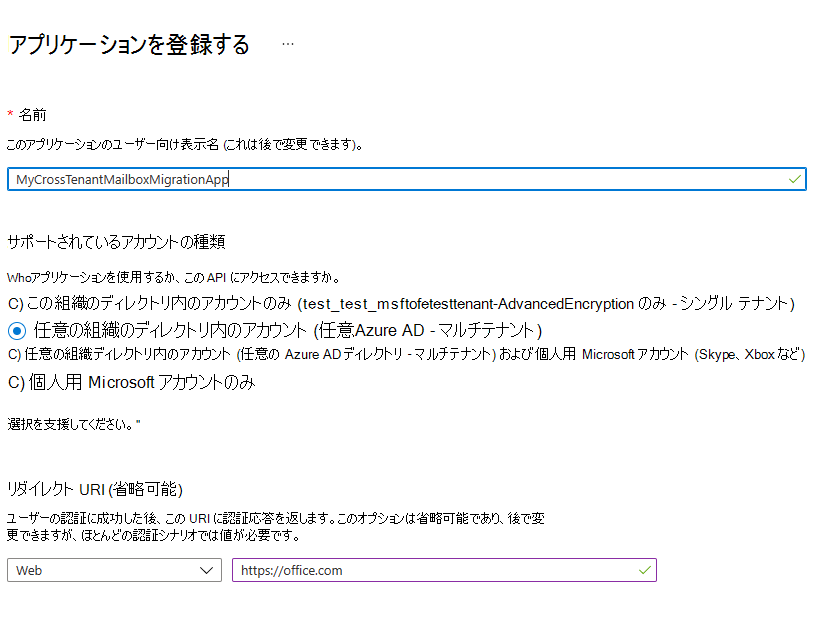
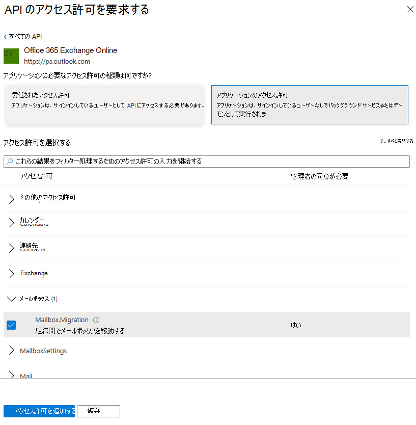

# <a name="cross-tenant-mailbox-migration-preview"></a>テナント間メールボックス移行 (プレビュー)

一般に、合併または分割中は、ユーザーのExchange Onlineメールボックスを新しいテナントに移動する機能が必要です。 テナント間メールボックスの移行により、テナント管理者はリモート PowerShell や MRS などの既知のインターフェイスを使用して、ユーザーを新しい組織に移行できます。

管理者は、メールボックスの移動管理ロールで使用できるNew-MigrationBatchコマンドレットを使用して、テナント間の移動を実行できます。

移行するユーザーは、ターゲット テナントExchange Online システムに MailUsers として存在する必要があります。テナント間の移動を有効にするには、特定の属性がマークされています。 ターゲット テナントで適切に設定されていないユーザーに対して、システムの移動が失敗します。

移動が完了すると、移行元のユーザー メールボックスが MailUser に変換され、targetAddress (Exchangeでは ExternalEmailAddress として表示) に宛先テナントへのルーティング アドレスがスタンプされます。 このプロセスは、従来の MailUser をソース テナントに残し、共存とメール ルーティングを可能にします。 ビジネス プロセスで許可されている場合、移行元テナントはソース MailUser を削除したり、メール連絡先に変換したりすることができます。

テナント間Exchangeメールボックスの移行は、ハイブリッドまたはクラウド内のテナント、または 2 つの任意の組み合わせでのみサポートされます。

この記事では、テナント間のメールボックス移動のプロセスについて説明し、Exchange Onlineメールボックスのコンテンツ移動に対してソース テナントとターゲット テナントを準備する方法に関するガイダンスを提供します。

   > [!NOTE]
   > 最近、Azure Key Vaultを必要としないテナント間メールボックス移行を有効にするために、セットアップ手順を更新しました。 このプレビューに初めてオンボードする場合は、アクションは必要ありません。このドキュメントで詳しく説明されている手順に従うことができます。 前の AKV メソッドを使用してテナントの構成を開始した場合は、この新しい方法の使用を開始するために、その構成を停止または削除することを非常に推奨します。 前の AKV 方法でメールボックスの移行が進行中の場合は、既存の移行が完了するまで待ってから、次の手順に従って新しい簡略化された方法を有効にしてください。 Azure Key Vault必要なセットアップ手順はアーカイブされますが、**[こちら](https://github.com/microsoft/cross-tenant/wiki/V1-Content#cross-tenant-mailbox-migration-preview)** から参照できます。

## <a name="preparing-source-and-target-tenants"></a>ソース テナントとターゲット テナントの準備

### <a name="prerequisites-for-source-and-target-tenants"></a>ソース テナントとターゲット テナントの前提条件

開始する前に、Azure、EXO 移行エンドポイント、および EXO 組織リレーションシップでメールボックスの移動アプリケーションを構成するために必要なアクセス許可があることを確認します。

さらに、ソース テナント内の少なくとも 1 つのメールが有効なセキュリティ グループが必要です。 これらのグループは、ソース テナント (またはリソースとも呼ばれる) テナントからターゲット テナントに移動できるメールボックスの一覧の範囲を指定するために使用されます。 これにより、移行元テナント管理者は、移動する必要があるメールボックスの特定のセットを制限またはスコープ設定し、意図しないユーザーが移行されないようにすることができます。 入れ子になったグループはサポートされていません。

また、信頼できるパートナー会社 (メールボックスを移動する相手) と通信して、Microsoft 365テナント ID を取得する必要もあります。 このテナント ID は、[組織リレーションシップ DomainName] フィールドで使用されます。

サブスクリプションのテナント ID を取得するには、[Microsoft 365 管理センター](https://go.microsoft.com/fwlink/p/?linkid=2024339)にサインインして [https://aad.portal.azure.com/\#blade/Microsoft_AAD_IAM/ActiveDirectoryMenuBlade/Properties](https://aad.portal.azure.com/#blade/Microsoft_AAD_IAM/ActiveDirectoryMenuBlade/Properties)、 . テナント ID プロパティのコピー アイコンをクリックして、クリップボードにコピーします。

### <a name="configuration-steps-to-enable-your-tenants-for-cross-tenant-mailbox-migrations"></a>テナント間メールボックスの移行を有効にする構成手順

   > [!NOTE]
   > 最初にターゲット (宛先) を構成する必要があります。 これらの手順を完了するには、ソース テナントとターゲット テナントの両方のテナント管理者資格情報を持っているか、知っている必要はありません。 ステップは、異なる管理者がテナントごとに個別に実行できます。

### <a name="prepare-the-target-destination-tenant-by-creating-the-migration-application-and-secret"></a>移行アプリケーションとシークレットを作成してターゲット (移行先) テナントを準備する

1. ターゲット テナント管理者の資格情報を使用して Azure AD ポータル (<https://portal.azure.com>) にログインする

   

2. [Azure Active Directoryの管理] の下にある [ビュー] をクリックします。

   

3. 左側のナビゲーション バーで、アプリの登録を選択します。

4. [新しい登録] を選択する

   

5. [アプリケーションの登録] ページの [サポートされているアカウントの種類] で、任意の組織ディレクトリの [アカウント] ([任意の Azure AD ディレクトリ - マルチテナント] ) を選択します。 次に、リダイレクト URI (省略可能) で Web を選択し、次のように入力 <https://office.com>します。 最後に、[登録] を選択します。

   

6. ページの右上隅に、アプリが正常に作成されたことを示す通知ポップアップが表示されます。

7. ホームに戻るし、Azure Active Directoryしてアプリの登録をクリックします。

8. [所有アプリケーション] で、作成したアプリを見つけてクリックします。

9. ^Essentials では、後でターゲット テナントの URL を作成する必要があるため、アプリケーション (クライアント) ID をコピーする必要があります。

10. 次に、左側のナビゲーション バーで [API アクセス許可] をクリックして、アプリに割り当てられているアクセス許可を表示します。

11. 既定では、ユーザーです。 作成したアプリには読み取りアクセス許可が割り当てられますが、メールボックスの移行には必要ありません。そのアクセス許可を削除できます。

    

12. 次に、メールボックス移行のアクセス許可を追加する必要があります。[アクセス許可の追加] を選択します

13. [要求 API のアクセス許可] ウィンドウで、組織が使用する API を選択し、Office 365 Exchange Onlineを検索して選択します。

    

14. 次に、[アプリケーションのアクセス許可] を選択します。

15. 次に、[アクセス許可の選択] で [メールボックス] を展開し、画面下部の [Mailbox.Migration] と [アクセス許可の追加] をオンにします。

    

16. 次に、アプリケーションの左側のナビゲーション バーで [証明書&シークレット] を選択します。

17. [クライアント シークレット] で、新しいクライアント シークレットを選択します。

    

18. [クライアント シークレットの追加] ウィンドウで説明を入力し、必要な有効期限設定を構成します。

      > [!NOTE]
      > これは、移行エンドポイントの作成時に使用されるパスワードです。 このパスワードをクリップボードにコピーするか、パスワードをコピーして安全な場所にセキュリティで保護/シークレットすることが非常に重要です。 このパスワードを確認できるのは、これが唯一の時間です。 何らかの方法で紛失した場合やリセットする必要がある場合は、Azure portalに再度ログインし、アプリの登録に移動し、移行アプリを見つけ、[シークレット&証明書] を選択して、アプリの新しいシークレットを作成できます。

19. 移行アプリケーションとシークレットを正常に作成したので、アプリケーションに同意する必要があります。 アプリケーションに同意するには、Azure Active Directoryランディング ページに戻り、左側のナビゲーションでEnterpriseアプリケーションをクリックし、作成した移行アプリを見つけて選択し、左側のナビゲーションで [アクセス許可] を選択します。

20. [テナント] ボタンの [管理者の同意を付与する] をクリックします。

21. 新しいブラウザー ウィンドウが開き、[承諾] を選択します。

22. ポータル ウィンドウに戻り、[更新] を選択して同意を確認できます。

23. 信頼されたパートナー (ソース テナント管理者) に送信する URL を作成し、アプリケーションを受け入れてメールボックスの移行を有効にすることもできます。 作成したアプリのアプリケーション ID が必要な URL の例を次に示します。

    ```powershell
    https://login.microsoftonline.com/sourcetenant.onmicrosoft.com/adminconsent?client_id=[application_id_of_the_app_you_just_created]&redirect_uri=https://office.com
    ```

    > [!NOTE]
    > 先ほど作成したメールボックス移行アプリのアプリケーション ID が必要です。
    >
    > 上の例の sourcetenant.onmicrosoft.com をソース テナントの正しい onmicrosoft.com 名に置き換える必要があります。
    >
    > [application_id_of_the_app_you_just_created] を、作成したメールボックス移行アプリのアプリケーション ID に置き換える必要もあります。

### <a name="prepare-the-target-tenant-by-creating-the-exchange-online-migration-endpoint-and-organization-relationship"></a>Exchange Online移行エンドポイントと組織の関係を作成してターゲット テナントを準備する

1. ターゲット Exchange Online テナントへのリモート PowerShell 接続を作成します。

2. テナント間メールボックス移動用の新しい移行エンドポイントを作成する

   > [!NOTE]
   > 作成したメールボックス移行アプリのアプリケーション ID と、このプロセス中に構成したパスワード (シークレット) が必要です。 また、エンドポイントを使用するクラウド インスタンスのMicrosoft 365によっては、異なる場合があります。 [Microsoft 365エンドポイント](/microsoft-365/enterprise/microsoft-365-endpoints) ページを参照し、テナントの適切なインスタンスを選択し、Exchange Online必要なアドレスの最適化を確認し、必要に応じて置き換えてください。

   ```powershell

   # Enable customization if tenant is dehydrated
   $dehydrated=Get-OrganizationConfig | select isdehydrated
   if ($dehydrated -eq $true) {Enable-OrganizationCustomization}
   $AppId = "[guid copied from the migrations app]"
   $Credential = New-Object -TypeName System.Management.Automation.PSCredential -ArgumentList $AppId, (ConvertTo-SecureString -String "[this is your secret password you saved in the previous steps]" -AsPlainText -Force)
   New-MigrationEndpoint -RemoteServer outlook.office.com -RemoteTenant "sourcetenant.onmicrosoft.com" -Credentials $Credential -ExchangeRemoteMove:$true -Name "[the name of your migration endpoint]" -ApplicationId $AppId
   ```

3. 既存の組織リレーションシップ オブジェクトを新しく作成するか、ソース テナントに編集します。

   ```powershell
   $sourceTenantId="[tenant id of your trusted partner, where the source mailboxes are]"
   $orgrels=Get-OrganizationRelationship
   $existingOrgRel = $orgrels | ?{$_.DomainNames -like $sourceTenantId}
   If ($null -ne $existingOrgRel)
   {
       Set-OrganizationRelationship $existingOrgRel.Name -Enabled:$true -MailboxMoveEnabled:$true -MailboxMoveCapability Inbound
   }
   If ($null -eq $existingOrgRel)
   {
       New-OrganizationRelationship "[name of the new organization relationship]" -Enabled:$true -MailboxMoveEnabled:$true -MailboxMoveCapability Inbound -DomainNames $sourceTenantId
   }
   ```

### <a name="prepare-the-source-current-mailbox-location-tenant-by-accepting-the-migration-application-and-configuring-the-organization-relationship"></a>移行アプリケーションを受け入れ、組織の関係を構成することで、ソース (現在のメールボックスの場所) テナントを準備する

1. ブラウザーから、信頼されたパートナーが提供する URL リンクに移動して、メールボックス移行アプリケーションに同意します。 URL は次のようになります。

   ```powershell
   https://login.microsoftonline.com/sourcetenant.onmicrosoft.com/adminconsent?client_id=[application_id_of_the_app_you_just_created]&redirect_uri=https://office.com
   ```

   > [!NOTE]
   > 先ほど作成したメールボックス移行アプリのアプリケーション ID が必要です。
   > 上の例の sourcetenant.onmicrosoft.com をソース テナントの正しい onmicrosoft.com 名に置き換える必要があります。
   > [application_id_of_the_app_you_just_created] を、作成したメールボックス移行アプリのアプリケーション ID に置き換える必要もあります。

2. ポップアップが表示されたら、アプリケーションを受け入れます。 Azure Active Directory ポータルにログインし、Enterprise アプリケーションでアプリケーションを見つけることもできます。

3. Exchange Onlineリモート PowerShell ウィンドウから、既存の組織リレーションシップ オブジェクトをターゲット (移行先) テナントに新規作成または編集します。

   ```powershell
   $targetTenantId="[tenant id of your trusted partner, where the mailboxes are being moved to]"
   $appId="[application id of the mailbox migration app you consented to]"
   $scope="[name of the mail enabled security group that contains the list of users who are allowed to migrate]"
   $orgrels=Get-OrganizationRelationship
   $existingOrgRel = $orgrels | ?{$_.DomainNames -like $targetTenantId}
   If ($null -ne $existingOrgRel)
   {
       Set-OrganizationRelationship $existingOrgRel.Name -Enabled:$true -MailboxMoveEnabled:$true -MailboxMoveCapability RemoteOutbound -OAuthApplicationId $appId -MailboxMovePublishedScopes $scope
   }
   If ($null -eq $existingOrgRel)
   {
       New-OrganizationRelationship "[name of your organization relationship]" -Enabled:$true -MailboxMoveEnabled:$true -MailboxMoveCapability RemoteOutbound -DomainNames $targetTenantId -OAuthApplicationId $appId -MailboxMovePublishedScopes $scope
   }
   ```

> [!NOTE]
> $sourceTenantIdと$targetTenantIdとして入力するテナント ID は、テナント ドメイン名ではなく GUID です。 テナント ID の例とテナント ID の検索に関する情報については、「[Microsoft 365テナント ID を検索する](/onedrive/find-your-office-365-tenant-id)」を参照してください。

### <a name="how-do-i-know-this-worked"></a>設定が適用されたことを確認する方法

ターゲット テナントで作成したテナント間移行エンドポイントに対して [Test-MigrationServerAvailability](/powershell/module/exchange/Test-MigrationServerAvailability) コマンドレットを実行することで、テナント間メールボックス移行構成を確認できます。

   > [!NOTE]
   >
   > - ターゲット テナント:
   >
   > Test-MigrationServerAvailability -Endpoint "[テナント間移行エンドポイントの名前]"
   >
   > Get-OrganizationRelationship |fl 名、DomainNames、MailboxMoveEnabled、MailboxMoveCapability
   >
   > - ソース テナント:
   >
   > Get-OrganizationRelationship |fl 名、DomainNames、MailboxMoveEnabled、MailboxMoveCapability

### <a name="move-mailboxes-back-to-the-original-source"></a>メールボックスを元のソースに戻す

メールボックスを元のソース テナントに戻す必要がある場合は、同じ手順とスクリプトのセットを新しいソース テナントと新しいターゲット テナントの両方で実行する必要があります。 既存の組織リレーションシップ オブジェクトは更新または追加され、再作成されません。

## <a name="prepare-target-user-objects-for-migration"></a>移行用にターゲット ユーザー オブジェクトを準備する

移行するユーザーは、ターゲット テナントに存在する必要があります。また、テナント間の移動を有効にするには、特定の属性でマークされた (MailUsers として) Exchange Online システムに存在する必要があります。 ターゲット テナントで適切に設定されていないユーザーに対して、システムの移動が失敗します。 次のセクションでは、ターゲット テナントの MailUser オブジェクトの要件について詳しく説明します。

### <a name="prerequisites-for-target-user-objects"></a>ターゲット ユーザー オブジェクトの前提条件

ターゲット組織で次のオブジェクトと属性が設定されていることを確認します。

1. 移行元組織から移動するすべてのメールボックスについては、ターゲット組織で MailUser オブジェクトをプロビジョニングする必要があります。

   - Target MailUser には、ソース メールボックスから、または新しい User オブジェクトで割り当てられている次の属性が必要です。
      - ExchangeGUID (ソースからターゲットへの直接フロー): メールボックス GUID が一致している必要があります。 ターゲット オブジェクトに存在しない場合、移動プロセスは続行されません。
      - ArchiveGUID (ソースからターゲットへの直接フロー): アーカイブ GUID が一致している必要があります。 ターゲット オブジェクトに存在しない場合、移動プロセスは続行されません。 (これは、ソース メールボックスがアーカイブが有効になっている場合にのみ必要です)。
      - LegacyExchangeDN (proxyAddress としてフロー、"x500:\<LegacyExchangeDN>"): LegacyExchangeDN は、ターゲット MailUser に x500: proxyAddress として存在する必要があります。 さらに、ソース メールボックスからターゲット メール ユーザーにすべての x500 アドレスをコピーする必要もあります。 移動プロセスは、ターゲット オブジェクトに存在しない場合は続行されません。
      - UserPrincipalName: UPN は、ユーザーの新しい ID またはターゲット企業 (user@northwindtraders.onmicrosoft.com など) に対応します。
      - プライマリ SMTPAddress: プライマリ SMTP アドレスは、ユーザーの新しい会社 (user@northwind.com など) に合わせて配置されます。
      - TargetAddress/ExternalEmailAddress: MailUser は、ソース テナントでホストされているユーザーの現在のメールボックス (user@contoso.onmicrosoft.com など) を参照します。 この値を割り当てるときに、PrimarySMTPAddress が割り当てられているか、またはこの値が PrimarySMTPAddress を設定することを確認します。これにより、移動エラーが発生します。
      - ソース メールボックスからターゲット MailUser に従来の SMTP プロキシ アドレスを追加することはできません。 たとえば、fabrikam.onmicrosoft.com テナント オブジェクト) で MEU の contoso.com を維持することはできません)。 ドメインは、1 つの Azure AD またはExchange Online テナントにのみ関連付けられます。

     **ターゲット** MailUser オブジェクトの例:

     | 属性            | 値                                                                                                                   |
     | -------------------- | ----------------------------------------------------------------------------------------------------------------------- |
     | Alias                | LaraN                                                                                                                   |
     | RecipientType        | MailUser                                                                                                                |
     | RecipientTypeDetails | MailUser                                                                                                                |
     | UserPrincipalName    | LaraN@northwintraders.onmicrosoft.com                                                                                   |
     | PrimarySmtpAddress   | Lara.Newton@northwind.com                                                                                               |
     | ExternalEmailAddress | SMTP:LaraN@contoso.onmicrosoft.com                                                                                      |
     | ExchangeGuid         | 1ec059c7-8396-4d0b-af4e-d6bd4c12a8d8                                                                                    |
     | LegacyExchangeDN     | /o=First Organization/ou=Exchange管理グループ                                                                  |
     |                      | (FYDIBOHF23SPDLT)/cn=Recipients/cn=74e5385fce4b46d1900687694985035Lara                                                 |
     | EmailAddresses       | x500:/o=First Organization/ou=Exchange 管理グループ (FYDIBOHF23SPDLT)/cn=Recipients/cn=d11ec1a2cacd4f81858c8190 |
     |                      | 7273f1f9-Lara                                                                                                           |
     |                      | smtp:LaraN@northwindtraders.onmicrosoft.com                                                                             |
     |                      | SMTP:Lara.Newton@northwind.com                                                                                          |

     **ソース** メールボックス オブジェクトの例:

     | 属性            | 値                                                                   |
     | -------------------- | ----------------------------------------------------------------------- |
     | Alias                | LaraN                                                                   |
     | RecipientType        | UserMailbox                                                             |
     | RecipientTypeDetails | UserMailbox                                                             |
     | UserPrincipalName    | LaraN@contoso.onmicrosoft.com                                           |
     | PrimarySmtpAddress   | Lara.Newton@contoso.com                                                 |
     | ExchangeGuid         | 1ec059c7-8396-4d0b-af4e-d6bd4c12a8d8                                    |
     | LegacyExchangeDN     | /o=First Organization/ou=Exchange管理グループ                  |
     |                      | (FYDIBOHF23SPDLT)/cn=Recipients/cn=d11ec1a2cacd4f81858c81907273f1f9Lara |
     | EmailAddresses       | smtp:LaraN@contoso.onmicrosoft.com                                      |
     |                      | SMTP:Lara.Newton@contoso.com                                            |

   - 追加の属性は、ハイブリッド ライトバックExchange既に含まれている可能性があります。 含まれていない場合は、含める必要があります。
   - msExchBlockedSendersHash – クライアントからオンプレミスの Active Directoryにオンラインの安全でブロックされた送信者データを書き戻します。
   - msExchSafeRecipientsHash – クライアントからオンプレミスの Active Directoryにオンラインの安全でブロックされた送信者データを書き戻します。
   - msExchSafeSendersHash – クライアントからオンプレミスの Active Directoryにオンラインの安全でブロックされた送信者データを書き戻します。

2. ソース メールボックスが LitigationHold にあり、ソース メールボックスの回復可能なアイテムサイズがデータベースの既定値 (30 GB) を超えている場合、ターゲット クォータがソース メールボックス サイズより小さいため、移動は続行されません。 ターゲット MailUser オブジェクトを更新して、ソース環境からターゲットに ELC メールボックス フラグを移行できます。これにより、ターゲット システムが MailUser のクォータを 100 GB に拡張し、ターゲットへの移動が許可されます。 これらの手順は、ELC フラグをスタンプするコマンドがテナント管理者に公開されないため、Azure AD Connectを実行するハイブリッド ID でのみ機能します。

    > [!NOTE]
    > サンプル – 現状のまま、保証なし
    >
    > このスクリプトでは、(ソース値を取得するために) ソース メールボックスとターゲット オンプレミスの Active Directory (ADUser オブジェクトをスタンプする) の両方への接続を前提としています。 ソースで訴訟または単一アイテムの回復が有効になっている場合は、移行先アカウントでこれを設定します。  これにより、移行先アカウントのダンプ スター サイズが 100 GB に増加します。

    ```powershell
    $ELCValue = 0
    if ($source.LitigationHoldEnabled) {$ELCValue = $ELCValue + 8} if ($source.SingleItemRecoveryEnabled) {$ELCValue = $ELCValue + 16} if ($ELCValue -gt 0) {Set-ADUser -Server $domainController -Identity $destination.SamAccountName -Replace @{msExchELCMailboxFlags=$ELCValue}}
    ```

3. ハイブリッド以外のターゲット テナントは、次のコマンドを実行して MailUser オブジェクトの訴訟ホールドを有効にし、クォータを 100 GB に増やすことで、移行前に MailUsers の回復可能なアイテム フォルダーのクォータを変更できます。

   ```powershell
   Set-MailUser -Identity <MailUserIdentity> -EnableLitigationHoldForMigration
   ```

   これは、ハイブリッドのテナントでは機能しないことに注意してください。

4. ターゲット組織のユーザーは、組織に適用される適切なExchange Onlineサブスクリプションを使用してライセンスを取得する必要があります。 メールボックスの移動の前にライセンスを適用できますが、ターゲットの MailUser が ExchangeGUID とプロキシ アドレスで適切に設定された場合にのみ適用できます。 ExchangeGUID が適用される前にライセンスを適用すると、ターゲット組織で新しいメールボックスがプロビジョニングされます。

    > [!NOTE]
    > Mailbox または MailUser オブジェクトにライセンスを適用すると、すべての SMTP 型 proxyAddresses がスクラブされ、検証済みのドメインのみがExchange EmailAddresses 配列に含まれていることが確認されます。

5. ターゲット MailUser に、ソース ExchangeGuid と一致しない以前の ExchangeGuid がないことを確認する必要があります。 これは、ターゲット MEU が以前にExchange Onlineのライセンスを取得し、メールボックスをプロビジョニングした場合に発生する可能性があります。 ターゲットの MailUser が以前に、ソース ExchangeGuid と一致しない ExchangeGuid に対してライセンスが付与されていたか、または ExchangeGuid を持っていた場合は、クラウド MEU のクリーンアップを実行する必要があります。 これらのクラウド MEU の場合 `Set-User <identity> -PermanentlyClearPreviousMailboxInfo`は、.

    > [!CAUTION]
    > このプロセスは元に戻せません。 オブジェクトに softDeleted メールボックスがある場合、この時点以降は復元できません。 ただし、クリアした後は、正しい ExchangeGuid をターゲット オブジェクトに同期することができ、MRS によってソース メールボックスが新しく作成されたターゲット メールボックスに接続されます。 (新しいパラメーターの EHLO ブログを参照してください)。)

    このコマンドを使用して、以前のメールボックスだったオブジェクトを検索します。

    ```powershell
    Get-User <identity> | select Name, *recipient* | Format-Table -AutoSize
    ```

    次に例を示します。

    ```powershell
    Get-User John@northwindtraders.com |select name, *recipient*| Format-Table -AutoSize

    Name       PreviousRecipientTypeDetails     RecipientType RecipientTypeDetails
    ----       ---------------------------- ------------- --------------------
    John       UserMailbox                  MailUser      MailUser
    ```

    このコマンドを使用して、論理的に削除されたメールボックスをクリアします。

    ```powershell
    Set-User <identity> -PermanentlyClearPreviousMailboxInfo
    ```

    次に例を示します。

    ```powershell
    Set-User John@northwindtraders.com -PermanentlyClearPreviousMailboxInfo -Confirm

    Are you sure you want to perform this action?
    Delete all existing information about user "John@northwindtraders.com"?. This operation will clear existing values from Previous home MDB and Previous Mailbox GUID of the user. After deletion, reconnecting to the previous mailbox that existed in the cloud will not be possible and any content it had will be unrecoverable PERMANENTLY.
    Do you want to continue?
    [Y] Yes  [A] Yes to All  [N] No  [L] No to All  [?] Help (default is "Y"): Y
    ```

### <a name="perform-mailbox-migrations"></a>メールボックスの移行を実行する

テナント間Exchangeメールボックスの移行は、移行バッチとしてターゲット テナントから開始されます。 これは、オンプレミスからMicrosoft 365に移行するときに、オンボード移行バッチが動作する方法Exchange似ています。

### <a name="create-migration-batches"></a>移行バッチを作成する

移動を開始するための移行バッチ コマンドレットの例を次に示します。

```powershell
New-MigrationBatch -Name T2Tbatch -SourceEndpoint target_source_7977 -CSVData ([System.IO.File]::ReadAllBytes('users.csv')) -Autostart -TargetDeliveryDomain target.onmicrosoft.com

Identity                   Status  Type               TotalCount
--------                   ------  ----               ----------
T2Tbatch                   Syncing ExchangeRemoteMove 1
```

> [!NOTE]
> CSV ファイル内の電子メール アドレスは、ソース テナントではなく、ターゲット テナントで指定されている必要があります。
>
> [コマンドレットの詳細については、ここをクリックしてください](/powershell/module/exchange/new-migrationbatch)
>
> [CSV ファイルの例については、ここをクリックしてください](/exchange/csv-files-for-mailbox-migration-exchange-2013-help)

移行バッチの送信は、クロステナント オプションを選択するときに、新しい<a href="https://go.microsoft.com/fwlink/p/?linkid=2059104" target="_blank">Exchange管理センター</a>からもサポートされます。

### <a name="update-on-premises-mailusers"></a>オンプレミスの MailUsers を更新する

メールボックスがソースからターゲットに移動したら、オンプレミスのメール ユーザー (ソースとターゲットの両方) が新しい targetAddress で更新されるようにする必要があります。 この例では、移動で使用される targetDeliveryDomain が **contoso.onmicrosoft.com**。 この targetAddress を使用してメール ユーザーを更新します。

## <a name="frequently-asked-questions"></a>よく寄せられる質問

**移行後にオンプレミスのソース内の RemoteMailbox を更新する必要がありますか?**

はい。ソース テナント メールボックスがターゲット テナントに移動するときに、ソース オンプレミス ユーザーの targetAddress (RemoteRoutingAddress/ExternalEmailAddress) を更新する必要があります。  メール ルーティングは、異なる targetAddresses を持つ複数のメール ユーザー間の紹介に従うことができますが、メール ユーザーの空き時間検索はメールボックス ユーザーの場所を対象にする必要があります。 空き時間検索では、複数のリダイレクトは追跡されません。

**会議Teamsクロステナントを移行しますか?**

会議は移動しますが、アイテムがテナント間を移行しても、Teams会議の URL は更新されません。 URL はターゲット テナントでは無効であるため、Teams会議を削除して再作成する必要があります。

**Teams チャット フォルダーコンテンツはクロステナントに移行されますか?**

いいえ。Teams チャット フォルダーのコンテンツは、クロステナントを移行しません。

**オンボーディングやオフボーディングの移動ではなく、テナント間の移動である移動だけを確認するにはどうすればよいですか?**

_Flags_ パラメーターを使用します。 次に例を示します。

```powershell
Get-MoveRequest -Flags "CrossTenant"
```

**テストで使用される属性をコピーするためのスクリプトの例を指定できますか?**

> [!NOTE]
> SAMPLE – AS IS,NO WARRANTY このスクリプトは、ソース メールボックス (ソース値を取得する) とターゲット オンプレミスの Active Directory Domain Services (ADUser オブジェクトにスタンプを設定する) の両方への接続を前提としています。 ソースで訴訟または単一アイテムの回復が有効になっている場合は、移行先アカウントでこれを設定します。  これにより、移行先アカウントのダンプ スター サイズが 100 GB に増加します。

   ```powershell
   # This will export users from the source tenant with the CustomAttribute1 = "Cross-Tenant-Project"
   # These are the 'target' users to be moved to the Northwind org tenant
   $outFileUsers = "$home\desktop\UsersToMigrate.txt"
   $outFileUsersXML = "$home\desktop\UsersToMigrate.xml"
   Get-Mailbox -Filter "CustomAttribute1 -like 'Cross-Tenant-Project'" -ResultSize Unlimited | Select-Object -ExpandProperty  Alias | Out-File $outFileUsers
   $mailboxes = Get-Content $outFileUsers
   $mailboxes | ForEach-Object {Get-Mailbox $_} | Select-Object PrimarySMTPAddress,Alias,SamAccountName,FirstName,LastName,DisplayName,Name,ExchangeGuid,ArchiveGuid,LegacyExchangeDn,EmailAddresses | Export-Clixml $outFileUsersXML
   ```

   ```powershell
   # Copy the file $outfile to the desktop of the target on-premises then run the below to create MEU in Target
   $mailboxes = Import-Clixml $home\desktop\UsersToMigrate.xml
   add-type -AssemblyName System.Web
   foreach ($m in $mailboxes) {
       $organization = "@contoso.onmicrosoft.com"
       $mosi = $m.Alias+$organization
       $Password = [System.Web.Security.Membership]::GeneratePassword(16,4) | ConvertTo-SecureString -AsPlainText -Force
       $x500 = "x500:" +$m.LegacyExchangeDn
       $tmpUser = New-MailUser -MicrosoftOnlineServicesID $mosi -PrimarySmtpAddress $mosi -ExternalEmailAddress $m.PrimarySmtpAddress -FirstName $m.FirstName -LastName $m.LastName -Name $m.Name -DisplayName $m.DisplayName -Alias $m.Alias -Password $Password
       $tmpUser | Set-MailUser -EmailAddresses @{add=$x500} -ExchangeGuid $m.ExchangeGuid -ArchiveGuid $m.ArchiveGuid -CustomAttribute1 "Cross-Tenant-Project"
       $tmpx500 = $m.EmailAddresses | ?{$_ -match "x500"}
       $tmpx500 | %{Set-MailUser $m.Alias -EmailAddresses @{add="$_"}}
       }
   ```

   ```powershell
   # Now sync the changes from On-Premises to Azure and Exchange Online in the Target tenant
   # This action should create the target mail enabled users (MEUs) in the Target tenant
   Start-ADSyncSyncCycle
   ```

**使用メールボックスを移動した後、1 日目にOutlookにアクセスするにはどうすればよいですか?**

ドメインを所有できるテナントは 1 つのみであるため、メールボックスの移動が完了すると、以前のプライマリ SMTPAddress はターゲット テナント内のユーザーに関連付けられません。新しいテナントに関連付けられているドメインのみ。 Outlookは、新しい UPN を使用してサービスに対する認証を行い、Outlook プロファイルは、ターゲット システム内のメールボックスと一致する従来のプライマリ SMTPAddress を見つけることを想定しています。 レガシ アドレスはターゲット システムにないため、Outlook プロファイルは新しく移動されたメールボックスを見つけるために接続されません。

この初期デプロイでは、ユーザーは新しい UPN、プライマリ SMTP アドレス、および OST コンテンツを再同期してプロファイルを再構築する必要があります。

> [!NOTE]
> 完了のためにユーザーをバッチ処理するときに、それに応じて計画します。 Outlookクライアント プロファイルが作成され、後続の OST ファイルと OAB ファイルがクライアントにダウンロードされる場合は、ネットワーク使用率と容量を考慮する必要があります。

**テナント間の移動を設定または完了するには、どのExchange RBAC ロールのメンバーである必要がありますか?**

メールボックスの移動を実行する際の委任された職務の前提に基づくロールのマトリックスがあります。 現在、次の 2 つのロールが必要です。

- 最初のロールは、テナント/組織の境界との間でコンテンツを移動する承認を確立する 1 回限りのセットアップ タスクです。 組織の管理外にデータを移動することは、すべての企業にとって重大な懸念事項であるため、組織管理者 (OrgAdmin) の最も高い割り当てロールを選択しました。 このロールは、リモート組織で -MailboxMoveCapability を定義する新しい OrganizationRelationship を変更または設定する必要があります。 OrgAdmin のみが MailboxMoveCapability 設定を変更できますが、OrganizationRelationship の他の属性はフェデレーション共有管理者が管理できます。

- 実際の移動コマンドを実行するロールは、下位レベルの関数に委任できます。 メールボックスの移動の役割は、組織内または組織外でメールボックスを移動する機能に割り当てられます。

**変換されたメールボックス (MailUser 変換) で targetAddress (TargetDeliveryDomain) に対して選択されている SMTP アドレスをターゲットにする方法**

MRS を使用してメールボックスを移動Exchange、ターゲット オブジェクトの電子メール アドレス (proxyAddress) を照合して MailUser に変換するときに、元のソース メールボックスの targetAddress を作成します。 このプロセスは、移動コマンドに渡された -TargetDeliveryDomain 値を受け取り、ターゲット側でそのドメインの一致するプロキシをチェックします。 一致するものが見つかると、変換されたメールボックス (現在の MailUser) オブジェクトの ExternalEmailAddress (targetAddress) を設定するために、一致する proxyAddress が使用されます。

**メールボックスのアクセス許可はどのように切り替えられますか?**

メールボックスのアクセス許可には、代理送信とメールボックス アクセスが含まれます。

- Send On Behalf Of (AD:publicDelegates) は、ユーザーのメールボックスへのアクセス権を持つ受信者の DN を代理人として格納します。 この値は Active Directory に格納され、現在はメールボックスの切り替えの一部として移動されません。 ソース メールボックスに publicDelegates が設定されている場合は、MEU からメールボックスへの変換が実行 `Set-Mailbox <principle> -GrantSendOnBehalfTo <delegate>`されてターゲット環境で完了したら、ターゲット メールボックスの publicDelegate を再サンプリングする必要があります。

- メールボックスに格納されているメールボックスのアクセス許可は、プリンシパルと代理人の両方がターゲット システムに移動されると、メールボックスと共に移動します。 たとえば、ユーザー TestUser_7には、テナント SourceCompany.onmicrosoft.com 内のメールボックス TestUser_8への FullAccess が付与されます。 メールボックスの移動が TargetCompany.onmicrosoft.com に完了すると、ターゲット ディレクトリに同じアクセス許可が設定されます。 ソース テナントとターゲット テナントの両方でTestUser_7に *Get-MailboxPermission* を使用する例を次に示します。 Exchangeコマンドレットには、それに応じてソースとターゲットのプレフィックスが付けられます。

移動前のメールボックスのアクセス許可の出力の例を次に示します。

```powershell
Get-SourceMailboxPermission TestUser_7 | Format-Table -AutoSize User, AccessRights, IsInherited, Deny

User                                             AccessRights                         IsInherited Deny
----                                             ------------                         ----------- ----
NT AUTHORITY\SELF                                {FullAccess, ReadPermission}         False       False
TestUser_8@SourceCompany.onmicrosoft.com         {FullAccess}                         False       False
```

移動後のメールボックスのアクセス許可の出力の例を次に示します。

```powershell
Get-TargetMailboxPermission TestUser_7 | Format-Table -AutoSize User, AccessRights, IsInherited, Deny

User                                             AccessRights                         IsInherited Deny
----                                             ------------                         ----------- ----
NT AUTHORITY\SELF                                {FullAccess, ReadPermission}         False       False
TestUser_8@TargetCompany.onmicrosoft.com         {FullAccess}                         False       False
```

> [!NOTE]
> テナント間メールボックスと予定表のアクセス許可はサポートされていません。 これらの接続されたメールボックスがソース テナントから同時に移行されるように、プリンシパルと代理人を統合移動バッチに編成する必要があります。

**移行を有効にするために、ターゲットの MailUser プロキシ アドレスに追加する必要がある X500 プロキシは何ですか?**

テナント間メールボックスの移行では、ソース メールボックス オブジェクトの LegacyExchangeDN 値をターゲット MailUser オブジェクトの x500 電子メール アドレスとしてスタンプする必要があります。

例:

```powershell
LegacyExchangeDN value on source mailbox is:
/o=First Organization/ou=Exchange Administrative Group(FYDIBOHF23SPDLT)/cn=Recipients/cn=d11ec1a2cacd4f81858c81907273f1f9Lara

so, the x500 email address to be added to target MailUser object would be:
x500:/o=First Organization/ou=Exchange Administrative Group (FYDIBOHF23SPDLT)/cn=Recipients/cn=d11ec1a2cacd4f81858c81907273f1f9-Lara
```

> [!NOTE]
> この X500 プロキシに加えて、ソース内のメールボックスからターゲット内のメールボックスにすべての X500 プロキシをコピーする必要があります。

**ソース テナントとターゲット テナントで同じドメイン名を使用できますか?**

いいえ。 ソーステナントとターゲットテナントのドメイン名は一意である必要があります。 たとえば、contoso.com のソース ドメインと、fourthcoffee.com のターゲット ドメインなどです。

**共有メールボックスは移動し、引き続き機能しますか?**

ただし、次の記事で説明されているように、ストアのアクセス許可のみが保持されます。

- [Microsoft Docs |Exchange Onlineで受信者のアクセス許可を管理する](/exchange/recipients-in-exchange-online/manage-permissions-for-recipients)

- [Microsoft サポート |専用のExchangeとOutlookメールボックスのアクセス許可Office 365付与する方法](https://support.microsoft.com/topic/how-to-grant-exchange-and-outlook-mailbox-permissions-in-office-365-dedicated-bac01b2c-08ff-2eac-e1c8-6dd01cf77287)

**バッチに関する推奨事項はありますか?**

バッチあたり 2,000 メールボックスを超えないようにしてください。 同期中にエンド ユーザーに影響がないため、カットオーバー日の 2 週間前にバッチを送信することを強くお勧めします。 メールボックスの数量が 50,000 を超える場合は、crosstenantmigrationpreview@service.microsoft.com のエンジニアリング フィードバック配布リストにアクセスできます。

**カスタマー キーでサービス暗号化を使用する場合はどうなりますか?**

メールボックスは、移動する前に暗号化解除されます。 ターゲット テナントで顧客キーがまだ必要な場合は、カスタマー キーが構成されていることを確認します。 詳細については [、こちらを](/microsoft-365/compliance/customer-key-overview) 参照してください。

**推定移行時間はどのくらいですか?**

移行を計画するために、 [次](/exchange/mailbox-migration/office-365-migration-best-practices#estimated-migration-times) の表に、一括メールボックスの移行または個々の移行をいつ完了するかを示します。 これらの見積もりは、以前の顧客の移行のデータ分析に基づいています。 すべての環境は一意であるため、正確な移行速度は異なる場合があります。

この機能は現在プレビュー段階であり、SLA であり、該当するサービス レベルは、この機能のプレビュー状態の間、パフォーマンスや可用性の問題には適用されないことに注意してください。

**移行先テナント内のユーザーがソース テナント内のドキュメントを消耗品として保護する。**

テナント間移行では、メールボックス データのみが移行され、それ以外は移行されません。 他にも複数のオプションがあります。これは、次のブログ投稿に記載されています。これは役立つ可能性があります。 <https://techcommunity.microsoft.com/t5/security-compliance-and-identity/mergers-and-spinoffs/ba-p/910455>

**移行元テナントと同じラベルを、組織間の配置に応じて移行されたユーザーの唯一の一連のラベルまたは追加のラベル セットとして、移行元テナントに持つことができます。**

テナント間の移行ではラベルがエクスポートされず、テナント間でラベルを共有する方法がないため、これを実現できるのは、移行先テナント内のラベルを再作成することだけです。

**Microsoft 365 グループの移動はサポートされていますか?**

現在、テナント間メールボックス移行機能では、Microsoft 365 グループの移行はサポートされていません。

**メールボックスが新しいテナントまたはターゲット テナントに移行された後、ソース テナント管理者はメールボックスに対して電子情報開示検索を実行できますか?**

いいえ。テナント間メールボックスの移行後、移行元の移行されたユーザーのメールボックスに対する電子情報開示は機能しません。 これは、メールボックスがターゲット テナントに移行され、現在はターゲット テナントに属しているため、検索対象のメールボックスがソースに存在しなくなったためです。 電子情報開示、メールボックスの移行後は、ターゲット テナント (メールボックスが現在存在する場所) でのみ実行できます。 移行元メールボックスのコピーを移行後に移行元テナントに保持する必要がある場合、ソースの管理者は、データに対する将来の電子情報開示操作のために、移行前の代替メールボックスにコンテンツをコピーできます。

## <a name="known-issues"></a>既知の問題

- **問題: 移行後Teams移行元テナントの機能は制限されます。** メールボックスをターゲット テナントに移行すると、移行元テナントのTeamsはユーザーのメールボックスにアクセスできなくなります。 そのため、ユーザーがソース テナント資格情報を使用してTeamsにログインすると、プロファイル画像を更新できない、予定表アプリケーションを更新できない、パブリック チームを検索して参加できないなどの機能が失われます。

- **問題: 自動展開アーカイブを移行できません。** テナント間移行機能は、特定のユーザーのプライマリ メールボックスとアーカイブ メールボックスの移行をサポートします。 ただし、ソース内のユーザーに自動展開アーカイブ (つまり複数のアーカイブ メールボックス) がある場合、この機能は追加のアーカイブを移行できず、失敗する必要があります。

- **問題: 非所有の smtp proxyAddress ブロック MRS を持つ Cloud MailUsers はバックグラウンドで移動します。** ターゲット テナントの MailUser オブジェクトを作成するときは、すべての SMTP プロキシ アドレスがターゲット テナント組織に属していることを確認する必要があります。 ローカル テナントに属していないターゲット メール ユーザーに SMTP proxyAddress が存在する場合、MailUser からメールボックスへの変換は防止されます。 これは、メールボックス オブジェクトが、テナントが権限を持つドメイン (テナントによって要求されたドメイン) からのみメールを送信できることを保証しているためです。

  - Azure AD Connectを使用してオンプレミスからユーザーを同期する場合は、ExternalEmailAddress でオンプレミスの MailUser オブジェクトをプロビジョニングし、メールボックスが存在するソース テナント (LaraN@contoso.onmicrosoft.com) を指し示し、PrimarySMTPAddress をターゲット テナント (Lara.Newton@northwind.com) に存在するドメインとしてスタンプします。 これらの値はテナントに同期され、適切なメール ユーザーがプロビジョニングされ、移行の準備が整います。 オブジェクトの例を次に示します。

    ```powershell
    Get-MailUser LaraN | select ExternalEmailAddress, EmailAddresses

    ExternalEmailAddress               EmailAddresses
    --------------------               --------------
    SMTP:LaraN@contoso.onmicrosoft.com {SMTP:lara.newton@northwind.com}
    ```

   > [!NOTE]
   > _contoso.onmicrosoft.com_ アドレスは EmailAddresses/proxyAddresses 配列に存在 _しません_。

- **問題: "外部" プライマリ SMTP アドレスを持つ MailUser オブジェクトが変更され、"内部" 企業が要求したドメインにリセットされる**

  MailUser オブジェクトは、ローカル以外のメールボックスへのポインターです。 テナント間メールボックスの移行の場合、MailUser オブジェクトを使用して(ターゲット組織の観点から) ソース メールボックスまたはターゲット メールボックス (ソース組織の観点から) を表します。 MailUsers には、ディレクトリ内のメールボックス ユーザーの表示された SMTP アドレスを表す実際のメールボックス (ProxyTest@fabrikam.onmicrosoft.com) と primarySMTP アドレスの SMTP アドレスを指す ExternalEmailAddress (targetAddress) があります。 一部の組織では、プライマリ SMTP アドレスを外部 SMTP アドレスとして表示することを選択します。これは、ローカル テナントによって所有または検証されるアドレスとしてではなく (contoso.com ではなく fabrikam.com など)。  ただし、ライセンス操作によって Exchangeサービス プラン オブジェクトが MailUser に適用されると、プライマリ SMTP アドレスが変更され、ローカル組織 (contoso.com) によって検証されたドメインとして表示されます。 次の 2 つの理由が考えられます。

  - Exchangeサービス プランが MailUser に適用されると、Azure AD プロセスはプロキシ スクラブを適用し始め、ローカル組織が別のテナントからメールを送信したり、スプーフィングしたり、メールを送信したりできないようにします。 これらのサービス プランを持つ受信者オブジェクト上の SMTP アドレスは、アドレスがローカル組織によって検証されない場合は削除されます。 例の場合と同様に、Fabikam.com ドメインは contoso.onmicrosoft.com テナントによって検証されないため、スクラブによってその fabrikam.com ドメインが削除されます。 移行前または移行後に、これらの外部ドメインを MailUser に保持する場合は、移行が完了した後または移行前にライセンスを削除するように移行プロセスを変更して、ユーザーが想定される外部ブランドが適用されていることを確認する必要があります。 メール サービスに影響を与えないように、メールボックス オブジェクトに適切なライセンスが付与されていることを確認する必要があります。
  - contoso.onmicrosoft.com テナント内の MailUser 上のサービス プランを削除するスクリプトの例を次に示します。

    ```powershell
    $LO = New-MsolLicenseOptions -AccountSkuId "contoso:ENTERPRISEPREMIUM" DisabledPlans "LOCKBOX_ENTERPRISE","EXCHANGE_S_ENTERPRISE","INFORMATION_BARRIERS","MIP_S_CLP2","MIP_S_CLP1","MYANALYTICS_P2","EXCHANGE_ANALYTICS","EQUIVIO_ANALYTICS","THREAT_INTELLIGENCE","PAM_ENTERPRISE","PREMIUM_ENCRYPTION"
    Set-MsolUserLicense -UserPrincipalName ProxyTest@contoso.com LicenseOptions $lo
    ```

       割り当てられた ServicePlan のセットの結果を次に示します。

    ```powershell
    (Get-MsolUser -UserPrincipalName ProxyTest@contoso.com).licenses | Select-Object -ExpandProperty ServiceStatus |sort ProvisioningStatus -Descending

    ServicePlan           ProvisioningStatus
    -----------           ------------------
    ATP_ENTERPRISE        PendingProvisioning
    MICROSOFT_SEARCH      PendingProvisioning
    INTUNE_O365           PendingActivation
    PAM_ENTERPRISE        Disabled
    EXCHANGE_ANALYTICS    Disabled
    EQUIVIO_ANALYTICS     Disabled
    THREAT_INTELLIGENCE   Disabled
    LOCKBOX_ENTERPRISE    Disabled
    PREMIUM_ENCRYPTION    Disabled
    EXCHANGE_S_ENTERPRISE Disabled
    INFORMATION_BARRIERS  Disabled
    MYANALYTICS_P2        Disabled
    MIP_S_CLP1            Disabled
    MIP_S_CLP2            Disabled
    ADALLOM_S_O365        PendingInput
    RMS_S_ENTERPRISE      Success
    YAMMER_ENTERPRISE     Success
    PROJECTWORKMANAGEMENT Success
    BI_AZURE_P2           Success
    WHITEBOARD_PLAN3      Success
    SHAREPOINTENTERPRISE  Success
    SHAREPOINTWAC         Success
    KAIZALA_STANDALONE    Success
    OFFICESUBSCRIPTION    Success
    MCOSTANDARD           Success
    Deskless              Success
    STREAM_O365_E5        Success
    FLOW_O365_P3          Success
    POWERAPPS_O365_P3     Success
    TEAMS1                Success
    MCOEV                 Success
    MCOMEETADV            Success
    BPOS_S_TODO_3         Success
    FORMS_PLAN_E5         Success
    SWAY                  Success
    ```

    ユーザーの PrimarySMTPAddress はスクラブされなくなりました。 fabrikam.com ドメインは、contoso.onmicrosoft.com テナントによって所有されておらず、ディレクトリに表示されるプライマリ SMTP アドレスとして保持されます。

    次に例を示します。

    ```powershell
    Get-Recipient ProxyTest | Format-Table -AutoSize UserPrincipalName, PrimarySmtpAddress, ExternalEmailAddress, ExternalDirectoryObjectId
    UserPrincipalName               PrimarySmtpAddress              ExternalEmailAddress                 ExternalDirectoryObjectId
    -----------------               ------------------              --------------------                 -------------------------
    ProxyTest@fabrikam.com          ProxyTest@fabrikam.com          SMTP:ProxyTest@fabrikam.com          e2513482-1d5b-4066-936a-cbc7f8f6f817
    ```

    - msExchRemoteRecipientType が 8 (DeprovisionMailbox) に設定されている場合、ターゲット テナントに移行されるオンプレミスの MailUsers の場合、Azure のプロキシ スクラブ ロジックによって、所有されていないドメインが削除され、primarySMTP が所有ドメインにリセットされます。 オンプレミスの MailUser で msExchRemoteRecipientType をクリアすると、プロキシ スクラブ ロジックは適用されなくなります。

      Exchange Onlineを含む現在のサービス プランの完全なセットを次に示します。

      | 名前                                             |
      | ------------------------------------------------ |
      | 電子情報開示 (プレミアム) Storage (500 GB)             |
      | 顧客ロックボックス                                 |
      | データ損失防止                             |
      | Exchange Enterprise CAL サービス (EOP、DLP)      |
      | Exchange Essentials                              |
      | Exchange Foundation                              |
      | Exchange Online (P1)                             |
      | Exchange Online (プラン 1)                         |
      | Exchange Online (プラン 2)                         |
      | Exchange Online 用の Exchange Online Archiving    |
      | Exchange Server 用の Exchange Online Archiving    |
      | 非アクティブなユーザー アドオンのExchange Online             |
      | Exchange Online Kiosk                            |
      | Exchange Online Multi-Geo                        |
      | Exchange Online プラン 1                           |
      | Exchange Online POP                              |
      | Exchange Online Protection                       |
      | Information Barriers                             |
      | Information Protection for Office 365 - Premium  |
      | Information Protection for Office 365 - Standard |
      | MyAnalytics によるインサイト                          |
      | 高度な監査のMicrosoft 365                  |
      | Microsoft Bookings                               |
      | Microsoft Business Center                        |
      | Microsoft MyAnalytics (フル機能)                     |
      | Office 365電子情報開示 (プレミアム)                   |
      | Microsoft Defender for Office 365 (プラン 1)       |
      | Microsoft Defender for Office 365 (プラン 2)       |
      | Office 365 Privileged Access Management          |
      | Office 365での暗号化のプレミアム                 |
