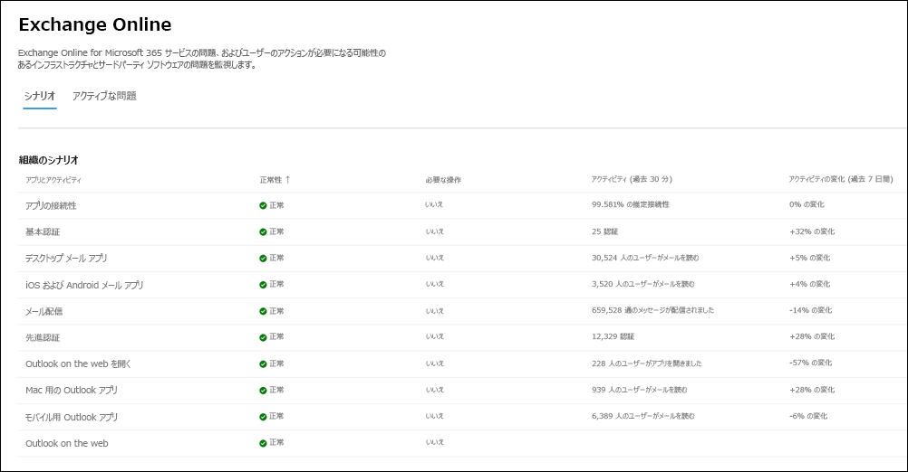
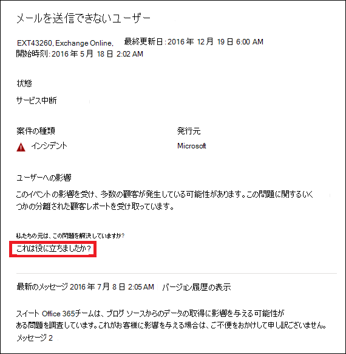

# Microsoft 365 の監視について学習する

[Microsoft 365 管理センター](https://go.microsoft.com/fwlink/p/?linkid=2024339)のダッシュボードを使用して、組織の Microsoft 365 サブスクリプションのさまざまな Microsoft サービスの正常性を監視できます。 この機能は、最初はExchange Onlineから始まり、Microsoft Teams、Microsoft 365 Apps、その他のサービスなどの他の Microsoft サービスに拡張されました。 監視では、次のカテゴリで収集されるインシデントとアドバイザリに関する情報が提供されます。

- **インフラストラクチャ**。 Microsoft が所有する Microsoft 365 インフラストラクチャで、定期的な更新プログラムの提供と問題の解決に関する問題が検出されます。 たとえば、Exchange やその他の Microsoft 365 クラウド インフラストラクチャの問題により、ユーザーはExchange Onlineにアクセスできません。

- **サード パーティのインフラストラクチャ**。 問題は、組織が依存関係を持ち、解決のために組織からのアクションが必要なサード パーティインフラストラクチャで検出されます。 たとえば、ユーザー認証のトランザクションが、ユーザーが Exchange Online にアクセスできないようにするサードパーティのセキュリティ トークン サービス (STS) プロバイダーによって調整される場合などです。

- **顧客インフラストラクチャ**。 問題は組織のインフラストラクチャで検出され、解決のために組織からのアクションが必要です。 たとえば、ユーザーは証明書の有効期限が切れているため、組織でホストされている STS プロバイダーから認証トークンを取得できないため、Exchange Onlineにアクセスできません。

組織のシナリオと [優先度アカウント](../admin/setup/priority-accounts.md)のシナリオで **正常性** > サービス正常性で使用できる **Microsoft 365 管理センターのサービス正常性** **ページの** 例を次に示します。

![Microsoft 365 管理センターの [サービス正常性] ページ。](../media/microsoft-365-exchange-monitoring/service-health-dashboard-example.png)

**[組織の問題]** は、組織レベルの監視と優先アカウントの監視によって識別され、使用されます。

**[組織の問題]** の **[正常性]** の列の値は、組織のインフラストラクチャまたはサード パーティ製ソフトウェアが、組織のユーザーのサービス正常性エクスペリエンスや Exchange Online の優先アカウントに影響を与えるかどうかを示します。アドバイザリまたはインシデントを解決するには、ユーザーのアクションが必要です。

**[Microsoft サービス正常性]** の **[正常性]** 列の値は、サービスが正常な状態にあるか、Microsoft が維持するクラウド サービスに基づいて勧告やインシデントがあるかどうかを示します。

正常性 **サービス正常性Exchange Online****から** > 利用できる組織レベルと優先度のアカウント シナリオの正常性を示すMicrosoft 365 管理センターのExchange Online > 監視ページの例を次に示します。

シナリオ リスト ページでは、Microsoft サービスが正常かどうか、および関連するインシデントまたはアドバイザリがあるかどうかを確認できます。 たとえば、Exchange Online監視では、特定の電子メール シナリオのサービス正常性を確認し、ほぼリアルタイムのシグナルを表示して、組織レベルのシナリオによる影響を判断できます。 また、優先度アカウントのシナリオの正常性 (使用可能な場合) を確認することもできます。

## 監視の要件

このプレビューは、次の要件を満たすお客様に対して有効になります。

- 組織には、Office 365 E3、Microsoft 365 E3、Office 365 E5、またはMicrosoft 365 E5の 1 つまたはこれらの製品の組み合わせから少なくとも 5,000 のライセンス数が必要です。

   たとえば、組織は Office 365 E3 のライセンスを 3,000 個と Microsoft 365 E5 のライセンスを 2,500 個持つことで、条件を満たす製品から合計 5,500 個のライセンスを持つことができます。

- 組織には、Microsoft Teams、OneDrive for Business、SharePoint Online、Exchange Online、および Office アプリを含む 1 つ以上のコア Microsoft 365 サービスに対して、少なくとも 50 人の月間アクティブ ユーザーが必要です。

- サービス正常性ダッシュボード レベルのアクセス許可のあるロールは、Exchange Online の監視にアクセスできます。 詳細については、「[Microsoft 365 サービス正常性を確認する方法](view-service-health.md)」を参照してください。

## Microsoft サービスのその他の監視

サービス固有の監視は、次の Microsoft サービスでも有効になります。 対応するリンクを選択して、そのサービスの監視の詳細を確認します。

- [Exchange Online](microsoft-365-exchange-monitoring.md)

- [Microsoft 365 アプリ](microsoft-365-apps-monitoring.md)

- [Microsoft Teams](microsoft-365-teams-monitoring.md)

## フィードバックを送信する

フィードバックは 2 つの方法でお寄せいただけます。

- Microsoft 365 管理センターのすべてのページに表示されている **[フィードバックの送信]** オプションを使用します。

- **この投稿は役に立ちますか?特定のインシデントまたはアドバイザリのリンク。

  

## よく寄せられる質問

### 1. Service Health 内のMicrosoft 365 管理センターの [組織の監視] 列に [表示] リンクが表示されないのはなぜですか?

まず、[Microsoft 365 管理センター](https://go.microsoft.com/fwlink/p/?linkid=2024339)の **[ホーム]** ページで新しい管理センターが有効になっていることを確認してください。

次に、次の両方の要件を満たしていることを確認してください。

- 組織には、Office 365 E3、Microsoft 365 E3、Office 365 E5、またはMicrosoft 365 E5の 1 つまたはこれらの製品の組み合わせから、少なくとも 5,000 のライセンス数が必要です。

- 組織には、Microsoft Teams、OneDrive for Business、SharePoint Online、Exchange Online、および Office アプリを含む 1 つ以上のコア Microsoft 365 サービスに対して、少なくとも 50 人の月間アクティブ ユーザーが必要です。

組織のライセンス数が 5,000 ユーザーを下回り、コア サービスの月間アクティブ ユーザー数が 50 を下回る場合、この要件が満たされるまで Exchange Online の監視は有効になりません。

### 2. 今後、他のサービスに対する他の監視シナリオはありますか?

はい。 パブリック プレビューには、さらにいくつかのサービスがあります。 今後も他のサービスへのフットプリントの拡大に取り組みます。

### 3. このエクスペリエンスの一般公開のプランは何ですか?

Microsoft の計画では、プレビュー エクスペリエンスに関するフィードバックを収集し、一般公開の計画を定義します。

### 4. これは無料 (含まれています) または有料 (追加) 機能ですか?

これはプレビュー段階にある無料の機能で、質問 1 での要件を満たしたユーザーのみが利用できます。このコンテンツを受け取るための有料オプションはありません。

### 5. フィードバックを提供操作方法?

一般的なフィードバックについては、監視ページの右下隅にある **[フィードバックの送信** ] アイコンを使用します。

インシデントやアドバイザリに関するフィードバックについては、**この投稿が役に立ちますか?リンク。

### 6. プライバシーに関する懸念はありますか?

監視はサービス メタデータに重点を置き、ユーザー コンテンツは監視されません。
