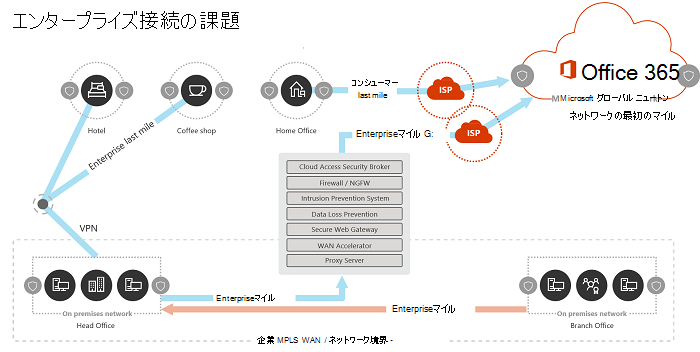
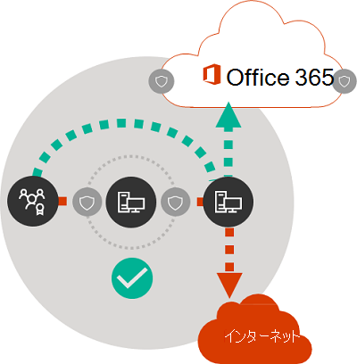

# Microsoft 365 ネットワーク接続の原則

*この記事は、Microsoft 365 Enterprise および Office 365 Enterprise の両方に適用されます。*

Microsoft 365 のネットワーク接続の計画を開始する前に、Microsoft 365 のトラフィックを安全に管理して最善のパフォーマンスを実現するための接続の原則を理解することが重要です。 この記事では、Microsoft 365 ネットワーク接続をセキュリティで保護するための最新のガイドについて説明します。
  
従来のエンタープライズ ネットワークは、強力な境界セキュリティを使用して、会社の運営データ センターでホストされているアプリケーションやデータにユーザーがアクセスできるように設計されています。 従来のモデルでは、ユーザーは社内ネットワークの境界内から、または支社の WAN リンクを介して、あるいは VPN 接続経由でリモートでアプリケーションやデータにアクセスします。
  
Microsoft 365 のような SaaS アプリケーションを導入すると、ネットワークの境界外でサービスとデータの組み合わせができます。 最適化されていない場合、ユーザーと SaaS アプリケーション間のトラフィックが、パケットの検査、ネットワーク ヘアピン、地理的に離れたエンドポイントへの偶発的な接続、その他の要因による遅延の対象になります。 主要な最適化ガイドラインについて理解し、それを実装することで、 Microsoft 365 の最適なパフォーマンスと信頼性を実現できます。
  
この記事では、以下について説明します。
  
- クラウドへのお客様の接続に適用される[Microsoft 365 アーキテクチャ](microsoft-365-network-connectivity-principles.md#BKMK_Architecture)
- [Microsoft 365 の接続の原則](microsoft-365-network-connectivity-principles.md#BKMK_Principles)と、ネットワーク トラフィックとエンド ユーザー エクスペリエンスの最適化に関する戦略が更新されました
- [Office 365 Endpoint の Web サービス](microsoft-365-network-connectivity-principles.md#BKMK_WebSvc)により、ネットワーク管理者は、ネットワークの最適化に使用するエンドポイントの構造化リストを利用できます
- [新しい Office 365 エンドポイントのカテゴリ](microsoft-365-network-connectivity-principles.md#BKMK_Categories) と最適化のガイダンス
- [境界ネットワーク セキュリティとエンドポイント セキュリティの比較](microsoft-365-network-connectivity-principles.md#BKMK_SecurityComparison)
- [Microsoft 365 トラフィックの増分最適化](microsoft-365-network-connectivity-principles.md#BKMK_IncOpt) オプション
- [Microsoft 365 の接続テスト](https://aka.ms/netonboard) (Microsoft 365 への基本的な接続をテストするための新しいツール)

## Microsoft 365 アーキテクチャ

Microsoft 365 は、Exchange Online、SharePoint Online、Skype for Business Online、Microsoft Teams、Exchange Online Protection、ブラウザ内の Office など、さまざまなマイクロサービスとアプリケーションを介して生産性とコラボレーション シナリオを提供する、分散サービスとしてのソフトウェア (SaaS) クラウドです。 特定の Microsoft 365 アプリケーションは、顧客ネットワークやクラウドへの接続に適用されるため、独自の機能を備えている場合がありますが、それらはすべて、いくつかの主要な原則、目標、アーキテクチャ パターンを共有しています。 これら接続の原則とアーキテクチャのパターンは、他の多くの SaaS クラウドでは一般的で、同時に Microsoft Azure のような Platform-as-a-Service および Infrastructure-as-a-Service クラウドの一般的な展開モデルとは異なります。
  
Microsoft 365 の最も重要なアーキテクチャ機能 (ネットワーク アーキテクトにより見落とされたり誤解されたりすることが多い) の 1 つは、ユーザーによる接続方法において、真にグローバルな分散サービスだということです。 ターゲットの Microsoft 365 テナントの場所は、クラウド内で顧客データが保存される場所を理解するのに重要ですが、Microsoft 365 のユーザー エクスペリエンスでは、データを含むディスクに直接、接続する必要はありません。 Microsoft 365 のユーザー エクスペリエンス (パフォーマンス、信頼性、およびその他の重要な品質特性を含む) には、世界中の数百の Microsoft ロケーションでスケールアウトされた高度に分散されたサービス フロントエンドを介した接続が含まれます。 ほとんどの場合、集中管理されている場所や地域の出口ポイントを介して Microsoft 365 に接続するのではなく、顧客ネットワークがユーザーの要求を最も近い Microsoft 365 サービス エントリ ポイントにルーティングできるようにすることで、最高のユーザー エクスペリエンスを実現できます。
  
ほとんどの顧客の場合、Microsoft 365 のユーザーは複数の場所に分散されています。 最良の結果を得るには、このドキュメントで概説されている原則をスケール アウト (スケール アップではありません) の観点から検討する必要があります。これには、Microsoft 365 テナントの地理的な場所ではなく、Microsoft グローバル ネットワーク内の最も近いプレゼンスへの接続最適化に焦点を当てます。 つまり、Microsoft 365 テナント データが特定の地理的な場所に保存されていても、そのテナントの Microsoft 365 エクスペリエンスは引き続き配布され、テナントがアクセスするすべてのエンドユーザーの場所にかなりの (ネットワーク) 近接度で存在できるということになります。
  
## Microsoft 365 の接続テスト

Microsoft では、最適な Microsoft 365 接続とパフォーマンスを実現するために、次の原則を推奨しています。 これらの Microsoft 365 接続の原則を使用してトラフィックを管理すれば、Microsoft 365 に接続したときに最高のパフォーマンスを得ることができます。
  
ネットワーク設計の主な目標は、 Microsoft のあらゆるデータ センターを、世界中に広がる低遅延のクラウド アプリケーション エントリ ポイントと相互に接続した Microsoft のパブリック ネットワーク バックボーン、Microsoft のグローバル ネットワークへのラウンド トリップ時間 (RTT) を削減することにより、遅延を最小限に抑えることです。 [Microsoft の高速で信頼性の高いグローバル ネットワーク構築方法](https://azure.microsoft.com/blog/how-microsoft-builds-its-fast-and-reliable-global-network/) については、Microsoft のグローバル ネットワークの詳細を参照してください。
  

### Microsoft 365 トラフィックを識別して区別する

  
Microsoft 365 のネットワーク トラフィックを識別することが、トラフィックをインターネット向けのジェネリック ネットワーク トラフィックから区別する最初のステップです。 Microsoft 365 の接続を最適化するには、ネットワーク ルートの最適化、ファイアウォール規則、ブラウザーのプロキシ設定、特定のエンドポイントのネットワーク検査デバイスのバイパスなどのアプローチの組み合わせを実装します。
  
以前の Microsoft 365 の最適化ガイドでは、Microsoft 365 エンドポイントを、**必須** と **オプション** の 2 つのカテゴリに分けていました。 新しい Microsoft 365 のサービスと機能をサポートするためにエンドポイントが追加されたため、Microsoft 365 エンドポイントは、**最適化**、**許可**、**既定** の 3つのカテゴリに再編成されました。 各カテゴリのガイドラインは、カテゴリのすべてのエンドポイントに適用され、最適化の理解と実装が簡単になります。
  
Microsoft 365 エンドポイントのカテゴリと最適化メソッドの詳細については、「[新しい Office 365 エンドポイントのカテゴリ](microsoft-365-network-connectivity-principles.md#BKMK_Categories)」を参照してください。
  
Microsoft は現在、Microsoft 365 のすべてのエンドポイントを Web サービスとして公開し、最適なデータの使用方法についてのガイダンスを提供しています。 Microsoft 365 エンドポイントを取得して使用する方法の詳細については、「[Office 365 URL および IP アドレス範囲](https://support.office.com/article/office-365-urls-and-ip-address-ranges-8548a211-3fe7-47cb-abb1-355ea5aa88a2?ui=en-US&amp;rs=en-US&amp;ad=US)」を参照してください。
  

### ネットワーク接続のローカルの出口を提供する

  
ローカル DNS とインターネット エグレスは、接続遅延を削減し、Microsoft 365 サービスへの最も近いポイントにユーザー接続が確立されるようにするために非常に重要となります。 複雑なネットワーク トポロジでは、ローカル DNS とローカルのインターネット エグレスの両方を同時に実装することが重要です。 Microsoft 365 が最も近いエントリポイントにクライアントの接続をルーティングする方法の詳細については、「[クライアントの接続](https://support.office.com/article/client-connectivity-4232abcf-4ae5-43aa-bfa1-9a078a99c78b)」の記事を参照してください。
  
Microsoft 365 のようなクラウド サービスが登場する前は、ネットワーク アーキテクチャの設計要素としてのエンドユーザーのインターネット接続は比較的シンプルでした。 インターネットサービスと Web サイトが世界中に分散している場合、企業の出口ポイントと特定の送信先エンドポイントの間の遅延は、主に地理的な距離の関数に左右されます。
  
従来のネットワーク アーキテクチャでは、すべての送信インターネット接続は社内ネットワークを通過し、集中管理する場所から送信されます。 Microsoft のクラウド サービスが成熟するにつれて、遅延の影響を受けるクラウド サービスをサポートするために、分散インターネット接続 ネットワーク アーキテクチャが重要になってきました。 Microsoft のグローバル ネットワークは、受信クラウド サービス接続を最も近いエントリ ポイントにルーティングするグローバル エントリ ポイントの動的ファブリック、分散サービスのフロント ドア インフラストラクチャを用いて遅延要件を満たすように設計されました。 これは、顧客とクラウドとの間のルートを効果的に短縮することで、Microsoft クラウドの顧客の「ラスト マイル」の長さを短縮することを目的としたものです。
  
エンタープライズ WAN は通常、1 つ以上のプロキシ サーバーを経由して、インターネットへの送信前の検査として、中心となる会社の本社にネットワーク トラフィックをバックホールするよう設計されています。下の図は、そうしたネットワーク トポロジを示したものです。
  

  
Microsoft 365 は、世界中のフロント エンド サーバーを含む Microsoft のグローバル ネットワークで実行されるので、多くの場合、ユーザーの場所にはフロント エンド サーバーが存在します。 ローカルのインターネット エグレスを提供し、Microsoft 365 エンドポイントにローカルな名前解決を提供するように内部 DNS サーバーを構成することで、Microsoft 365 宛てのネットワーク トラフィックは、可能な限りユーザーに近い Microsoft 365 フロント エンド サーバーに接続できます。 次の図は、本社、支社、およびリモート環境から接続するユーザーが、最も近い Microsoft 365 のエントリ ポイントへの最短ルートをたどることができるネットワーク トポロジの例を示したものです。
  

  
このように Microsoft 365 エントリ ポイントへのネットワーク パスを短くすると、Microsoft 365 での接続パフォーマンスやエンドユーザー エクスペリエンスが改善され、365 Microsoft のパフォーマンスと信頼性に関するネットワーク アーキテクチャへの将来の変更による影響を軽減するのにも役立ちます。
  
また、応答する DNS サーバーが遠くにあるかビジー状態である場合は、DNS 要求が遅延を生じさせる場合があります。 ブランチ ロケーションでローカル DNS サーバーをプロビジョニングし、DNS レコードを適切にキャッシュするように構成することで、名前解決待ち時間を最小限に抑えることができます。
  
地域の出口は Microsoft 365 でうまく機能しますが、これが会社のネットワーク上にあるか、自宅、ホテル、コーヒーショップ、空港などのリモート環境にあるかに関係なく、常にユーザーの場所でネットワーク出口を提供するのが最適な接続モデルとなります。このローカルの直接の出口モデルを示したものが下の図です。
  

  
Microsoft 365 を導入しているエンタープライズは、Microsoft 365 へのユーザー接続が最も近い Microsoft グローバル ネットワークのエントリ ポイントへの最短ルートを使用するようにすることで、Microsoft のグローバル ネットワークの分散サービス フロント ドア アーキテクチャを利用できます。 ローカル出口ネットワーク アーキテクチャでは、ユーザーの場所に関係なく、最寄りの出口を介して Microsoft 365 のトラフィックをルーティングすることができます。
  
ローカル出口アーキテクチャには、従来のモデルに比べて次のような利点があります。
  
- ルートの長さを最適化することにより、Microsoft 365 の最適なパフォーマンスを提供します。 エンドユーザー接続は、分散サービスのフロント ドア インフラストラクチャによって、最も近い Microsoft 365 のエントリ ポイントに動的にルーティングされます。
- ローカル出口を許可することで、社内ネットワーク インフラストラクチャの負荷を軽減します。
- 顧客エンドポイントのセキュリティとクラウドのセキュリティ機能を活用して、両端で接続のセキュリティを保護します。

### ネットワーク ヘアピンを回避する

  
一般的な原則として、ユーザーと最も近い Microsoft 365 エンドポイントの間の最短で最も直接的なルートが、最高のパフォーマンスを提供します。 ネットワーク ヘアピンは、特定の宛先に向かう WAN または VPN トラフィックが最初に別の中間の場所 (セキュリティ スタック、クラウド アクセス ブローカー、クラウドベースの Web ゲートウェイなど) に向けられ、地理的に離れたエンドポイントへの遅延と潜在的なリダイレクトが発生したときに発生します。 ネットワークヘアピンは、ルーティング/ピアリングの非効率性または最適ではない (リモート) DNS ルックアップによって引き起こされることもあります。
  
ローカル出口であっても Microsoft 365 がネットワーク ヘアピンの影響を受けないようにするには、ユーザーの場所に対してインターネット エグレスを提供するために使用される ISP が、その場所の近くにある Microsoft グローバル ネットワークとの直接的なピアリング関係にあるかどうかを確認します。 また、インターネット向けのトラフィックを処理するサード パーティのクラウドまたはクラウドベースのネットワーク セキュリティ ベンダーを介したプロキシまたはトンネリングではなく、信頼できる Microsoft 365 トラフィックを直接送信するようにエグレス ルーティングを構成することもできます。 Microsoft 365 エンドポイントのローカル DNS 名前解決は、直接のルーティングに加えて、最も近い Microsoft 365 エントリ ポイントがユーザー接続に使用されているか確認するのに役立ちます。
  
Microsoft 365 のトラフィックにクラウドベースのネットワークやセキュリティ サービスを使用している場合は、ヘアピンの結果が評価され、Microsoft 365 のパフォーマンスへの影響が理解されているか確認してください。 これを行うには、支社の数と Microsoft グローバル ネットワークのピアリング ポイントとの関係でトラフィックが転送されるサービス プロバイダの場所の数と位置、サービス プロバイダーと ISP および Microsoft とのネットワーク ピアリング関係の品質、およびサービス プロバイダー インフラストラクチャでのバックホールのパフォーマンスへの影響を調べます。
  
Microsoft 365 のエントリ ポイントを持ち、エンドユーザーに近接した分散場所の数が多いため、プロバイダ ネットワークが最適な Microsoft 365 ピアリングのために構成されていない場合、Microsoft 365 のトラフィックをサード パーティのネットワークやセキュリティ プロバイダーにルーティングすると、Microsoft 365 の接続に悪影響を及ぼす可能性があります。
  

### プロキシのバイパス、トラフィック検査デバイス、重複するセキュリティ テクノロジを評価する

  
エンタープライズのお客様は、特に Microsoft 365 にバインドされたトラフィックに対するネットワーク セキュリティとリスクの削減方法を確認し、Microsoft 365 のセキュリティ機能を使用して、Microsoft 365 のネットワーク トラフィックに対する割り込みの、パフォーマンスに影響を及ぼす、高価なネットワーク セキュリティ テクノロジへの依存を軽減する必要があります。
  
ほとんどのエンタープライズ ネットワークでは、プロキシ、SSL 検査、パケットの検査、データ損失防止システムなどのテクノロジを使用して、インターネット トラフィック向けのネットワーク セキュリティを適用します。 これらのテクノロジは、一般的なインターネット要求の重要なリスクを軽減しますが、Microsoft 365 のエンドポイントに適用すると、パフォーマンス、スケーラビリティ、エンドユーザー エクスペリエンスの品質が大幅に落ちることがあります。
  

#### Office 365 エンドポイント Web サービス

Microsoft 365 の管理者は、スクリプトまたは REST 呼び出しを使用して、Office 365 エンドポイントの Web サービスからエンドポイントの構造化リストを利用して、境界ファイアウォールやその他のネットワーク デバイスの構成を更新することができます。 これにより、Microsoft 365 向けのトラフィックが識別され、適切に扱われ、一般的で不明なことが多いインターネット Web サイト向けのネットワーク トラフィックとは異なる方法で管理されます。 Microsoft 365 エンドポイント Web サービスの使用方法の詳細については、「[Office 365 URL および IP アドレス範囲](https://support.office.com/article/office-365-urls-and-ip-address-ranges-8548a211-3fe7-47cb-abb1-355ea5aa88a2?ui=en-US&amp;rs=en-US&amp;ad=US)」を参照してください。
  
#### PAC (プロキシの自動構成) スクリプト

Microsoft 365 の管理者は、ユーザーのコンピューターに WPAD または GPO 経由で配信できる PAC (プロキシ自動構成) スクリプトを作成できます。 PAC スクリプトを使用して、Microsoft 365 要求のプロキシを WAN または VPN ユーザーからバイパスし、Microsoft 365 トラフィックが企業ネットワークを経由するのではなく、直接インターネット接続を使用できるようにします。
  
#### Microsoft 365 セキュリティ機能

Microsoft は、データセンターのセキュリティ、運用上のセキュリティ、Microsoft 365 サーバーとそれが示すネットワーク エンドポイントに関するリスクの低減について、透明性を確保しています。 Microsoft 365 の組み込みのセキュリティ機能を使用すると、データ損失防止、ウイルス対策、多要素認証、顧客ロックボックス、Defender for Office 365、Microsoft 365 脅威インテリジェンス、Microsoft 365 セキュアスコア、Exchange Online Protection、ネットワーク DDOS セキュリティなどのネットワーク セキュリティ リスクを軽減できます。
  
Microsoft データセンターとグローバル ネットワークのセキュリティの詳細については、「[Microsoft トラスト センター](https://www.microsoft.com/trustcenter/security)」をご覧ください。
  
## 新しい Office 365 エンドポイントのカテゴリ

Office 365 エンドポイントは、さまざまなネットワーク アドレスおよびサブネットのセットを表しています。 エンドポイントは、URL、IP アドレスまたは IP 範囲である場合があり、特定の TCP/UDP ポートと共にリスト表示されるものもあります。 URL は、*account.office.net* のような FQDN か、*\*.office365.com* のようなワイルドカードの URL にすることができます。
  
> [!NOTE]
> ネットワーク内の Office 365 エンドポイントの場所は、Microsoft 365 テナント データの場所に直接関連付けられていません。 このため、お客様は、分散およびグローバル サービスとして Microsoft 365 を参照する必要があり、地理的な基準に基づいて Office 365 エンドポイントへのネットワーク接続をブロックしようとするべきではありません。
  
Microsoft 365 のトラフィックを管理するための以前のガイダンスでは、エンドポイントが 2 つのカテゴリ、**必須** と **オプション** に分類されていました。 各カテゴリ内のエンドポイントは、サービスの重要度に応じて異なる最適化を必要とするため、多くのお客様が、Office 365 の URL と IP アドレスの完全なリストに同じネットワーク最適化の適用を正当化する際に課題に直面しました。
  
新しいモデルでは、エンドポイントが **最適化**、**許可**、**既定** の 3 つのカテゴリに分類されており、最高のパフォーマンス向上と投資収益率の実現のため、どこに集中してネットワーク最適化の取り組みを行うか、優先事項に基づいてポイントを絞っています。 エンドポイントは、ネットワーク品質、ボリューム、シナリオのパフォーマンス エンベロープ、そして実装のしやすさに対する効果的なユーザー エクスペリエンスの感度に基づいて、上記のカテゴリに統合されます。 推奨される最適化は、特定のカテゴリ内のすべてのエンドポイントに同じ方法で適用できます。
  
- エンドポイントの **最適化** は、すべての Office 365 サービスへの接続に必須で、Office 365 の帯域幅、接続、データ量の 75% 以上に相当します。 これらのエンドポイントは、ネットワーク パフォーマンス、待機時間、可用性の影響を最も受けやすい Office 365 シナリオに該当します。 すべてのエンドポイントは、Microsoft データセンターでホストされます。 このカテゴリのエンドポイントに対する変更の割合は、その他 2 つのカテゴリのエンドポイントよりもはるかに低いことが予想されます。 このカテゴリには、(10 程度の) 主要 URL のセットと、Exchange Online、SharePoint Online、Skype for Business Online、Microsoft Teams などの主要な Office 365 のワークロード専用の IP サブネットのセットが含まれています。

    適切に定義された重要なエンドポイントの要約リストにより、これらの宛先に対する価値の高いネットワーク最適化をより迅速かつ簡単に計画し、実装できます。

    *最適化*  エンドポイントの例には *https://outlook.office365.com*、 *https://\<tenant\>.sharepoint.com* および *https://\<tenant\>-my.sharepoint.com* があります。

    最適化メソッドは次のとおりです。

  - トラフィックの傍受、SSL 解読、詳細なパケット検査、コンテンツのフィルター処理を実行するネットワーク デバイスやサービスのエンドポイントの *最適化* をバイパスします。
  - 一般的なインターネットの閲覧に一般的に使用されるオンプレミスのプロキシ デバイスおよびクラウドベースのプロキシ サービスをバイパスします。
  - これらエンドポイントの評価を、ネットワーク インフラストラクチャおよび境界システムにより完全に信頼されるものとして優先します。
  - WAN バックホールの削減や排除を優先し、可能な限りユーザー/ブランチに近い場所で、これらエンドポイントに対するインターネット ベースの直接分散エグレスを円滑に提供します。
  - 分割トンネリングを実装することで、VPN ユーザーがこれらのクラウド エンドポイントに直接接続できるようになります。
  - DNS 名前解決により返された IP アドレスが、これらエンドポイントのルーティング エグレス パスと一致するようにします。
  - SD-WAN 統合のこうしたエンドポイントを優先して、Microsoft グローバル ネットワークの最も近いインターネット ピアリング ポイントに直接、最低限の待機時間のルーティングを行います。

- **許可** エンドポイントは特定の Office 365 サービスや機能への接続に必須ですが、ネットワーク パフォーマンスや待機時間への影響は、*最適化* カテゴリのエンドポイントほど大きくありません。 これらのエンドポイントの全体的なネットワーク フットプリントは、帯域幅と接続数の観点からもより小さくなります。 これらのエンドポイントは Office 365 専用で、Microsoft データセンターにホストされています。 これらは Office 365 マイクロサービスとその依存関係 (約 100 の URL) を表しており、*最適化* カテゴリのものより速い割合で変化することが予想されます。 このカテゴリのすべてのエンドポイントが、定義済みの専用 IP サブネットに関連付けられているわけではありません。

    *許可* エンドポイントのネットワーク最適化で、Office 365 のユーザー エクスペリエンスを向上できますが、ネットワークに対する変更を最小限に抑えるために、これらの最適化の範囲を絞り込むお客様もいます。

    *許可* エンドポイントの例には *https://\*.protection.outlook.com* と *https://accounts.accesscontrol.windows.net* があります。

    最適化メソッドは次のとおりです。

  - トラフィックの傍受、SSL 解読、詳細なパケット検査、コンテンツのフィルター処理を実行するネットワーク デバイスやサービスのエンドポイントの *許可* をバイパスします。
  - これらエンドポイントの評価を、ネットワーク インフラストラクチャおよび境界システムにより完全に信頼されるものとして優先します。
  - WAN バックホールの削減や排除を優先し、可能な限りユーザー/ブランチに近い場所で、これらエンドポイントに対するインターネット ベースの直接分散エグレスを円滑に提供します。
  - DNS 名前解決により返された IP アドレスが、これらエンドポイントのルーティング エグレス パスと一致するようにします。
  - SD-WAN 統合のこうしたエンドポイントを優先して、Microsoft グローバル ネットワークの最も近いインターネット ピアリング ポイントに直接、最低限の待機時間のルーティングを行います。

- **既定** のエンドポイントは、最適化を必要としない Office 365 サービスと、依存関係を表し、顧客ネットワークでは通常のインターネット バウンド トラフィックとして扱うことができます。 このカテゴリの一部のエンドポイントは、Microsoft データ センターでホストされない場合があります。 たとえば、  *https://odc.officeapps.live.com*  や  *https://appexsin.stb.s-msn.com* などがあります。

Office 365 のネットワーク最適化手法の詳細については、「[Office 365 エンドポイントを管理する](managing-office-365-endpoints.md)」の記事を参照してください。
  
## 境界ネットワーク セキュリティとエンドポイント セキュリティの比較

従来のネットワーク セキュリティの目標は、侵入および悪意のある脅威に対して企業のネットワーク境界を強化することです。 組織が Microsoft 365 を採用すると、一部のネットワーク サービスとデータが部分的また完全にクラウドに移行されます。 ネットワーク アーキテクチャの基本的な変更に関しては、このプロセスでは、新しい要因を考慮してネットワーク セキュリティを再評価しなくてはなりません。
  
- クラウドサービスが採用されると、ネットワーク サービスとデータは、オンプレミスのデータ センターとクラウドとの間で分散され、境界セキュリティだけではもはや不十分となります。
- リモート ユーザーは、自宅、ホテル、コーヒーショップなどの制御されていない場所から、オンプレミスのデータセンターとクラウドの両方で企業のリソースに接続します。
- 専用のセキュリティ機能がクラウド サービスに組み込まれることが多くなると、既存のセキュリティ システムを補完したり置き換えたりする可能性があります。

Microsoft では、幅広い Microsoft 365 のセキュリティ機能を用意し、Microsoft 365 のデータおよびネットワーク セキュリティの確保に役立つ、セキュリティ上のベスト プラクティスを採用するための規範的なガイダンスを提供しています。推奨されるベスト プラクティスには次のようなものがあります。
  
- **多要素認証 (MFA) の使用** MFA では強力なパスワード戦略に保護レイヤーを追加して、パスワードを正しく入力した後、スマートフォンで電話、テキスト メッセージ、またはアプリ通知を確認するようユーザーに要求します。

- **Microsoft Cloud App Security の使用** 異常な活動を追跡し、それに対処するためのポリシーを構成します。 管理者が、異常なまたはリスクのあるユーザーの活動を確認できるように Microsoft Cloud App Security で通知を設定します。たとえば、大量のデータのダウンロード、複数回のサインイン試行の失敗、不明または危険な IP アドレスからの接続などを確認します。

- **データ損失防止 (DLP) の構成** DLP を使用すると、機密データを特定し、ユーザーが誤ってまたは意図的にデータを共有することを回避するためのポリシーを作成できます。 DLP は、Exchange Online、SharePoint Online、OneDrive を含む Microsoft 365 で動作するので、ユーザーはワークフローを中断させずに準拠を維持できます。

- **顧客ロックボックスの使用** Microsoft 365 管理者はカスタマー ロックボックスを使用して、Microsoft のサポート エンジニアがヘルプ セッション中にデータにアクセスする方法を制御することができます。 エンジニアが、トラブルシューティングや問題解決のためにデータにアクセスする必要がある場合は、カスタマー ロック ボックスを使用してアクセス要求を承認または拒否することができます。

- **Office 365 セキュリティ スコアの使用** さらにリスクを軽減するために実行できる処理を推奨するセキュリティ分析ツールをです。 セキュリティ スコアは、Microsoft 365 の設定とアクティビティを調べ、Microsoft が確立した基準とそれらを比較します。 ユーザーの状況がセキュリティのベスト プラクティスとどの程度一致しているかに基づいて、スコアが付けられます。

セキュリティを強化する総合的なアプローチには、次の点を考慮する必要があります。
  
- クラウド ベースのセキュリティ機能と Office クライアント セキュリティ機能を適用して、境界のセキュリティからエンドポイントのセキュリティへと重点を移します。
  - データ センターへのセキュリティ境界を縮小する
  - Office または遠隔地にあるユーザーのデバイスに対して、同等の信頼を有効にする
  - データの場所とユーザーの場所のセキュリティ強化に焦点を置く
  - 管理されたユーザーのマシンに、エンドポイントのセキュリティにより高い信頼を得る
- 境界にのみ焦点を当てるのではなく、すべての情報セキュリティを総合的に管理する
  - 信頼できるトラフィックによりセキュリティ デバイスをバイパスし、管理されていないデバイスをゲスト Wi-fi ネットワークに分離して、WAN を再定義し、境界ネットワーク セキュリティを強化する
  - 企業 WAN エッジのネットワーク セキュリティ要件を軽減する
  - ファイアウォールなどの一部のネットワーク境界セキュリティ デバイスは引き続き必要ではあるが、負荷が軽減される
  - Microsoft 365 のトラフィックをローカルに送信する
- 「[増分最適化](microsoft-365-network-connectivity-principles.md#BKMK_IncOpt)」のセクションで説明されているように、改善には段階的に対処できます。 一部の最適化手法では、使用しているネットワーク アーキテクチャによっては、より優れたコスト/利益率を提供する場合があるので、組織にとって最も意味のある最適化を選択する必要があります。

Microsoft 365 のセキュリティとコンプライアンスの詳細については、「[Microsoft 365 セキュリティ](../security/index.yml)」と「[Microsoft 365 コンプライアンス](../compliance/index.yml)」の記事を参照してください。
  
## 増分の最適化

この記事の前半で SaaS 向けの理想的なネットワーク接続モデルについて説明しましたが、歴史的に複雑なネットワーク アーキテクチャを備えた大規模な組織では、このような変更のすべてを直接行うことは現実的ではありません。 このセクションでは、Microsoft 365 のパフォーマンスと信頼性の向上に役立ついくつかの増分変更について説明します。
  
Microsoft 365 トラフィックの最適に使用する方法は、ネットワーク トポロジと実装しているネットワーク デバイスによって異なります。 ロケーションが多く、複雑なネットワーク セキュリティ対策を行っている大企業は、「[Microsoft 365 接続の原則](microsoft-365-network-connectivity-principles.md#BKMK_Principles)」セクションに記載されている原則のほとんど、またはすべてを含む戦略を開発する必要がありますが、小規模な組織では、1 つまたは 2 つのみを検討するだけで良い場合があります。
  
最適化は、各方法を順次適用して、増分プロセスとして提案することが可能です。 次の表は、主要な最適化の方法を、最大数のユーザーについて待ち時間と信頼性への影響の順に示したものです。
  
|**最適化の方法**|**説明**|**影響**|
|:-----|:-----|:-----|
|ローカル DNS 解決とインターネット エグレス    |各場所にローカル DNS サーバーをプロビジョニングし、Microsoft 365 の接続が可能な限りユーザーの場所に近いインターネットに送信されるようにします。    | 待機時間の最小化     最も近い Microsoft 365 エントリ ポイントに信頼性の高い接続ができるよう改善する    |
|地域のエグレス ポイントを追加する    |企業ネットワークに複数の場所があり、エグレス ポイントが 1 つしかない場合は、地域の送信ポイントを追加して、ユーザーが最寄りの Microsoft 365 エントリ ポイントに接続できるようにします。    | 待機時間の最小化     最も近い Microsoft 365 エントリ ポイントに信頼性の高い接続ができるよう改善する    |
|プロキシおよび検査デバイスのバイパス    |Microsoft 365 の要求を直接エグレス ポイントに送信する PAC ファイルでブラウザーを構成します。    検査を行わずに Microsoft 365 トラフィックを許可するよう、エッジ ルーターとファイアウォールを構成します。    | 待機時間の最小化     ネットワーク デバイスの負荷を減らす    |
|VPN ユーザーの直接接続を有効にする    |VPN ユーザーの場合、スプリット トンネリングを実装することで、Microsoft 365 接続を VPN トンネル経由ではなく、ユーザーのネットワークから直接行えるようにします。    | 待機時間の最小化     最も近い Microsoft 365 エントリ ポイントに信頼性の高い接続ができるよう改善する    |
|従来の WAN から SD-WAN への移行    |SD-WAN (Software Defined Wide Area Networks) を使用すると、仮想マシン (VM) を使用した計算リソースの仮想化と同様に、従来の WAN ルーターと仮想アプライアンスを置き換えることで、WAN 管理が効率化され、パフォーマンスを向上させられます。    | WAN トラフィックのパフォーマンスと管理性を向上させる     ネットワーク デバイスの負荷を減らす    |

## 関連項目

[Microsoft 365 ネットワーク接続の概要](microsoft-365-networking-overview.md)

[Office 365 エンドポイントの管理](managing-office-365-endpoints.md)

[Office 365 の URL および IP アドレスの範囲](urls-and-ip-address-ranges.md)

[Office 365 IP アドレスと URL の Web サービス ](microsoft-365-ip-web-service.md)

[Microsoft 365 ネットワーク接続の評価](assessing-network-connectivity.md)

[Microsoft 365 のネットワーク計画とパフォーマンス チューニング](network-planning-and-performance.md)

[ベースラインとパフォーマンス履歴を使用した、Office 365 のパフォーマンスのチューニング](performance-tuning-using-baselines-and-history.md)

[Office 365 のパフォーマンスに関するトラブルシューティングの計画](performance-troubleshooting-plan.md)

[Content Delivery Network](content-delivery-networks.md)

[Microsoft 365 の接続テスト](https://aka.ms/netonboard)

[Microsoft がそのファースト・信頼性の高いグローバルネットワークを構築する方法](https://azure.microsoft.com/blog/how-microsoft-builds-its-fast-and-reliable-global-network/)

[Office 365 ネットワークのしくみ](https://techcommunity.microsoft.com/t5/Office-365-Networking/bd-p/Office365Networking)
