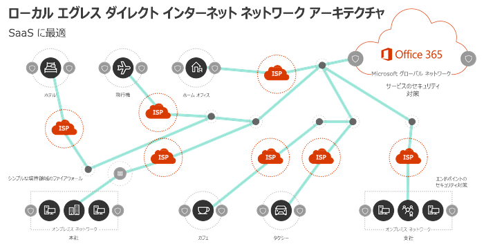

# Microsoft 365接続の概要

*この記事は、Microsoft 365 Enterprise および Office 365 Enterprise の両方に適用されます。*

Microsoft 365は、さまざまなマイクロ サービスとアプリケーションのセットを通じて生産性とコラボレーション シナリオを提供する、分散されたサービスとしてのソフトウェア (SaaS) クラウドです。 Outlook、Word、PowerPoint などの Microsoft 365 のクライアント コンポーネントは、ユーザー コンピューター上で実行され、Microsoft データセンターで実行される Microsoft 365 の他のコンポーネントに接続します。 Microsoft 365 エンド ユーザー エクスペリエンスの品質を決定する最も重要な要因は、Microsoft 365 クライアントと Microsoft 365 サービス フロント ドア間のネットワークの信頼性と低遅延です。

この記事では、ネットワークの目的と、Microsoft 365ネットワークが一般的なインターネット トラフィックMicrosoft 365最適化に対して異なるアプローチを必要とする理由について説明します。

## Microsoft 365の目標

ネットワークをMicrosoft 365の最終的な目標は、クライアントと最も近いエンドポイント間の最も制限の少ないアクセスを有効にすることで、エンド ユーザー エクスペリエンスMicrosoft 365です。 エンド ユーザー エクスペリエンスの品質は、ユーザーが使用しているアプリケーションのパフォーマンスと応答性に直接関係します。 たとえば、Microsoft Teams は低遅延に依存して、ユーザーの電話、会議、共有画面のコラボレーションはグリッチフリーであり、Outlook はサーバー側のインデックス作成と AI 機能を活用するインスタント検索機能に対するネットワーク接続に大きな依存しています。

ネットワーク設計の主な目標は、クライアント コンピューターから Microsoft Global Network への往復時間 (RTT) を短縮することで、待ち時間を最小限に抑え、Microsoft のすべてのデータセンターを低遅延で相互接続する Microsoft のパブリック ネットワーク バックボーンで、世界中に広がる高可用性クラウド アプリケーション エントリ ポイントです。 [Microsoft の高速で信頼性の高いグローバル ネットワーク構築方法](https://azure.microsoft.com/blog/how-microsoft-builds-its-fast-and-reliable-global-network/) については、Microsoft のグローバル ネットワークの詳細を参照してください。

ネットワークのMicrosoft 365最適化は複雑である必要はありません。 次の主要な原則に従って、可能な限り最高のパフォーマンスを得る方法があります。

- ネットワーク トラフィックMicrosoft 365識別する
- ユーザーがネットワークに接続Microsoft 365場所からインターネットへのネットワーク トラフィックのローカル ブランチ出力を許可Microsoft 365
- プロキシMicrosoft 365パケット検査デバイスをバイパスするトラフィックを許可する

ネットワーク接続の原則のMicrosoft 365詳細については、「ネットワーク接続[Microsoft 365」を参照してください](microsoft-365-network-connectivity-principles.md)。

## 従来のネットワーク アーキテクチャと SaaS

クライアント/サーバー ワークロードの従来のネットワーク アーキテクチャ原則は、クライアントとエンドポイント間のトラフィックが企業のネットワーク境界外に広がらないという前提に基づいて設計されています。 また、多くのエンタープライズ ネットワークでは、すべての送信インターネット接続が企業ネットワークを通過し、中央の場所から出力されます。

従来のネットワーク アーキテクチャでは、一般的なインターネット トラフィックの待機時間が長いほど、ネットワーク境界のセキュリティを維持するために必要なトレードオフであり、インターネット トラフィックのパフォーマンスの最適化には、通常、ネットワーク出力ポイントで機器をアップグレードまたはスケール アウトする必要があります。 ただし、この方法では、SaaS サービス (SaaS サービスなど) の最適なネットワーク パフォーマンスに関する要件Microsoft 365。

## ネットワーク トラフィックMicrosoft 365識別する

ネットワーク トラフィックを簡単に識別Microsoft 365、ネットワーク ID の管理が簡単になりました。

- 高度に重要なネットワーク トラフィックとインターネット遅延の影響を受けないネットワーク トラフィックを区別する新しいカテゴリのネットワーク エンドポイント。 最も重要な "最適化" カテゴリには、ほんの一握りの URL とサポート IP アドレスがあります。
- スクリプトの使用またはデバイスの直接構成およびネットワーク識別の変更管理Microsoft 365 Web サービス。 変更は、Web サービス、RSS 形式、または電子メールのテンプレートを使用Power Automateできます。
- [Office 365ネットワーク接続](./microsoft-365-networking-partner-program.md)の原則に従い、簡単な構成を持つデバイスまたはサービスを提供する Microsoft パートナー Microsoft 365ネットワーク パートナー プログラムを提供します。

## セキュリティ保護Microsoft 365接続

従来のネットワーク セキュリティの目標は、侵入および悪意のある脅威に対して企業のネットワーク境界を強化することです。 ほとんどのエンタープライズ ネットワークでは、プロキシ サーバー、ファイアウォール、SSL ブレーク アンド インスペクション、ディープ パケット インスペクション、データ損失防止システムなどのテクノロジを使用して、インターネット トラフィックのネットワーク セキュリティを適用します。 これらのテクノロジは、一般的なインターネット要求の重要なリスクを軽減しますが、Microsoft 365 のエンドポイントに適用すると、パフォーマンス、スケーラビリティ、エンドユーザー エクスペリエンスの品質が大幅に落ちることがあります。

Microsoft 365機能とワークロード専用に設計された組み込みのセキュリティ機能とガバナンス機能を使用して、コンテンツ セキュリティとデータ使用コンプライアンスに関する組織のニーズを満Microsoft 365役立ちます。 セキュリティとコンプライアンスの詳細Microsoft 365、「セキュリティロードマップOffice 365[参照してください](/office365/securitycompliance/security-roadmap)。 Microsoft 365 トラフィックで高度なレベルの処理を実行する高度なネットワーク ソリューションに関する Microsoft の推奨事項とサポートの位置の詳細については、「Office 365 トラフィックでのサード パーティ製のネットワーク デバイスまたはソリューションの使用」[を参照](https://support.microsoft.com/help/2690045)してください。

## ネットワークがMicrosoft 365違う理由

Microsoft 365は、エンドポイント セキュリティと暗号化されたネットワーク接続を使用して最適なパフォーマンスを実現するように設計され、境界セキュリティの適用の必要性を軽減します。 Microsoft 365データセンターは世界中にあり、このサービスは、クライアントを利用可能な最適なサービス エンドポイントに接続するためのさまざまな方法を使用するように設計されています。 ユーザー データと処理は多くの Microsoft データセンター間で分散されますので、クライアント コンピューターが接続できる単一のネットワーク エンドポイントはありません。 実際、Microsoft 365 テナント内のデータとサービスは、エンド ユーザーがアクセスする地理的な場所に合わせて Microsoft グローバル ネットワークによって動的に最適化されています。

トラフィックがパケット検査と集中出力のMicrosoft 365場合、一般的なパフォーマンスの問題が発生します。

- 待ち時間が長い場合、ビデオおよびオーディオ ストリームのパフォーマンスが非常に低下し、データ取得、検索、リアルタイムコラボレーション、予定表の空き時間情報、製品内コンテンツ、その他のサービスの応答が遅くなる可能性があります。
- 中央の場所からの接続を出力すると、Microsoft 365ネットワークの動的ルーティング機能が機能しなく、待機時間とラウンドトリップ時間が追加されます。
- ネットワーク トラフィックMicrosoft 365 SSL セキュリティで保護された暗号化を解除し、再暗号化すると、プロトコル エラーが発生し、セキュリティ リスクが発生する可能性があります。

クライアント トラフィックが地理的な場所に可能な限り近い位置に出力できるようにして、ネットワーク パスを Microsoft 365 エントリ ポイントに短縮すると、Microsoft 365 での接続パフォーマンスとエンド ユーザー エクスペリエンスが向上します。 また、ネットワーク アーキテクチャに対する将来の変更がパフォーマンスと信頼性に及ぼす影響をMicrosoft 365役立ちます。 最適な接続モデルは、企業ネットワークまたは自宅、ホテル、コーヒーショップ、空港などのリモートの場所に関係なく、常にユーザーの場所にネットワーク出力を提供します。 一般的なインターネット トラフィックと WAN ベースの企業ネットワーク トラフィックは個別にルーティングされ、ローカルの直接出力モデルは使用されません。 このローカルの直接の出口モデルを示したものが下の図です。

ローカル出口アーキテクチャには、従来のモデルよりも Microsoft 365 ネットワーク トラフィックに次のような利点があります。
  
- ルートの長さを最適化することにより、Microsoft 365 の最適なパフォーマンスを提供します。 エンド ユーザー接続は、Microsoft Global Network の分散サービス フロント ドア インフラストラクチャによって最も近い Microsoft 365 エントリ ポイントに動的にルーティングされ、トラフィックは Microsoft の超低遅延高可用性ファイバーを使用して内部的にデータおよびサービス エンドポイントにルーティングされます。
- トラフィックのローカル出力を許可し、プロキシとトラフィック検査デバイスをバイパスMicrosoft 365、企業のネットワーク インフラストラクチャの負荷を軽減します。
- クライアント エンドポイントのセキュリティ機能とクラウド セキュリティ機能を活用して、両端の接続をセキュリティで保護し、冗長なネットワーク セキュリティ テクノロジの適用を回避します。

> [!NOTE]
> 分散 _サービス フロント ドア インフラストラクチャ_ は、地理的に分散した場所を持つ Microsoft Global Network の高可用性と拡張性の高いネットワーク エッジです。 エンド ユーザー接続を終了し、Microsoft グローバル ネットワーク内で効率的にルーティングします。 [Microsoft の高速で信頼性の高いグローバル ネットワーク構築方法](https://azure.microsoft.com/blog/how-microsoft-builds-its-fast-and-reliable-global-network/) については、Microsoft のグローバル ネットワークの詳細を参照してください。

ネットワーク接続の原則の理解と適用Microsoft 365については、「ネットワーク接続[Microsoft 365」を参照してください](microsoft-365-network-connectivity-principles.md)。

## まとめ

ネットワークパフォーマンスMicrosoft 365最適化すると、不要な障害が取り除かされます。 ネットワーク接続Microsoft 365信頼できるトラフィックとして処理することで、パケット検査やプロキシ帯域幅の競合によって遅延が発生するのを防ぐことが可能です。 クライアント コンピューターとエンドポイント間のローカル接続Office 365、トラフィックを Microsoft グローバル ネットワーク経由で動的にルーティングできます。

## 関連項目

[Microsoft 365 ネットワーク接続の原則](microsoft-365-network-connectivity-principles.md)

[Office 365 エンドポイントの管理](managing-office-365-endpoints.md)

[Office 365 の URL および IP アドレスの範囲](urls-and-ip-address-ranges.md)

[Office 365 IP アドレスと URL の Web サービス ](microsoft-365-ip-web-service.md)

[Microsoft 365 ネットワーク接続の評価](assessing-network-connectivity.md)

[Microsoft 365 のネットワーク計画とパフォーマンス チューニング](network-planning-and-performance.md)

[ベースラインとパフォーマンス履歴を使用した、Office 365 のパフォーマンスのチューニング](performance-tuning-using-baselines-and-history.md)

[Office 365 のパフォーマンスに関するトラブルシューティングの計画](performance-troubleshooting-plan.md)

[Content Delivery Network](content-delivery-networks.md)

[Microsoft 365 の接続テスト](https://aka.ms/netonboard)

[Microsoft がそのファースト・信頼性の高いグローバルネットワークを構築する方法](https://azure.microsoft.com/blog/how-microsoft-builds-its-fast-and-reliable-global-network/)

[Office 365 ネットワークのしくみ](https://techcommunity.microsoft.com/t5/Office-365-Networking/bd-p/Office365Networking)