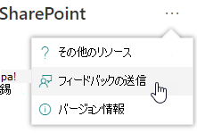
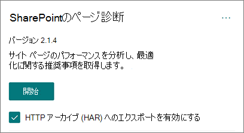

# [ページ診断] ツールを使用SharePointする

この記事では、SharePoint ツールのページ診断を使用して、SharePoint Online のモダン およびクラシック サイト ページを事前に定義されたパフォーマンス条件のセットに対して分析する方法について説明します。

[ページ診断] SharePointツールをインストールできます。

- **Microsoft Edge** [(エッジ拡張機能)](https://microsoftedge.microsoft.com/addons/detail/ocemkolpnamjcacndljdfmhlpcaoipji)
- **Chrome** [(Chrome 拡張機能)](https://chrome.google.com/webstore/detail/inahogkhlkbkjkkaleonemeijihmfagi)

>[!TIP]
>バージョン **2.0.0** 以降には、従来のサイト ページに加えてモダン ページのサポートが含まれています。 使用しているツールのバージョンが不明な場合は、[バージョン情報] リンクまたは省略記号 (...) を選択してバージョンを確認できます。 **ツールを使用する場合は、常に** 最新バージョンに更新してください。

SharePoint 用ページ診断ツールは、新しい Microsoft Edge (https://www.microsoft.com/edge) と Chrome のブラウザー拡張機能であり、SharePoint Online の最新ポータルと従来の発行サイト ページの両方を分析します。 このツールは、SharePointオンラインでのみ機能し、システム ページSharePoint使用できません。

このツールは、定義済みのルールセットに対してページがどのように実行されるのかを示す分析された各ページのレポートを生成し、テストの結果が基準値を外れた場合の詳細情報を表示します。 SharePointオンライン管理者とデザイナーは、このツールを使用してパフォーマンスの問題をトラブルシューティングし、発行前に新しいページが最適化されるのを確認できます。

ページ診断ツールは *、allitems.aspx* や *sharepoint.aspx* などのシステム ページではなく、SharePoint ページのみを分析するように設計されています。 システム ページまたは他のサイト以外のページでツールを実行しようとすると、その種類のページでツールを実行できないことを通知するエラー メッセージが表示されます。

> [!div class="mx-imgBorder"]
> 

ライブラリやシステム ページを評価する際に価値が無い場合、これはツールのエラーではありません。 ツールを使用するには、SharePointページに移動してください。 このエラーが [SharePoint] ページで発生した場合は、マスター ページを調SharePointメタタグが削除されていないか確認してください。

ツールに関するフィードバックを提供するには、ツールの右上隅にある省略記号を選択し、[フィードバックを与える] [を選択します](https://go.microsoft.com/fwlink/?linkid=874109)。

> [!div class="mx-imgBorder"]
> 
  
## ページ診断ツールのインストールSharePointする

このセクションのインストール手順は、Chrome ブラウザーとブラウザーの両方Microsoft Edgeします。

> [!IMPORTANT]
> Microsoft は、SharePoint ツールのページ診断によって分析されたデータやページ コンテンツを読み取り、個人情報、Web サイト、またはダウンロード情報を取得したりは行いません。 ツールによって Microsoft に記録される識別可能な情報は、テナント名、失敗したルールの数、およびツールが実行された日時のみです。 この情報は、最新のポータルと発行サイトの使用状況の傾向と一般的なパフォーマンスの問題をよりよく理解するために Microsoft によって使用されます。

1. [ページ診断] ツールを SharePoint (Microsoft Edge拡張機能) または **Chrome (Chrome** 拡張機能 [)](https://microsoftedge.microsoft.com/addons/detail/ocemkolpnamjcacndljdfmhlpcaoipji) [にインストールします](https://chrome.google.com/webstore/detail/inahogkhlkbkjkkaleonemeijihmfagi)。 ストアの説明ページで提供されているユーザー プライバシー ポリシーを確認してください。 ブラウザーにツールを追加すると、次のアクセス許可に関する通知が表示されます。

    > [!div class="mx-imgBorder"]
    > 

    この通知は、ページの Web パーツとカスタマイズに応じて、SharePoint外部の場所のコンテンツがページに含まれている可能性があるためです。 つまり、スタート ボタンをクリックすると、ツールは要求と応答を読み取り、ツールが実行されているアクティブな [SharePoint] タブにのみ表示されます。 この情報は Web ブラウザーによってローカルにキャプチャされ、ツールの [ネットワーク トレース] タブの **[JSON** にエクスポート]または **[HAR** にエクスポート] ボタンを使用して使用できます。情報は **Microsoft** に送信またはキャプチャされません。 (このツールは、ここでアクセス可能な Microsoft プライバシー ポリシーを [尊重します](https://go.microsoft.com/fwlink/p/?linkid=857875)。)

    [ _ダウンロードの管理] アクセス_ 許可は、ツールの JSON へのエクスポート機能 **の使用について** 説明します。 結果には URL が含まれているので、PII (個人を特定できる情報) として分類できる JSON ファイルを組織外で共有する前に、会社独自のプライバシー ガイドラインに従って下さい。
1. Incognito モードまたは InPrivate モードでツールを使用する場合は、ブラウザーの手順に従います。
    1. [Microsoft Edgeに移動 **するか、URL** バーに edge://extensions _を入力_ し、拡張機能の [**詳細]** を選択します。 拡張機能の設定で **、InPrivate で許可のチェック ボックスをオンにします**。
    1. Chrome で、[拡張機能] に移動 **するか** 、URL バーに chrome://extensions _を入力_ し、拡張機能の **[詳細]** を選択します。 拡張機能の設定で **、Incognito で許可するスライダーを選択します**。
1. 確認する SharePointオンラインの [SharePoint] ページに移動します。 ページ上のアイテムの "遅延読み込み" を許可しました。したがって、ツールは自動的に停止しません (これは、すべてのページ読み込みシナリオに対応するように設計されています)。 コレクションを停止するには、[停止] を **選択します**。 データ収集を停止する前に、または部分的なトレースのみをキャプチャする前に、ページの読み込み完了を確認してください。
1. 拡張機能のツール バー ボタンをクリックする  ツールを読み込むには、次の拡張機能ポップアップ ウィンドウが表示されます。

    

[開始 **] を** 選択して、分析用のデータの収集を開始します。

## [ページ診断] ツールに表示されるSharePoint

1. ツールの右上隅にある省略記号 (...)をクリックして、次のリンクを検索します。
   1. [ **その他のリソース** ] リンクには、この記事へのリンクを含むツールに関する一般的なガイダンスと詳細が表示されます。
   1. [**フィードバックの送信]** リンクには、[サイト] および [グループSharePoint _音声] サイトへのリンクが表示_ されます。
   1. [ **バージョン情報** ] リンクには、現在インストールされているバージョンのツールと、ツールのサード パーティの通知への直接リンクが含まれます。  
1. 相関 **ID、SPRequestDuration、SPIISLatency、****ページ** 読み込み時間、**および URL** の詳細は情報であり、いくつかの目的で使用できます。

    > [!div class="mx-imgBorder"]
    > 

   - **CorrelationID** は、特定のページの追加の診断データを収集できる Microsoft サポートを操作する際に重要な要素です。
   - **SPRequestDuration は**、ページの処理にSharePoint時間です。 構造ナビゲーション、大きな画像、多くの API 呼び出しは、すべて長い期間に貢献する可能性があります。
   - **SPIISLatency は**、オンラインがページの読み込みを開始SharePointミリ秒単位の時間です。 この値には、Web アプリケーションが応答するために必要な時間は含めではありません。
   - **ページ読み込** み時間は、要求時からブラウザーで応答が受信およびレンダリングされた時間までのページによって記録された合計時間です。 この値は、ネットワークの待機時間、コンピューターのパフォーマンス、ブラウザーがページを読み込むのにかかる時間など、さまざまな要因によって影響を受ける。
   - ページ **URL** (Uniform Resource Locator) は、現在のページの Web アドレスです。

1. [[**診断テスト] タブ**](#how-to-use-the-diagnostic-tests-tab)には、分析結果が 3 つのカテゴリで表示されます。**アクションは必要ありません**。**改善の機会と****注意が必要です**。 各テスト結果は、次の表で説明するように、これらのカテゴリの 1 つの項目で表されます。

    |カテゴリ  |色  |説明  |
    |---------|---------|---------|
    |**注意が必要** |赤 |テスト結果は基準値を外れ、ページのパフォーマンスに影響を与えます。 修復のガイダンスに従います。|
    |**改善の機会** |黄 |テスト結果は基準値を外れ、パフォーマンスの問題に寄与する可能性があります。 テスト固有の条件が適用される場合があります。|
    |**操作は不要** |緑 |テスト結果は、テストの基準値に含されます。|

    > [!div class="mx-imgBorder"]
    > 

1. [ [**ネットワーク トレース]**](#how-to-use-the-network-trace-tab-and-how-to-export-a-har-file) タブには、ページビルドの要求と応答に関する詳細が表示されます。

## [診断テスト] タブの使い方

SharePoint のページ診断ツールを使用して SharePoint モダン ポータル ページまたは従来の発行サイト ページを分析すると、結果は、ベースライン値と結果を比較し、[診断テスト] タブに表示される定義済みのルールを使用して分析されます。特定のテストのルールでは、2 つのパフォーマンス特性の違いによって、最新のポータルサイトと従来の発行サイトで異なる基準値を使用する場合があります。

[改善の機会]または [注意が必要なカテゴリ] に表示されるテスト結果は、推奨されるプラクティスに対して確認する必要がある領域を示し、結果に関する追加情報を表示するために選択できます。 各アイテムの詳細には、テスト _に関連する_ 適切なガイダンスに直接アクセスできる [詳細情報] リンクが含まれます。 [アクション不要] カテゴリに表示されるテスト結果 **は** 、関連するルールへの準拠を示し、選択した場合は追加の詳細は表示されません。

[診断テスト] タブの情報では、ページの設計方法は説明されますが、ページのパフォーマンスに影響を与える可能性がある要素が強調表示されます。 一部のページ機能とカスタマイズは、ページのパフォーマンスに避けられない影響を与えるので、その影響が大きい場合は、ページからの潜在的な修復または省略について確認する必要があります。

赤または黄色の結果は、データを頻繁に更新する Web パーツを示す場合もあります。 たとえば、企業のニュースは 1 秒ごとに更新されるのではなく、ユーザー エクスペリエンス全体を向上させるキャッシュ要素を実装するのではなく、1 秒ごとに最新のニュースを取得するためにカスタム Web パーツが構築される場合が多い。 Web パーツをページに含め、使用可能な各パラメーターの値を評価して、目的に合った適切な設定を行って、パフォーマンスへの影響を軽減する簡単な方法が多い場合に備えておきます。

>[!NOTE]
>発行機能が有効になっていない従来のチーム サイトでは、CDN を利用できません。 これらのサイトでツールを実行すると、CDNテストは失敗すると予想され、無視できますが、残りのテストはすべて適用可能です。 発行機能の追加機能SharePointページの読み込み時間が増える可能性があります。そのため、ページの読み込み機能を許可CDNすることはできません。

>[!IMPORTANT]
>テスト ルールは定期的に追加および更新されますので、現在のルールとテスト結果に含まれる特定の情報の詳細については、ツールの最新バージョンを参照してください。 拡張機能を管理することでバージョンを確認できます。拡張機能は更新プログラムが利用可能かどうかを示します。

## [ネットワーク トレース] タブの使い方と HAR ファイルのエクスポート方法

[**ネットワーク トレース]** タブには、ページをビルドするための要求と、ページから受信した応答の両方に関する詳細情報SharePoint。

1. **赤のフラグが設定されたアイテムの読み込み時間を探します**。 各要求と応答は、次の待機時間メトリックを使用してページ全体のパフォーマンスに与える影響を示す色分けされています。
    - 緑: \< 500ms
    - 黄色: 500 ~ 1000ms
    - 赤: \> 1000ms

    > [!div class="mx-imgBorder"]
    > 

    上の図では、赤いアイテムは既定のページに関係します。 ページが 1000ms (1 秒未満) で読み込まれる場合を超え、常に赤 \< で表示されます。

2. **テスト アイテムの読み込み時間**。 場合によっては、アイテムが既にブラウザーによってキャッシュされているため、時間または色インジケーターが表示されません。 これを正しくテストするには、ページを開き、ブラウザー キャッシュをクリアし、[開始] をクリックすると、強制的に "コールド" ページが読み込まれるので、最初のページの読み込みについて真に反映されます。 これは、ページにキャッシュされているアイテムを特定するのにも役立ちますので、"ウォーム" ページの読み込みと比較する必要があります。

3. **問題の調査に役立つ他のユーザーと関連する詳細を共有します**。 ツールで提供される詳細または情報を開発者またはテクニカル サポート担当者と共有するには、HTTP アーカイブへのエクスポートを有効 **にする (HAR)** を使用する方法をお勧めします。 

   > [!div class="mx-imgBorder"]
   > 

これは、[スタート] をクリックする前に有効にし、ブラウザーでデバッグ モードを有効にする必要があります。 HTTP アーカイブ ファイル (HAR) が生成され、[ネットワーク トレース] タブからアクセスできます。[HAR にエクスポート] をクリックすると、ファイルがコンピューターにダウンロードされ、必要に応じて共有できます。 このファイルは、F12 Developer Tools や Fiddler など、さまざまなデバッグ ツールで開くことができる。

> [!div class="mx-imgBorder"]
> 

> [!IMPORTANT]
> これらの結果には URL が含まれるので、PII (個人を特定できる情報) として分類できます。 その情報を配布する前に、必ず組織のガイドラインに従います。

## Microsoft サポートへの取り組み

サポート ケースに **直接取** り組む場合にのみ利用する必要がある Microsoft サポート レベルの機能が含まれています。 この機能を利用すると、サポート チームの関与なしで使用する場合はメリットが得ず、ページのパフォーマンスが大幅に低下する可能性があります。 この機能をツールで使用する場合は、サービスのログに追加情報が追加されます。

変更は表示されませんが、有効にしたという通知が表示され、ページのパフォーマンスが有効になっている間にパフォーマンスが 2 ~ 3 倍低下します。 特定のページとアクティブなセッションにのみ関連します。 このため、サポートに積極的に取り組む場合にのみ、これを使用する必要があります。

### Microsoft サポート レベルの機能を有効にするには

1. [ページ診断] ツールを開SharePointします。
2. キーボードで **ALT-Shift-L キーを押します**。 [サポート ログを有効 **にする] チェック ボックスが** 表示されます。
3. チェック ボックスをオンにし、[スタート] **をクリック** してページを再読み込みし、詳細ログを生成します。

   > [!div class="mx-imgBorder"]
   > 
  
    CorrelationID (ツールの上部に表示) をメモし、サポート担当者に提供して、診断セッションに関する追加情報を収集できます。

## 関連トピック

[SharePoint Online のパフォーマンスをチューニングする](tune-sharepoint-online-performance.md)

[Office 365 のパフォーマンスをチューニングする](tune-microsoft-365-performance.md)

[SharePoint のモダン エクスペリエンスにおけるパフォーマンス](/sharepoint/modern-experience-performance)

[コンテンツ配信ネットワーク](content-delivery-networks.md)

[SharePoint Online での Office 365 コンテンツ配信ネットワーク (CDN) の使用](use-microsoft-365-cdn-with-spo.md)