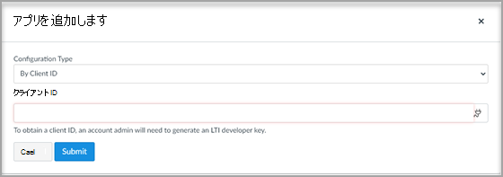

# Canvas でMicrosoft Teamsクラスを使用する

Microsoft Teamsクラスは、ラーニング ツール相互運用性 (LTI) アプリで、教育者と学生が ラーニング 管理システム (LMS) と Teams の間を簡単に移動するのに役立ちます。 ユーザーは、自分のコースに関連付けられているクラス チームに、自分の LMS 内から直接アクセスできます。

## 展開前の前提条件

> [!NOTE]
> LTI の現在Teamsクラスは、キャンバス ユーザーと制限されたスコープ内Microsoft Azure Active Directory (AAD) の同期のみをサポートします。 
> - テナントは、Microsoft AAD のキャンバス フィールド (電子メール、ユーザー ID、または SIS ID) と UPN の間で完全に一致している必要があります。 同期機能に柔軟に対応するために取り組み中ですが、その間、Canvas のユーザーが AAD の UPN と一致しない場合、Canvas と同期された Teams クラスには追加されません。 
> - Canvas と Microsoft の間でユーザーをマッピングするには、1 つの Microsoft テナントのみを使用できます。
> - グループの重複を回避するには、LTI クラスを使用する前Teams SDS をオフにする必要があります。

## Microsoft Office 365管理者

Instructure Canvas 内の Microsoft Teams 統合を管理する前に、Canvas の管理セットアップを完了する前に、キャンバスの **microsoft-Teams-Sync-for-Canvas** Azure アプリを Microsoft Azure テナントの教育機関の Microsoft Office 365 管理者によって承認することが重要です。

1. Canvas にサインインします。

2. グローバル ナビゲーション **で [管理者** ] リンクを選択し、アカウントを選択します。

3. 管理ナビゲーションで、[リンク]**リンクを** 設定、[統合]**タブを選択** します。

4. トグルMicrosoft Teamsして同期を有効にします。

   

5. Microsoft テナント名とログイン属性を入力します。

   login 属性は、Canvas ユーザーをユーザーに関連付Azure Active Directoryされます。

6. [完了 **したら設定** 更新] を選択します。

7. Canvas の **Microsoft-Teams-Sync-for-Canvas** Azure アプリへのアクセスを承認するには、[テナント アクセスを **許可する] リンクを選択** します。 Microsoft Identity Platform Admin Consent Endpoint にリダイレクトされます。

   

8. **[同意する]** を選択します。

## Canvas Admin

LTI 1.3 Microsoft Teamsをセットアップします。

Canvas 管理者として、環境内に LTI Microsoft Teamsクラスを追加する必要があります。 メイン アカウントの開発者キーの一覧にアクセスし、継承されたキーに切り替えて、LTI ツールTeams有効にします。 アプリの LTI クライアント ID をメモします。

 - Microsoft Teamsクラス - 170000000000570

1. Access **Admin settings**  >  **Apps**.

2. [+**アプリ] を** 選択して、LTI Teamsを追加します。

   

3. 構成 **の種類として [クライアント ID 別** ] を選択します。

   

4. 指定されたクライアント ID を入力し、[送信] を **選択します**。

   確認のためにクライアント ID Microsoft Teamsクラス LTI アプリ名が表示されます。

5. **[インストール]** を選択します。

   LTI Microsoft Teamsクラスは、外部アプリの一覧に追加されます。
   
## キャンバス コースの LTI アプリを有効にする

コース内で LTI アプリを使用するには、Canvas コースの講師が統合同期を有効にする必要があります。各コースは、対応するチームを作成するために講師が有効にする必要があります。チームを作成するためのグローバルメカニズムはありません。 これは、望ましくないチームが作成されるのを防ぐための予防措置として設計されています。

各コースで LTI アプリを [有効](https://support.microsoft.com/topic/use-microsoft-teams-classes-in-your-lms-preview-ac6a1e34-32f7-45e6-b83e-094185a1e78a#ID0EBD=Instructure_Canvas) にし、統合セットアップを完了するには、教員のドキュメントを参照してください。
