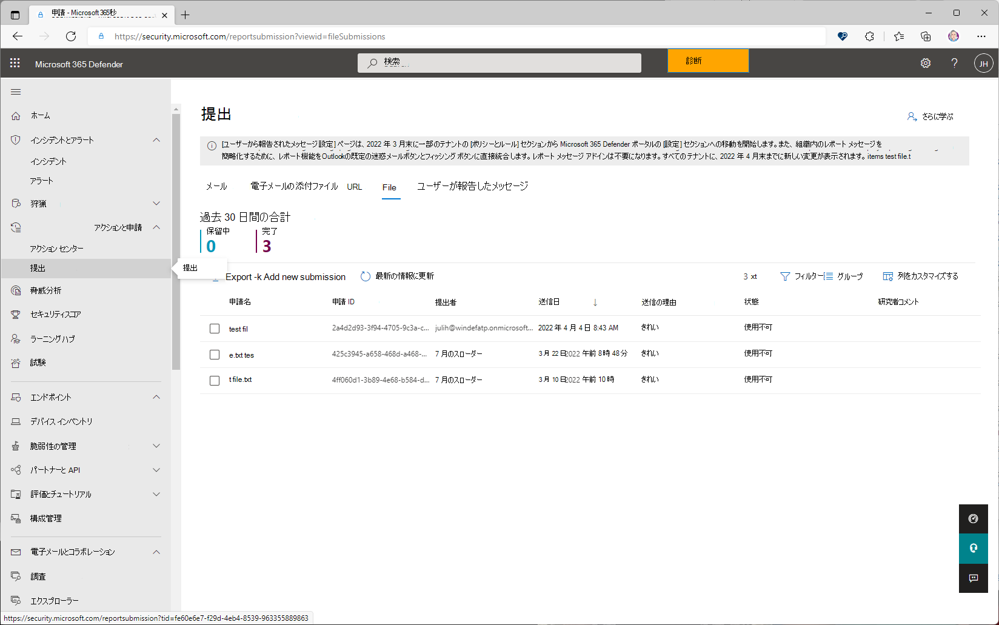
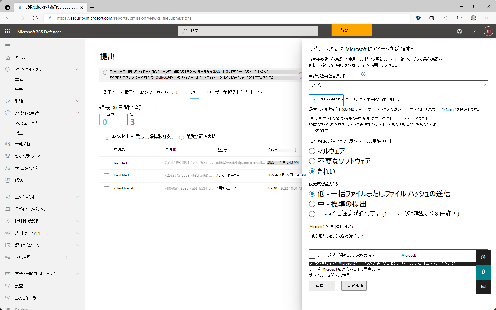
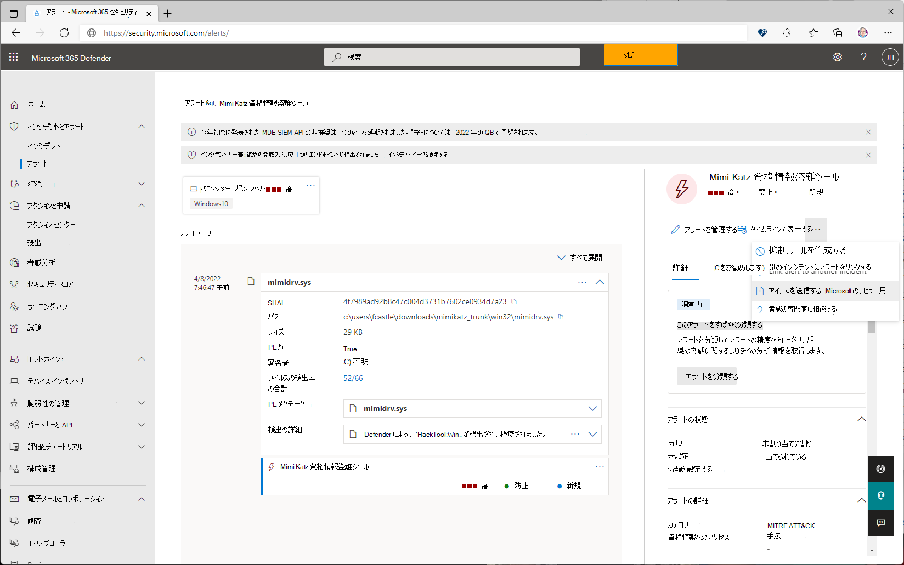
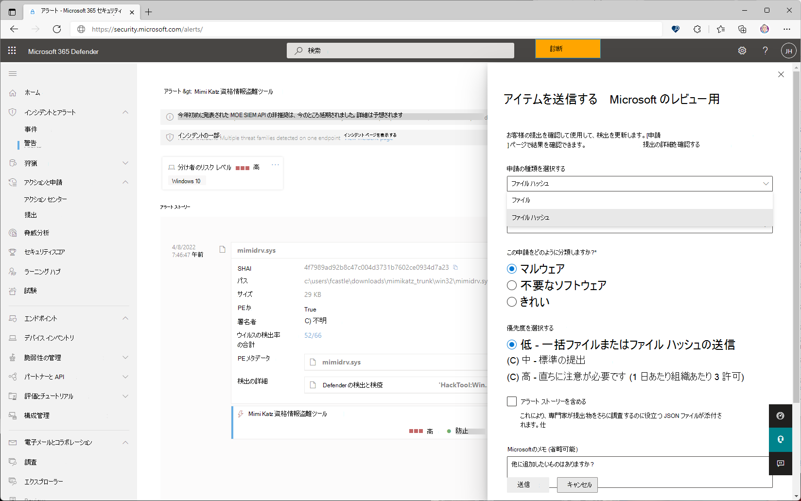

# Microsoft Defender for Endpointでファイルを送信する

[!INCLUDE [Microsoft 365 Defender rebranding](../../includes/microsoft-defender.md)]

**適用対象**

- [Microsoft Defender for Endpoint](https://go.microsoft.com/fwlink/p/?linkid=2146806)
- [Microsoft 365 Defender](https://go.microsoft.com/fwlink/?linkid=2118804)

>Microsoft Defender ATP を試してみたいですか? [無料試用版にサインアップ](https://www.microsoft.com/microsoft-365/windows/microsoft-defender-atp?ocid=docs-wdatp-usewdatp-abovefoldlink)します。

Microsoft Defender for Endpointでは、管理者は統合申請機能を使用して、ファイルとファイル ハッシュ (SHA) を Microsoft に送信してレビューを行うことができます。 統合された提出エクスペリエンスは、メール、URL、電子メールの添付ファイル、ファイルを 1 つの使いやすい提出エクスペリエンスで送信するための一貫したショップです。 管理者は、Microsoft 365 Defender ポータルまたはMicrosoft Defender for Endpointアラート ページを使用して疑わしいファイルを送信できます。

## はじめに把握しておくべき情報

- 新しい統合申請エクスペリエンスは、Microsoft 365 Defender、Microsoft Defender for Endpoint プラン 2、または Microsoft Defender for Office プラン 2 を含むサブスクリプションでのみ使用できます。

- Microsoft にファイルを送信するには、次のいずれかの役割グループのメンバーである必要があります。

  - [Microsoft 365 Defender ポータル](../office-365-security/permissions-microsoft-365-security-center.md)の **組織の管理** または **セキュリティ管理者**。

- スパム、フィッシング、URL、電子メールの添付ファイルを Microsoft に送信する方法の詳細については、「 [メッセージとファイルを Microsoft に報告する」を](../office-365-security/report-junk-email-messages-to-microsoft.md)参照してください。

## ポータルから Microsoft にアイテムを報告する

マルウェアである可能性がある、または誤って検出されている (誤検知) 可能性があるファイルがある場合は、Microsoft 365 Defender ポータルをhttps://security.microsoft.com/使用して分析のために Microsoft に送信できます。

### ファイルまたはファイル ハッシュを送信する

1. Microsoft 365 Defender<https://security.microsoft.com/>を開き、[**アクション&申請**] をクリックし、[**申請]** をクリックして [**ファイル**] タブに移動し、[**新しい申請の追加**] を選択します。

    > [!div class="mx-imgBorder"]
    > 

2. **[ファイル**] または [**ファイル] ハッシュ****を送信するように** 表示されるポップアップを確認するには、Microsoft にアイテムを送信するを使用します。

3. [ **送信の種類の選択** ] ボックスで、ドロップダウン リストから **[ファイル** ] または [ **ファイル ハッシュ** ] を選択します。

4. ファイルを送信するときに、[ファイルの **参照**] をクリックします。 開いたダイアログで、ファイルを見つけて選択し、[ **開く**] をクリックします。 ファイル ハッシュの提出では、 **ファイル ハッシュ** をコピーするか入力する必要があることに注意してください。

5. **[このファイルは、セクションとして分類されている必要があります**]、[**マルウェア** (偽陰性)]、または **[不要なソフトウェア**]、または **[クリーン** (偽陽性)] を選択します。

6. 次に、 **優先度を選択します**。 **ファイル ハッシュ** の送信では、**低 - 一括ファイルまたはファイル ハッシュの送信** のみが選択され、自動的に選択されることに注意してください。

    > [!div class="mx-imgBorder"]
    > 

7. [**送信**] をクリックします。

   申請の詳細を表示する場合は、[ **申請] の名前** の一覧から申請を選択して、[ **結果の詳細** ] ポップアップを開きます。

## [アラート] ページから Microsoft にアイテムを報告する

[ **アラート]** ページのアラートの一覧から、ファイルハッシュまたはファイル ハッシュを直接送信することもできます。

1. Microsoft 365 Defenderを開き<https://security.microsoft.com/>、[**インシデント&アラート**] をクリックし、[**アラート**] をクリックしてアラートの一覧を表示します。

2. レポートするアラートを選択します。 アラート内に入っているファイルを送信することに注意してください。

3. [ **アラートの管理** ] の横にある省略記号をクリックすると、その他のオプションが表示されます。 [ **レビュー用にアイテムを Microsoft に送信する] を選択します**。

    > [!div class="mx-imgBorder"]
    > 

4. 次に表示されるポップアップで、提出の種類を選択します。

    > [!div class="mx-imgBorder"]
    > 

    提出の種類として **[ファイル** ] を選択した場合は、ファイルをアップロードし、申請を分類して優先度を選択します。

    提出の種類として **[ファイル ハッシュ** ] を選択した場合は、ドロップダウンから使用できるファイル ハッシュを選択します。 複数のファイル ハッシュを選択できます。

5. [**送信**] をクリックします。

## 関連情報

- [Microsoft 365 Defender の Microsoft Defender for Endpoint](../defender/microsoft-365-security-center-mde.md)
- [false positives/negatives に対処する](defender-endpoint-false-positives-negatives.md)
- [Microsoft Defender for Endpointでアラート キューを表示および整理する](alerts-queue.md)
