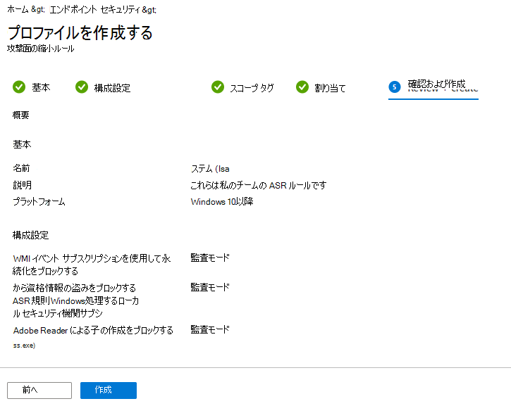
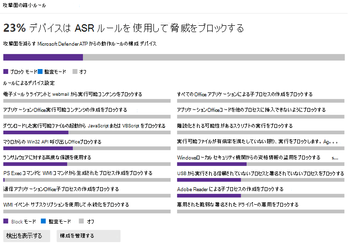
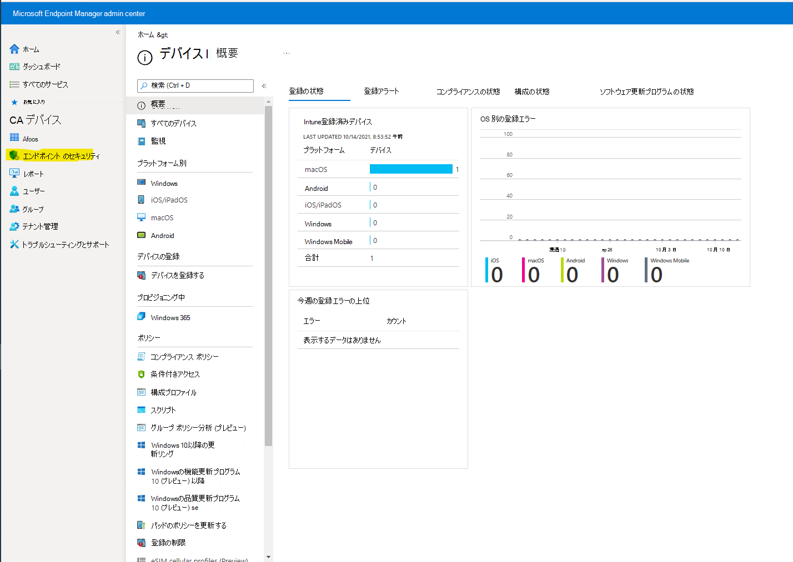
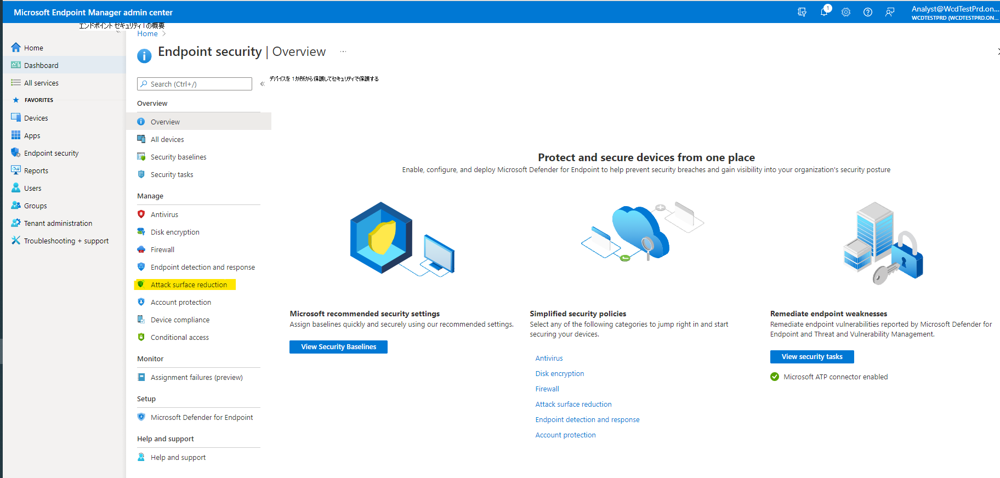

# <a name="step-2-test-asr-rules"></a>手順 2: ASR ルールをテストする

攻撃表面の縮小 (ASR) ルールをテストすると、ルールが任意のルールを有効にする前に、業務ライン操作を妨げないかどうかを判断できます。 小規模で制御されたグループから開始すると、組織全体で展開を拡大する場合に、潜在的な作業の中断を制限できます。

リング 1 で攻撃表面の縮小 (ASR) ルールの展開を開始します。

> [!div class="mx-imgBorder"]
> 

## <a name="step-1-test-asr-rules-using-audit"></a>手順 1: 監査を使用して ASR ルールをテストする

ルールが [監査] に設定されている ASR ルールをオンにして、リング 1 のチャンピオン ユーザーまたはデバイスからテストフェーズを開始します。 通常、テスト フェーズ中にトリガーされるルールを特定できるよう、すべてのルール (監査) を有効にしてください。 [監査] に設定されているルールは、通常、ルールが適用されるエンティティまたはエンティティの機能には影響を与えず、評価のためにログに記録されたイベントを生成します。エンド ユーザーには影響しません。

### <a name="configure-asr-rules-using-mem"></a>MEM を使用して ASR ルールを構成する

カスタム ASR ルールMicrosoft エンドポイント マネージャー(MEM) エンドポイント セキュリティを使用して構成できます。

1. 管理[Microsoft エンドポイント マネージャーを開く](https://endpoint.microsoft.com/#home)
2. [Endpoint **SecurityAttack]** >  **サーフェスの縮小に移動します**。
3. **[ポリシーを作成する]** を選択します。
4. [**プラットフォーム] で**、[Windows 10 **] を** 選択し、[**プロファイル**] で [攻撃表面の縮小ルール **] を選択します**。
  
    > [!div class="mx-imgBorder"]
    > 

5. **[作成]** をクリックします。
6. [プロファイル **の作成]** ウィンドウの [ **基本] タブ** で、[ **名前] で** ポリシーの名前を追加します。 [ **説明]** で、ASR ルール ポリシーの説明を追加します。
7. [構成 **設定] タブの** [ **攻撃表面** 縮小ルール] で、すべてのルールを監査モード **に設定します**。

    > [!div class="mx-imgBorder"]
    > 

    >[!Note]
    >一部の ASR ルール モードの一覧にはバリエーションがあります。 _[ブロック]_ と _[有効] は_ 、同じ機能を提供します。

8. [省略可能][スコープ タグ **] ウィンドウ** で、特定のデバイスにタグ情報を追加できます。 また、役割ベースのアクセス制御タグとスコープ タグを使用して、適切な管理者が適切な Intune オブジェクトに対する適切なアクセスと可視性を確保することもできます。 詳細については、「 [Intune で分散 IT に役割ベースのアクセス制御 (RBAC) タグとスコープ タグを使用する」を参照してください](/mem/intune/fundamentals/scope-tags)。
9. [割 **り当て]** ウィンドウで、ユーザーまたはデバイス グループにプロファイルを展開または "割り当て" できます。 詳細: デバイス [プロファイルの割り当て (](/mem/intune/configuration/device-profile-assign#exclude-groups-from-a-profile-assignment)Microsoft Intune
10. [確認と作成] ウィンドウ **で設定を確認** します。 [作成 **] を** クリックしてルールを適用します。

   > [!div class="mx-imgBorder"]
   > 

ASR ルールの新しい攻撃表面縮小ポリシーは、[エンドポイント セキュリティ ポリシー] に **|攻撃表面の縮小**。

   > [!div class="mx-imgBorder"]
   > 

## <a name="step-2-understand-the-attack-surface-reduction-rules-reporting-page-in-the-microsoft-365-defender-portal"></a>手順 2: サイト ポータルの [攻撃表面の縮小ルール] レポート ページMicrosoft 365 Defenderする

ASR ルールレポート ページは、**portalReportsAttack** >  **Microsoft 365 Defender** > に **表示されます**。 このページには、次の 3 つのタブがあります。

- Detections
- 構成
- 除外の追加

### <a name="detections-tab"></a>[検出] タブ

検出された監査イベントとブロックされたイベントの 30 日間のタイムラインを提供します。

> [!div class="mx-imgBorder"]
> ![[攻撃表面の縮小ルールの検出] タブ](images/asr-defender365-01.png)

[攻撃表面の縮小ルール] ウィンドウには、ルールごとに検出されたイベントの概要が表示されます。

>[!Note]
>ASR ルール レポートにはいくつかのバリエーションがあります。 Microsoft は、一貫性のあるエクスペリエンスを提供するために ASR ルール レポートの動作を更新中です。

> [!div class="mx-imgBorder"]
> 

[ **検出の表示] をクリック** して、[検出 **] タブを開** きます。

> [!div class="mx-imgBorder"]
> 

**[GroupBy] ウィンドウと** **[フィルター] ウィンドウ** には、次のオプションがあります。

**GroupBy は**、結果セットを次のグループに返します。

- グループ化なし
- 検出されたファイル
- 監査またはブロック
- Rule
- ソース アプリ
- Device
- User
- Publisher

> [!div class="mx-imgBorder"]
> 

**フィルター** によって [ **ルールのフィルター]** ページが開き、選択した ASR ルールのみを結果の範囲に設定できます。

> [!div class="mx-imgBorder"]
> 

>[!Note]
>Microsoft Microsoft 365 Security E5 または A5、Windows E5、または A5 ライセンスをお持ちの場合は、次のリンクをクリックすると、[Microsoft Defender 365 Reports > Attack [surface](https://security.microsoft.com/asr?viewid=detections) reductions > Detections] タブが開きます。

### <a name="configuration-tab"></a>[構成] タブ

ASR ルールの集約状態である[オフ]、[監査]、または [ブロック] の各リストをコンピューター単位で表示します。

> [!div class="mx-imgBorder"]
> ![攻撃表面の縮小ルール [構成] タブ](images/asr-defender365-configurations.png)

[構成] タブで、ASR ルールを確認するデバイスを選択することで、デバイスごとにどの ASR ルールが有効になっているか、どのモードで有効になっているのか確認できます。

> [!div class="mx-imgBorder"]
> 

[**開始] リンク** は、Microsoft エンドポイント マネージャー管理センターを開き、ASR のエンドポイント保護ポリシーを作成または変更できます。

> [!div class="mx-imgBorder"]
> 

[エンドポイント セキュリティ] |[概要] で、[ **攻撃表面の縮小] を選択します**。

> [!div class="mx-imgBorder"]
> 

Endpoint Security |攻撃表面の縮小ウィンドウが開きます。

> [!div class="mx-imgBorder"]
> ![[エンドポイント セキュリティ] [Asr] ウィンドウ](images/asr-defender365-05b-mem3.png)

>[!Note]
>Microsoft Defender 365 E5 (または Windows E5?) ライセンスをお持ちの場合、このリンクにより[Microsoft Defender 365 Reports > Attack surface [reductions > Configurations](https://security.microsoft.com/asr?viewid=configuration)] タブが開きます。

### <a name="add-exclusions"></a>除外の追加

このタブには、検出されたエンティティ (誤検知など) を除外対象として選択するメソッドが表示されます。 除外が追加された場合、予想される影響の概要がレポートに表示されます。

>[!Note]
> Microsoft Defender ウイルス対策の除外は ASR ルールによって適用されます。  「 [拡張機能、名前、または場所に基づいて除外を構成して検証する」を参照してください](configure-extension-file-exclusions-microsoft-defender-antivirus.md)。

> [!div class="mx-imgBorder"]
> 

> [!Note]
>Microsoft Defender 365 E5 (または Windows E5?) ライセンスをお持ちの場合、このリンクにより[Microsoft Defender 365 Reports > Attack surface [reductions > 除外](https://security.microsoft.com/asr?viewid=exclusions)] タブが開きます。

### <a name="use-powershell-as-an-alternative-method-to-enable-asr-rules"></a>ASR ルールを有効にする代替方法として PowerShell を使用する

MEM の代わりに PowerShell を使用すると、監査モードで ASR ルールを有効にして、機能が完全に有効になっている場合にブロックされた可能性があるアプリのレコードを表示できます。 また、通常の使用中にルールが発生する頻度を確認することもできます。

監査モードで攻撃表面の縮小ルールを有効にするには、次の PowerShell コマンドレットを使用します。

```PowerShell
Add-MpPreference -AttackSurfaceReductionRules_Ids <rule ID> -AttackSurfaceReductionRules_Actions AuditMode
```

攻撃 `<rule ID>` 表面の [縮小ルールの GUID 値はここで指定します](attack-surface-reduction-rules-reference.md)。

監査モードで追加された攻撃表面の縮小ルールを有効にするには、次の PowerShell コマンドレットを使用します。

```PowerShell
(Get-MpPreference).AttackSurfaceReductionRules_Ids | Foreach {Add-MpPreference -AttackSurfaceReductionRules_Ids $_ -AttackSurfaceReductionRules_Actions AuditMode}
```

> [!TIP]
> 組織内での攻撃表面の縮小ルールの動作を完全に監査する場合は、管理ツールを使用して、ネットワーク内のデバイスにこの設定を展開する必要があります。

グループ ポリシー、Intune、またはモバイル デバイス管理 (MDM) 構成サービス プロバイダー (CSP) を使用して、設定を構成および展開することもできます。 詳しくは、「攻撃表面の [縮小ルール」のメイン記事を参照](attack-surface-reduction.md) してください。

## <a name="use-windows-event-viewer-review-as-an-alternative-to-the-attack-surface-reduction-rules-reporting-page-in-the-microsoft-365-defender-portal"></a>イベント Windowsポータルの攻撃表面縮小ルールレポート ページの代わりに、イベント ビューアー レビューをMicrosoft 365 Defenderする

ブロックされているアプリを確認するには、Microsoft-Windows-Windows Defender/運用ログでイベント ビューアーを開き、イベント ID 1121 をフィルター処理します。 次の表に、すべてのネットワーク保護イベントを示します。

イベント ID | 説明
-|-
 5007 | 設定が変更された場合のイベント
 1121 | ブロック モードで攻撃表面の縮小ルールが発生した場合のイベント
 1122 | 監査モードで攻撃表面の縮小ルールが発生した場合のイベント

## <a name="additional-topics-in-this-deployment-collection"></a>この展開コレクションのその他のトピック

[ASR ルールの展開の前提条件](attack-surface-reduction-rules-deployment.md)

[手順 1: ASR ルールの展開を計画する](attack-surface-reduction-rules-deployment-plan.md)

[手順 3: ASR ルールを実装する](attack-surface-reduction-rules-deployment-implement.md)

[手順 4: ASR ルールを運用化する](attack-surface-reduction-rules-deployment-operationalize.md)
