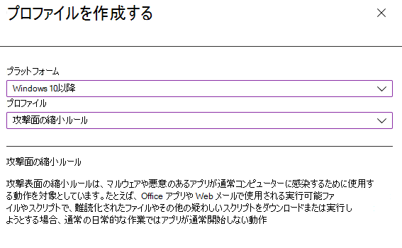
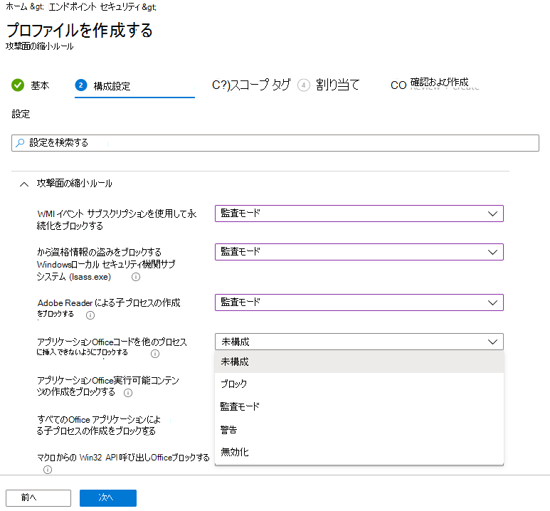
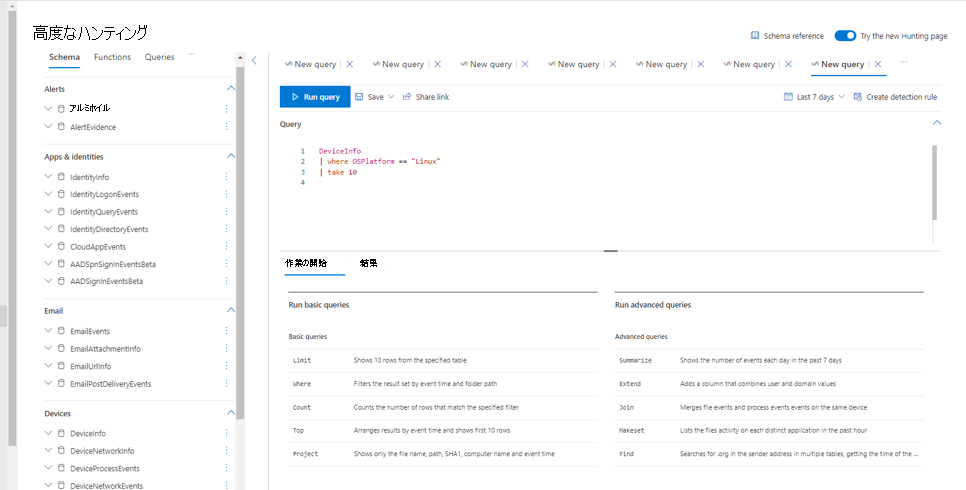
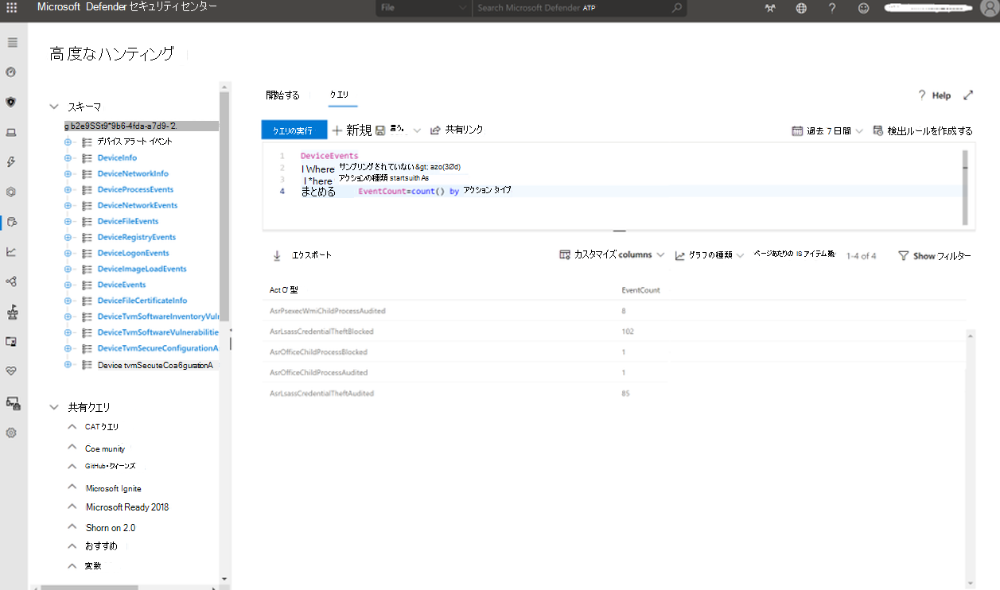

# 攻撃表面の縮小ルールの展開ガイド

## はじめに

攻撃表面は、組織がサイバー脅威や攻撃に対して脆弱なすべての場所です。 組織の攻撃表面には、攻撃者が組織のデバイスやネットワークを侵害する可能性があるすべての場所が含まれています。 攻撃の表面を減らすことは、組織のデバイスとネットワークを保護する手段であり、攻撃方法が少ない攻撃者を残します。 攻撃表面の縮小 (ASR) ルール (Microsoft Defender for Endpoint で見つかった多くのセキュリティ機能の 1 つ) を構成すると、役立ちます。

ASR ルールは、次のような特定のソフトウェア動作を対象とします。

- ファイルのダウンロードまたは実行を試みる実行可能ファイルとスクリプトの起動
- 難読化されたスクリプトまたはその他の疑わしいスクリプトを実行する
- 通常の日次作業中にアプリが通常は発生しない動作

異なる攻撃表面を減らすことで、攻撃が最初に起こらされるのを防ぐのに役立ちます。

最初の準備では、配置するシステムの機能を理解する必要があります。 この機能を理解すると、組織を保護するために最も重要な ASR ルールを特定するのに役立ちます。

>[!IMPORTANT]
>このガイドでは、ASR ルールを構成する方法を決定するのに役立つ画像と例を示します。これらのイメージと例は、環境に最適な構成オプションを反映していない可能性があります。

開始する前に、「 [攻撃表面](overview-attack-surface-reduction.md)の縮小の概要」と [「Demystifying](https://techcommunity.microsoft.com/t5/microsoft-defender-for-endpoint/demystifying-attack-surface-reduction-rules-part-1/ba-p/1306420) Attack Surface Reduction rules - Part 1 for foundational information」を参照してください。 カバレッジの領域と潜在的な影響を理解するには、ASR ルールの現在のセットについて理解してください。「攻撃 [表面の縮小ルール」を参照してください](attack-surface-reduction-rules.md)。

ASR ルールは、Microsoft Defender for Endpoint 内の攻撃表面縮小機能の機能の 1 つのみです。 このドキュメントでは、人間が操作するランサムウェアなどの高度な脅威を阻止するために、ASR ルールを効果的に展開する方法について詳しく説明します。  

### カテゴリ別のルール

「攻撃表面の縮小ルールを使用してマルウェアの感染を防止する」で説明されている通り、MDE 内には複数の攻撃表面縮小ルールが含め、組織を保護できます。 カテゴリ別に分類されるルールを次に示します。

 

| 多態性の脅威 | 横方向の移動&資格情報の盗難 | 生産性向上アプリのルール |  電子メール ルール | スクリプト ルール | その他のルール |
|:---|:---|:---|:---|:---|:---|
| 有病率 (1000 台のコンピューター)、年齢 (24 時間)、または信頼できるリスト条件を満たしない限り、実行可能ファイルの実行をブロックする | PSExec および WMI コマンドから発生するプロセス作成をブロックする | 実行可能Officeアプリの作成をブロックする | メール クライアントと Web メールから実行可能なコンテンツをブロックする | 難読化された JS/VBS/PS/マクロ コードをブロックする | 悪用された脆弱な署名済みドライバーの悪用をブロック  する [[1](#fn1)]  |
| USB から実行される信頼されていないプロセスと署名されていないプロセスをブロックする | ローカル セキュリティ機関サブシステムからの資格情報のWindowsをブロックする (lsass.exe) [  [2](#fn1)]   | アプリOffice子プロセスの作成をブロックする |  通信アプリケーションOffice子プロセスの作成のみをブロックする | JS/VBS のダウンロード済み実行可能コンテンツの起動をブロックする | |
| ランサムウェアに対する高度な保護の使用 | WMI イベント サブスクリプションによる永続化のブロック | アプリOffice他のプロセスへのコードの挿入をブロックする | 通信Office子プロセスの作成をブロックする | | |
| | | Adobe Reader の子プロセスの作成をブロックする | | | |

(<a id="fn1">1</a>) _脆弱な_ 署名済みドライバーの悪用をブロックする機能は、MEM Endpoint セキュリティでは現在利用できません。 このルールは [、MEM OMA-URI を使用して構成できます](enable-attack-surface-reduction.md#mem)。

(<a id="fn1">2</a>) 一部の ASR ルールではかなりのノイズが発生しますが、機能はブロックできません。 たとえば、Chrome を更新する場合。Chrome はユーザーにlsass.exe。パスワードはデバイスの lsass に保存されます。 ただし、Chrome はローカル デバイスにアクセスlsass.exe。 lsass へのアクセスをブロックするルールを有効にした場合、多くのイベントが生成されます。 これらのイベントは、ソフトウェアの更新プロセスがユーザーにアクセスしないので、lsass.exe。 このルールを有効にすると、Chrome の更新プログラムによる lsass へのアクセスはブロックされますが、Chrome の更新はブロックされます。これは、ユーザーに対して不要な呼び出しを行う他のアプリケーションlsass.exe。 _lsass ルールへのブロック アクセスは、lsass_ への不要な呼び出しをブロックしますが、アプリケーションの実行をブロックしません。

### インフラストラクチャの要件

ASR ルールを実装する複数の方法が可能ですが、このガイドは次のインフラストラクチャに基づいて作成されます。

- Azure Active Directory
- Microsoft Endpoint Management (MEM)
- Windows 10およびWindows 11 台のデバイス
- エンドポイント E5 または E5 ライセンスWindows Microsoft Defender

ASR ルールとレポートを完全に活用するには、E5 または E5 ライセンス、および A5 Microsoft 365 Defenderまたは Windows使用することをお勧めします。 詳細については、「 [エンドポイント用 Microsoft Defender の最小要件」を参照してください](minimum-requirements.md)。

>[!Note]
>ASR ルールを構成するには、複数の方法があります。 ASR ルールは、Microsoft エンドポイント マネージャー(MEM)、PowerShell、グループ ポリシー、Microsoft System Center Configuration Manager (SCCM)、MEM OMA-URI を使用して構成できます。
>インフラストラクチャ要件 _(上記_) に記載されているインフラストラクチャ構成とは異なるインフラストラクチャ構成を使用している場合は、他の構成を使用して攻撃表面の縮小ルールを展開する 方法の詳細については、「攻撃表面の縮小ルールを有効にする」を参照してください。  

### ASR ルールの依存関係

Microsoft Defender ウイルス対策プライマリ ウイルス対策ソリューションとして有効および構成する必要があります。次のモードである必要があります。

- プライマリ ウイルス対策/マルウェア対策ソリューション  
- 状態: アクティブ モード

Microsoft Defender ウイルス対策モードを使用しない必要があります。

- パッシブ
- ブロック モードでのエンドポイントの検出と応答 (EDR) のパッシブ モード
- 限られた定期的なスキャン (LPS)
- Off

参照:[クラウド配信の保護とMicrosoft Defender ウイルス対策。](cloud-protection-microsoft-defender-antivirus.md)

### クラウド保護 (MAPS) を有効にする必要があります

Microsoft Defender ウイルス対策 Microsoft クラウド サービスとシームレスに連携します。 Microsoft Advanced Protection Service (MAPS) とも呼ばれるこれらのクラウド保護サービスは、標準のリアルタイム保護を強化し、間違いなく最高のウイルス対策防御を提供します。 クラウド保護は、マルウェアからの侵害や ASR ルールの重要なコンポーネントを防止するために重要です。
[クラウドで配信される保護をオン Microsoft Defender ウイルス対策にする](enable-cloud-protection-microsoft-defender-antivirus.md)

### Microsoft Defender ウイルス対策コンポーネントは現在のバージョンである必要があります

次のMicrosoft Defender ウイルス対策コンポーネント のバージョンは、現在利用可能なバージョンより 2 つ以上古いバージョンである必要があります。

- **Microsoft Defender ウイルス対策プラットフォーム更新プログラムのバージョン**- Microsoft Defender ウイルス対策月次更新されます。
- **Microsoft Defender ウイルス対策エンジンのバージョン**- Microsoft Defender ウイルス対策は毎月更新されます。
- **Microsoft Defender ウイルス対策** セキュリティ インテリジェンス - Microsoft は、Microsoft Defender セキュリティ インテリジェンス (定義と署名とも呼ばれる) を継続的に更新して、最新の脅威に対処し、検出ロジックを強化します。

最新のMicrosoft Defender ウイルス対策維持すると、ASR ルールの誤検知結果を減らし、検出機能Microsoft Defender ウイルス対策向上します。 現在のバージョンと、さまざまなコンポーネントを更新する方法の詳細については、「Microsoft Defender ウイルス対策サポート[Microsoft Defender ウイルス対策」を参照してください](manage-updates-baselines-microsoft-defender-antivirus.md)。

## ASR ルールの展開フェーズ

ビジネスラインの運用に影響を与える可能性のある新しい大規模な実装と同様に、計画と実装では計画的な方法が重要です。 ASR ルールがマルウェアを防止する強力な機能を備えるので、独自の顧客ワークフローに最適な動作を実現するには、これらのルールの慎重な計画と展開が必要です。 環境で作業するには、ASR ルールを慎重に計画、テスト、実装、運用する必要があります。  

> [!div class="mx-imgBorder"]
> 

>[!Note]
>Microsoft 以外の HIPS を使用し、Microsoft Defender for Endpoint 攻撃表面縮小ルールに移行しているお客様の場合:監査モードからブロック モードに移行するまで、ASR ルールの展開を使用して HIPS ソリューションをサイド バイ サイドで実行する必要があります。 除外の推奨事項については、サードパーティのウイルス対策ベンダーに問い合う必要があります。  

## フェーズ 1: 計画

ASR ルールのテストを開始するには、適切なビジネス ユニットから始める必要があります。 まず、特定のビジネス ユニットの少人数のグループから始める必要があります。 ASR ルールに実際の影響を与え、実装の調整に役立つ ASR チャンピオンを特定できます。

> [!div class="mx-imgBorder"]
> 

### 適切なビジネス ユニットから始める

ASR ルールの展開を展開するビジネス ユニットを選択する方法は、次のような要因によって異なっています。

- ビジネス ユニットのサイズ
- ASR ルール チャンピオンの可用性  
- の配布と使用法:
  - ソフトウェア
  - 共有フォルダー
  - スクリプトの使用
  - Officeマクロ
  - ASR ルールの影響を受けるその他のエンティティ

ビジネス ニーズに応じて、複数のビジネス ユニットを含めて、ソフトウェア、共有フォルダー、スクリプト、マクロなどの広範なサンプリングを取得する場合があります。逆に、最初の ASR ルールロールアウトの範囲を 1 つのビジネス ユニットに制限し、ASR ルールのロールアウト プロセス全体を他のビジネス ユニットに対して一度に 1 回繰り返す場合があります。

### ASR ルール のチャンピオンを特定する

ASR ルール のチャンピオンは、事前テストと実装の段階で最初の ASR ルールのロールアウトに役立つ組織のメンバーです。 チャンピオンは通常、技術的に詳しく、断続的な作業フローの停止によって脱線しない従業員です。 チャンピオンの関与は、組織への ASR ルール展開の広範な拡大を通じて継続されます。 ASR ルール のチャンピオンは、最初に ASR ルールロールアウトの各レベルを体験します。

ASR ルールのチャンピオンにフィードバックと応答チャネルを提供して、ASR ルールに関連する作業の中断を警告し、ASR ルールロールアウト関連の通信を受信することが重要です。

### 業務用アプリのインベントリを取得し、ビジネス ユニット プロセスを理解する

組織全体で使用されるアプリケーションとビジネス単位ごとのプロセスを完全に理解するには、ASR ルールの展開を成功するために重要です。 さらに、組織内のさまざまなビジネス ユニット内でこれらのアプリがどのように使用されるかを理解する必要があります。
まず、組織全体で使用が承認されたアプリのインベントリを取得する必要があります。 管理センターなどのツールをMicrosoft 365 Apps、ソフトウェア アプリケーションのインベントリに役立ちます。 参照:[管理センターの在庫Microsoft 365 Appsを参照してください](/deployoffice/admincenter/inventory)。

### レポートと応答チームの役割と責任を定義する

ASR ルールの状態とアクティビティの監視と通信を担当する担当者の役割と責任を明確に明確に示すのは、ASR メンテナンスの中核的なアクティビティです。 したがって、次の点を判断することが重要です。

- レポートの収集を担当する担当者またはチーム
- レポートの共有方法と共有相手
- ASR ルールによって引き起こされた新たに特定された脅威または望ましくないブロックに対するエスカレーションの対処方法

一般的な役割と責任は次のとおりです。

- IT 管理者: ASR ルールを実装し、除外を管理します。 アプリとプロセスでさまざまなビジネス 単位を使用します。 関係者へのレポートの組み立てと共有
- 認定セキュリティ 運用センター (CSOC) アナリスト: 優先度の高いブロックされたプロセスを投資し、脅威が有効かどうかを判断する責任
- 最高情報セキュリティ責任者 (CISO): 組織の全体的なセキュリティ体制と正常性を担当する

### リング展開

大企業では、ASR ルールを "リング" に展開する方法をお勧めします。 リングは、重複しないツリー リングのように外側に放射する同心円として視覚的に表されるデバイスのグループです。 最も内側のリングが正常に展開されると、次のリングをテスト フェーズに移行できます。 リングを定義するには、ビジネス ユニット、ASR ルール のチャンピオン、アプリ、プロセスを徹底的に評価する必要があります。
ほとんどの場合、組織は、更新プログラムの段階的なロールアウト用に展開Windowsがあります。 既存のリングデザインを使用して ASR ルールを実装できます。
詳細については、「[展開計画を作成する」を参照Windows](/windows/deployment/update/create-deployment-plan)

## フェーズ 2: テスト

リング 1 で ASR ルールの展開を開始します。

> [!div class="mx-imgBorder"]
> 

### 手順 1: 監査を使用して ASR ルールをテストする

ルールが [監査] に設定されている ASR ルールをオンにして、リング 1 のチャンピオン ユーザーまたはデバイスからテストフェーズを開始します。 通常、テスト フェーズ中にトリガーされるルールを特定できるよう、すべてのルール (監査) を有効にしてください。 [監査] に設定されているルールは、通常、ルールが適用されるエンティティまたはエンティティの機能には影響を与えず、評価のためにログに記録されたイベントを生成します。エンド ユーザーには影響しません。

#### MEM を使用して ASR ルールを構成する

カスタム ASR Microsoft エンドポイント マネージャー (MEM) エンドポイント セキュリティを使用して構成できます。

1. 管理[Microsoft エンドポイント マネージャーを開く](https://endpoint.microsoft.com/#home)
2. [エンドポイント セキュリティ **攻撃]**  >  **表面の縮小に移動します**。
3. **[ポリシーを作成する]** を選択します。
4. [**プラットフォーム]** で **、[Windows 10] を** 選択し、[**プロファイル**] で [攻撃表面の縮小ルール]**を選択します**。
  
    > [!div class="mx-imgBorder"]
    > 

5. **[作成]** をクリックします。
6. [プロファイル **の作成]** ウィンドウの [基本] **タブ** で、[名前] **で** ポリシーの名前を追加します。 [ **説明]** で、ASR ルール ポリシーの説明を追加します。
7. [構成 **設定] タブの** [ **攻撃表面** 縮小ルール] で、すべてのルールを監査モード **に設定します**。

    > [!div class="mx-imgBorder"]
    > 

    >[!Note]
    >一部の ASR ルール モードの一覧にはバリエーションがあります。 _[ブロック]_ と _[有効] は_ 、同じ機能を提供します。

8. [省略可能][スコープ タグ **] ウィンドウ** で、特定のデバイスにタグ情報を追加できます。 また、役割ベースのアクセス制御タグとスコープ タグを使用して、適切な管理者が適切な Intune オブジェクトに対する適切なアクセスと可視性を確保することもできます。 詳細については、「Intune で分散 IT に役割ベースの [アクセス制御 (RBAC) タグとスコープ タグを使用する」を参照してください](/mem/intune/fundamentals/scope-tags)。
9. [割 **り当て]** ウィンドウで、ユーザーまたはデバイス グループにプロファイルを展開または "割り当て" できます。 詳細: デバイス[プロファイルの割り当て (Microsoft Intune](/mem/intune/configuration/device-profile-assign#exclude-groups-from-a-profile-assignment)
10. [確認と作成] ウィンドウ **で設定を確認** します。 [作成 **] を** クリックしてルールを適用します。

   > [!div class="mx-imgBorder"]
   > 

ASR ルールの新しい攻撃表面縮小ポリシーは、[エンドポイント セキュリティ ポリシー] に **|攻撃表面の縮小**。

   > [!div class="mx-imgBorder"]
   > 

### 手順 2: サイト ポータルの [攻撃表面縮小ルール] レポート ページMicrosoft 365 Defenderする

[ASR ルールレポート] ページは、Microsoft 365 Defender  >  **レポート攻撃** 表面の縮小  >  **ルールに表示されます**。 このページには、次の 3 つのタブがあります。

- Detections
- 構成
- 除外の追加

#### [検出] タブ

検出された監査イベントとブロックされたイベントの 30 日間のタイムラインを提供します。

> [!div class="mx-imgBorder"]
> ![[攻撃表面の縮小ルールの検出] タブ](images/asr-defender365-01.png)

[攻撃表面の縮小ルール] ウィンドウには、ルールごとに検出されたイベントの概要が表示されます。

>[!Note]
>ASR ルール レポートにはいくつかのバリエーションがあります。 Microsoft は、一貫性のあるエクスペリエンスを提供するために ASR ルール レポートの動作を更新中です。

> [!div class="mx-imgBorder"]
> 

[ **検出の表示] をクリック** して、[検出 **] タブを開** きます。

> [!div class="mx-imgBorder"]
> 

**[GroupBy] ウィンドウと** **[フィルター] ウィンドウ** には、次のオプションがあります。

**GroupBy は**、結果セットを次のグループに返します。

- グループ化なし
- 検出されたファイル
- 監査またはブロック
- Rule
- ソース アプリ
- Device
- User
- 発行者

> [!div class="mx-imgBorder"]
> 

**フィルター** によって [ **ルールのフィルター]** ページが開き、選択した ASR ルールのみを結果の範囲に設定できます。

> [!div class="mx-imgBorder"]
> 

>[!Note]
>Microsoft Microsoft 365 Security E5 または A5、Windows E5、または A5 ライセンスをお持ちの場合は、次のリンクをクリックすると、[Microsoft  Defender 365 Reports > 攻撃表面の縮小] > タブが開きます。

#### [構成] タブ

ASR ルールの集約状態である[オフ]、[監査]、または [ブロック] の各リストをコンピューター単位で表示します。

> [!div class="mx-imgBorder"]
> [![攻撃表面の縮小ルール [構成] タブ ](images/asr-defender365-configurations.png) ](images/asr-defender365-configurations.png#lightbox)

[構成] タブで、ASR ルールを確認するデバイスを選択することで、デバイスごとにどの ASR ルールが有効になっているか、どのモードで有効になっているのか確認できます。

> [!div class="mx-imgBorder"]
> 

[**開始] リンク** は、Microsoft エンドポイント マネージャー管理センターを開き、ASR のエンドポイント保護ポリシーを作成または変更できます。

> [!div class="mx-imgBorder"]
> 

[エンドポイント セキュリティ] |[概要] で、[ **攻撃表面の縮小] を選択します**。

> [!div class="mx-imgBorder"]
> 

Endpoint Security |攻撃表面の縮小ウィンドウが開きます。

> [!div class="mx-imgBorder"]
> [![[エンドポイント セキュリティ] [Asr] ウィンドウ ](images/asr-defender365-05b-mem3.png) ](images/asr-defender365-05b-mem3.png#lightbox)

>[!Note]
>Microsoft Defender 365 E5 (または Windows E5?) ライセンスをお持ちの場合、このリンクは Microsoft Defender 365 Reports > Attack surface reductions > [Configurations](https://security.microsoft.com/asr?viewid=configuration)タブを開きます。

#### 除外の追加

このタブには、検出されたエンティティ (誤検知など) を除外対象として選択するメソッドが表示されます。 除外が追加された場合、予想される影響の概要がレポートに表示されます。

>[!Note]
> Microsoft Defender ウイルス対策の除外は ASR ルールによって適用されます。  「 [拡張機能、名前、または場所に基づいて除外を構成して検証する」を参照してください](configure-extension-file-exclusions-microsoft-defender-antivirus.md)。

> [!div class="mx-imgBorder"]
> 

> [!Note]
>Microsoft Defender 365 E5 (または Windows E5?) ライセンスをお持ちの場合、このリンクは Microsoft Defender 365 Reports > 攻撃表面の縮小 > [除外][タブを開](https://security.microsoft.com/asr?viewid=exclusions)きます。

### 手順 3: 影響を評価する

#### レビュー

ASR ルールがビジネス ユニット プロセスMicrosoft 365 Defender影響を与えた場合は、このポータルのレポート ページを使用します。 このプロセスの一環として、ASR チャンピオンからのフィードバックを含める。 監査レポートを確認して、発生/トリガーされるイベントが最も多く、最も少ないルールを判断します。

ASR ルールは幅広いコンポーネントを対象とするため、これらのコンポーネントはさまざまな間隔で呼び出されます。組織で ASR ルールによってトリガーされるイベントの有用なサンプリングを取得するためにかかる時間を予測することは困難です。ただし、Microsoft は最低 4 週間を提案します。 たとえば、Microsoft Office アプリケーションの一部の ASR ルールは、ASR ルールよりも早く、より頻繁にトリガーされ、「ランサムウェアに対する高度な保護を使用する」可能性があります。 同様に、各リングは、ASR ルールの対象となるアプリケーションや他のコンポーネントを、異なる頻度で使用する可能性があります。 組織の結果に基づいて、テストが完了した場合の決定を行う必要があります。 詳しくは、「有効にする前に監査モードで ASR ルールをテストする期間 [」をご覧ください](attack-surface-reduction-faq.yml#how-long-should-i-test-an-asr-rule-in-audit-mode-before-enabling-it-)。

#### 除外を作成する

多くの場合、組織にはファイルまたはファイルのフォルダーがあります 。たとえば、安全と知られているファイルや、ASR ルールをトリガーする側面が含まれている可能性があります。監査モードでは、そのようなファイルとフォルダーが表示されます。 たとえば、特定の目的でマクロが有効になっている Word または Excel ドキュメントのコレクションが組織に含まれています。そのようなマクロによって ASR ルールがトリガーされる可能性があります。 このような場合、監査モードでそのようなファイルを識別する場合は、これらのファイルまたはフォルダーを除外して、ASR ルールによってキャプチャされるのを防ぐ必要があります。 「ファイル [とフォルダーを除外する」を参照してください。](enable-attack-surface-reduction.md#exclude-files-and-folders-from-asr-rules)

>[!Note]
>AV の除外のMicrosoft Defender ウイルス対策は ASR ルールによって尊重されます。 「 [拡張機能、名前、または場所に基づいて除外を構成して検証する」を参照してください](configure-extension-file-exclusions-microsoft-defender-antivirus.md)。

ルールが業務上の業務に大きな影響を及ぼすと判断した場合は、ルールを監査に残して、引き続きキャプチャしたり、ルールを完全に無効にしたりできます。 除外は、レポート攻撃表面 **Microsoft 365 Defender**  >    >  **ルールで簡単に有効になります**。 除外を作成するエンティティまたはエンティティを選択します。

除外は、レポート攻撃表面 **Microsoft 365 Defender**  >    >  **ルールで簡単に有効になります**。 除外を作成するエンティティまたはエンティティを選択します。

> [!div class="mx-imgBorder"]
> 

#### レビュー後に除外を作成する

多くの場合、組織にはファイルまたはファイルのフォルダーがあります 。たとえば、安全と知られているファイルや、ASR ルールをトリガーする側面が含まれている可能性があります。監査モードでは、そのようなファイルとフォルダーが表示されます。 たとえば、特定の目的でマクロが有効になっている Word または Excel ドキュメントのコレクションが組織に含まれています。そのようなマクロによって ASR ルールがトリガーされる可能性があります。 このような場合、監査モードでそのようなファイルを識別する場合は、これらのファイルまたはフォルダーを除外して、ASR ルールによってキャプチャされるのを防ぐ必要があります。 「ファイル [とフォルダーを除外する」を参照してください](enable-attack-surface-reduction.md#exclude-files-and-folders-from-asr-rules)。

>[!Note]
>AV の除外のMicrosoft Defender ウイルス対策は ASR ルールによって尊重されます。 「 [拡張機能、名前、または場所に基づいて除外を構成して検証する」を参照してください](configure-extension-file-exclusions-microsoft-defender-antivirus.md)。

## フェーズ 3: 実装

実装フェーズでは、リングをテストから機能状態に移動します。

> [!div class="mx-imgBorder"]
> 

### 手順 1: 監査からブロックへの ASR ルールの移行

1. 監査モードですべての除外が決定された後、トリガーされるイベントが最も少ないルールから始め、一部の ASR ルールを "ブロック" モードに設定します。 「攻撃表面 [の縮小ルールを有効にする」を参照してください](enable-attack-surface-reduction.md)。
2. ポータルのレポート ページを確認Microsoft 365 Defender Microsoft Defender for Endpoint の脅威[保護レポートを参照してください](threat-protection-reports.md)。 ASR チャンピオンからのフィードバックも確認します。
3. 必要に応じて除外を絞り込むか、新しい除外を作成します。
4. 問題のあるルールを [監査] に切り替えます。

  >[!Note]
  >問題のあるルール (ノイズが多すぎるルール) の場合は、ルールをオフにするか、監査に戻すよりも除外を作成する方が良いです。 環境に最適な情報を判断する必要があります。

  >[!Tip]
  >使用可能な場合は、ルールの [警告モード] 設定を利用して中断を制限します。 警告モードで ASR ルールを有効にすると、トリガーされたイベントをキャプチャし、エンド ユーザー アクセスを実際にブロックすることなく、中断の可能性を確認できます。 詳細については、「 [ユーザーの警告モード」を参照してください](attack-surface-reduction.md#warn-mode-for-users)。

#### 警告モードの動作方法

警告モードは、実質的には Block 命令ですが、ユーザーが特定のフローまたはアプリの後続の実行を "ブロック解除" するオプションを使用します。 デバイス、ユーザー、ファイル、プロセスの組み合わせごとに警告モードのブロックを解除します。 警告モードの情報はローカルに保存され、期間は 24 時間です。

### 手順 2: 展開をリング n + 1 に展開する

リング 1 の ASR ルールが正しく構成されていることを確信している場合は、展開の範囲を次のリング (リング n + 1) に拡大できます。

展開プロセスである手順 1 ~ 3 は、以降のリングごとに基本的に同じです。

1. 監査のテスト ルール
2. ASR がトリガーした監査イベントをポータルでMicrosoft 365 Defenderする
3. 除外を作成する
4. レビュー: 必要に応じて除外を絞り込み、追加、または削除する
5. ルールを "ブロック" に設定する
6. ポータルのレポート ページMicrosoft 365 Defenderします。
7. 除外を作成します。
8. 問題のあるルールを無効にするか、監査に戻します。

## フェーズ 4: オペレーショナル化

組織に ASR ルールを完全に展開した後、組織が ASR 関連のアクティビティを監視および応答するプロセスを実施する必要があります。

### 誤検知の管理

False positives/negatives は、Microsoft Defender for Endpoint を含む脅威保護ソリューションで発生する可能性があります。 エンドポイント保護ソリューションでは、誤検知とは、エンティティが実際には脅威ではないが、エンティティ (ファイルやプロセスなど) が検出され、悪意のあるものとして識別される場合です。 対照的に、偽陰性とは、脅威として検出されたのではなく、実際には悪意のあるエンティティです。
誤検知と誤検知への参加の詳細については [、「Address false positives/negatives in Microsoft Defender for Endpoint」を参照してください。](defender-endpoint-false-positives-negatives.md)

### レポートの管理

レポートの一貫性のある定期的なレビューは、ASR ルールの展開を維持し、新たに出現する脅威に近付く重要な側面です。 組織では、ASR ルールで報告されたイベントを最新の状態に保つ、ケイデンスに関する ASR ルール イベントのスケジュールされたレビューを行う必要があります。 組織のサイズに応じて、毎日、時間別、または継続的な監視が可能です。

### 検索

この機能の最も強力でクールな機能の[1](https://securitycenter.microsoft.com)つはMicrosoft 365 Defender高度な狩猟です。 高度な狩猟に精通していない場合は、ドキュメントを参照してください。高度な狩猟を使用して脅威 [を積極的に探してください](/windows/security/threat-protection/microsoft-defender-atp/advanced-hunting-overview)。

> [!div class="mx-imgBorder"]
> 

高度な検索は、Microsoft Defender ATP Endpoint Detection and Response (EDR) がすべてのコンピューターから収集する、キャプチャされた (生の) データの最大 30 日間を探索できるクエリ ベースの (Kusto クエリ言語) 脅威検索ツールです。 高度な狩猟を通じて、イベントを積極的に検査して、興味深いインジケーターやエンティティを見つける。 データへの柔軟なアクセスにより、既知の脅威と潜在的な脅威の両方に対して、無制限な捜索が容易になります。

高度な検索を通じて、ASR ルール情報を抽出し、レポートを作成し、特定の ASR ルール監査またはブロック イベントのコンテキストに関する詳細な情報を取得できます。

ASR ルール イベントは、ポータルの詳細な検索セクションの DeviceEvents テーブルからMicrosoft 365 Defenderできます。 たとえば、次のような単純なクエリは、過去 30 日間、ASR ルールをデータ ソースとして持つすべてのイベントをレポートし、アクションタイプカウントで集計します。この場合は ASR ルールの実際のコード名になります。

> [!div class="mx-imgBorder"]
> 

> [!div class="mx-imgBorder"]
> 

上記の例では、AsrLsassCredentialTheft (102 for Blocked、85 for Audited)、AsrOfficeChildProcess の 2 つのイベント (監査済みの場合は 1、ブロックの場合は 1)、AsrPsexecWmiChildProcessAudited のイベントは 8 イベントに登録されています。

AsrOfficeChildProcess ルールに焦点を当て、関連する実際のファイルとプロセスの詳細を取得する場合は、ActionType のフィルターを変更し、集計行を必要なフィールドの投影に置き換えます (この場合は DeviceName、FileName、FolderPath など)。

> [!div class="mx-imgBorder"]
> 

> [!div class="mx-imgBorder"]
> 

高度な検索の真の利点は、個々のコンピューターで何かを特定するか、環境全体から分析情報を抽出するかに関係なく、何が起こっていたかの正確なストーリーを確認できるよう、好きなクエリを形成できる点です。

追加のハンティング オプションの詳細については、「Demystifying 攻撃表面の縮小ルール [- パート 3」を参照してください](https://techcommunity.microsoft.com/t5/microsoft-defender-for-endpoint/demystifying-attack-surface-reduction-rules-part-3/ba-p/1360968)。

## Reference

### ブログ

[攻撃表面の縮小ルールの定義 - パート 1](https://techcommunity.microsoft.com/t5/microsoft-defender-for-endpoint/demystifying-attack-surface-reduction-rules-part-1/ba-p/1306420)

[攻撃表面の縮小ルールの定義 - パート 2](https://techcommunity.microsoft.com/t5/microsoft-defender-for-endpoint/demystifying-attack-surface-reduction-rules-part-2/ba-p/1326565)

[攻撃表面の縮小ルールの定義 - パート 3](https://techcommunity.microsoft.com/t5/microsoft-defender-for-endpoint/demystifying-attack-surface-reduction-rules-part-3/ba-p/1360968)

[攻撃表面の縮小ルールの定義 - パート 4](https://techcommunity.microsoft.com/t5/microsoft-defender-for-endpoint/demystifying-attack-surface-reduction-rules-part-4/ba-p/1384425)

### ASR コレクション

[攻撃面の減少の概要](overview-attack-surface-reduction.md)

[マルウェア感染を防ぐために攻撃面の減少ルールを使用する](attack-surface-reduction.md)

[攻撃面の減少ルールを有効にする](enable-attack-surface-reduction.md)

[攻撃面の減少ルール](attack-surface-reduction-rules.md)

[攻撃面の減少の FAQ](attack-surface-reduction-faq.yml)

### Microsoft Defender

[Microsoft Defender for Endpoint での誤検出/検出漏れに対処する](defender-endpoint-false-positives-negatives.md)

[クラウド配信保護と Microsoft Defender ウイルス対策](cloud-protection-microsoft-defender-antivirus.md)

[クラウドで配信される保護をオン Microsoft Defender ウイルス対策にする](enable-cloud-protection-microsoft-defender-antivirus.md)

[拡張機能、名前、または場所に基づいて除外を構成および検証する](configure-extension-file-exclusions-microsoft-defender-antivirus.md)

[Microsoft Defender ウイルス対策サポート](manage-updates-baselines-microsoft-defender-antivirus.md)

[管理センターの在庫Microsoft 365 Apps概要](/deployoffice/admincenter/inventory)

[ユーザーの展開計画を作成Windows](/windows/deployment/update/create-deployment-plan)

[Intune で分散 IT に役割ベースのアクセス制御 (RBAC) とスコープ タグを使用する](/mem/intune/fundamentals/scope-tags)

[デバイス プロファイルを割り当Microsoft Intune](/mem/intune/configuration/device-profile-assign#exclude-groups-from-a-profile-assignment)

### 管理サイト

[Microsoft エンドポイント マネージャー管理センター](https://endpoint.microsoft.com/#home)

[攻撃面の減少](https://security.microsoft.com/asr?viewid=detections)

[ASR ルール構成](https://security.microsoft.com/asr?viewid=configuration)

[ASR ルールの除外](https://security.microsoft.com/asr?viewid=exclusions)
