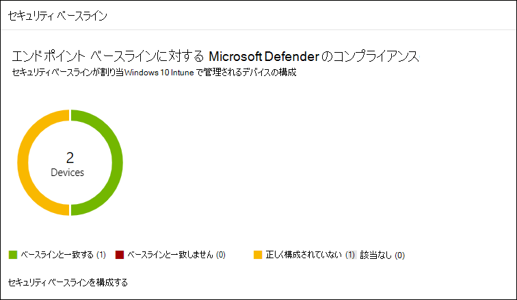
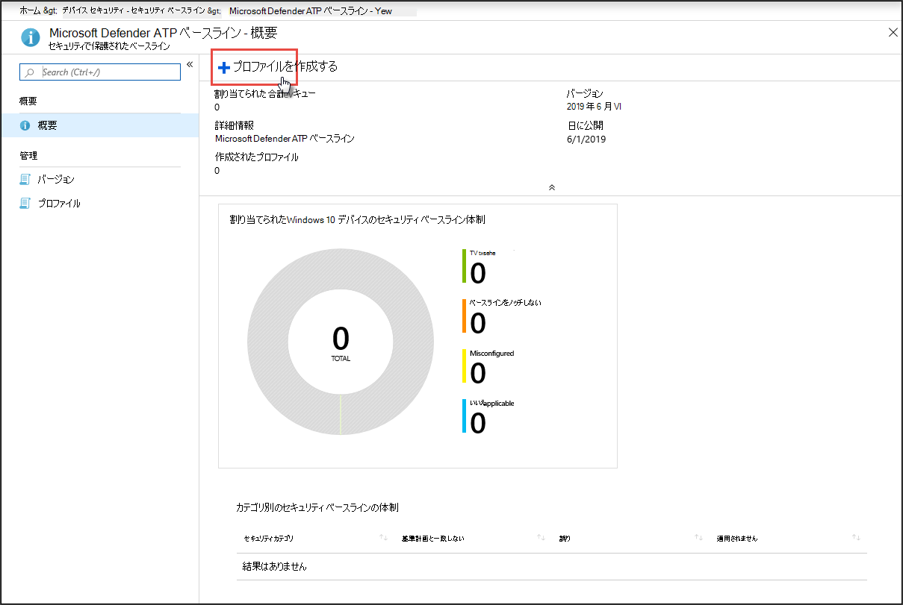

# Microsoft Defender for Endpoint セキュリティ ベースラインへのコンプライアンスを強化する

[!INCLUDE [Microsoft 365 Defender rebranding](../../includes/microsoft-defender.md)]

**適用対象:**
- [Microsoft Defender for Endpoint](https://go.microsoft.com/fwlink/p/?linkid=2154037)
- [Microsoft 365 Defender](https://go.microsoft.com/fwlink/?linkid=2118804)

> Defender for Endpoint を試す場合は、 [無料試用版にサインアップしてください。](https://signup.microsoft.com/create-account/signup?products=7f379fee-c4f9-4278-b0a1-e4c8c2fcdf7e&ru=https://aka.ms/MDEp2OpenTrial?ocid=docs-wdatp-onboardconfigure-abovefoldlink)

セキュリティ ベースラインは、セキュリティ専門家とシステム管理者の専門家の両方からのガイダンスに従ってセキュリティ機能がWindowsします。 展開すると、Defender for Endpoint セキュリティ ベースラインは、最適な保護を提供するために Defender for Endpoint セキュリティ コントロールを設定します。

構成プロファイルを使用して Intune でセキュリティ基準がどのように割り当てられているかについて理解するには、この [FAQ を参照してください](/intune/security-baselines#q--a)。

セキュリティ 基準へのコンプライアンスを展開して追跡する前に、次の方法を実行します。

- [Intune 管理にデバイスを登録する](configure-machines.md#enroll-devices-to-intune-management)
- [必要なアクセス許可を持っている必要があります。](configure-machines.md#obtain-required-permissions)

## Microsoft Defender for Endpoint と Intune のセキュリティ ベースラインWindows比較する

Windows Intune のセキュリティ ベースラインには、ブラウザー設定、PowerShell 設定、Microsoft Defender ウイルス対策 などの一部のセキュリティ機能の設定など、Windows を実行しているデバイスを安全に構成するために必要な、一連の推奨設定が提供されています。 これに対し、Defender for Endpoint ベースラインには、エンドポイント検出と応答 (EDR) の設定、Windows Intune のセキュリティ ベースラインにある設定など、Defender for Endpoint スタック内のすべてのセキュリティ コントロールを最適化する設定が用意されています。 各ベースラインの詳細については、以下を参照してください。

- [Windows Intune のセキュリティ基準設定の詳細](/intune/security-baseline-settings-windows)
- [Intune のエンドポイント基準設定用 Microsoft Defender](/intune/security-baseline-settings-defender-atp)

理想的には、Defender for Endpoint にオンボードされたデバイスは、Windows を最初にセキュリティで保護するための Windows Intune セキュリティ ベースラインと、Defender for Endpoint セキュリティ コントロールを最適に構成するために上に層化された Defender for Endpoint セキュリティ ベースラインの両方を展開します。 リスクと脅威に関する最新のデータを利用し、ベースラインの進化に伴う競合を最小限に抑えるために、リリース後すぐにすべての製品に最新バージョンのベースラインを適用してください。

> [!NOTE]
> Defender for Endpoint セキュリティ ベースラインは物理デバイス用に最適化されています。現在、仮想マシン (VM) または VDI エンドポイントでの使用は推奨されていません。 一部の基準設定は、仮想化環境でのリモート 対話型セッションに影響を与える可能性があります。

## Defender for Endpoint セキュリティ ベースラインへのコンプライアンスを監視する

デバイス **構成管理の** セキュリティ 基準カードは、Defender for Endpoint セキュリティ ベースラインが割り当てられているWindows 10デバイス全体のコンプライアンスの概要を示します。

*Defender for Endpoint セキュリティ ベースラインへの準拠を示すカード*

各デバイスには、次のいずれかの状態の種類が与えられます。

- **基準と一致**: デバイスの設定は、基準計画のすべての設定と一致します。
- **ベースラインと一致しない**: 少なくとも 1 つのデバイス設定がベースラインと一致しません。
- **正しく構成されていません**: 少なくとも 1 つの基準設定がデバイスで適切に構成されていないので、競合、エラー、または保留中の状態です。
- **該当なし**: 少なくとも 1 つの基準計画設定がデバイスに適用できません。

特定のデバイスを確認するには、カード **の [セキュリティ 基準計画の構成** ] を選択します。 これにより、Intune デバイス管理にアクセスできます。 そこから、[デバイスの **状態]** を選択して、デバイスの名前と状態を指定します。

> [!NOTE]
> デバイス構成管理ページに表示される集計データと、Intune の概要画面に表示されるデータに不一致が発生する可能性があります。

## Microsoft Defender for Endpoint セキュリティ ベースラインの確認と割り当て

デバイス構成管理は、Microsoft Defender for Endpoint セキュリティ ベースラインWindows 10割り当てられているデバイスの基準準拠のみを監視します。 ベースラインを簡単に確認し、Intune デバイス管理のデバイスに割り当てできます。

1. [ **セキュリティ ベースライン カードのセキュリティ** 基準を構成する] **を選択** して、Intune デバイス管理に移動します。 ベースラインコンプライアンスの同様の概要が表示されます。

   > [!TIP]
   > または **、Microsoft Defender ATP** ベースラインのすべてのサービス > Intune > デバイス セキュリティ > セキュリティ ベースライン> Microsoft Azure ポータルの Defender for Endpoint セキュリティ ベースラインに移動することもできます。

2. 新しいプロファイルを作成します。

    
   *Intune の Microsoft Defender for Endpoint セキュリティ ベースラインの概要*

3. プロファイルの作成中に、基準計画の特定の設定を確認および調整できます。

    
   *Intune でのプロファイル作成時のセキュリティ基準オプション*

4. プロファイルを適切なデバイス グループに割り当てる。

    
   *Intune でのセキュリティ 基準プロファイルの割り当て*

5. プロファイルを作成して保存し、割り当てられたデバイス グループに展開します。

    
   *Intune でのセキュリティ ベースライン プロファイルの作成*

> [!TIP]
> Intune のセキュリティ ベースラインは、デバイスを包括的に保護して保護するための便利な方法を提供します。 [Intune のセキュリティ基準について詳しくは、次のページをご覧ください](/intune/security-baselines)。

> Microsoft Defender ATP を試してみたいですか? [無料試用版にサインアップしてください。](https://signup.microsoft.com/create-account/signup?products=7f379fee-c4f9-4278-b0a1-e4c8c2fcdf7e&ru=https://aka.ms/MDEp2OpenTrial?ocid=docs-wdatp-onboardconfigure-belowfoldlink)

## 関連トピック

- [デバイスが正しく構成されていることを確認する](configure-machines.md)
- [Microsoft Defender for Endpoint にオンボードされているデバイスを取得する](configure-machines-onboarding.md)
- [ASR ルールの展開と検出を最適化する](configure-machines-asr.md)
