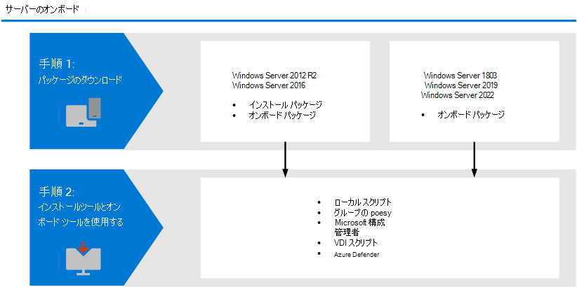
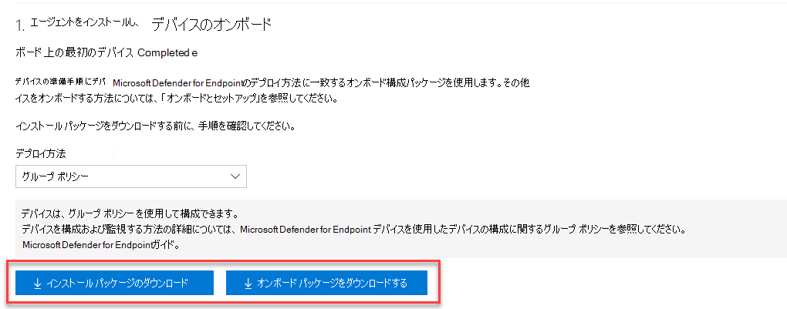

# <a name="onboard-windows-servers-to-the-microsoft-defender-for-endpoint-service"></a>Microsoft Defender Windowsエンドポイント サービスへのオンボード サーバー

[!INCLUDE [Microsoft 365 Defender rebranding](../../includes/microsoft-defender.md)]

**適用対象:**

- Windows Server 2012 R2
- Windows Server 2016
- Windows サーバー Semi-Annual Enterprise チャネル
- Windows Server 2019 以降
- Windows Server 2019 Core Edition
- Windows Server 2022
- [Microsoft Defender for Endpoint Plan 2](https://go.microsoft.com/fwlink/p/?linkid=2154037)

[!include[Prerelease information](../../includes/prerelease.md)]

> Defender for Endpoint を試す場合は、 [無料試用版にサインアップしてください。](https://signup.microsoft.com/create-account/signup?products=7f379fee-c4f9-4278-b0a1-e4c8c2fcdf7e&ru=https://aka.ms/MDEp2OpenTrial?ocid=docs-wdatp-configserver-abovefoldlink)

Defender for Endpoint では、サポートを拡張して、サーバー オペレーティング Windowsも含まれます。 このサポートは、高度な攻撃の検出と調査機能を、Microsoft 365 Defender提供します。 サーバーのWindowsは、サーバーアクティビティ、カーネル攻撃とメモリ攻撃検出の範囲に関するより深い洞察を提供し、応答アクションを有効にします。

このトピックでは、特定のサーバーを Microsoft Defender for Endpoint Windowsオンボードする方法について説明します。

サーバーのベースラインをダウンロードして使用するWindows セキュリティについては、「Windowsベースライン[」を参照Windows セキュリティしてください](/windows/device-security/windows-security-baselines)。

## <a name="windows-server-onboarding-overview"></a>Windowsサーバーオンボーディングの概要

サーバーを正常にオンボードするには、次の一般的な手順を完了する必要があります。



**Windows Server 2012 R2 と Windows Server 2016 (プレビュー)**

- インストール パッケージとオンボーディング パッケージのダウンロード
- インストール パッケージの適用
- 対応するツールのオンボーディング手順に従う

**Windows サーバー Semi-Annual Enterprise チャネルと Windows サーバー 2019**

- オンボーディング パッケージをダウンロードする
- 対応するツールのオンボーディング手順に従う

>[!IMPORTANT]
>Microsoft Defender for Endpoint Server SKU を購入する資格を得るには、Windows E5/A5、Microsoft 365 E5/A5、または Microsoft 365 E5 Security サブスクリプション ライセンスを組み合わせて購入している必要があります。  ライセンスの詳細については、「製品条項」 [を参照してください](https://www.microsoft.com/licensing/terms/productoffering/MicrosoftDefenderforEndpointServer/all)。  


### <a name="new-windows-server-2012-r2-and-2016-functionality-in-the-modern-unified-solution-preview"></a>最新Windows Server 2012ソリューションの R2 および 2016 の新機能 (プレビュー)

R2 および R2 および Windows Server 2012の以前Windows Server 2016実装では、Microsoft Monitoring Agent (MMA) の使用が必要でした。

新しい統合ソリューション パッケージを使用すると、依存関係とインストール手順を削除することで、サーバーのオンボードが容易になります。 さらに、この統合ソリューション パッケージには、次の大きな改善点が付属しています。

- [Microsoft Defender ウイルス対策](/microsoft-365/security/defender-endpoint/microsoft-defender-antivirus-windows) R2 [の次世代](/microsoft-365/security/defender-endpoint/next-generation-protection)保護Windows Server 2012する
- [攻撃表面の縮小 (ASR) ルール](/microsoft-365/security/defender-endpoint/attack-surface-reduction-rules)
- [ネットワーク保護](/microsoft-365/security/defender-endpoint/network-protection)
- [フォルダー アクセスの制御](/microsoft-365/security/defender-endpoint/controlled-folders)
- [望ましくない可能性があるアプリケーション (PUA) のブロック](/microsoft-365/security/defender-endpoint/detect-block-potentially-unwanted-apps-microsoft-defender-antivirus)
- [検出機能の強化](/microsoft-365/security/defender-endpoint/overview-endpoint-detection-response)
- [デバイスとファイルでの応答](/microsoft-365/security/defender-endpoint/respond-machine-alerts) 機能の [拡張](/microsoft-365/security/defender-endpoint/respond-file-alerts)
- [EDRモードでの設定](/microsoft-365/security/defender-endpoint/edr-in-block-mode)
- [ライブ応答](/microsoft-365/security/defender-endpoint/live-response)
- [自動調査と応答 (AIR)](/microsoft-365/security/defender-endpoint/automated-investigations)
- [タンパープロテクション](/microsoft-365/security/defender-endpoint/prevent-changes-to-security-settings-with-tamper-protection)

以前に MMA を使用してサーバーをオンボードした場合は、「 [Server migration](server-migration.md) 」のガイダンスに従って新しいソリューションに移行します。

>[!NOTE]
>R2 Windows Server 2012 と Windows Server 2016 のオンボーディングのこの方法はプレビュー中ですが、以前のオンボーディング方法を引き続き使用するには、Microsoft Monitoring Agent (MMA) を使用します。 詳細については、「 [MMA を使用してエンドポイントをインストールして構成する」を参照してください](onboard-downlevel.md#install-and-configure-microsoft-monitoring-agent-mma)。

#### <a name="known-issues-and-limitations-on-the-new-unified-solution-package-for-windows-server-2012-r2-and-2016"></a>R2 および 2016 の新しい統合ソリューション パッケージに関する既知Windows Server 2012制限事項

次の詳細は、R2 および 2016 の新しい統合ソリューション パッケージWindows Server 2012適用されます。

- 「プロキシ サーバー内の [Microsoft Defender for Endpoint サービス URL](/microsoft-365/security/defender-endpoint/configure-proxy-internet?enable-access-to-microsoft-defender-for-endpoint-service-urls-in-the-proxy-server) へのアクセスを有効にする」で指定されている接続要件が満たされている必要があります。 これらは、サーバー 2019 Windowsと同じです。
- 以前は、OMS/Log Analytics ゲートウェイが Defender クラウド サービスへの接続を提供するために、Windows Server 2016 以下の Microsoft Monitoring Agent (MMA) を使用する必要がありました。 Windows Server 2019、Windows Server 2022、Windows 10 の Microsoft Defender for Endpoint のような新しいソリューションは、このゲートウェイをサポートしません。
- このWindows Server 2016、インストールMicrosoft Defender ウイルス対策アクティブで最新の状態に設定されていることを確認します。 Update を使用して、最新のプラットフォーム バージョンをダウンロードWindowsできます。 または、Microsoft Update Catalog または MMPC から更新[](https://www.catalog.update.microsoft.com/Search.aspx?q=KB4052623)プログラム パッケージを手動で[ダウンロードします](https://go.microsoft.com/fwlink/?linkid=870379&arch=x64)。  
- R2 Windows Server 2012では、ユーザー インターフェイスがMicrosoft Defender ウイルス対策。 さらに、ユーザー インターフェイスは、Windows Server 2016操作のみを許可します。 デバイスに対してローカルで操作を実行するには、「PowerShell、WMI、およびデバイスを使用して [Microsoft Defender for Endpoint ](/microsoft-365/security/defender-endpoint/manage-mde-post-migration-other-tools)を管理する」を参照MPCmdRun.exe。 その結果、ユーザーの操作に特に依存する機能 (ユーザーに決定の指示や特定のタスクの実行を求めるメッセージが表示される場所など) は、期待した通りに機能しない可能性があります。 保護機能に影響を与える可能性がある場合は、ユーザー インターフェイスを無効にするか、無効にするか、管理サーバーでユーザーの操作を必要としません。
- すべての攻撃表面縮小ルールがすべてのオペレーティング システムで使用できる場合があります。 「 [攻撃表面の縮小 (ASR) ルール」を参照してください](/microsoft-365/security/defender-endpoint/attack-surface-reduction-rules)。
- ネットワーク保護 [を有効にするには、](/microsoft-365/security/defender-endpoint/network-protection)追加の構成が必要です。
  - `Set-MpPreference -EnableNetworkProtection Enabled`
  - `Set-MpPreference -AllowNetworkProtectionOnWinServer 1`
  - `Set-MpPreference -AllowNetworkProtectionDownLevel 1`
  - `Set-MpPreference -AllowDatagramProcessingOnWinServer 1`

  さらに、ネットワーク トラフィックが多いコンピューターでは、この機能を広く有効にする前に、環境でのパフォーマンス テストを強くお勧めします。 追加のリソース消費を考慮する必要がある場合があります。
- R2 Windows Server 2012、ネットワーク イベントがタイムラインに設定されない場合があります。 この問題には、[2021 年 10 月 12 日の月次ロールアップ (KB5006714)](https://support.microsoft.com/topic/october-12-2021-kb5006714-monthly-rollup-4dc4a2cd-677c-477b-8079-dcfef2bda09e) の一部としてWindows更新プログラムが必要です。
- オペレーティング システムのアップグレードはサポートされていません。 アップグレードする前にオフボードをアンインストールします。
- サーバー の役割の自動 *除外* は R2 ではWindows Server 2012されませんが、オペレーティング システム ファイルの組み込みの除外はサポートされていません。 除外の追加の詳細については、「現在サポートされているバージョンのコンピューターを実行している Enterprise コンピューターのウイルス スキャンの推奨事項」を[参照](https://support.microsoft.com/topic/virus-scanning-recommendations-for-enterprise-computers-that-are-running-currently-supported-versions-of-windows-kb822158-c067a732-f24a-9079-d240-3733e39b40bc)Windows。


<a name="integration-with-azure-defender"></a>

## <a name="integration-with-microsoft-defender-for-cloud"></a>Microsoft Defender for Cloudとの統合

Microsoft Defender for Endpoint は、Microsoft Defender for Cloud とシームレスに統合されます。 サーバーを自動的にオンボードし、Azure Defender によって監視されるサーバーを Defender for Endpoint に表示し、Microsoft Defender for Cloud のお客様として詳細な調査を行います。

詳細については、「 [Microsoft Defender for Cloud との統合」を参照してください](azure-server-integration.md)。

> [!NOTE]
> 最新Windows Server 2012統合ソリューション プレビューを実行している R2 および 2016 の場合、アラートと自動展開用のサーバー用 Microsoft Defender for Cloud/ Microsoft Defender との統合はまだ利用できません。 これらのコンピューターに新しいソリューションをインストールすることもできますが、Microsoft Defender for Cloud にはアラートは表示されません。

> [!NOTE]
> - Microsoft Defender for server と Microsoft Defender for Endpoint の統合は、Windows Server 2022、[Windows Server 2019、Windows Virtual Desktop (WVD)](/azure/security-center/release-notes#microsoft-defender-for-endpoint-integration-with-azure-defender-now-supports-windows-server-2019-and-windows-10-virtual-desktop-wvd-in-preview) をサポートするために拡張されました。
> - この統合を利用したサーバー エンドポイントの監視は、ユーザーのOffice 365 GCCされています。

## <a name="windows-server-2012-r2-and-windows-server-2016"></a>Windows Server 2012 R2 と Windows Server 2016

> [!NOTE]
> R2 Windows Server 2012 と Windows Server 2016 のオンボーディングのこの方法はプレビュー中ですが、以前のオンボーディング方法を引き続き使用するには、Microsoft Monitoring Agent (MMA) を使用します。 詳細については、「 [MMA を使用してエンドポイントをインストールして構成する」を参照してください](onboard-downlevel.md#install-and-configure-microsoft-monitoring-agent-mma)。

### <a name="prerequisites"></a>前提条件

**R2 のWindows Server 2012前提条件**

最新の月次ロールアップ パッケージを使用してコンピューターを完全 [](https://support.microsoft.com/topic/october-12-2021-kb5006714-monthly-rollup-4dc4a2cd-677c-477b-8079-dcfef2bda09e)に更新した場合、**追加の前提条件** はありません。


インストーラー パッケージは、次のコンポーネントが更新プログラムを介して既にインストールされていることを確認します。

- [カスタマー エクスペリエンスと診断テレメトリの更新](https://support.microsoft.com/help/3080149/update-for-customer-experience-and-diagnostic-telemetry)
- [ユニバーサル C ランタイムの更新プログラム (Windows](https://support.microsoft.com/topic/update-for-universal-c-runtime-in-windows-c0514201-7fe6-95a3-b0a5-287930f3560c)

**サーバーの前提条件Windows Server 2016** 

最新の累積的な更新プログラム (LCU) を使用してコンピューターを完全に更新する以外に、Microsoft Defender ウイルス対策がインストールされ、アクティブで最新の状態になされていることを確認します。 Update を使用して、最新のプラットフォーム バージョンをダウンロードWindowsできます。 または、Microsoft Update Catalog または MMPC から更新[](https://www.catalog.update.microsoft.com/Search.aspx?q=KB4052623)プログラム パッケージを手動で[ダウンロードします](https://go.microsoft.com/fwlink/?linkid=870379&arch=x64)。 

> [!NOTE]
> 4.10 以降のバージョン番号を持つ組み込みバージョンの Windows Defender を最新のプラットフォームに正常に更新するには、サービス スタック更新プログラムと、2018 年 9 月 20 日以降の最新累積的な更新プログラム (LCU) が適用されている必要があります。KB4457127 (OS ビルド 14393.2515)。

**R2 および 2016 の Microsoft Defender for Endpoint Windows Server 2012更新プログラム パッケージ**

EDR センサー コンポーネントの製品の定期的な改善と修正を受け取Windows [KB5005292](https://go.microsoft.com/fwlink/?linkid=2168277) の更新プログラムが適用または承認されます。 さらに、保護コンポーネントを更新し続ける場合は、「更新プログラムの管理と基準[Microsoft Defender ウイルス対策適用する」を参照してください](/microsoft-365/security/defender-endpoint/manage-updates-baselines-microsoft-defender-antivirus#monthly-platform-and-engine-versions)。

### <a name="onboarding-steps-summary"></a>オンボーディングの手順の概要

- 手順 1: [インストール パッケージとオンボーディング パッケージをダウンロードする](#step-1-download-installation-and-onboarding-packages)
- 手順 2: [インストールパッケージとオンボーディング パッケージを適用する](#step-2-apply-the-installation-and-onboarding-package)
- 手順 3: [オンボーディングの手順を完了する](#step-3-complete-the-onboarding-steps) 


### <a name="step-1-download-installation-and-onboarding-packages"></a>手順 1: インストール パッケージとオンボーディング パッケージをダウンロードする

インストール パッケージとオンボーディング パッケージの両方 **をポータル** から **ダウンロード** する必要があります。

> [!div class="mx-imgBorder"]
> 


   > [!NOTE]
   > サーバー 2012R2 Windowsでは、Microsoft Defender ウイルス対策 パッケージによってインストールされ、パッシブ モードに設定しない限りアクティブになります。 このWindows Server 2016、Microsoft Defender ウイルス対策を実行する前に、最初に機能 ([「MDE](/microsoft-365/security/defender-endpoint/switch-to-mde-phase-2#re-enable-microsoft-defender-antivirus-on-windows-server-2016) に切り替える」を参照) としてインストールし、完全に更新する必要があります。
   > 
   > Microsoft 以外のマルウェア対策ソリューションを実行している場合は、インストール前に Microsoft Defender ウイルス対策 の除外を ([Defender プロセス] タブの Microsoft [Defender プロセス](https://download.microsoft.com/download/8/a/5/8a51eee5-cd02-431c-9d78-a58b7f77c070/mde-urls.xlsx)のこのリストから) Microsoft 以外のソリューションに追加してください。  また、Microsoft 以外のセキュリティ ソリューションを Defender ウイルス対策除外リストに追加する方法も推奨されます。


インストール **パッケージには、** Microsoft Defender for Endpoint エージェントをインストールする MSI ファイルが含まれています。

オン **ボーディング パッケージには、** 次のファイルが含まれています。

- `OptionalParamsPolicy` - サンプル コレクションを有効にする設定が含まれている
- `WindowsDefenderATPOnboardingScript.cmd` - オンボーディング スクリプトが含まれている

パッケージをダウンロードするには、次の手順を使用します。 

1. [Microsoft 365 Defender] で、[デバイス管理 **設定 >オンボーディング>移動します**。

2. [**R2 Windows Server 2012 2016] を選択します**。

3. [ **インストール パッケージのダウンロード] を** 選択し、インストール ファイル.msiします。 
 
4. [ **オンボード パッケージのダウンロード] を選択** し、.zip保存します。

5. インストール パッケージをインストールするには、任意のオプションを使用してインストール パッケージをインストールMicrosoft Defender ウイルス対策。 インストールには、管理アクセス許可が必要です。


### <a name="step-2-apply-the-installation-and-onboarding-package"></a>手順 2: インストールパッケージとオンボーディング パッケージを適用する
この手順では、デバイスを Microsoft Defender for Endpoint クラウド環境にオンボーディングする前に必要な予防および検出コンポーネントをインストールし、オンボーディング用にコンピューターを準備します。 すべての前提条件 [が満](#prerequisites) たされていることを確認します。 

   > [!NOTE]
   > Microsoft Defender ウイルス対策インストールされ、パッシブ モードに設定しない限りアクティブになります。 

#### <a name="options-to-install-the-microsoft-defender-for-endpoint-packages"></a>Microsoft Defender for Endpoint パッケージをインストールするオプション

前のセクションでは、インストール パッケージをダウンロードしました。 インストール パッケージには、すべての Microsoft Defender for Endpoint コンポーネントのインストーラーが含まれています。 

エージェントをインストールするには、次のオプションを使用できます。
- [コマンド ラインを使用してインストールする](#install-microsoft-defender-for-endpoint-using-the-command-line)
- [スクリプトを使用してインストールする](#install-microsoft-defender-for-endpoint-using-a-script)
- [グループ ポリシーを使用してインストール パッケージとオンボーディング パッケージを適用する](#apply-the-microsoft-defender-for-endpoint-installation-and-onboarding-packages-using-group-policy)

##### <a name="install-microsoft-defender-for-endpoint-using-the-command-line"></a>コマンド ラインを使用して Microsoft Defender For Endpoint をインストールする
前の手順のインストール パッケージを使用して、Microsoft Defender for Endpoint をインストールします。 


次のコマンドを実行して、Microsoft Defender for Endpoint をインストールします。

```console
Msiexec /i md4ws.msi /quiet
```

アンインストールするには、適切なオフボード スクリプトを使用して、コンピューターが最初にオフボードに設定されている必要があります。 次に、コントロール パネル の \> [プログラム] \> プログラムと機能を使用してアンインストールを実行します。

または、次のアンインストール コマンドを実行して、Microsoft Defender for Endpoint をアンインストールします。

```console
Msiexec /x md4ws.msi /quiet
```

上記のコマンドを正常に実行するには、インストールに使用したパッケージと同じパッケージを使用する必要があります。

スイッチ `/quiet` は、すべての通知を非表示にします。

> [!NOTE]
> Microsoft Defender ウイルス対策パッシブ モードには自動的には入らない。 Microsoft 以外のウイルス対策/マルウェア対策Microsoft Defender ウイルス対策を実行している場合は、パッシブ モードで実行するアプリケーションを設定できます。 コマンド ライン インストールの場合、`FORCEPASSIVEMODE=1`オプションでは、干渉を回避するために、Microsoft Defender ウイルス対策 コンポーネントをパッシブ モードに直ちに設定します。 次に、EDR Block のような機能をサポートするためにオンボーディング後に Defender ウイルス対策がパッシブ モードに維持されるのを確認するには、"ForceDefenderPassiveMode" レジストリ キーを設定します。

サーバーのWindowsは、サーバーアクティビティ、カーネル攻撃とメモリ攻撃検出の範囲に関するより深い洞察を提供し、応答アクションを有効にします。

##### <a name="install-microsoft-defender-for-endpoint-using-a-script"></a>スクリプトを使用して Microsoft Defender for Endpoint をインストールする

インストーラー スクリプトを使用すると [、](server-migration.md#installer-script) インストール、アンインストール、オンボーディングを自動化できます。 詳細については、次のセクションの手順を参照して、グループ ポリシーでスクリプトを使用します。

##### <a name="apply-the-microsoft-defender-for-endpoint-installation-and-onboarding-packages-using-group-policy"></a>グループ ポリシーを使用して Microsoft Defender for Endpoint のインストールおよびオンボーディング パッケージを適用する

1. グループ ポリシーを作成します。 <br> グループ ポリシー [管理コンソール](/internet-explorer/ie11-deploy-guide/group-policy-and-group-policy-mgmt-console-ie11) (GPMC) を開き、構成する **グループ** ポリシー オブジェクトを右クリックし、[新規] をクリック **します**。 表示されるダイアログ ボックスに新しい GPO の名前を入力し、[OK] をクリック **します**。

2. グループ ポリシー [管理コンソール](/internet-explorer/ie11-deploy-guide/group-policy-and-group-policy-mgmt-console-ie11) (GPMC) を開き、構成するグループ ポリシー オブジェクト (GPO) を右クリックし、[編集] をクリック **します**。

3. グループ ポリシー **管理エディターで、[****コンピューターの構成**] 、[基本設定] の順に移動し、[コントロール パネルの設定 **] に移動します**。

4. [スケジュールされたタスク **] を右クリック** し、[新規] をポイント **し、[イ** ミディエイト タスク] (少なくとも **7) Windowsクリックします**。

5. 開く **[タスク]** ウィンドウで、[全般] タブ **に移動** します。[セキュリティ **オプション] で[****ユーザーまたはグループの変更] をクリックし、「** SYSTEM」と入力し、[名前の確認] をクリックしてから **[OK****] を** クリックします。 NT AUTHORITY\SYSTEM は、タスクが実行されるユーザー アカウントとして表示されます。

6. [ **ユーザーがログオンするかどうかを実行する] を選択し** 、[最高の特権で実行する **] チェック ボックスを** オンにします。

7. [名前] フィールドに、スケジュールされたタスクの適切な名前 (Defender for Endpoint Deployment など) を入力します。

8. [操作] タブ **に移動し** 、[新規] **を選択します。** [アクション **] フィールドで [プログラム** の開始] が選択 **されている必要** があります。 インストーラー [スクリプトはインストール](server-migration.md#installer-script) を処理し、インストールが完了した直後にオンボーディング 手順を実行します。 [ *C:\Windows\System32\WindowsPowerShell\v1.0\powershell.exe* を選択し、引数を指定します。

    ```console
     -ExecutionPolicy RemoteSigned \\servername-or-dfs-space\share-name\install.ps1 -OnboardingScript \\servername-or-dfs-space\share-name\windowsdefenderatponboardingscript.cmd
    ```  

     >[!NOTE]
    >推奨される実行ポリシー設定はです `Allsigned`。 この場合、スクリプトがエンドポイントで SYSTEM として実行されている場合は、スクリプトの署名証明書をローカル コンピューター信頼済み発行元ストアにインポートする必要があります。

    共有 \\install.ps1ファイルのファイル サーバーの完全修飾ドメイン名 (FQDN) を使用して、servername-or-dfs-space\share-name を UNC パス *に置き換* えてください。 インストーラー パッケージはmd4ws.msi同じディレクトリに配置する必要があります。  また、UNC パスのアクセス許可によって、プラットフォームをインストールしているコンピューター アカウントへの読み取りアクセスが許可されます。

   

    Microsoft 以外のマルウェア対策Microsoft Defender ウイルス対策と共に存在するシナリオでは、インストール時にパッシブ モードを設定する $Passive パラメーターを追加します。

9. [ **OK] を選択** し、開いている GPMC ウィンドウを閉じます。

10. GPO を組織単位 (OU) にリンクするには、右クリックして[既存の GPO のリンク **] を選択します**。 表示されるダイアログ ボックスで、リンクするグループ ポリシー オブジェクトを選択します。 [**OK**] をクリックします。

その他の構成設定については、「サンプル コレクション設定 [の構成」および](configure-endpoints-gp.md#configure-sample-collection-settings) 「その他の推奨 [される構成設定」を参照してください](configure-endpoints-gp.md#other-recommended-configuration-settings)。

### <a name="step-3-complete-the-onboarding-steps"></a>手順 3: オンボーディングの手順を完了する

次の手順は、サードパーティのマルウェア対策ソリューションを使用している場合にのみ適用されます。 パッシブ モードの設定に次のMicrosoft Defender ウイルス対策する必要があります。 正しく構成されていることを確認します。

1. 次のレジストリ エントリを設定します。
    - パス: `HKLM\SOFTWARE\Policies\Microsoft\Windows Advanced Threat Protection`
    - 名前: `ForceDefenderPassiveMode`
    - 種類`REG_DWORD`
    - 値: `1`

2. 次の PowerShell コマンドを実行して、パッシブ モードが構成されていることを確認します。

    ```powershell
    Get-WinEvent -FilterHashtable @{ProviderName="Microsoft-Windows-Sense" ;ID=84}
    ```

3. パッシブ モード イベントを含む最近のイベントが見つかったこと確認します。

    

> [!IMPORTANT]
>
> - Microsoft Defender for Cloud を使用してサーバーを監視すると、Defender for Endpoint テナントが自動的に作成されます (米国のユーザーの場合は米国、欧州ユーザーの場合は EU、英国では英国ユーザー)。
Defender for Endpoint によって収集されたデータは、プロビジョニング中に特定されたテナントの地理的位置に格納されます。
> - Microsoft Defender for Cloud を使用する前に Defender for Endpoint を使用する場合、後で Microsoft Defender for Cloud と統合した場合でも、テナントの作成時に指定した場所にデータが保存されます。
> - 構成が完了すると、データの保存場所を変更できません。 データを別の場所に移動する必要がある場合は、Microsoft サポートに問い合わせ、テナントをリセットする必要があります。
> - 現在、Windows Server 2019 および Windows Server 2022 Microsoft エンドポイント マネージャーオンボード パッケージがスクリプトを出荷しています。 Configuration Manager でスクリプトを展開する方法の詳細については、「Configuration Manager の [パッケージとプログラム」を参照してください](/configmgr/apps/deploy-use/packages-and-programs)。
> - ローカル スクリプトは概念実証に適していますが、実稼働展開には使用できません。 実稼働展開の場合は、グループ ポリシーまたはグループ ポリシーを使用Microsoft Endpoint Configuration Manager。


## <a name="windows-server-semi-annual-enterprise-channel-and-windows-server-2019-and-windows-server-2022"></a>Windows サーバー Semi-Annual Enterprise チャネルと Windows Server 2019 および Windows Server 2022

Windows Server 2019 および Windows Server 2022 Microsoft エンドポイント マネージャーのオンボーディング パッケージは、現在スクリプトを出荷しています。 Configuration Manager でスクリプトを展開する方法の詳細については、「Configuration Manager の [パッケージとプログラム」を参照してください](/configmgr/apps/deploy-use/packages-and-programs)。

### <a name="download-package"></a>パッケージのダウンロード

1. [Microsoft 365 Defender] で、[デバイス管理 **設定 >オンボーディング>移動します**。

2. [**サーバー 1803 Windows 2019] を選択します**。

3. [パッケージ **のダウンロード] を選択します**。 ファイルとして保存WindowsDefenderATPOnboardingPackage.zip。

4. 「オンボーディングの手順を完了 [する」セクションに示されている手順に従](#step-3-complete-the-onboarding-steps) います。


## <a name="verify-the-onboarding-and-installation"></a>オンボーディングとインストールを確認する

エンドポイントのMicrosoft Defender ウイルス対策 Microsoft Defender が実行されているのを確認します。

## <a name="run-a-detection-test-to-verify-onboarding"></a>検出テストを実行してオンボーディングを確認する

デバイスのオンボード後、検出テストを実行して、デバイスがサービスに適切にオンボードされていることを確認できます。 詳細については、「新しくオンボード [された Microsoft Defender for Endpoint デバイスで検出テストを実行する」を参照してください](run-detection-test.md)。

> [!NOTE]
> このMicrosoft Defender ウイルス対策は必要ありませんが、お勧めします。 別のウイルス対策ベンダー製品がプライマリ エンドポイント保護ソリューションである場合は、パッシブ モードで Defender ウイルス対策を実行できます。 パッシブ モードがオンの状態を確認できるのは、Microsoft Defender for Endpoint センサー (SENSE) が実行されている状態を確認した後のみです。

1. 次のコマンドを実行して、インストールMicrosoft Defender ウイルス対策確認します。

    >[!NOTE]
    >この確認手順は、アクティブなマルウェア対策ソリューションとしてMicrosoft Defender ウイルス対策場合にのみ必要です。

    `sc.exe query Windefend`


    結果が '指定されたサービスがインストール済みサービスとして存在しない' の場合は、そのサービスをインストールするMicrosoft Defender ウイルス対策。 


    グループ ポリシーを使用して Windows サーバー上の Microsoft Defender ウイルス対策 を構成および管理する方法については、「グループ ポリシー設定を使用してグループ ポリシーを構成および管理する」を参照[Microsoft Defender ウイルス対策。](use-group-policy-microsoft-defender-antivirus.md)

2. 次のコマンドを実行して、Microsoft Defender for Endpoint が実行されているのを確認します。

    `sc.exe query sense`

    結果は、実行中を示す必要があります。 オンボーディングで問題が発生した場合は、「オンボーディングのトラブルシューティング [」を参照してください](troubleshoot-onboarding.md)。

## <a name="run-a-detection-test"></a>検出テストを実行する

「新しくオンボード[](run-detection-test.md)されたデバイスで検出テストを実行する」の手順に従って、サーバーが Defender for the Endpoint Service に対して報告を行っているのを確認します。

## <a name="next-steps"></a>次の手順

デバイスをサービスに正常にオンボーディングした後、Microsoft Defender for Endpoint の個々のコンポーネントを構成する必要があります。 さまざまなコンポーネント [を有効にする](prepare-deployment.md#adoption-order) 方法について説明する導入の順序に従います。

## <a name="offboard-windows-servers"></a>オフボード Windows サーバー

Windows 10 クライアント デバイスで使用できるのと同じ方法で、Windows Server 2012 R2、Windows Server 2016、Windows Server (SAC)、Windows Server 2019、Windows Server 2019 Core edition のオフボードを使用できます。

- [グループ ポリシーを使用してデバイスをオフボードする](configure-endpoints-gp.md#offboard-devices-using-group-policy)
- [Configuration Manager を使用したオフボード デバイス](configure-endpoints-sccm.md#offboard-devices-using-configuration-manager)
- [モバイル デバイス管理ツールを使用したオフボードデバイスと監視デバイス](configure-endpoints-mdm.md#offboard-and-monitor-devices-using-mobile-device-management-tools)
- [ローカル スクリプトを使用してデバイスをオフボードする](configure-endpoints-script.md#offboard-devices-using-a-local-script)

他のサーバー Windowsの場合は、サービスからサーバーをオフボードWindows 2 つのオプションがあります。

- MMA エージェントのアンインストール
- Defender for Endpoint ワークスペース構成を削除する

>[!NOTE]
>*他の Windows サーバー バージョンのこれらのオフボード手順は、MMA を必要とする Windows Server 2016 および Windows Server 2012 R2 用の以前の Microsoft Defender for Endpoint を実行している場合にも適用されます。 新しい未確認ソリューションに移行する手順は、 [Microsoft Defender for Endpoint のサーバー移行シナリオにあります](/microsoft-365/security/defender-endpoint/server-migration)。

## <a name="related-topics"></a>関連項目

- [以前のバージョンの Windows をオンボードする](onboard-downlevel.md)
- [Windows 10 デバイスのオンボード](configure-endpoints.md)
- [Windows 以外のデバイスをオンボードする](configure-endpoints-non-windows.md)
- [プロキシとインターネット接続の設定を構成する](configure-proxy-internet.md)
- [新しくオンボードされた Defender for Endpoint デバイスで検出テストを実行する](run-detection-test.md)
- [Microsoft Defender for Endpoint オンボーディングの問題のトラブルシューティング](troubleshoot-onboarding.md)
