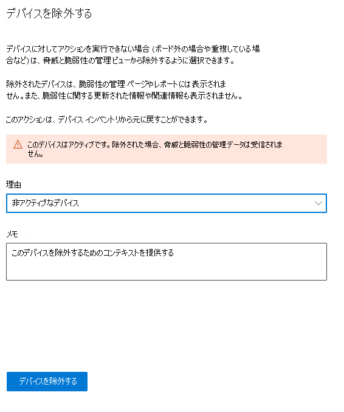
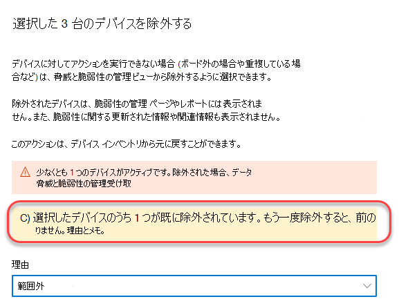
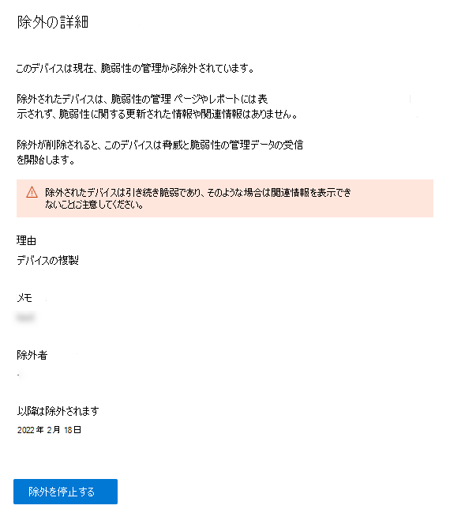

# デバイスを除外する

[!INCLUDE [Microsoft 365 Defender rebranding](../../includes/microsoft-defender.md)]

**適用対象:**

- [Microsoft Defender for Endpoint Plan 1](https://go.microsoft.com/fwlink/p/?linkid=2154037)
- [Microsoft Defender for Endpoint Plan 2](https://go.microsoft.com/fwlink/p/?linkid=2154037)
- [Microsoft 365 Defender](https://go.microsoft.com/fwlink/?linkid=2118804)

> Defender for Endpoint を試す場合は、 [無料試用版にサインアップしてください。](https://signup.microsoft.com/create-account/signup?products=7f379fee-c4f9-4278-b0a1-e4c8c2fcdf7e&ru=https://aka.ms/MDEp2OpenTrial?ocid=docs-wdatp-respondmachine-abovefoldlink)

## 脅威と脆弱性の管理からデバイスを除外する

非アクティブ、重複、または範囲外のデバイスを除外すると、アクティブなデバイスのリスクの検出と優先順位付けに集中できます。 このアクションは、除外されたデバイスが脅威と脆弱性の管理 レポートに表示されないため、より正確な脅威と脆弱性の管理露出スコアを反映するのにも役立ちます。

デバイスが除外されると、これらのデバイスにインストールされている脆弱性やインストール済みソフトウェアに関する更新された情報や関連情報を表示できなくなります。 高度な捜索では、すべての脅威と脆弱性の管理ページ、レポート、および関連テーブルに影響します。

デバイス除外機能は、脆弱性の管理 ページとレポートからデバイス データを削除しますが、デバイスはネットワークに接続されたままであり、組織のリスクになる可能性があります。 デバイスの除外はいつでもキャンセルできます。

## デバイスを除外する方法

1 つのデバイスまたは複数のデバイスを同時に除外することを選択できます。

### 1 つのデバイスを除外する

1. **[デバイス インベントリ**] ページに移動し、除外するデバイスを選択します。
2. デバイス インベントリ ページのアクション バーまたはデバイス ポップアップの [アクション] メニューから [ **除外** ] を選択します。

   ![[除外デバイス] メニュー オプションの画像。](images/exclude-devices-menu.png)

3. 理由を選択します。

    - 非アクティブなデバイス
    - デバイスの複製
    - デバイスが存在しない
    - 対象外
    - その他

4. メモを入力し、[ **デバイスの除外**] を選択します。

デバイスをデバイス ページから除外することもできます。

> [!NOTE]
> アクティブなデバイスを除外することはお勧めしません。これは、脆弱性情報を可視化しないことが特に危険であるためです。 デバイスがアクティブで、除外しようとすると、アクティブなデバイスを除外するかどうかを確認する警告メッセージと確認ポップアップが表示されます。

デバイスが脆弱性の管理ビューとデータから完全に除外されるまでには、最大で 10 時間かかる場合があります。

除外されたデバイスは、[デバイス インベントリ] の一覧に引き続き表示されます。 除外されたデバイスのビューは、次の方法で管理できます。

- **除外状態** 列をデバイス インベントリ ビューに追加します。
- **除外状態** フィルターを使用して、関連するデバイスの一覧を表示します。

### デバイスの一括除外

複数のデバイスを同時に除外することもできます。

1. **[デバイス インベントリ**] ページに移動し、除外するデバイスを選択します。

2. アクション バーで、[除外] を選択 **します**。

3. 理由を選択し、[ **デバイスの除外**] を選択します。

除外状態が異なるデバイスの一覧で複数のデバイスを選択した場合、選択したデバイスを除外するポップアップによって、選択したデバイスのうち既に除外されているデバイスの数に関する詳細が表示されます。 デバイスを再度除外することはできますが、理由とメモは上書きされます。

デバイスが除外されると、除外されたデバイスのデバイス ページに移動すると、検出された脆弱性、ソフトウェア インベントリ、またはセキュリティに関する推奨事項のデータを表示できなくなります。 データは、脆弱性の管理 ページ、関連する高度なハンティング テーブル、脆弱なデバイス レポートにも表示されません。

## デバイスの除外を停止する

デバイスの除外はいつでも停止できます。 デバイスが除外されなくなったら、脆弱性データは脆弱性の管理ページ、レポート、および高度な捜索で表示されます。 変更が有効になるまでに最大で 8 時間かかる場合があります。

1. デバイス インベントリに移動し、除外されたデバイスを選択してポップアップを開き、[除外の **詳細]** を選択します。
2. [**除外の停止**] を選択する

## 関連項目

- [デバイス一覧](machines-view-overview.md)
