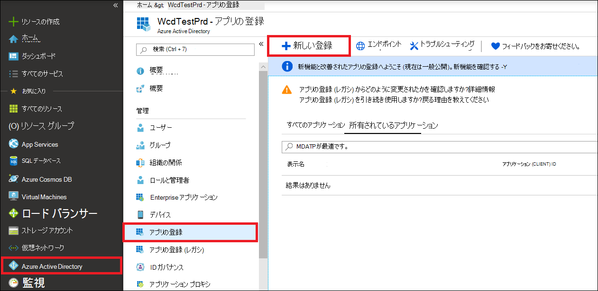
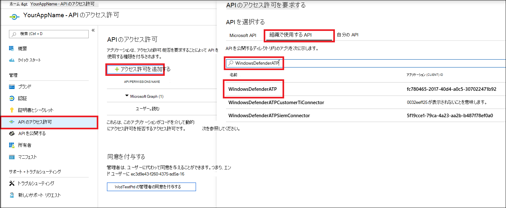

# <a name="use-microsoft-defender-for-endpoint-apis"></a>エンドポイント API で Microsoft Defender を使用する

[!INCLUDE [Microsoft 365 Defender rebranding](../../includes/microsoft-defender.md)]


**適用対象:**
- [Microsoft Defender for Endpoint](https://go.microsoft.com/fwlink/?linkid=2154037)

> Microsoft Defender ATP を試してみたいですか? [無料試用版にサインアップしてください。](https://signup.microsoft.com/create-account/signup?products=7f379fee-c4f9-4278-b0a1-e4c8c2fcdf7e&ru=https://aka.ms/MDEp2OpenTrial?ocid=docs-wdatp-exposedapis-abovefoldlink)

[!include[Microsoft Defender for Endpoint API URIs for US Government](../../includes/microsoft-defender-api-usgov.md)]

[!include[Improve request performance](../../includes/improve-request-performance.md)]

このページでは、ユーザーに代わって Defender for Endpoint へのプログラムによるアクセスを取得するアプリケーションを作成する方法について説明します。

ユーザーなしで Microsoft Defender for Endpoint にプログラムでアクセスする必要がある場合は、「Access Microsoft Defender for Endpoint with application [context」を参照してください](exposed-apis-create-app-webapp.md)。

必要なアクセスが分からない場合は、[概要] ページをお [読みください](apis-intro.md)。

Microsoft Defender for Endpoint は、一連のプログラム API を通じて、そのデータとアクションの多くを公開します。 これらの API を使用すると、Microsoft Defender for Endpoint の機能に基づいてワークフローを自動化し、革新することができます。 API アクセスには、OAuth2.0 認証が必要です。 詳細については[、「OAuth 2.0 Authorization Code Flow」 を参照してください](/azure/active-directory/develop/active-directory-v2-protocols-oauth-code)。

一般に、API を使用するには、次の手順を実行する必要があります。
- AAD アプリケーションの作成
- このアプリケーションを使用してアクセス トークンを取得する
- トークンを使用して Defender for Endpoint API にアクセスする

このページでは、AAD アプリケーションを作成し、Microsoft Defender for Endpoint へのアクセス トークンを取得し、トークンを検証する方法について説明します。

>[!NOTE]
> ユーザーに代わって Microsoft Defender for Endpoint API にアクセスする場合は、適切なアプリケーションアクセス許可とユーザーアクセス許可が必要です。
> Microsoft Defender for Endpoint のユーザーアクセス許可に精通していない場合は、「役割ベースのアクセス制御を使用してポータル アクセスを管理する」 [を参照してください](rbac.md)。

>[!TIP]
> ポータルでアクションを実行するアクセス許可がある場合は、API でアクションを実行するアクセス許可を持つ必要があります。

## <a name="create-an-app"></a>アプリを作成する

1. グローバル管理者の [役割を](https://portal.azure.com) 持つユーザー アカウントを使用して **Azure にログオン** します。

2. [アプリの **登録Azure Active Directory**  >  **新しい登録]**  >  **に移動します**。 

   

3. [**アプリケーションの登録**] ページが表示されたら、以下のアプリケーションの登録情報を入力します。

   - **名前** - アプリのユーザーに表示されるわかりやすいアプリケーション名を入力します。
   - **サポートされているアカウントの種類** - アプリケーションでサポートするアカウントを選択します。

       | サポートされているアカウントの種類 | 説明 |
       |-------------------------|-------------|
       | **この組織のディレクトリ内のアカウントのみ** | 基幹業務 (LOB) アプリケーションを作成している場合は、このオプションを選択します。 アプリケーションをディレクトリに登録していない場合、このオプションは選択できません。<br><br>このオプションは、Azure AD のシングルテナントにのみマッピングします。<br><br>これは、ディレクトリの外部にアプリを登録している場合を除き、既定のオプションです。 アプリがディレクトリの外部に登録されている場合、既定のオプションは Azure AD マルチテナントと個人の Microsoft アカウントです。 |
       | **組織のディレクトリ内のアカウント** | 企業および教育機関のすべてのユーザーを対象とする場合は、このオプションを選択します。<br><br>このオプションは、Azure AD のマルチテナントにのみマッピングします。<br><br>アプリを Azure AD のシングルテナントとしてのみ登録した場合は、[**認証**] ブレードを使用して、Azure AD マルチテナントに更新し、シングルテナントに戻すことができます。 |
       | **組織のディレクトリ内のアカウントと個人用 Microsoft アカウント** | 最も広い範囲の顧客を対象とする場合は、このオプションを選択します。<br><br>このオプションは、Azure AD マルチテナントと個人用 Microsoft アカウントにマッピングします。<br><br>アプリを Azure AD マルチテナントと個人用 Microsoft アカウントとして登録した場合は、UI でこれを変更できません。 代わりに、アプリケーション マニフェスト エディターを使用して、サポートされているアカウントの種類を変更する必要があります。 |

   - **リダイレクト URI (オプション)** - 構築しているアプリの種類として **Web** または **パブリック クライアント (モバイルとデスクトップ)** を選択し、アプリケーションのリダイレクト URI (または応答 URL) を入力します。
       - Web アプリケーションの場合は、アプリのベース URL を指定します。 たとえば、`http://localhost:31544` はローカル マシンで実行されている Web アプリの URL になる場合があります。 ユーザーはこの URL を使用して、Web クライアント アプリケーションにサインインします。
       - パブリック クライアント アプリケーションの場合は、トークンの応答を返す際に Azure AD が使用する URI を指定します。 `myapp://auth` などのアプリケーションに固有の値を入力します。

     Web アプリケーションまたはネイティブ アプリケーションの具体的な例を見るには、「[クイック スタート](/azure/active-directory/develop/#quickstarts)」を参照してください。

     終了したら、[**登録**] を選択します。

4. アプリケーションが Microsoft Defender for Endpoint にアクセスし、"アラートの読み取り" アクセス許可を割り当てるのを許可します。

    - アプリケーション ページで **、[API アクセス** 許可の追加] アクセス許可 API を選択します。組織で  >    >  WindowsDefenderATP >を使用し **、WindowsDefenderATP** で選択します。 

    - **注**: *WindowsDefenderATP* は元のリストには表示されません。 テキスト ボックスに名前を書き始め、表示を確認します。

      

    - [**委任されたアクセス許可の**  >  **アラート] を選択し、[アクセス**>を **追加する] を選択します。**

      

    - **重要な注意**: 関連するアクセス許可を選択します。 アラートの読み取りは、一例にすのみです。

      例えば

      - 高度 [なクエリを実行するには、[](run-advanced-query-api.md)高度なクエリの実行] アクセス許可を選択します。
      - デバイス [を分離するには、[](isolate-machine.md)コンピューターの分離] アクセス許可を選択します。
      - 必要なアクセス許可を確認するには、呼 **び** 出す API の [アクセス許可] セクションを表示します。

    - [同意 **の付与] を選択します。**

      **注**: アクセス許可を追加する度に、新しいアクセス許可を有効にするための同意の付与で選択する必要があります。

      

6. アプリケーション ID とテナント ID を書き出します。

   - アプリケーション ページで、[概要] に移動 **し** 、次の情報をコピーします。

   


## <a name="get-an-access-token"></a>アクセス トークンを取得する

AAD トークンの詳細については [、「Azure AD」を参照してください。](/azure/active-directory/develop/active-directory-v2-protocols-oauth-client-creds)

### <a name="using-c"></a>C の使用#

- 以下のクラスをアプリケーションにコピー/貼り付けます。
- トークンを取得するには、アプリケーション ID、テナント ID、ユーザー名、およびパスワードで **AcquireUserTokenAsync** メソッドを使用します。

    ```csharp
    namespace WindowsDefenderATP
    {
        using System.Net.Http;
        using System.Text;
        using System.Threading.Tasks;
        using Newtonsoft.Json.Linq;

        public static class WindowsDefenderATPUtils
        {
            private const string Authority = "https://login.microsoftonline.com";

            private const string WdatpResourceId = "https://api.securitycenter.microsoft.com";

            public static async Task<string> AcquireUserTokenAsync(string username, string password, string appId, string tenantId)
            {
                using (var httpClient = new HttpClient())
                {
                    var urlEncodedBody = $"resource={WdatpResourceId}&client_id={appId}&grant_type=password&username={username}&password={password}";

                    var stringContent = new StringContent(urlEncodedBody, Encoding.UTF8, "application/x-www-form-urlencoded");

                    using (var response = await httpClient.PostAsync($"{Authority}/{tenantId}/oauth2/token", stringContent).ConfigureAwait(false))
                    {
                        response.EnsureSuccessStatusCode();

                        var json = await response.Content.ReadAsStringAsync().ConfigureAwait(false);

                        var jObject = JObject.Parse(json);

                        return jObject["access_token"].Value<string>();
                    }
                }
            }
        }
    }
    ```

## <a name="validate-the-token"></a>トークンを検証する

正しいトークンを取得していることを確認します。
- 前の手順で取得したトークンを [JWT](https://jwt.ms) にコピー/貼り付けしてデコードする
- 目的のアプリのアクセス許可を持つ 'scp' クレームを取得する検証
- 以下のスクリーンショットでは、チュートリアルでアプリから取得したデコードされたトークンを確認できます。


## <a name="use-the-token-to-access-microsoft-defender-for-endpoint-api"></a>トークンを使用して Microsoft Defender for Endpoint API にアクセスする

- 使用する API を選択する - [サポートされている Microsoft Defender for Endpoint API](exposed-apis-list.md)
- 送信する HTTP 要求の承認ヘッダーを "Bearer {token}" に設定します (ベアラーは承認スキームです)
- トークンの有効期限は 1 時間です (同じトークンで複数の要求を送信できます)

- メッセージを使用してアラートの一覧を取得する要求を送信 **するC#** 

    ```csharp
    var httpClient = new HttpClient();

    var request = new HttpRequestMessage(HttpMethod.Get, "https://api.securitycenter.microsoft.com/api/alerts");

    request.Headers.Authorization = new AuthenticationHeaderValue("Bearer", token);

    var response = httpClient.SendAsync(request).GetAwaiter().GetResult();

    // Do something useful with the response
    ```

## <a name="see-also"></a>関連項目
- [エンドポイント API 用 Microsoft Defender](exposed-apis-list.md)
- [アプリケーション コンテキストを使用して Microsoft Defender for Endpoint にアクセスする](exposed-apis-create-app-webapp.md)
