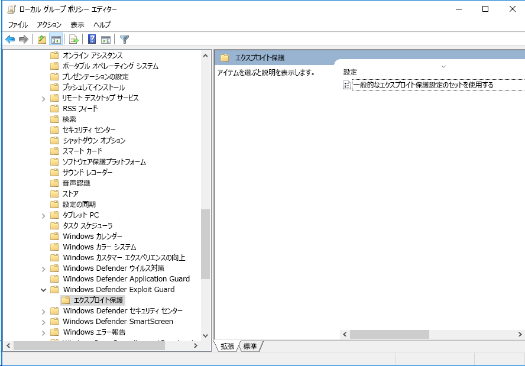

# <a name="import-export-and-deploy-exploit-protection-configurations"></a>エクスプロイト保護構成のインポート、エクスポート、展開

[!INCLUDE [Microsoft 365 Defender rebranding](../../includes/microsoft-defender.md)]


**適用対象:**
- [Microsoft Defender for Endpoint](https://go.microsoft.com/fwlink/p/?linkid=2154037)
- [Microsoft 365 Defender](https://go.microsoft.com/fwlink/?linkid=2118804)

> Defender for Endpoint を試す場合は、 [無料試用版にサインアップしてください。](https://signup.microsoft.com/create-account/signup?products=7f379fee-c4f9-4278-b0a1-e4c8c2fcdf7e&ru=https://aka.ms/MDEp2OpenTrial?ocid=docs-wdatp-exposedapis-abovefoldlink)

エクスプロイト保護は、悪用を使用して拡散および感染するマルウェアからデバイスを保護するのに役立ちます。 これは、オペレーティング システム レベルまたは個々のアプリ レベルで適用できるいくつかの軽減策で構成されます。

アプリまたは PowerShell Windows セキュリティを使用して、一連の軽減策 (構成と呼ばれる) を作成します。 その後、この構成を XML ファイルとしてエクスポートし、ネットワーク上の複数のデバイスと共有できます。 次に、すべて同じ軽減設定のセットを持つ。

評価 [パッケージには、XML](https://demo.wd.microsoft.com/Page/EP) 構造の外観を確認するために使用 *ProcessMitigation.xml構成ファイル* (Selfhost v4) の名前を示すサンプル構成ファイルが含まれています。 サンプル ファイルには、拡張軽減エクスペリエンス 構成 (サポートされなくなった) Toolkitから変換された設定も[含](https://support.microsoft.com/help/2458544/the-enhanced-mitigation-experience-toolkit)まれている。 テキスト エディター (メモ帳 など) でファイルを開く、または直接エクスプロイト保護にインポートし、Windows セキュリティ アプリの設定を確認できます。

## <a name="create-and-export-a-configuration-file"></a>構成ファイルの作成とエクスポート

構成ファイルをエクスポートする前に、正しい設定が必要です。 まず、1 台の専用デバイスでエクスプロイト保護を構成します。 軽減 [策の構成の詳細については](customize-exploit-protection.md) 、「悪用保護のカスタマイズ」を参照してください。

エクスプロイト保護を目的の状態 (システム レベルとアプリ レベルの両方の軽減策を含む) に構成した場合は、Windows セキュリティ アプリまたは PowerShell を使用してファイルをエクスポートできます。

### <a name="use-the-windows-security-app-to-export-a-configuration-file"></a>構成ファイルをエクスポートWindows セキュリティアプリを使用する

1. タスク バー Windows セキュリティシールド アイコンを選択して、アプリを開きます。 または、Defender のスタート メニューを **検索します**。

2. [App **& コントロール] タイル** (または左側のメニュー バーのアプリ アイコン) を選択し、[エクスプロイト保護の設定] **を選択します**。

    ![アプリの [エクスプロイト保護の設定] オプションWindows セキュリティします。](../../media/wdsc-exp-prot.png)

3. [エクスプロイト保護] セクション **の下部で** 、[設定のエクスポート] **を選択します**。 構成を保存する XML ファイルの場所と名前を選択します。

    > [!IMPORTANT]
    > 既定の構成を使用する場合は、XML ファイルに正しくエクスポートされた設定を取得するには、"Use Default (On)" ではなく、設定 "既定でオン" を使用します。

    ![[エクスポート] オプションの設定します。](../../media/wdsc-exp-prot-export.png)

    > [!NOTE]
    > 設定をエクスポートすると、アプリ レベルとシステム レベルの両方の軽減策のすべての設定が保存されます。 つまり、[システム設定] セクションと [プログラム設定]セクションの両方からファイルをエクスポートする必要はありません (どちらのセクションでもすべての設定がエクスポートされます)。

### <a name="use-powershell-to-export-a-configuration-file"></a>PowerShell を使用して構成ファイルをエクスポートする

1. **[powershell]** と入力スタート メニュー **右クリックし**、[管理者Windows PowerShell **実行] を選択します**。
2. 次のコマンドレットを入力します。

    ```PowerShell
    Get-ProcessMitigation -RegistryConfigFilePath filename.xml
    ```

    選択 `filename` した任意の名前または場所に変更します。

    コマンドの例:

    ```powershell
    Get-ProcessMitigation -RegistryConfigFilePath C:\ExploitConfigfile.xml
    ```

> [!IMPORTANT]
> グループ ポリシーを使用して構成を展開する場合、構成を使用するすべてのデバイスが構成ファイルにアクセスできる必要があります。 ファイルを共有の場所に配置してください。

## <a name="import-a-configuration-file"></a>構成ファイルのインポート

以前に作成したエクスプロイト保護構成ファイルをインポートできます。 PowerShell を使用して構成ファイルをインポートする場合にのみ使用できます。

インポート後、設定は即座に適用され、アプリで確認Windows セキュリティできます。

### <a name="use-powershell-to-import-a-configuration-file"></a>PowerShell を使用して構成ファイルをインポートする

1. **[powershell]** と入力スタート メニュー **右クリックし**、[管理者Windows PowerShell **実行] を選択します**。
2. 次のコマンドレットを入力します。

    ```PowerShell
    Set-ProcessMitigation -PolicyFilePath filename.xml
    ```

    エクスプ `filename` ロイト保護 XML ファイルの場所と名前に変更します。

    コマンドの例:

    ```powershell
    Set-ProcessMitigation -PolicyFilePath C:\ExploitConfigfile.xml
    ```

> [!IMPORTANT]
> エクスプロイト保護専用に作成された構成ファイルをインポートしてください。

## <a name="manage-or-deploy-a-configuration"></a>構成の管理または展開

グループ ポリシーを使用して、作成した構成をネットワーク内の複数のデバイスに展開できます。

> [!IMPORTANT]
> グループ ポリシーを使用して構成を展開する場合、構成を使用するすべてのデバイスが構成 XML ファイルにアクセスできる必要があります。 ファイルを共有の場所に配置してください。

### <a name="use-group-policy-to-distribute-the-configuration"></a>グループ ポリシーを使用して構成を配布する

1. グループ ポリシー管理デバイスで、グループ ポリシー [管理](/previous-versions/windows/desktop/gpmc/group-policy-management-console-portal)コンソールを開き、構成するグループ ポリシー オブジェクトを右クリックし、[編集] を **クリックします**。

2. **[グループ ポリシー管理エディター]** で、**[コンピューターの構成]** に移動し、**[管理用テンプレート]** を選択します。

3. ツリーを展開して **、Exploit Guard Windows保護** \> **Windows Defenderコンポーネント** \> **を展開します**。

    

4. [エクスプロイト **保護設定の共通セットを使用する** ] をダブルクリックし、オプションを [有効] に **設定します**。

5. [オプション **:]** セクションで、次の例のように、使用する Exploit protection 構成ファイルの場所とファイル名を入力します。

    - `C:\MitigationSettings\Config.XML`
    - `\\Server\Share\Config.xml`
    - `https://localhost:8080/Config.xml`
    - `C:\ExploitConfigfile.xml`

6. **[OK] を**[選択し、通常と同様に更新された GPO を展開します](/windows/win32/srvnodes/group-policy)。

## <a name="see-also"></a>関連項目

- [エクスプロイトからデバイスを保護する](exploit-protection.md)
- [エクスプロイト保護の評価](evaluate-exploit-protection.md)
- [エクスプロイト保護を有効にする](enable-exploit-protection.md)
- [Exploit Protection 軽減策の構成と監査](customize-exploit-protection.md)
