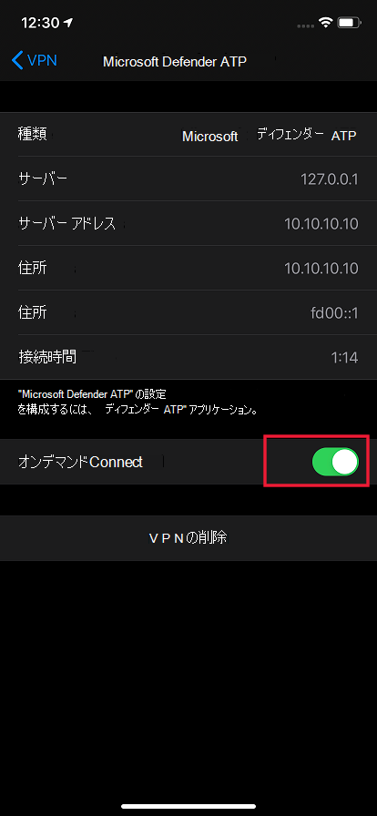

# iOS の機能で Microsoft Defender for Endpoint を構成する

[!INCLUDE [Microsoft 365 Defender rebranding](../../includes/microsoft-defender.md)]

**適用対象:**
- [Microsoft Defender for Endpoint Plan 2](https://go.microsoft.com/fwlink/p/?linkid=2154037)
- [Microsoft 365 Defender](https://go.microsoft.com/fwlink/?linkid=2118804)

> Defender for Endpoint を試す場合は、 [無料試用版にサインアップしてください。](https://signup.microsoft.com/create-account/signup?products=7f379fee-c4f9-4278-b0a1-e4c8c2fcdf7e&ru=https://aka.ms/MDEp2OpenTrial?ocid=docs-wdatp-exposedapis-abovefoldlink)

> [!NOTE]
> iOS 上のエンドポイントの Defender は、Web 保護機能を提供するために VPN を使用します。 これは通常の VPN ではなく、デバイス外のトラフィックを受け取らないローカル/自己ループ VPN です。

## iOS 上のエンドポイント用 Defender を使用した条件付きアクセス

Microsoft Defender for Endpoint on iOS および Microsoft Intune および Azure Active Directoryにより、デバイス のリスク スコアに基づいてデバイスコンプライアンスと条件付きアクセス ポリシーを適用できます。 Defender for Endpoint は、Intune を介してこの機能を活用するために展開できるモバイル脅威防御 (MTD) ソリューションです。

iOS で Defender for Endpoint を使用して条件付きアクセスを設定する方法の詳細については、「 [Defender for Endpoint and Intune」を参照してください](/mem/intune/protect/advanced-threat-protection)。

### Microsoft Defender for Endpoint による脱獄の検出

Microsoft Defender for Endpoint には、脱獄された管理されていないデバイスと管理対象デバイスを検出する機能があります。 デバイスが脱獄されたと検出されると、危険度の高いアラートが Microsoft 365 Defender ポータルに報告され、条件付きアクセスがデバイス リスク スコアに基づいてセットアップされている場合、デバイスは企業データへのアクセスをブロックされます。

## Web 保護と VPN

既定では、Defender for Endpoint on iOS には Web 保護機能が含まれています。 [Web 保護](web-protection-overview.md)は、Web の脅威からデバイスを保護し、フィッシング攻撃からユーザーを保護するのに役立ちます。 フィッシング対策とカスタム インジケーター (URL と IP アドレス) は、Web Protection の一部としてサポートされています。 現在、iOS では Web コンテンツ フィルターはサポートされていません。

iOS のエンドポイントの Defender は、この機能を提供するために VPN を使用します。 これはローカル VPN であり、従来の VPN とは異なり、ネットワーク トラフィックはデバイスの外部に送信されません。

既定で有効になっている場合は、VPN を無効にする必要がある場合があります。 たとえば、VPN が構成されているときに動作しないアプリを実行する場合です。 このような場合は、次の手順に従って、デバイス上のアプリから VPN を無効にできます。

1. iOS デバイスで、アプリを開き **設定、[全般**] を **クリックまたはタップ** し、[VPN] を **タップします**。
1. Microsoft Defender for Endpoint の "i" ボタンをクリックまたはタップします。
1. VPN を無効 **にするにはConnectをオフ** にします。

    > [!div class="mx-imgBorder"]
    > 

> [!NOTE]
> VPN が無効になっている場合、Web 保護は使用できません。 Web Protection を再び有効にするには、デバイスで Microsoft Defender for Endpoint アプリを開き、[VPN の開始] をクリックまたは **タップします**。

## 複数の VPN プロファイルの共存在

Apple iOS では、同時にアクティブになる複数のデバイス全体の VPN はサポートされていません。 デバイスに複数の VPN プロファイルを存在することができますが、一度にアクティブにできる VPN は 1 つのみです。

## アプリ保護ポリシー (MAM) で Microsoft Defender for Endpoint リスクシグナルを構成する

Microsoft Defender for Endpoint は、iOS/iPadOS のアプリ保護ポリシー (APP、 MAM とも呼ばれる) で使用される脅威信号を送信するように構成できます。 この機能を使用すると、Microsoft Defender for Endpoint を使用して、登録されていないデバイスから企業データへのアクセスを保護することもできます。

Microsoft Defender for Endpoint を使用してアプリ保護ポリシーをセットアップする手順は次のとおりです。

1. クライアント テナントから Microsoft Defender for Endpoint Microsoft エンドポイント マネージャー接続をセットアップします。 [Microsoft Endpoint](https://go.microsoft.com/fwlink/?linkid=2109431) \>  \> Manager 管理センターで、[テナント管理コネクタとトークン **Microsoft Defender for** Endpoint (クロス プラットフォーム) または Endpoint **Security** \> **Microsoft Defender for** Endpoint (セットアップ] の下) に移動し、[アプリ保護ポリシー 設定 for **iOS**] のトグルをオンにします。
1. [保存] を選択します。 [接続の状態 **] が [有効** ] に設定されている必要 **があります**。
1. アプリ保護ポリシーの作成: Microsoft Defender for Endpoint  \> Connector のセットアップが完了したら、[アプリアプリ保護ポリシー **] ([** ポリシー] の下) に移動して、新しいポリシーを作成するか、既存のポリシーを更新します。
1. 組織がポリシーに必要とするプラットフォーム、 **アプリ、データ** 保護、アクセス要件の設定を選択します。
1. [ **条件付き起動** \> **デバイスの条件**] の下に、[許可されるデバイスの **脅威レベルの最大値] の設定が表示されます**。 これは、Low、Medium、High、または Secured のどちらかに構成する必要があります。 使用できるアクションは、[アクセスのブロック **] または [** データのワイプ **] になります**。 この設定を有効にする前にコネクタをセットアップする情報ダイアログが表示される場合があります。 コネクタが既にセットアップされている場合は、このダイアログは無視できます。
1. [割り当て] で終了し、ポリシーを保存します。

MAM またはアプリ保護ポリシーの詳細については、「 [iOS アプリ保護ポリシー設定」を参照してください](/mem/intune/apps/app-protection-policy-settings-ios)。

### MAM または登録されていないデバイスでの Microsoft Defender for Endpoint の展開

Microsoft Defender for Endpoint on iOS では、アプリ保護ポリシーのシナリオを有効にし、Apple アプリ ストアで利用できます。

エンド ユーザーは、Apple アプリ ストアからアプリの最新バージョンを直接インストールする必要があります。

## プライバシーコントロール

> [!IMPORTANT]
> iOS 上の Microsoft Defender for Endpoint のプライバシーコントロールはプレビュー中です。 次の情報は、製品が商用リリースされる前に大幅に変更される可能性がある事前リリース済み製品に関連しています。 Microsoft は、ここに記載された情報に関して、明示または黙示を問わず、いかなる保証も行いません。

### フィッシングアラート レポートでプライバシーを構成する

お客様は、iOS 上の Microsoft Defender for Endpoint から送信されるフィッシング レポートのプライバシー制御を有効にできます。 これにより、Microsoft Defender for Endpoint によってフィッシング Web サイトが検出およびブロックされるたびに、フィッシングアラートの一部としてドメイン名が送信されません。

次の手順を使用して、プライバシーを有効にし、フィッシングアラート レポートの一部としてドメイン名を収集しない。

1. [[Microsoft エンドポイント マネージャー管理センターで、**AppsApp** >  >  構成ポリシー **] [デバイスの追加]** >  **に移動します**。
1. ポリシーに名前を付け、「 **プラットフォーム > iOS/iPadOS**」でプロファイルの種類を選択します。
1. ターゲット **アプリとして [Microsoft Defender for Endpoint** ] を選択します。
1. [設定] ページで、[構成デザイナーを使用する] **を選択し**、キーと値の種類として **DefenderExcludeURLInReport** をブール型として追加 **します。**
   - プライバシーを有効にしてドメイン名を収集しない場合は、値を as と入力し `true` 、このポリシーをユーザーに割り当てる必要があります。 既定では、この値はに設定されます `false`。
   - キーが設定されているユーザー `true`の場合、悪意のあるサイトが Defender for Endpoint によって検出およびブロックされるたびに、フィッシング アラートにはドメイン名情報は含めされません。
1. [次 **へ] を** クリックし、このプロファイルを対象のデバイス/ユーザーに割り当てる。

上記のプライバシーコントロールをオンまたはオフにした場合、デバイスコンプライアンスチェックや条件付きアクセスには影響はありません。

## 脱獄されたデバイスに対するコンプライアンス ポリシーの構成

企業データが脱獄された iOS デバイスでアクセスされるのを保護するには、Intune で次のコンプライアンス ポリシーを設定することをお勧めします。

> [!NOTE]
> 脱獄検出は、iOS 上の Microsoft Defender for Endpoint によって提供される機能です。 ただし、脱獄シナリオに対する追加の防御層としてこのポリシーをセットアップすることをお勧めします。

以下の手順に従って、脱獄されたデバイスに対するコンプライアンス ポリシーを作成します。

1. 管理 [Microsoft エンドポイント マネージャーで、**DevicesCompliance** ->  **policyesCreate Policy**]  ->  に移動します。 プラットフォームとして [iOS/iPadOS] を選択し、[作成] を **クリックします**。

    > [!div class="mx-imgBorder"]
    > 

2. ポリシーの名前を指定します 。たとえば、「脱獄のコンプライアンス ポリシー」などです。
3. [コンプライアンス設定] ページで、[デバイスの正常性] セクションをクリック **し、[脱** 獄デバイスのブロック **] フィールドをクリック** します。

    > [!div class="mx-imgBorder"]
    > 

4. [非 **準拠のアクション] セクションで** 、要件に従ってアクションを選択し、[次へ] を選択 **します**。

    > [!div class="mx-imgBorder"]
    > 

5. [割 **り当て** ] セクションで、このポリシーに含めるユーザー グループを選択し、[次へ] を選択 **します**。
6. [レビュー **+ 作成] セクション** で、入力した情報が正しいか確認し、[作成] を選択 **します**。

## カスタム インジケーターの構成

iOS のエンドポイントの Defender を使用すると、管理者は iOS デバイス上のカスタム インジケーターも構成できます。 カスタム インジケーターを構成する方法の詳細については、「指標の管理」 [を参照してください](/microsoft-365/security/defender-endpoint/manage-indicators)。

> [!NOTE]
> IOS のエンドポイントの Defender は、IP アドレスと URL/ドメインのカスタム インジケーターの作成のみをサポートしています。

## アプリ内フィードバックを送信するオプションを構成する 

お客様は、Defender for Endpoint アプリ内でフィードバック データを Microsoft に送信する機能を構成できます。 フィードバック データは、Microsoft が製品を改善し、問題のトラブルシューティングを行う際に役立ちます。

> [!NOTE]
> 米国政府機関のクラウド顧客の場合、フィードバック データ収集は **既定で** 無効になっています。 

次の手順を使用して、フィードバック データを Microsoft に送信するオプションを構成します。

1. [[Microsoft エンドポイント マネージャー管理センターで、**AppsApp** >  >  構成ポリシー **] [デバイスの追加]** >  **に移動します**。
1. ポリシーに名前を付け、「 **プラットフォーム > iOS/iPadOS**」でプロファイルの種類を選択します。
1. ターゲット **アプリとして [Microsoft Defender for Endpoint** ] を選択します。
1. [設定] ページで、[構成デザイナーを使用する] **を選択し**、キーと値の種類として **DefenderSendFeedback** をブール型として追加 **します。**
   - エンド ユーザーがフィードバックを提供する機能を削除するには、値を as `false` に設定し、このポリシーをユーザーに割り当てる必要があります。 既定では、この値はに設定されます `true`。 米国政府機関のお客様の場合、既定値は 'false' に設定されます。
   - キーが設定されている `true`ユーザーの場合、アプリ内でフィードバック データを Microsoft に送信するオプションがあります (メニュー > ヘルプ & フィードバック > Microsoft にフィードバックを送信する)
1. [次 **へ] を** クリックし、このプロファイルを対象のデバイス/ユーザーに割り当てる。

## 安全でないサイトを報告する

フィッシング Web サイトは、お客様の個人情報または財務情報を取得する目的で信頼できる Web サイトになりすます。 フィッシング サイト [の可能性がある Web サイトを報告](https://www.microsoft.com/wdsi/filesubmission/exploitguard/networkprotection) する場合は、[ネットワーク保護に関するフィードバックを提供する] ページをご覧ください。
