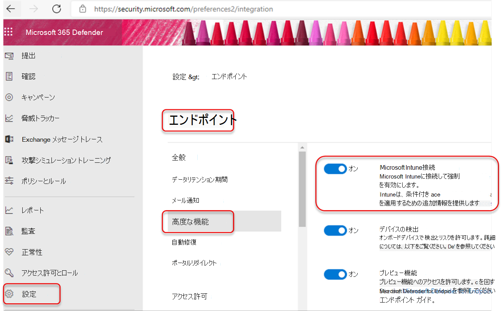
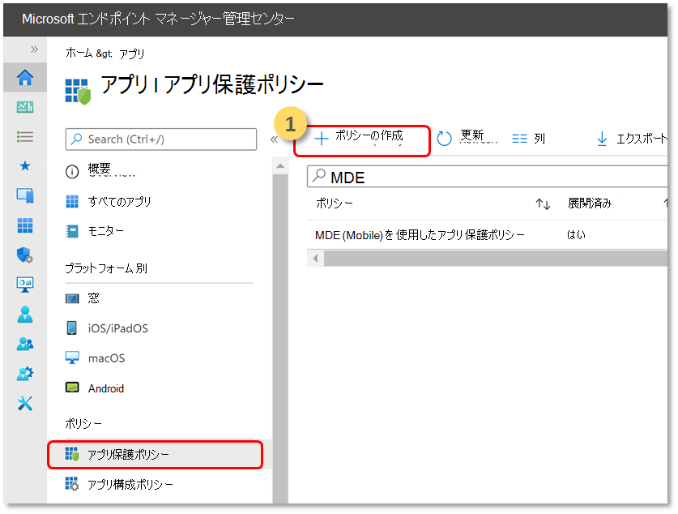

# 登録されていない iOS デバイスに Microsoft Defender for Endpoint を展開する

[!INCLUDE [Microsoft 365 Defender rebranding](../../includes/microsoft-defender.md)]

**適用対象:**
- [Microsoft Defender for Endpoint Plan 1](https://go.microsoft.com/fwlink/p/?linkid=2154037)
- [Microsoft Defender for Endpoint Plan 2](https://go.microsoft.com/fwlink/p/?linkid=2154037)
- [Microsoft 365 Defender](https://go.microsoft.com/fwlink/?linkid=2118804)

> Defender for Endpoint を試す場合は、 [無料試用版にサインアップしてください。](https://signup.microsoft.com/create-account/signup?products=7f379fee-c4f9-4278-b0a1-e4c8c2fcdf7e&ru=https://aka.ms/MDEp2OpenTrial?ocid=docs-wdatp-exposedapis-abovefoldlink)

> [!NOTE]
> iOS のエンドポイントの Defender は、Web 保護機能を提供するために VPN を使用します。 これは通常の VPN ではなく、デバイス外のトラフィックを受け取らないローカル/自己ループ VPN です。

## アプリ保護ポリシー (MAM) で Microsoft Defender for Endpoint リスクシグナルを構成する

モバイル デバイス管理 (MDM) シナリオでエンタープライズ ユーザーを既に保護している iOS 上の Microsoft Defender for Endpoint は、Intune モバイル デバイス管理 (MDM) を使用して登録されていないデバイスのモバイル アプリ管理 (MAM) のサポートを拡張しました。 また、このサポートは、他のエンタープライズ モビリティ管理ソリューションを使用しているお客様にも拡張しますが、モバイル アプリケーション管理 (MAM) には Intune を使用します。この機能を使用すると、アプリケーション内で組織のデータを管理および保護できます。

Microsoft Defender for Endpoint on iOS の脅威情報は、Intune アプリ保護ポリシーによってこれらのアプリを保護するために活用されます。 アプリ保護ポリシー (APP) は、組織のデータが安全な状態にあるか、またはマネージド アプリ内に格納されることを保証するルールです。 管理アプリケーションにはアプリ保護ポリシーが適用され、Intune で管理できます。  

Microsoft Defender for Endpoint on iOS では、MAM の両方の構成がサポートされています
- **Intune MDM + MAM**: IT 管理者は、Intune モバイル デバイス管理 (MDM) に登録されているデバイスでアプリ保護ポリシーを使用してアプリのみを管理できます。
- **デバイス登録のない** MAM: デバイス登録なしの MAM、または MAM-WE を使用すると、IT 管理者は Intune MDM  に登録されていないデバイスでアプリ保護ポリシーを使用してアプリを管理できます。 つまり、サードパーティ EMM プロバイダーに登録されているデバイスで Intune によりアプリを管理できます。 上記の両方の構成で使用するアプリを管理するには、管理者センターで Intune [をMicrosoft エンドポイント マネージャーする必要があります。](https://go.microsoft.com/fwlink/?linkid=2109431)

この機能を有効にするには、管理者が Microsoft Defender for Endpoint と Intune 間の接続を構成し、アプリ保護ポリシーを作成し、対象のデバイスとアプリケーションにポリシーを適用する必要があります。 
 
エンド ユーザーは、デバイスに Microsoft Defender for Endpoint をインストールし、オンボーディング フローをアクティブ化するための手順を実行する必要があります。

### 前提条件

1. **コネクタが有効になっているか確認します**。   統合セキュリティ [コンソールで](https://security.microsoft.com)、[ > 設定 **EndpointsAdvanced** >  **機能**] に移動し、Microsoft Intune **接続が** 有効になっているか確認します。

  
  
2. **Intune ポータルでコネクタが有効になっているか確認します**。   [Microsoft Endpoint manager 管理センターで、**Endpoint SecurityMicrosoft** >  **Defender for Endpoint**] に移動し、[接続] 状態が有効になっているか確認します。

  

### アプリ保護ポリシーを作成する
 
アプリ保護ポリシーを作成して、Microsoft Defender for Endpoint リスクシグナルに基づいて管理アプリのデータへのアクセスをブロックまたはワイプします。
Microsoft Defender for Endpoint は、アプリ保護ポリシー (APP、 MAM とも呼ばれる) で使用される脅威信号を送信するように構成できます。 この機能を使用すると、Microsoft Defender for Endpoint を使用して管理対象アプリを保護できます。

1. ポリシーを作成する  
アプリ保護ポリシー (APP) は、組織のデータが安全な状態にあるか、またはマネージド アプリ内に格納されることを保証するルールです。 ポリシーの例としては、ユーザーが "企業" データへのアクセスまたは移動を試みた場合や、アプリ内で禁止または監視されている一連の操作を試みた場合に適用されるルールがあります。 

2. アプリを追加する  
    a. このポリシーをさまざまなデバイス上のアプリに適用する方法を選択します。 次に、少なくとも 1 つのアプリを追加します。  
    このポリシーが管理されていないデバイスに適用されるかどうかを指定するには、このオプションを使用します。 また、任意の管理状態のデバイス上のアプリにポリシーをターゲットにすることもできます。
モバイル アプリ管理にはデバイス管理が必要ないため、マネージド デバイスとアンマネージド デバイスの両方で会社データを保護することができます。 管理の中心がユーザー ID になり、デバイスを管理する必要がなくなります。 企業は、MDM を使用する場合と使用しない場合でも、アプリ保護ポリシーを同時に使用できます。 たとえば、会社で支給されたスマートフォンと自分のタブレットの両方を使用する社員がいるとします。 会社の電話は MDM に登録され、アプリ保護ポリシーによって保護され、個人用デバイスはアプリ保護ポリシーでのみ保護されます。

    b. [アプリの選択] 
    管理対象アプリは、アプリ保護ポリシーが適用されたアプリであり、Intune で管理できます。 [Intune SDK](/mem/intune/developer/app-sdk) に統合されたアプリ、または Intune アプリによってラップされたアプリは、[Intune](/mem/intune/developer/apps-prepare-mobile-application-management) アプリApp Wrapping Toolポリシーを使用して管理できます。 これらのツールを使用して構築されている一般使用が可能な [Microsoft Intune による保護アプリ](/mem/intune/apps/apps-supported-intune-apps)の公式一覧を参照してください。

    *例: Outlookアプリとして使用する*

    

 3. 保護ポリシーのサインイン セキュリティ要件を設定します。  
[ **デバイスの条件>最大許容** デバイス脅威レベルの設定] を選択 **し、値** を入力します。 次に、[  **アクション: アクセスをブロックする] を選択します**。 Microsoft Defender for Endpoint on iOS では、このデバイス脅威レベルを共有します。

    

4. ポリシーを適用する必要があるユーザー グループを割り当てる。 
  [含 **まれるグループ] を選択します**。 次に、関連するグループを追加します。 

MAM またはアプリ保護ポリシーの詳細については、「 [iOS アプリ保護ポリシー設定」を参照してください](/mem/intune/apps/app-protection-policy-settings-ios)。

## MICROSOFT Defender for Endpoint for MAM または登録されていないデバイスに展開する

Microsoft Defender for Endpoint on iOS では、アプリ保護ポリシーのシナリオを有効にし、Apple アプリ ストアで利用できます。

アプリ保護ポリシーが、Microsoft Defender for Endpoint からのデバイス リスク信号を含むアプリ用に構成されている場合、そのようなアプリを使用する場合、ユーザーは Microsoft Defender for Endpoint をインストールするようにリダイレクトされます。 また、ユーザーは Apple アプリ ストアから直接アプリの最新バージョンをインストールすることもできます。
