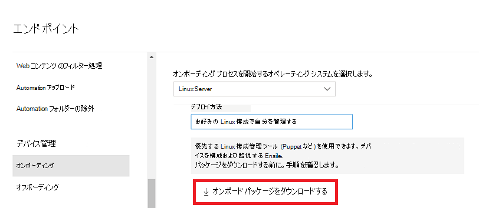

# <a name="deploy-microsoft-defender-for-endpoint-on-linux-with-puppet"></a>Linux での Microsoft Defender for Endpoint の展開 (Puppet を使用)

[!INCLUDE [Microsoft 365 Defender rebranding](../../includes/microsoft-defender.md)]


**適用対象:**
- [Microsoft Defender for Endpoint](https://go.microsoft.com/fwlink/p/?linkid=2154037)
- [Microsoft 365 Defender](https://go.microsoft.com/fwlink/?linkid=2118804)

> Defender for Endpoint を体験してみませんか? [無料試用版にサインアップしてください。](https://signup.microsoft.com/create-account/signup?products=7f379fee-c4f9-4278-b0a1-e4c8c2fcdf7e&ru=https://aka.ms/MDEp2OpenTrial?ocid=docs-wdatp-investigateip-abovefoldlink)

この記事では、Puppet を使用して Defender for Endpoint を Linux に展開する方法について説明します。 展開が成功するには、次のすべてのタスクを完了する必要があります。

- [オンボーディング パッケージをダウンロードする](#download-the-onboarding-package)
- [Puppet マニフェストの作成](#create-a-puppet-manifest)
- [展開](#deployment)
- [オンボーディングの状態を確認する](#check-onboarding-status)

## <a name="prerequisites-and-system-requirements"></a>前提条件とシステム要件

 現在のソフトウェア バージョンの前提条件とシステム要件の説明については、メイン [の Defender for Endpoint on Linux ページを参照してください](microsoft-defender-endpoint-linux.md)。

さらに、Puppet の展開では、Puppet 管理タスクを理解し、Puppet を構成し、パッケージを展開する方法を知る必要があります。 Puppet には、同じタスクを実行する多くの方法があります。 これらの手順では、パッケージの展開に役立つ apt など、サポートされている *Puppet* モジュールの可用性を前提とします。 組織で別のワークフローを使用する場合があります。 詳細については [、Puppet のドキュメント](https://puppet.com/docs) を参照してください。

## <a name="download-the-onboarding-package"></a>オンボーディング パッケージをダウンロードする

オンボーディング パッケージを次のポータルからMicrosoft 365 Defenderします。

1. [Microsoft 365 Defender] ポータルで、[デバイス管理設定 >オンボーディング>**エンドポイント>移動します**。
2. 最初のドロップダウン メニューで、オペレーティング システム **として [Linux Server]** を選択します。 2 番目のドロップダウン メニューで、展開 **方法として [優先する Linux 構成管理ツール** ] を選択します。
3. [オンボード **パッケージのダウンロード] を選択します**。 ファイルを [ファイル名] WindowsDefenderATPOnboardingPackage.zip。

    

4. コマンド プロンプトから、ファイルが存在するように確認します。 

    ```bash
    ls -l
    ```
    ```Output
    total 8
    -rw-r--r-- 1 test  staff  4984 Feb 18 11:22 WindowsDefenderATPOnboardingPackage.zip
    ```
5. アーカイブの内容を抽出します。
    ```bash
    unzip WindowsDefenderATPOnboardingPackage.zip
    ```
    ```Output
    Archive:  WindowsDefenderATPOnboardingPackage.zip
    inflating: mdatp_onboard.json
    ```

## <a name="create-a-puppet-manifest"></a>Puppet マニフェストの作成

Linux 上の Defender for Endpoint を、Puppet サーバーによって管理されるデバイスに展開するために、Puppet マニフェストを作成する必要があります。 この例では *、puppetlabs* から利用できる apt モジュールと *yumrepo* モジュールを使用し、モジュールが Puppet サーバーにインストールされていることを前提とします。

Puppet インストールの *modules フォルダー install_mdatp下に、install_mdatp/* ファイル、install_mdatp/マニフェストのフォルダーを作成します。  このフォルダーは、通常 *、/etc/puppetlabs/code/environments/production/modules* on your Puppet server にあります。 上記でmdatp_onboard.jsしたファイルのコピーを *、install_mdatp/files フォルダーにコピー* します。 *init.pp を作成する* 展開手順を含むファイルを次に示します。

```bash
pwd
```
```Output
/etc/puppetlabs/code/environments/production/modules
```

```bash
tree install_mdatp
```
```Output
install_mdatp
├── files
│   └── mdatp_onboard.json
└── manifests
    └── init.pp
```

### <a name="contents-of-install_mdatpmanifestsinitpp"></a>`install_mdatp/manifests/init.pp` のコンテンツ

Defender for Endpoint on Linux は、以下のいずれかのチャネル *([channel]* と示す) から展開できます。insiders-fast *、insiders-slow、**または prod* です。 これらの各チャネルは、Linux ソフトウェア リポジトリに対応します。

チャネルの選択によって、デバイスに提供される更新プログラムの種類と頻度が決されます。 *insiders-fast* のデバイスは、更新プログラムと新機能を受け取る最初のデバイスで、後で *insiders-slow* と最後に *prod が続きます*。

新機能をプレビューし、早期のフィードバックを提供するために、インサイダー高速またはインサイダー低速のいずれかを使用するために、企業の一部のデバイスを構成をお *勧めします*。

> [!WARNING]
> 最初のインストール後にチャネルを切り替える場合は、製品を再インストールする必要があります。 製品チャネルを切り替える: 既存のパッケージをアンインストールし、新しいチャネルを使用するデバイスを再構成し、このドキュメントの手順に従って新しい場所からパッケージをインストールします。

配布とバージョンをメモし、その下の最も近いエントリを識別します `https://packages.microsoft.com/config/` 。

以下のコマンドで *、[distro]* と *[version]* を、特定した情報に置き換える必要があります。

> [!NOTE]
> RedHat、Oracle EL、CentOS 8 の場合 *、[distro] を 'rhel'* に置き換える。

```puppet
# Puppet manifest to install Microsoft Defender for Endpoint on Linux.
# @param channel The release channel based on your environment, insider-fast or prod.
# @param distro The Linux distribution in lowercase. In case of RedHat, Oracle EL, and CentOS 8, the distro variable should be 'rhel'.
# @param version The Linux distribution release number, e.g. 7.4.

class install_mdatp (
$channel = 'insiders-fast',
$distro = undef,
$version = undef
){
    case $::osfamily {
        'Debian' : {
            apt::source { 'microsoftpackages' :
                location => "https://packages.microsoft.com/${distro}/${version}/prod",
                release  => $channel,
                repos    => 'main',
                key      => {
                    'id'     => 'BC528686B50D79E339D3721CEB3E94ADBE1229CF',
                    'server' => 'keyserver.ubuntu.com',
                },
            }
        }
        'RedHat' : {
            yumrepo { 'microsoftpackages' :
                baseurl  => "https://packages.microsoft.com/${distro}/${version}/${channel}",
                descr    => "packages-microsoft-com-prod-${channel}",
                enabled  => 1,
                gpgcheck => 1,
                gpgkey   => 'https://packages.microsoft.com/keys/microsoft.asc'
            }
        }
        default : { fail("${::osfamily} is currently not supported.") }
    }

    case $::osfamily {
        /(Debian|RedHat)/: {
            file { ['/etc/opt', '/etc/opt/microsoft', '/etc/opt/microsoft/mdatp']:
                ensure => directory,
                owner  => root,
                group  => root,
                mode   => '0755'
            }

            file { '/etc/opt/microsoft/mdatp/mdatp_onboard.json':
                source  => 'puppet:///modules/install_mdatp/mdatp_onboard.json',
                owner   => root,
                group   => root,
                mode    => '0600',
                require => File['/etc/opt/microsoft/mdatp']
            }

            package { 'mdatp':
                ensure  => 'installed',
                require => File['/etc/opt/microsoft/mdatp/mdatp_onboard.json']
            }
        }
        default : { fail("${::osfamily} is currently not supported.") }
    }
}
```

## <a name="deployment"></a>展開

上記のマニフェストを site.pp に含める file:

```bash
cat /etc/puppetlabs/code/environments/production/manifests/site.pp
```
```Output
node "default" {
    include install_mdatp
}
```

登録されたエージェント デバイスは、定期的に Puppet Server をポーリングし、検出されるとすぐに新しい構成プロファイルとポリシーをインストールします。

## <a name="monitor-puppet-deployment"></a>Puppet の展開を監視する

エージェント デバイスで、次のコマンドを実行してオンボーディングの状態を確認することもできます。

```bash
mdatp health
```
```Output
...
licensed                                : true
org_id                                  : "[your organization identifier]"
...
```

- **licensed**: これにより、デバイスが組織に関連付けられているのが確認されます。

- **orgId**: これは Defender for Endpoint 組織識別子です。

## <a name="check-onboarding-status"></a>オンボーディングの状態を確認する

スクリプトを作成すると、デバイスが正しくオンボードされていることを確認できます。 たとえば、次のスクリプトは、登録されているデバイスでオンボーディングの状態をチェックします。

```bash
mdatp health --field healthy
```

上記のコマンドは、 `1` 製品がオンボードされ、期待通り機能している場合に出力されます。

> [!IMPORTANT]
> 製品が初めて起動すると、最新のマルウェア対策定義がダウンロードされます。 インターネット接続によっては、数分かかる場合があります。 この間、上記のコマンドはの値を返します `0` 。

製品が正常ではない場合、終了コード (チェックスルー `echo $?` 可能) は問題を示します。

- デバイスがまだオンボードされていない場合は 1。
- デーモンへの接続を確立できない場合は 3。

## <a name="log-installation-issues"></a>ログ インストールの問題

 エラーが発生した場合にインストーラーによって作成される自動的に生成されたログを検索する方法の詳細については [、「Log installation issues 」を参照してください](linux-resources.md#log-installation-issues)。

## <a name="operating-system-upgrades"></a>オペレーティング システムのアップグレード

オペレーティング システムを新しいメジャー バージョンにアップグレードする場合は、まず、Linux 上の Defender for Endpoint をアンインストールし、アップグレードをインストールし、最後にデバイス上で Defender for Endpoint on Linux を再構成する必要があります。

## <a name="uninstallation"></a>アンインストール

*init.pp* *でremove_mdatp**の内容* install_mdatpに似たモジュール を作成する file:

```bash
class remove_mdatp {
    package { 'mdatp':
        ensure => 'purged',
    }
}
```
