# <a name="set-up-the-microsoft-defender-for-endpoint-on-macos-policies-in-jamf-pro"></a>Jamf の macOS ポリシーで Microsoft Defender for Endpoint をセットアップPro

[!INCLUDE [Microsoft 365 Defender rebranding](../../includes/microsoft-defender.md)]


**適用対象:**

- [Defender for Endpoint on Mac](microsoft-defender-endpoint-mac.md)

このページでは、Jamf ポリシーで macOS ポリシーをセットアップするために必要な手順をPro。

次の手順を実行する必要があります。

1. [Microsoft Defender for Endpoint オンボーディング パッケージの取得](#step-1-get-the-microsoft-defender-for-endpoint-onboarding-package)

2. [オンボード パッケージを使用して Jamf Pro構成プロファイルを作成する](#step-2-create-a-configuration-profile-in-jamf-pro-using-the-onboarding-package)

3. [エンドポイントの Microsoft Defender の設定を構成する](#step-3-configure-microsoft-defender-for-endpoint-settings)

4. [Microsoft Defender for Endpoint 通知の設定を構成する](#step-4-configure-notifications-settings)

5. [Microsoft AutoUpdate (MAU) の構成](#step-5-configure-microsoft-autoupdate-mau)

6. [Microsoft Defender for Endpoint へのフル ディスク アクセスを許可する](#step-6-grant-full-disk-access-to-microsoft-defender-for-endpoint)

7. [Microsoft Defender for Endpoint のカーネル拡張機能を承認する](#step-7-approve-kernel-extension-for-microsoft-defender-for-endpoint)

8. [エンドポイント用 Microsoft Defender のシステム拡張機能を承認する](#step-8-approve-system-extensions-for-microsoft-defender-for-endpoint)

9. [ネットワーク拡張機能の構成](#step-9-configure-network-extension)

10. [macOS で Microsoft Defender for Endpoint でスキャンをスケジュールする](/windows/security/threat-protection/microsoft-defender-atp/mac-schedule-scan-atp)

11. [macOS での Microsoft Defender for Endpoint の展開](#step-11-deploy-microsoft-defender-for-endpoint-on-macos)

## <a name="step-1-get-the-microsoft-defender-for-endpoint-onboarding-package"></a>手順 1: Microsoft Defender for Endpoint オンボーディング パッケージを取得する

1. [[Microsoft Defender セキュリティ センター]](https://securitycenter.microsoft.com)で、[オンボーディング]**設定 >移動します**。

2. オペレーティング システムとして macOS を、展開方法として [モバイル デバイスMicrosoft Intuneを選択します。

    

3. [ **オンボード パッケージのダウンロード] (WindowsDefenderATPOnboardingPackage.zip)** を選択します。

4. 抽出 `WindowsDefenderATPOnboardingPackage.zip` .

5. ファイルを好みの場所にコピーします。 例: `C:\Users\JaneDoe_or_JohnDoe.contoso\Downloads\WindowsDefenderATPOnboardingPackage_macOS_MDM_contoso\jamf\WindowsDefenderATPOnboarding.plist`。


## <a name="step-2-create-a-configuration-profile-in-jamf-pro-using-the-onboarding-package"></a>手順 2: オンボード パッケージを使用して Jamf Pro構成プロファイルを作成する

1. 前のセクション `WindowsDefenderATPOnboarding.plist` からファイルを探します。

   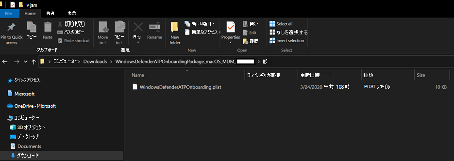

2. Jamf Proで、[新規] を **選択します**。

    

3. 次の詳細を入力します。

   **全般**
   - 名前: macOS の MDATP オンボーディング
   - 説明: mDATP EDR macOS のオンボーディング
   - カテゴリ: なし
   - 配布方法: 自動的にインストールする
   - レベル: コンピューター レベル

4. [**アプリケーション の設定&カスタム 設定** 構成] を **選択します**。

    

5. **[アップロードファイル (PLIST ファイル) を選択し、[基本設定ドメイン]** **に次を** 入力します `com.microsoft.wdav.atp` 。

    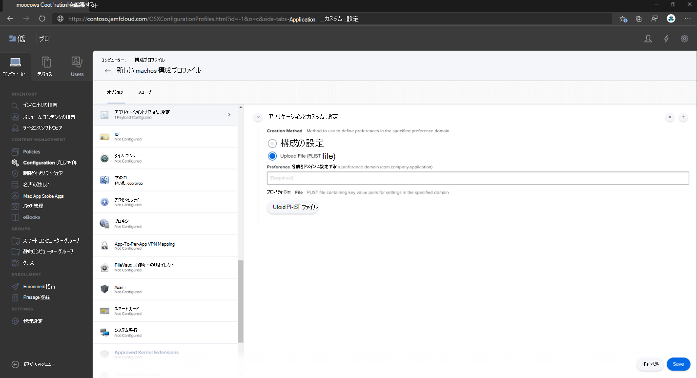

    

6. [開 **く] を** 選択し、オンボーディング ファイルを選択します。

    

7. [アップロード]**を選択します**。

    

8. [スコープ] **タブを選択** します。

    ![[スコープ] タブの画像。](images/jamfpro-scope-tab.png)

9. ターゲット コンピューターを選択します。

    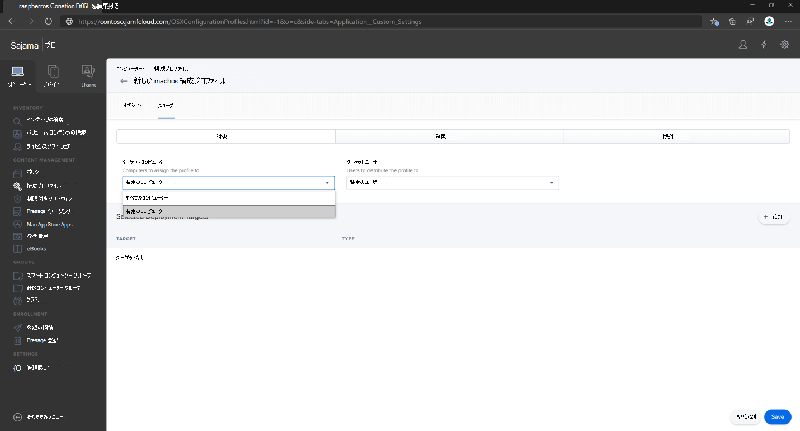

    

10. **[保存]** を選択します。

    

    

11. **[完了]** を選択します。

    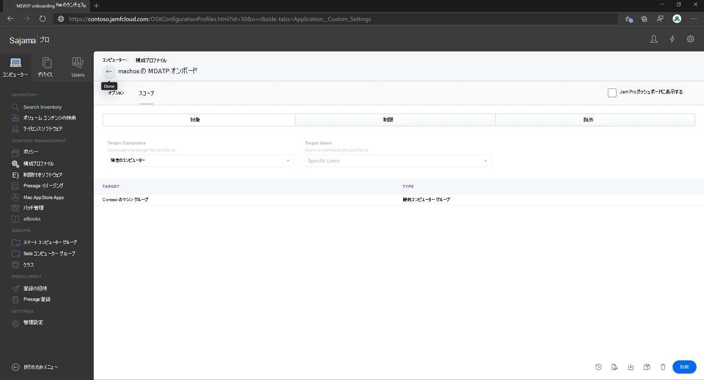

    

## <a name="step-3-configure-microsoft-defender-for-endpoint-settings"></a>手順 3: エンドポイントの Microsoft Defender の設定を構成する

JAMF Pro GUI を使用して Microsoft Defender 構成の個々の設定を編集するか、テキスト エディターで構成 Plist を作成して JAMF Pro にアップロードすることで従来のメソッドを使用できます。

ユーザー設定ドメインとして正確に使用する必要があります。Microsoft Defender では、この名前のみを使用し、管理設定 `com.microsoft.wdav`  `com.microsoft.wdav.ext` を読み込む必要があります。

(GUI メソッドを使用する場合はまれにバージョンを使用できますが、スキーマにまだ追加されていない設定を構成する `com.microsoft.wdav.ext` 必要があります)。

### <a name="gui-method"></a>GUI メソッド

1. Defender schema.jsリポジトリからファイルにGitHub[し](https://github.com/microsoft/mdatp-xplat/tree/master/macos/schema)、ローカル ファイルに保存します。

    ```bash
    curl -o ~/Documents/schema.json https://raw.githubusercontent.com/microsoft/mdatp-xplat/master/macos/schema/schema.json
    ```

2. [コンピューター- >構成プロファイル] の下に新しい構成プロファイルを作成し、[全般] タブに次の詳細を **入力** します。

    

    - 名前: MDATP MDAV 構成設定
    - 説明:\<blank\>
    - カテゴリ: なし (既定)
    - レベル: コンピューター レベル (既定)
    - 配布方法: 自動インストール (既定)

3. 下にスクロールして 、[アプリケーション &**カスタム** 設定] タブをクリックし、[外部アプリケーション] を選択し、[追加] をクリックして、カスタム スキーマをソースとして使用して、基本設定ドメインに使用します。 

    

4. [ `com.microsoft.wdav` 基本設定ドメイン] として入力し、[スキーマの追加] をクリックし **アップロード** 手順 1 でschema.jsを選択します。 **[保存]** をクリックします。

    

5. サポートされている Microsoft Defender 構成設定はすべて、以下の [基本設定ドメインのプロパティ] **の下に表示されます**。 [ **プロパティの追加と削除]** をクリックして、管理する設定を選択し **、[OK]** をクリックして変更を保存します。 (設定選択されていない場合、エンド ユーザーはそれらの設定を自分のコンピューターで構成できます。

    ![[管理設定] を選択します。](images/817b3b760d11467abe9bdd519513f54f.png)

6. 設定の値を目的の値に変更します。 [詳細] **をクリックすると、** 特定の設定のドキュメントを取得できます。 **([Plist プレビュー] をクリックして**、構成 plist の外観を確認できます。 [ **フォーム エディター] を** クリックしてビジュアル エディターに戻る)。

    

7. [スコープ] **タブを選択** します。

    

8. **[Contoso's Machine Group] を選択します**。

9. [追加 **] を** 選択し、[保存] **を選択します**。

    

    

10. **[完了]** を選択します。 新しい構成プロファイルが **表示されます**。

    

Microsoft Defender は、時間の間に新しい設定を追加します。 これらの新しい設定がスキーマに追加され、新しいバージョンが Github に発行されます。
更新を行う必要があるのは、更新されたスキーマのダウンロード、既存の構成プロファイルの編集、およびスキーマの編集を[アプリケーションの設定] タブで行&**する** 設定です。

### <a name="legacy-method"></a>従来のメソッド

1. 次の Microsoft Defender for Endpoint 構成設定を使用します。

    - enableRealTimeProtection
    - passiveMode

    > [!NOTE]
    > 既定ではオンにされません。macOS 用にサードパーティの AV を実行する予定の場合は、 に設定します `true` 。

    - 除外
    - excludedPath
    - excludedFileExtension
    - excludedFileName
    - exclusionsMergePolicy
    - allowedThreats

    > [!NOTE]
    > EICAR はサンプルに含め、概念実証を行う場合は、EICAR をテストする場合は特に削除してください。

    - disallowedThreatActions
    - potentially_unwanted_application
    - archive_bomb
    - cloudService
    - automaticSampleSubmission
    - tags
    - hideStatusMenuIcon

     詳細については [、「Jamf 構成プロファイルのプロパティ 一覧」を参照してください](mac-preferences.md#property-list-for-jamf-configuration-profile)。

     ```XML
     <?xml version="1.0" encoding="UTF-8"?>
     <!DOCTYPE plist PUBLIC "-//Apple//DTD PLIST 1.0//EN" "http://www.apple.com/DTDs/PropertyList-1.0.dtd">
     <plist version="1.0">
     <dict>
         <key>antivirusEngine</key>
         <dict>
             <key>enableRealTimeProtection</key>
             <true/>
             <key>passiveMode</key>
             <false/>
             <key>exclusions</key>
             <array>
                 <dict>
                     <key>$type</key>
                     <string>excludedPath</string>
                     <key>isDirectory</key>
                     <false/>
                     <key>path</key>
                     <string>/var/log/system.log</string>
                 </dict>
                 <dict>
                     <key>$type</key>
                     <string>excludedPath</string>
                     <key>isDirectory</key>
                     <true/>
                     <key>path</key>
                     <string>/home</string>
                 </dict>
                 <dict>
                     <key>$type</key>
                     <string>excludedFileExtension</string>
                     <key>extension</key>
                     <string>pdf</string>
                 </dict>
                 <dict>
                     <key>$type</key>
                     <string>excludedFileName</string>
                     <key>name</key>
                     <string>cat</string>
                 </dict>
             </array>
             <key>exclusionsMergePolicy</key>
             <string>merge</string>
             <key>allowedThreats</key>
             <array>
                 <string>EICAR-Test-File (not a virus)</string>
             </array>
             <key>disallowedThreatActions</key>
             <array>
                 <string>allow</string>
                 <string>restore</string>
             </array>
             <key>threatTypeSettings</key>
             <array>
                 <dict>
                     <key>key</key>
                     <string>potentially_unwanted_application</string>
                     <key>value</key>
                     <string>block</string>
                 </dict>
                 <dict>
                     <key>key</key>
                     <string>archive_bomb</string>
                     <key>value</key>
                     <string>audit</string>
                 </dict>
             </array>
             <key>threatTypeSettingsMergePolicy</key>
             <string>merge</string>
         </dict>
         <key>cloudService</key>
         <dict>
             <key>enabled</key>
             <true/>
             <key>diagnosticLevel</key>
             <string>optional</string>
             <key>automaticSampleSubmission</key>
             <true/>
         </dict>
         <key>edr</key>
         <dict>
             <key>tags</key>
             <array>
                 <dict>
                     <key>key</key>
                     <string>GROUP</string>
                     <key>value</key>
                     <string>ExampleTag</string>
                 </dict>
             </array>
         </dict>
         <key>userInterface</key>
         <dict>
             <key>hideStatusMenuIcon</key>
             <false/>
         </dict>
     </dict>
     </plist>
     ```

2. ファイルをとして保存します `MDATP_MDAV_configuration_settings.plist` 。

3. Jamf Proで、[コンピューター] を **開** き、[**構成プロファイル] を開きます**。 [**New] をクリックし* 、[全般] タブ **に切り替** えます。

    

4. 次の詳細を入力します。

    **全般**

    - 名前: MDATP MDAV 構成設定
    - 説明:\<blank\>
    - カテゴリ: なし (既定)
    - 配布方法: 自動インストール(既定)
    - Level: Computer Level(default)

    

5. [**アプリケーション の設定&カスタム 設定** 構成] を **選択します**。

    

6. [**ファイルアップロード (PLIST ファイル) を選択します**。

    

7. [**基本設定ドメイン] で** `com.microsoft.wdav` 、「PLIST ファイル」と入力アップロード **選択します**。

    

8. [ファイル **の選択] を選択します**。

    

9. **[MDATP_MDAV_configuration_settings.plist] を選択し、[** 開く] を **選択します**。

    

10. [アップロード]**を選択します**。

    

    

    >[!NOTE]
    >Intune ファイルをアップロードすると、次のようなエラー メッセージが表示されます。<br>
    >

11. **[保存]** を選択します。

    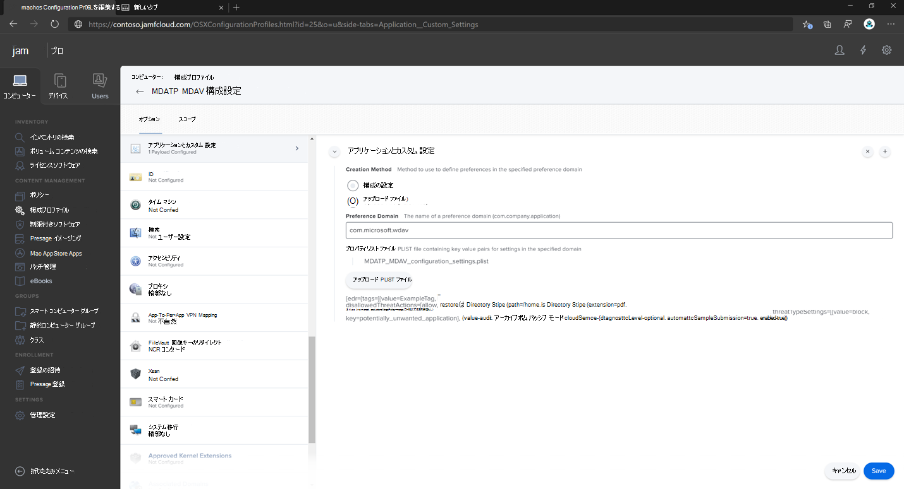

12. ファイルがアップロードされます。

    

    

13. [スコープ] **タブを選択** します。

    

14. **[Contoso's Machine Group] を選択します**。

15. [追加 **] を** 選択し、[保存] **を選択します**。

    

    

16. **[完了]** を選択します。 新しい構成プロファイルが **表示されます**。

    

## <a name="step-4-configure-notifications-settings"></a>手順 4: 通知の設定を構成する

これらの手順は、macOS 10.15 (Catalina) 以降に適用できます。

1. Jamf Proで、[コンピューター] 、[**構成** プロファイル]**の順に選択します**。

2. [ **新規] を** クリックし、[オプション] に次の詳細を **入力します**。

    - タブ **全般**:
        - **名前**: MDATP MDAV 通知の設定
        - **説明**: macOS 10.15 (Catalina) 以降
        - **カテゴリ**: なし *(既定)*
        - **配布方法**: 自動的にインストール *する (既定)*
        - **レベル**: コンピューター レベル *(既定)*

        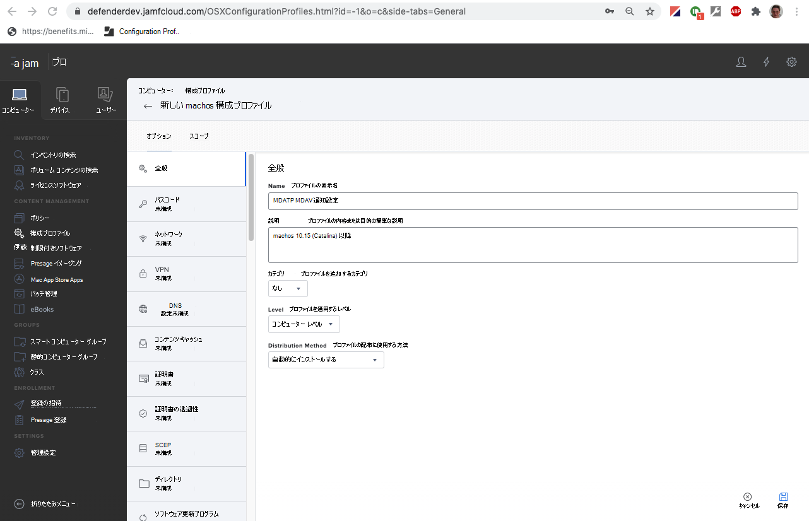

    - [タブ **通知]** をクリック **し、[追加**] をクリックし、次の値を入力します。
        - **バンドル ID**: `com.microsoft.wdav.tray`
        - **重大な通知**: [無効にする] **をクリックします。**
        - **通知**: [有効にする **] をクリックします。**
        - **バナー通知の種類**: [含める]**と [一時**]  *(既定) を選択します。*
        - **ロック画面の通知**: [非表示] **をクリックします。**
        - **通知センターの通知**: [表示] を **クリックします。**
        - **バッジ アプリのアイコン**: [表示] **をクリックします。**

        

    - Tab **Notifications**, Click **Add more time,** scroll down to **new Notifications** 設定
        - **バンドル ID**: `com.microsoft.autoupdate2`
        - 残りの設定を上記と同じ値に構成する

        

        通知構成が 2 つの 「テーブル」 に追加され、もう 1 つはバンドル ID : **com.microsoft.wdav.tray、** もう 1 つはバンドル **ID: com.microsoft.autoupdate2** です。 要件ごとにアラート設定を構成することもできますが、バンドル ID は前の説明とまったく同じにする必要があります。Include **スイッチは** 通知に対して **[オン] にする** 必要 **があります**。

3. [スコープ] **タブを選択** し、[追加] を **選択します**。

    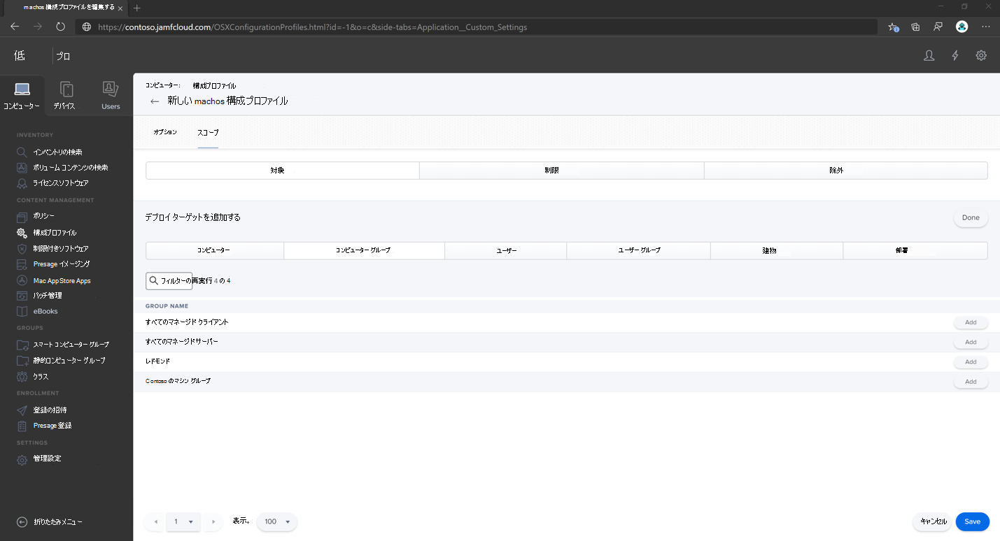

4. **[Contoso's Machine Group] を選択します**。

5. [追加 **] を** 選択し、[保存] **を選択します**。

    

    

6. **[完了]** を選択します。 新しい構成プロファイルが **表示されます**。
    

## <a name="step-5-configure-microsoft-autoupdate-mau"></a>手順 5: Microsoft AutoUpdate (MAU) を構成する

1. 次の Microsoft Defender for Endpoint 構成設定を使用します。

      ```XML
   <?xml version="1.0" encoding="UTF-8"?>
   <!DOCTYPE plist PUBLIC "-//Apple//DTD PLIST 1.0//EN" "http://www.apple.com/DTDs/PropertyList-1.0.dtd">
   <plist version="1.0">
   <dict>
    <key>ChannelName</key>
    <string>Current</string>
    <key>HowToCheck</key>
    <string>AutomaticDownload</string>
    <key>EnableCheckForUpdatesButton</key>
    <true/>
    <key>DisableInsiderCheckbox</key>
    <false/>
    <key>SendAllTelemetryEnabled</key>
    <true/>
   </dict>
   </plist>
   ```

2. として保存します `MDATP_MDAV_MAU_settings.plist` 。

3. Jamf のダッシュボードでPro [全般] を **選択します**。

    

4. 次の詳細を入力します。

    **全般**

    - 名前: MDATP MDAV MAU の設定
    - 説明: MacOS 用 MDATP の Microsoft AutoUpdate 設定
    - カテゴリ: なし (既定)
    - 配布方法: 自動インストール(既定)
    - Level: Computer Level(default)

5. [**アプリケーション の設定&カスタム 設定** 構成] を **選択します**。

    

6. [**ファイルアップロード (PLIST ファイル) を選択します**。

    

7. [**基本設定ドメイン]** に次 `com.microsoft.autoupdate2` を入力し、[PLIST **ファイルアップロードを選択します**。

    

8. [ファイル **の選択] を選択します**。

    

9. **[MDATP_MDAV_MAU_settings.plist] を選択します**。

    

10. [アップロード]**を選択します**。
    

    

11. **[保存]** を選択します。

    

12. [スコープ] **タブを選択** します。

     

13. **[追加]** を選択します。

    

    

    

14. **[完了]** を選択します。

    

## <a name="step-6-grant-full-disk-access-to-microsoft-defender-for-endpoint"></a>手順 6: エンドポイント用 Microsoft Defender へのフル ディスク アクセスを許可する

1. Jamf Proダッシュボードで、[**構成プロファイル] を選択します**。

    

2. [+ **新規] を選択します**。

3. 次の詳細を入力します。

    **全般**
    - 名前: MDATP MDAV - ディスクおよび AV へのフル ディスク アクセスEDR付与する
    - 説明: macOS Catalina 以降では、新しいプライバシー設定ポリシーコントロール
    - カテゴリ: なし
    - 配布方法: 自動的にインストールする
    - レベル: コンピューター レベル


    

4. [ **プライバシー設定の構成] ポリシーコントロールで、[構成** ] を **選択します**。

    

5. [ **プライバシー設定ポリシー制御] で、** 次の詳細を入力します。

    - 識別子: `com.microsoft.wdav`
    - 識別子の種類: バンドル ID
    - コード要件: `identifier "com.microsoft.wdav" and anchor apple generic and certificate 1[field.1.2.840.113635.100.6.2.6] /* exists */ and certificate leaf[field.1.2.840.113635.100.6.1.13] /* exists */ and certificate leaf[subject.OU] = UBF8T346G9`


    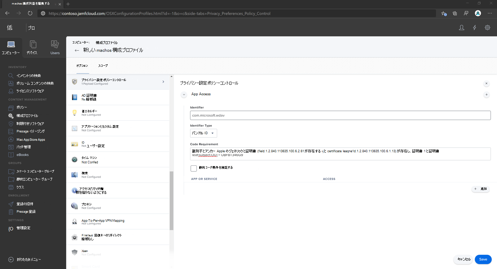

6. **[+ 追加]** を選択します。

    

    - [アプリまたはサービス] で **、SystemPolicyAllFiles に設定する**

    - [アクセス] の下: [許可] に **設定します。**

7. [ **保存]** を選択します (右下の保存は選択しない)。

    

8. [アプリ アクセス `+` ] の横にある **記号をクリックして** 、新しいエントリを追加します。

    

9. 次の詳細を入力します。

    - 識別子: `com.microsoft.wdav.epsext`
    - 識別子の種類: バンドル ID
    - コード要件: `identifier "com.microsoft.wdav.epsext" and anchor apple generic and certificate 1[field.1.2.840.113635.100.6.2.6] /* exists */ and certificate leaf[field.1.2.840.113635.100.6.1.13] /* exists */ and certificate leaf[subject.OU] = UBF8T346G9`

10. **[+ 追加]** を選択します。

    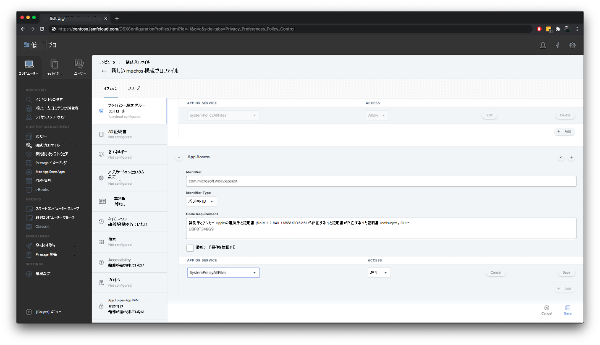

    - [アプリまたはサービス] で **、SystemPolicyAllFiles に設定する**

    - [アクセス] の下: [許可] に **設定します。**

11. [ **保存]** を選択します (右下の保存は選択しない)。

    

12. [スコープ] **タブを選択** します。

    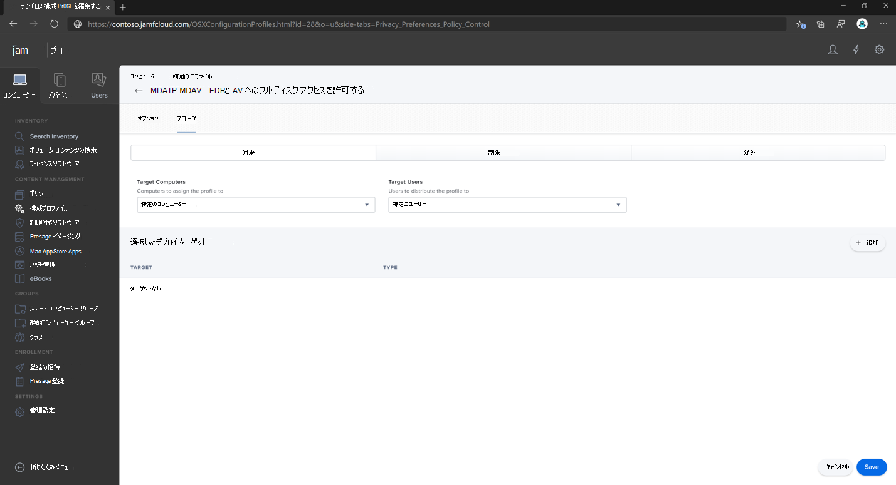

13. **[+ 追加]** を選択します。

    

14. [ **グループ名]** > [コンピューター グループ] **を** 選択> **Contoso の MachineGroup を選択します**。

    

15. **[追加]** を選択します。

16. **[保存]** を選択します。

17. **[完了]** を選択します。

    

    

または、「Jamf を使用したカスタム構成プロファイルの展開」の説明に従って[、fulldisk.mobileconfig](https://github.com/microsoft/mdatp-xplat/blob/master/macos/mobileconfig/profiles/fulldisk.mobileconfig)をダウンロードして JAMF 構成プロファイル[にアップロードPro|方法 2: アップロードプロファイルを Jamf ファイルにPro。](https://www.jamf.com/jamf-nation/articles/648/deploying-custom-configuration-profiles-using-jamf-pro)

## <a name="step-7-approve-kernel-extension-for-microsoft-defender-for-endpoint"></a>手順 7: Microsoft Defender for Endpoint のカーネル拡張機能を承認する

> [!CAUTION]
> Apple Silicon (M1) デバイスは KEXT をサポートしていない。 KEXT ポリシーからなる構成プロファイルのインストールは、これらのデバイスで失敗します。

1. [構成プロファイル **] で、[+** 新規 **] を選択します**。

    

2. 次の詳細を入力します。

    **全般**

    - 名前: MDATP MDAV カーネル拡張機能
    - 説明: MDATP カーネル拡張機能 (kext)
    - カテゴリ: なし
    - 配布方法: 自動的にインストールする
    - レベル: コンピューター レベル

    

3. [承認済 **みカーネル拡張機能の構成] で、[構成** ] を **選択します**。

    

4. [ **承認済みカーネル拡張機能]** で、次の詳細を入力します。

    - 表示名: Microsoft Corp.
    - チーム ID: UBF8T346G9

    

5. [スコープ] **タブを選択** します。

    

6. **[+ 追加]** を選択します。

7. [ **グループ名]** > [コンピューター グループ] **を>** Contoso の [コンピューター グループ] **を選択します**。

8. **[+ 追加]** を選択します。

    

9. **[保存]** を選択します。

    

10. **[完了]** を選択します。

    

または、「Jamf を使用したカスタム構成プロファイルの展開」の説明に従って[、kext.mobileconfig](https://github.com/microsoft/mdatp-xplat/blob/master/macos/mobileconfig/profiles/kext.mobileconfig)をダウンロードして JAMF 構成プロファイルに[アップロードPro|方法 2: アップロードプロファイルを Jamf ファイルにPro。](https://www.jamf.com/jamf-nation/articles/648/deploying-custom-configuration-profiles-using-jamf-pro)

## <a name="step-8-approve-system-extensions-for-microsoft-defender-for-endpoint"></a>手順 8: エンドポイント用 Microsoft Defender のシステム拡張機能を承認する

1. [構成プロファイル **] で、[+** 新規 **] を選択します**。

    

2. 次の詳細を入力します。

    **全般**

    - 名前: MDATP MDAV システム拡張機能
    - 説明: MDATP システム拡張機能
    - カテゴリ: なし
    - 配布方法: 自動的にインストールする
    - レベル: コンピューター レベル

    

3. [ **システム拡張機能] で、[構成** ] を **選択します**。

   

4. [System **Extensions] に次** の詳細を入力します。

   - 表示名: Microsoft Corp. System Extensions
   - システム拡張の種類: 許可されているシステム拡張機能
   - チーム識別子: UBF8T346G9
   - 許可されるシステム拡張機能:
     - **com.microsoft.wdav.epsext**
     - **com.microsoft.wdav.netext**

    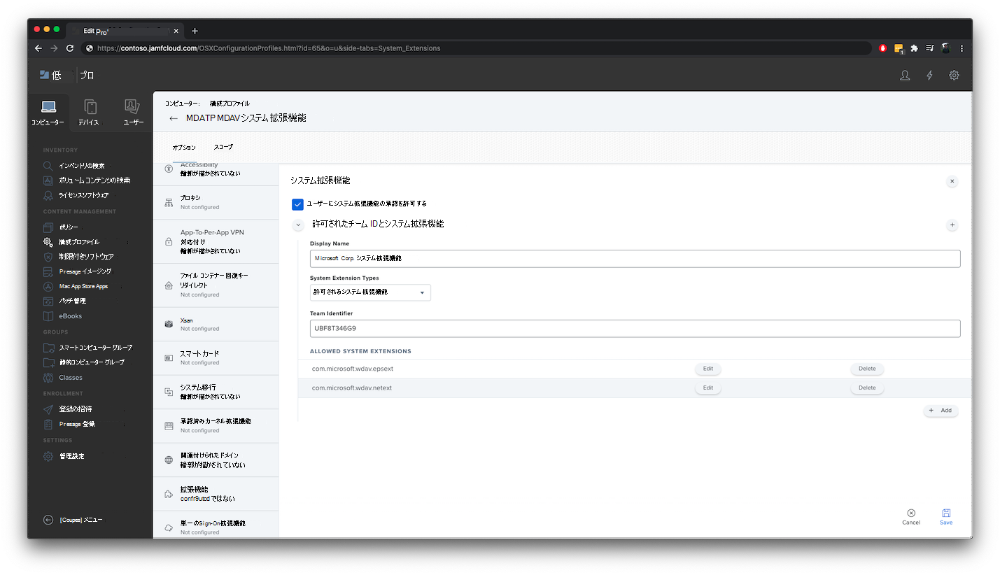

5. [スコープ] **タブを選択** します。

    

6. **[+ 追加]** を選択します。

7. [ **グループ名]** > [コンピューター グループ] **を>** Contoso の [コンピューター グループ] **を選択します**。

8. **[+ 追加]** を選択します。

   

9. **[保存]** を選択します。

   

10. **[完了]** を選択します。

    

## <a name="step-9-configure-network-extension"></a>手順 9: ネットワーク拡張機能を構成する

エンドポイント検出および応答機能の一環として、macOS 上の Microsoft Defender for Endpoint はソケット トラフィックを検査し、この情報をポータルMicrosoft Defender セキュリティ センターします。 次のポリシーでは、ネットワーク拡張機能でこの機能を実行できます。

これらの手順は、macOS 10.15 (Catalina) 以降に適用できます。

1. Jamf Proで、[コンピューター] 、[**構成** プロファイル]**の順に選択します**。

2. [ **新規] を** クリックし、[オプション] に次の詳細を **入力します**。

    - タブ **全般**:
        - **名前**: Microsoft Defender ATP ネットワーク拡張機能
        - **説明**: macOS 10.15 (Catalina) 以降
        - **カテゴリ**: なし *(既定)*
        - **配布方法**: 自動的にインストール *する (既定)*
        - **レベル**: コンピューター レベル *(既定)*

    - タブ **コンテンツ フィルター**:
        - **フィルター名**: Microsoft Defender ATP コンテンツ フィルター
        - **識別子**: `com.microsoft.wdav`
        - サービス **アドレス 、****組織、****ユーザー名、** パスワード、**証明書** を空白のままにする **(Include** *は* 選択されません) 
        - **フィルターの順序**: Inspector
        - **ソケット フィルター**: `com.microsoft.wdav.netext`
        - **ソケット フィルターの指定要件**: `identifier "com.microsoft.wdav.netext" and anchor apple generic and certificate 1[field.1.2.840.113635.100.6.2.6] /* exists */ and certificate leaf[field.1.2.840.113635.100.6.1.13] /* exists */ and certificate leaf[subject.OU] = UBF8T346G9`
        - [ **ネットワーク フィルター] フィールド** を空白のままにします **([含** める *] は* 選択されません)

        識別子、 **ソケット フィルター** **、ソケット フィルター** の指定 **された** 要件の正確な値は、上記で指定したとおりです。

        

3. [スコープ] **タブを選択** します。

   ![[構成設定] [sco] タブのイメージ。](images/0df36fc308ba569db204ee32db3fb40a.png)

4. **[+ 追加]** を選択します。

5. [ **グループ名]** > [コンピューター グループ] **を>** Contoso の [コンピューター グループ] **を選択します**。

6. **[+ 追加]** を選択します。

    

7. **[保存]** を選択します。

    

8. **[完了]** を選択します。

    

または、「Jamf を使用したカスタム構成プロファイルの展開」の説明に従って[、netfilter.mobileconfig](https://github.com/microsoft/mdatp-xplat/blob/master/macos/mobileconfig/profiles/netfilter.mobileconfig)をダウンロードして JAMF 構成プロファイル[にアップロードPro|方法 2: アップロードプロファイルを Jamf ファイルにPro。](https://www.jamf.com/jamf-nation/articles/648/deploying-custom-configuration-profiles-using-jamf-pro)

## <a name="step-10-schedule-scans-with-microsoft-defender-for-endpoint-on-macos"></a>手順 10: macOS で Microsoft Defender for Endpoint でスキャンをスケジュールする

macOS の Microsoft Defender for Endpoint でスキャンをスケジュール [するの手順に従います](/windows/security/threat-protection/microsoft-defender-atp/mac-schedule-scan-atp)。

## <a name="step-11-deploy-microsoft-defender-for-endpoint-on-macos"></a>手順 11: macOS に Microsoft Defender for Endpoint を展開する

1. 保存した場所に移動します `wdav.pkg` 。

    

2. に名前を変更します `wdav_MDM_Contoso_200329.pkg` 。

    

3. Jamf ダッシュボードをProします。

    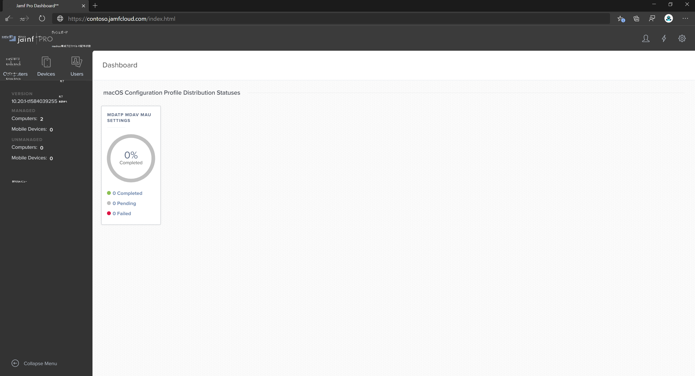

4. コンピューターを選択し、上部の歯車アイコンをクリックし、[コンピューターの管理] **を選択します**。

    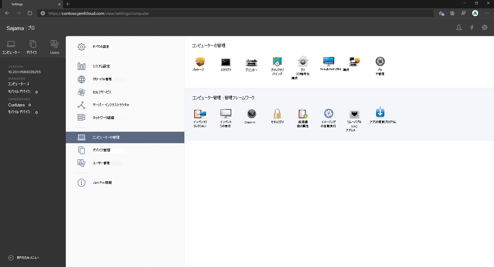

5. [パッケージ **] で**、[+ **新規] を選択します**。
    

6. [ **新しいパッケージ]** で、次の詳細を入力します。

    **[全般] タブ**
    - 表示名: 空白のままにしておきます。 pkg を選択するとリセットされます。
    - カテゴリ: なし (既定)
    - ファイル名: [ファイル] を選択します。

    ![構成設定の [全般] タブのイメージ。](images/21de3658bf58b1b767a17358a3f06341.png)

    ファイルを開き、またはをポイント `wdav.pkg` します `wdav_MDM_Contoso_200329.pkg` 。

    

7. [**開く**]を選択します。 [表示名 **] を**[Microsoft Defender Advanced Threat Protection] に設定 **し、Microsoft Defender ウイルス対策。**

    **マニフェスト ファイル** は必須ではありません。 Microsoft Defender for Endpoint はマニフェスト ファイルなしで動作します。

    **オプション タブ**<br> 既定値を保持します。

    **[制限] タブ**<br> 既定値を保持します。

     ![[構成設定の制限] タブのイメージ。](images/56dac54634d13b2d3948ab50e8d3ef21.png)

8. **[保存]** を選択します。 パッケージは Jamf ファイルにアップロードPro。

   

   パッケージを展開に使用するには数分かかる場合があります。

   

9. [ポリシー] **ページに移動** します。

    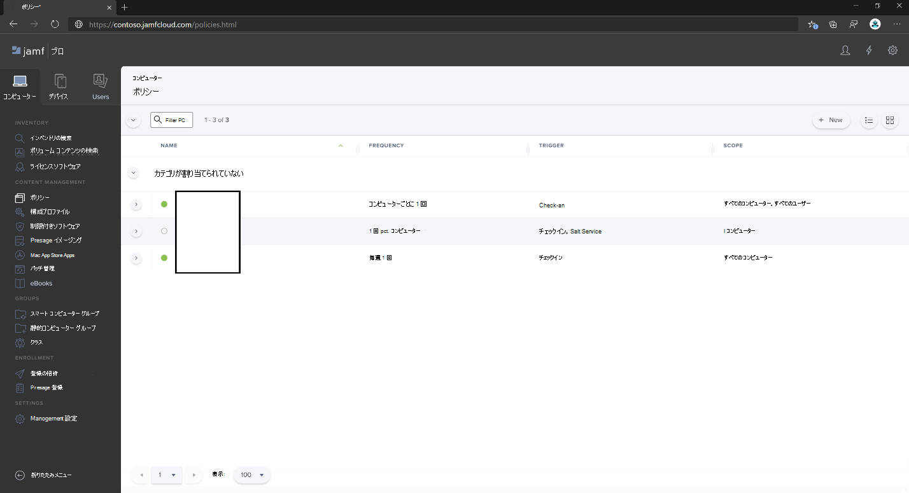

10. [+ **新規] を** 選択して新しいポリシーを作成します。

    


11. [ **全般]** 次の詳細を入力します。

    - 表示名: MDATP Onboarding Contoso 200329 v100.86.92 以降

    

12. [ **定期的なチェックイン] を選択します**。

    

13. **[保存]** を選択します。

14. [パッケージ **] を選択>構成します**。

    

15. [Microsoft **Defender Advanced Threat** Protection] の横にある [追加] ボタンを **選択し、Microsoft Defender ウイルス対策。**

    

16. **[保存]** を選択します。

    

17. [スコープ] **タブを選択** します。

    

18. ターゲット コンピューターを選択します。

    

    **スコープ**

    **[追加]** を選択します。

    

    

    **セルフサービス**

    

19. **[完了]** を選択します。

    

    
