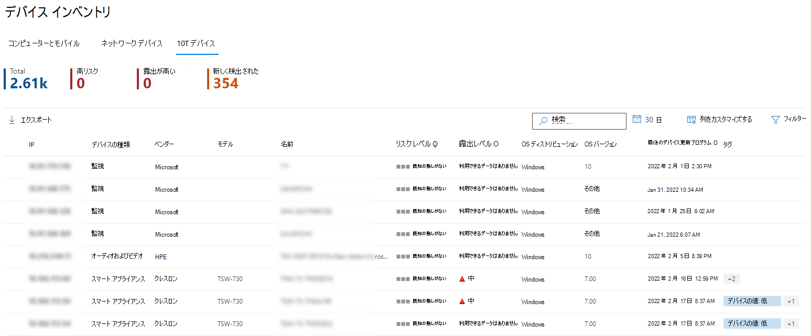
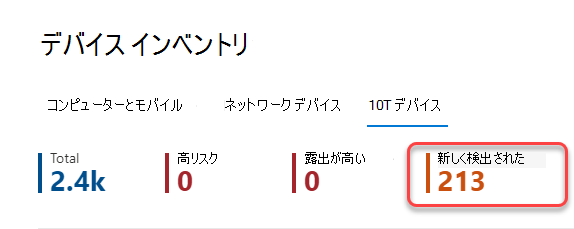

# デバイス一覧

[!INCLUDE [Microsoft 365 Defender rebranding](../../includes/microsoft-defender.md)]

**適用対象:**

- [Microsoft Defender for Endpoint Plan 1](https://go.microsoft.com/fwlink/p/?linkid=2154037)
- [Microsoft Defender for Endpoint Plan 2](https://go.microsoft.com/fwlink/p/?linkid=2154037)
- [Microsoft 365 Defender](https://go.microsoft.com/fwlink/?linkid=2118804)

> Defender for Endpoint を試す場合は、 [無料試用版にサインアップしてください。](https://signup.microsoft.com/create-account/signup?products=7f379fee-c4f9-4278-b0a1-e4c8c2fcdf7e&ru=https://aka.ms/MDEp2OpenTrial?ocid=docs-wdatp-machinesview-abovefoldlink)

**デバイスの一覧** には、アラートが生成されたネットワーク内のデバイスの一覧が表示されます。 既定では、過去 30 日間に表示されたデバイスがキューに表示されます。

一目で、ドメイン、リスク レベル、OS プラットフォームなどの情報が表示され、最も危険なデバイスを簡単に識別できます。

デバイスリスト ビューをカスタマイズするには、いくつかのオプションを選択できます。 上部のナビゲーションでは、次の操作を行うことができます。

- 列を追加または削除する
- 一覧全体を CSV 形式でエクスポートする
- ページごとに表示するアイテムの数を選択する
- フィルターの適用

オンボード プロセス中に、センサー データの報告を開始すると、 **デバイスの一覧** にデバイスが徐々に設定されます。 このビューを使用して、オンボードされたエンドポイントがオンラインになった時点を追跡したり、オフライン分析用の CSV ファイルとして完全なエンドポイント 一覧をダウンロードしたりできます。

> [!NOTE]
> デバイスリストをエクスポートすると、組織内のすべてのデバイスが含まれます。 組織の規模によっては、ダウンロードにかなりの時間がかかる場合があります。 リストを CSV 形式でエクスポートすると、フィルター処理されていない方法でデータが表示されます。 CSV ファイルには、ビュー自体に適用されるフィルター処理に関係なく、組織内のすべてのデバイスが含まれます。

:::image type="content" source="images/device-inventory.png" alt-text="デバイスの一覧" lightbox="images/device-inventory.png":::

## デバイスの一覧を並べ替え、フィルター処理する

次のフィルターを適用して、アラートの一覧を制限し、より焦点を絞ったビューを取得できます。

### デバイス名

Microsoft Defender for Endpointオンボード プロセス中、MDE にオンボードされたデバイスは、センサー データの報告を開始すると、徐々にデバイス インベントリに入力されます。 この後、デバイス インベントリは、デバイス検出プロセスを通じてネットワーク内で検出されたデバイスによって設定されます。 デバイス インベントリには、次の 3 つのタブがあります。

- **コンピューターとモバイル**: Enterprise エンドポイント (ワークステーション、サーバー、モバイル デバイス)
- **ネットワーク デバイス**: ルーターやスイッチなどのデバイス
- **IoT デバイス**: プリンターやカメラなどのデバイス

## [デバイス インベントリ] ページに移動する

[Microsoft 365 Defender ポータル](/defender/microsoft-365-security-center-mde)の **[エンドポイント**] ナビゲーション メニューから **[デバイス インベントリ**] を選択して、デバイス インベントリ ページにアクセスします。

## デバイス インベントリの概要

デバイス インベントリが [ **コンピューターとモバイル** ] タブで開きます。デバイス名、ドメイン、リスク レベル、露出レベル、OS プラットフォーム、オンボード状態、センサーの正常性状態などの情報を一目で確認して、最も危険にさらされているデバイスを簡単に識別できます。

**[オンボード状態] 列を** 使用して、検出されたデバイスと、既にMicrosoft Defender for Endpointにオンボードされているデバイスで並べ替えとフィルター処理を行います。

[ **ネットワーク デバイス** ] タブと [ **IoT デバイス** ] タブには、ベンダー、モデル、デバイスの種類などの情報も表示されます。

各デバイス インベントリ タブの上部には、デバイスの合計数、まだオンボードされていないデバイスの数、組織のリスクが高いと特定されたデバイスの数が表示されます。 この情報を使用すると、セキュリティ体制の改善のためにデバイスの優先順位を付けることができます。

[ネットワーク デバイスと IoT デバイスの **新しく検出された** デバイス数] タブには、検出された新しいデバイスの数 (過去 7 日間) が現在のビューに一覧表示されます。

## デバイス インベントリを調べる

デバイス インベントリ ビューをカスタマイズするには、いくつかのオプションを選択できます。 各タブの上部のナビゲーションでは、次の操作を行うことができます。

- 名前でデバイスを検索する
- 最近使用した IP アドレスまたは IP アドレス プレフィックスでデバイスを検索する
- 列を追加または削除する
- オフライン分析のためにリスト全体を CSV 形式でエクスポートする
- 表示する日付範囲を選択する
- フィルターの適用

> [!NOTE]
> デバイスリストをエクスポートすると、組織内のすべてのデバイスが含まれます。 組織の規模によっては、ダウンロードにかなりの時間がかかる場合があります。 リストを CSV 形式でエクスポートすると、フィルター処理されていない方法でデータが表示されます。 CSV ファイルには、ビュー自体に適用されるフィルター処理に関係なく、組織内のすべてのデバイスが含まれます。

各デバイス インベントリ タブで使用できる並べ替え機能とフィルター機能を使用して、より焦点を絞ったビューを取得し、組織内のデバイスを評価および管理するのに役立ちます。

各タブの上部のカウントは、現在のビューに基づいて更新されます。

## フィルターを使用してデバイス インベントリ ビューをカスタマイズする

フィルター | 説明
:---|:---
**リスク レベル**   | リスク レベルは、デバイス上のアクティブなアラートの種類や重大度など、要因の組み合わせに基づいて、デバイスの全体的なリスク評価を反映します。 アクティブなアラートを解決し、修復アクティビティを承認し、後続のアラートを抑制すると、リスク レベルが低下する可能性があります。
**露出レベル**   | 露出レベルは、保留中のセキュリティ推奨事項の累積的な影響に基づいて、デバイスの現在の露出を反映します。 可能なレベルは低、中、高です。 露出が低いということは、デバイスが悪用の影響を受けにくいという意味です。     露出レベルに "データが利用できない" と表示される場合、次のような理由がいくつかあります。 - デバイスが 30 日間以上レポートを停止しました。 その場合は非アクティブと見なされ、露出は計算されません。 - デバイス OS がサポートされていません - [Microsoft Defender for Endpointの最小要件を](/microsoft-365/security/defender-endpoint/minimum-requirements)参照してください。 - 古いエージェントを持つデバイス (可能性は低い)。
**Tags**   | 個々のデバイスに追加したグループ化とタグ付けに基づいて、リストをフィルター処理します。 [デバイス タグの作成と管理に関するページを](machine-tags.md)参照してください。
**デバイスの値**  | デバイスが高い値と低い値のどちらとしてマークされているかに基づいて、リストをフィルター処理します。
**除外状態**   | デバイスが除外されたかどうかに基づいて、一覧をフィルター処理します。 詳細については、「デバイスを [除外する](exclude-devices.md)」を参照してください。
**OS プラットフォーム**  | 調査対象の OS プラットフォームでフィルター処理する   (_コンピューターとモバイルおよび IoT デバイスのみ_)
**最初に見た**   | デバイスがネットワークで初めて表示されたとき、またはデバイスがMicrosoft Defender for Endpoint センサーによって最初に報告されたタイミングに基づいてビューをフィルター処理します。  (_コンピューターとモバイルおよび IoT デバイスのみ_)
**Windows バージョン**   | 調査対象のWindowsバージョンでフィルター処理します。   (_コンピューターとモバイルのみ_)
**センサーの正常性状態**   | Microsoft Defender for Endpointにオンボードされているデバイスの場合は、次のセンサーの正常性状態でフィルター処理します。  - **アクティブ**: センサー データをサービスにアクティブに報告しているデバイス。  - **非アクティブ**: 7 日以上シグナルの送信を停止したデバイス。   - **構成が正しくない**: サービスとの通信が妨げているか、センサー データを送信できないデバイス。   構成が正しくないデバイスは、さらに次のように分類できます。    - センサー データなし    - 通信の障害    正しく構成されていないデバイスの問題に対処する方法の詳細については、「 [異常なセンサーを修正](/microsoft-365/security/defender-endpoint/fix-unhealthy-sensors)する」を参照してください。   (_コンピューターとモバイルのみ_)
**オンボードの状態**   | オンボード状態は、デバイスが現在Microsoft Defender for Endpointにオンボードされているかどうかを示します。 次の状態でフィルター処理できます。   - **オンボード済み**: エンドポイントはMicrosoft Defender for Endpointにオンボードされます。    - **オンボード可能**: エンドポイントは、サポートされているデバイスとしてネットワーク内で検出されましたが、現在オンボードされていません。 Microsoft では、これらのデバイスのオンボードを非常に推奨しています。   - **サポートされていません**:エンドポイントはネットワーク内で検出されましたが、Microsoft Defender for Endpointではサポートされていません。   - **情報が不十分** です。システムはデバイスのサポート可能性を判断できませんでした。   (_コンピューターとモバイルのみ_)
**ウイルス対策の状態**   | ウイルス対策の状態が無効になっているか、更新されていないか不明かに基づいてビューをフィルター処理します。   (_コンピューターとモバイルのみ_)
**Group**   | 調査対象のグループに基づいてリストをフィルター処理します。    (_コンピューターとモバイルのみ_)
**Managed by**   | 管理対象は、デバイスの管理方法を示します。 次の条件でフィルター処理できます。 - Microsoft Defender for Endpoint   - モバイル デバイス管理 (MDM)  - 不明: 古いWindows バージョンの実行、SCCM の実行、または別のサード パーティ MDM が原因である可能性があります。   (_コンピューターとモバイルのみ_)
**デバイスの種類**   | 調査するデバイスの種類でフィルター処理します。   (_IoT デバイスのみ_)

## 列を使用してデバイス インベントリ ビューをカスタマイズする

表示から列を追加または削除し、使用可能な列ヘッダーをクリックしてエントリを並べ替えることができます。

[ **コンピューターとモバイル** ] タブで、[ **列のカスタマイズ** ] を選択して使用可能な列を表示します。 次の図では、既定値がチェックされます。

[ **ネットワーク デバイス** ] タブで、[ **列のカスタマイズ** ] を選択して、使用可能な列を表示します。 次の図では、既定値がチェックされます。

[ **IoT デバイス** ] タブで、[ **列のカスタマイズ** ] を選択して、使用可能な列を表示します。 次の図では、既定値がチェックされます。

## 関連記事

[Microsoft Defender for Endpoint デバイスの一覧のデバイスを調査する](investigate-machines.md)
