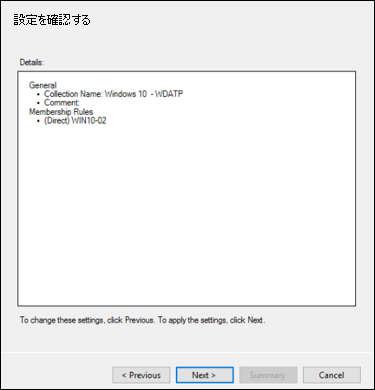
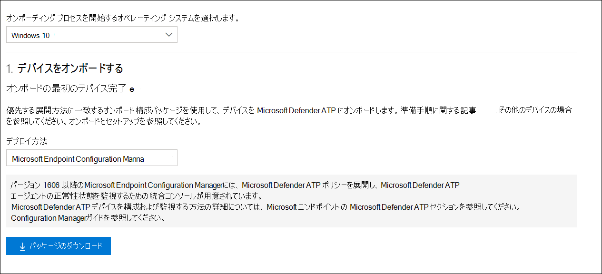
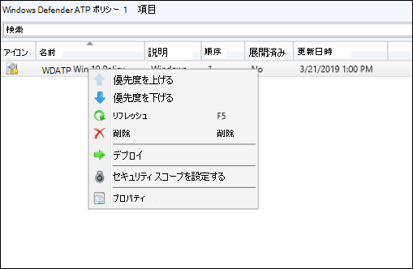
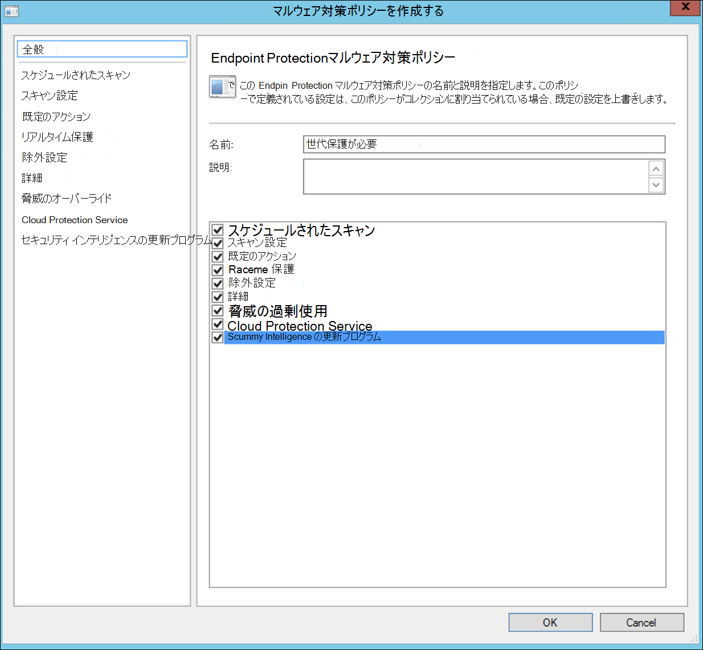
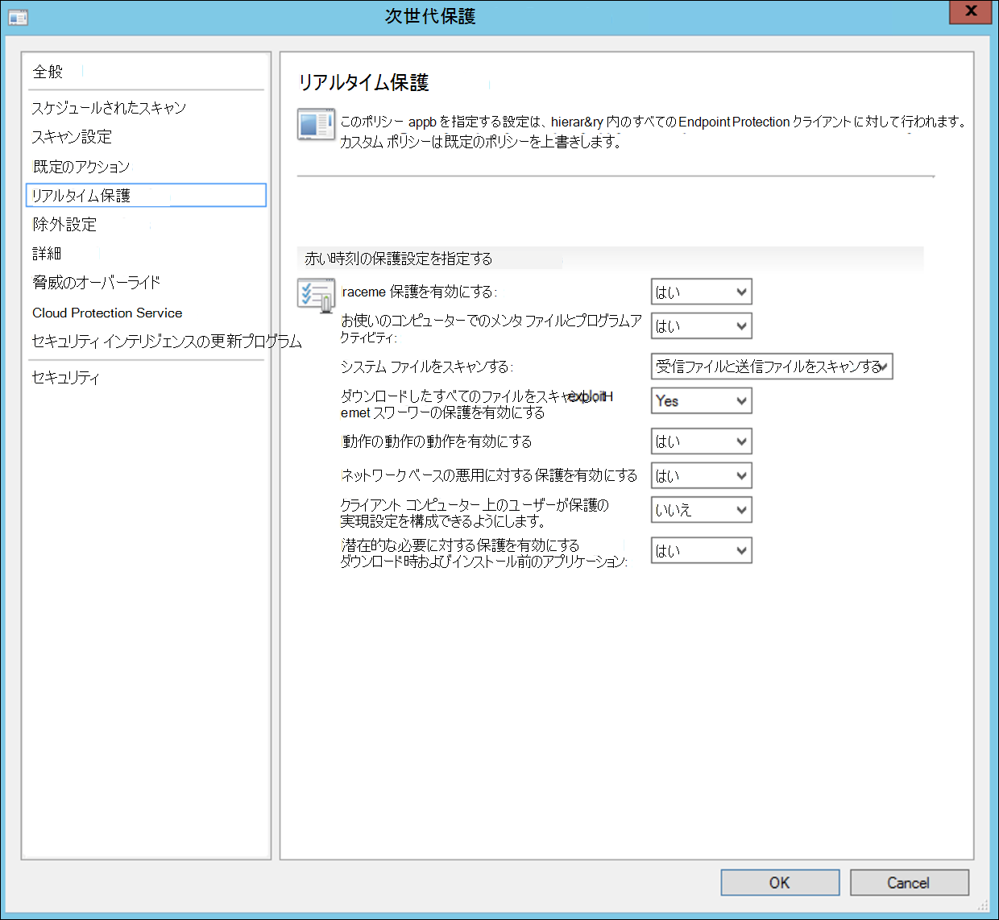
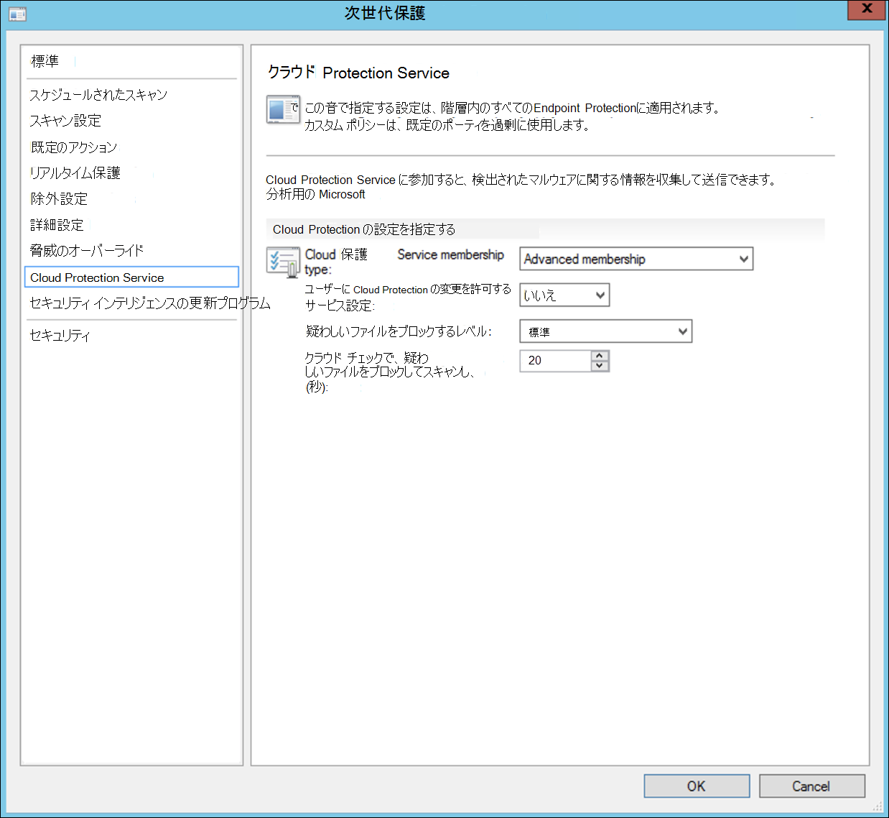
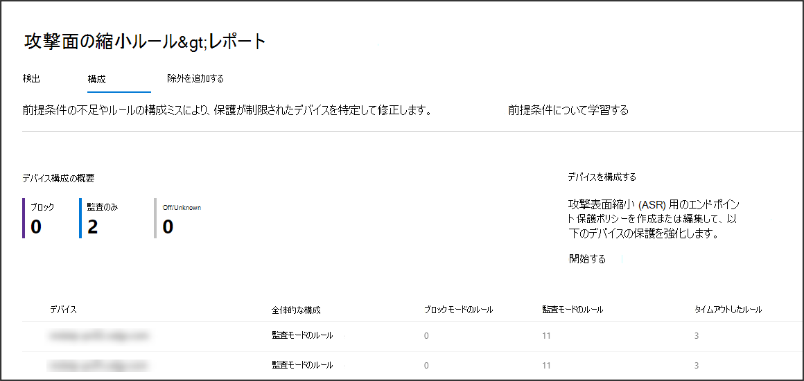

# Microsoft Endpoint Configuration Manager を使用したオンボーディング

[!INCLUDE [Microsoft 365 Defender rebranding](../../includes/microsoft-defender.md)]

**適用対象:**
- [Microsoft Defender for Endpoint](https://go.microsoft.com/fwlink/p/?linkid=2154037)
- [Microsoft 365 Defender](https://go.microsoft.com/fwlink/?linkid=2118804)

> Microsoft Defender ATP を試してみたいですか? [無料試用版にサインアップしてください。](https://signup.microsoft.com/create-account/signup?products=7f379fee-c4f9-4278-b0a1-e4c8c2fcdf7e&ru=https://aka.ms/MDEp2OpenTrial?ocid=docs-wdatp-exposedapis-abovefoldlink)

この記事は展開ガイドの一部であり、オンボーディング方法の例として機能します。

「計画 [」トピック](deployment-strategy.md) では、デバイスをサービスにオンボードする方法がいくつか用意されています。 このトピックでは、共同管理アーキテクチャについて説明します。

*環境アーキテクチャの図*

Defender for Endpoint はさまざまなエンドポイントとツールのオンボーディングをサポートしますが、この記事ではそれらをカバーしません。 サポートされている他の展開ツールと方法を使用した一般的なオンボーディングの詳細については、「オンボードの概要 [」を参照してください](onboarding.md)。

このトピックでは、次のユーザーをガイドします。

- 手順 1: サービスWindowsデバイスをオンボーディングする
- 手順 2: Defender for Endpoint の機能を構成する

このオンボーディング ガイダンスでは、次の基本的な手順について説明します。このガイドでは、ユーザーの使用に必要なMicrosoft Endpoint Configuration Manager。

- **コレクションの作成Microsoft Endpoint Configuration Manager**
- **Microsoft Defender for Endpoint の機能を構成するには、Microsoft Endpoint Configuration Manager**

> [!NOTE]
> この展開Windowsでは、このデバイスのみを対象とします。

## 手順 1: デバイスを使用WindowsデバイスをオンボードMicrosoft Endpoint Configuration Manager

### コレクションの作成

既存のWindows 10デバイスMicrosoft Endpoint Configuration Managerオンボーディングするには、展開で既存のコレクションをターゲットにするか、テスト用に新しいコレクションを作成できます。

グループ ポリシーや手動メソッドなどのツールを使用したオンボーディングでは、システムにエージェントはインストールされない。

コンソール内Microsoft Endpoint Configuration Managerオンボーディング プロセスは、コンソール内のコンプライアンス設定の一部として構成されます。

この必要な構成を受け取るシステムは、Configuration Manager クライアントが管理ポイントからこのポリシーを受け取り続ける限り、その構成を維持します。

以下の手順に従って、デバイスを使用してエンドポイントをオンボードMicrosoft Endpoint Configuration Manager。

1. コンソールMicrosoft Endpoint Configuration Manager、[アセット] と [**コンプライアンスの概要] \> デバイス コレクション \> に移動します**。

    

2. [デバイス コレクション] **を右クリックし** 、[デバイス コレクション **の作成] を選択します**。

    

3. [名前]**と [制限****コレクション] を指定し、[** 次へ] を **選択します**。

    

4. [ルール **の追加] を選択** し、[ **クエリ ルール] を選択します**。

    

5. [直接 **メンバーシップ ウィザード** ] で **[次へ] をクリックし** 、[クエリ ステートメントの **編集] をクリックします**。

     

6. [ **条件] を** 選択し、星のアイコンを選択します。

     

7. 条件の種類を **単純な** 値として保持し、オペレーティング システム **-** ビルド番号 、演算子の値が **14393** 以上の場合は、OK をクリックする場所を選択 **します**。

    

8. [次 **へ] と [** 閉じる] **を選択します**。

    

9. [**次へ**] を選択します。

    

このタスクを完了すると、環境内のすべてのエンドポイントWindows 10デバイス コレクションが作成されます。

## 手順 2: Microsoft Defender for Endpoint の機能を構成する

このセクションでは、デバイス上のデバイスを使用して次の機能Microsoft Endpoint Configuration Manager構成Windowsします。

- [**エンドポイントでの検出と対応**](#endpoint-detection-and-response)
- [**次世代の保護**](#next-generation-protection)
- [**攻撃面の減少**](#attack-surface-reduction)

### エンドポイントの検出および応答

#### Windows 10

Microsoft 365 Defender ポータル内から、System Center Configuration Manager でポリシーを作成し、そのポリシーを Windows 10 デバイスに展開するために使用できる '.onboarding' ポリシーをダウンロードできます。

1. 新しいポータルMicrosoft 365 Defender、[オンボーディング][設定を選択します](https://security.microsoft.com/preferences2/onboarding)。

2. [展開方法] で、サポートされているバージョンのファイルを **Microsoft Endpoint Configuration Manager。**

    

3. [パッケージ **のダウンロード] を選択します**。

    

4. パッケージをアクセス可能な場所に保存します。
5. [Microsoft Endpoint Configuration Managerに移動します。 [アセットとコンプライアンス] > Microsoft Defender ATP ポリシー **> Endpoint Protection >に移動します**。

6. [Microsoft **Defender ATP ポリシー] を右クリックし、[Microsoft** Defender ATP ポリシー **の作成] を選択します**。

    

7. 名前と説明を入力し、[ **オン** ボーディング] が選択されている場合は、[次へ] を選択 **します**。

    

8. [ **参照**] をクリックします。

9. 上記の手順 4 からダウンロードしたファイルの場所に移動します。

10. [**次へ**] をクリックします。
11. 適切なサンプル (None または All ファイルの種類)**を使用****してエージェントを構成します**。

    

12. 適切な利用統計情報 (標準または **迅速) を****選択し**、[次へ] を **クリックします**。

    

13. 構成を確認し、[次へ] を **クリックします**。

     

14. ウィザードが **完了したら** 、[閉じる] をクリックします。

15. コンソールでMicrosoft Endpoint Configuration Manager作成した Defender for Endpoint ポリシーを右クリックし、[展開] を **選択します**。

     

16. 右側のパネルで、前に作成したコレクションを選択し **、[OK] をクリックします**。

    

#### 以前のバージョンの Windows クライアント (Windows 7 および Windows 8.1)

以下の手順に従って、以前のバージョンのデバイスのオンボーディングに必要な Defender for Endpoint Workspace ID と Workspace Key を特定Windows。

1. [デバイスのMicrosoft 365 Defender] で、[エンドポイント設定オンボーディング] \>  \> を **選択します**。

2. [オペレーティング システム] で **、[Windows 7 SP1 と 8.1] を選択します**。

3. ワークスペース **ID とワークスペース キー****をコピーして** 保存します。 これらは、プロセスの後半で使用されます。

    

4. [インストール] Microsoft Monitoring Agent (MMA) をインストールします。

   MMA は現在 (2019 年 1 月現在) 次のオペレーティング システムWindowsサポートされています。

   - サーバー SKU: Windows Server 2008 SP1 以降
   - クライアント SKU: Windows 7 SP1 以降

   MMA エージェントをデバイスにインストールするWindowsがあります。 エージェントをインストールするには、MMA を使用してデータを収集するために、一部のシステムでカスタマー エクスペリエンスと診断テレメトリの更新プログラムをダウンロードする必要があります。 これらのシステム バージョンには、次のものが含まれますが、これらに限定されない場合があります。

   - Windows 8.1
   - Windows 7
   - Windows Server 2016
   - Windows Server 2012 R2
   - Windows Server 2008 R2

   具体的には、Windows 7 SP1 の場合は、次のパッチをインストールする必要があります。

   - [KB4074598 のインストール](https://support.microsoft.com/help/4074598/windows-7-update-kb4074598)
   - [4.5 .NET Framework (以降](https://www.microsoft.com/download/details.aspx?id=30653)**)** または [KB3154518 のいずれかをインストールします](https://support.microsoft.com/help/3154518/support-for-tls-system-default-versions-included-in-the-net-framework)。 両方を同じシステムにインストールしない。

5. プロキシを使用してインターネットに接続する場合は、「プロキシ設定の構成」セクションを参照してください。

完了すると、1 時間以内にポータルにオンボード エンドポイントが表示されます。

### 次世代の保護

Windows Defender ウイルス対策は、デスクトップ、ポータブル コンピューター、サーバーを対象に次世代の保護機能を提供する、組み込みのマルウェア対策ソリューションです。

1. このコンソールMicrosoft Endpoint Configuration Manager、マルウェア対策ポリシーの [アセットと **\> \> コンプライアンスEndpoint Protection] \>** に移動し、[マルウェア対策ポリシーの作成]**を選択します**。

    

2. [**スケジュールされたスキャン****]、[** スキャン設定]、[既定のアクション]、[リアルタイム保護]、[除外設定]、[詳細設定]、[脅威の上書き]、**クラウド保護サービス** とセキュリティ インテリジェンスの更新を選択し **、[OK] を選択します**。   

    

    特定の業界または一部の企業のお客様は、ウイルス対策の構成方法に関する特定のニーズを持っている場合があります。

    [クイック スキャンとフル スキャン、およびカスタム スキャン](/windows/security/threat-protection/microsoft-defender-antivirus/scheduled-catch-up-scans-microsoft-defender-antivirus#quick-scan-versus-full-scan-and-custom-scan)

    詳細については、「Windows セキュリティ[構成フレームワーク」を参照してください](/windows/security/threat-protection/windows-security-configuration-framework/windows-security-configuration-framework)。
  
    

    

    

    

    

    

    

    

3. 新しく作成したマルウェア対策ポリシーを右クリックし、[展開] を **選択します**。

    

4. 新しいマルウェア対策ポリシーをユーザーコレクションにWindows 10し **、[OK] をクリックします**。

     

このタスクを完了すると、このタスクが正常に構成Windows Defender ウイルス対策。

### 攻撃面の縮小

Defender for Endpoint の攻撃表面の縮小の柱には、Exploit Guard で使用できる機能セットが含まれています。 攻撃表面の縮小 (ASR) ルール、フォルダー アクセスの制御、ネットワーク保護、エクスプロイト保護。

これらの機能はすべて監査モードとブロック モードを提供します。 監査モードでは、エンド ユーザーに影響はありません。 追加のテレメトリを収集し、ポータルで利用Microsoft 365 Defenderです。 展開の目的は、セキュリティ コントロールをブロック モードにステップ バイ ステップで移動する方法です。

監査モードで ASR ルールを設定するには、次の方法を実行します。

1. [セキュリティ コンソールMicrosoft Endpoint Configuration Manager、Exploit Guard の [アセットとコンプライアンスの概要] Endpoint Protection Windows Defender **\> \> \> し、[Exploit Guard** ポリシーの作成]**を選択します**。

   

2. [攻撃 **表面の縮小] を選択します**。

3. ルールを [監査] に **設定し、[** 次へ] を **クリックします**。

    

4. [次へ] をクリックして、新しい Exploit Guard ポリシーを **確認します**。

    

5. ポリシーが作成されると、[閉じる] を **クリックします**。

    

6. 新しく作成したポリシーを右クリックし、[展開] を **選択します**。

    

7. ポリシーを新しく作成したコレクションにWindows 10し **、[OK] をクリックします**。

    

このタスクを完了すると、監査モードで ASR ルールが正常に構成されました。

ASR ルールがエンドポイントに正しく適用されているかどうかを確認する追加の手順を次に示します。 (これには数分かかる場合があります)

1. Web ブラウザーからに移動します <https://security.microsoft.com> 。

2. 左側 **のメニューから [構成** の管理] を選択します。

3. [攻撃 **表面管理] パネルの [攻撃表面の** 管理に移動] をクリックします。

    

4. 攻撃表面 **縮小ルール** レポートの [構成] タブをクリックします。 各デバイスの ASR ルール構成の概要と ASR ルールの状態が表示されます。

    

5. 各デバイスをクリックすると、ASR ルールの構成の詳細が表示されます。

    

詳細 [については、「オプティマイズ ASR ルールの展開と検出」](/microsoft-365/security/defender-endpoint/configure-machines-asr) を参照してください。

#### 監査モードでネットワーク保護ルールを設定する

1. [セキュリティ コンソールMicrosoft Endpoint Configuration Manager、Exploit Guard の [アセットとコンプライアンスの概要] Endpoint Protection Windows Defender **\> \> \> し、[Exploit Guard** ポリシーの作成]**を選択します**。

    

2. [ネットワーク **保護] を選択します**。

3. 設定を [監査] に **設定し、[次** へ] を **クリックします**。

    

4. [次へ] をクリックして、新しい Exploit Guard ポリシーを **確認します**。

    

5. ポリシーが作成されると、[閉じる] を **クリックします**。

    

6. 新しく作成したポリシーを右クリックし、[展開] を **選択します**。

    

7. 新しく作成したコレクションのポリシーを選択しWindows 10 OK を選択 **します**。

    

このタスクを完了すると、監査モードでネットワーク保護が正常に構成されました。

#### 監査モードでフォルダー アクセスの制御ルールを設定するには

1. [セキュリティ コンソールMicrosoft Endpoint Configuration Manager、Exploit Guard の [アセットとコンプライアンスの概要] Endpoint Protection Windows Defender **\> \> \> し、[Exploit Guard** ポリシーの作成]**を選択します**。

    

2. [フォルダー **アクセスの制御] を選択します**。

3. 構成を [監査] に **設定し、[次** へ] を **クリックします**。

    

4. [次へ] をクリックして、新しい Exploit Guard ポリシーを **確認します**。

    

5. ポリシーが作成されると、[閉じる] を **クリックします**。

    

6. 新しく作成したポリシーを右クリックし、[展開] を **選択します**。

    

7. ポリシーを新しく作成したコレクションにWindows 10し **、[OK] をクリックします**。

    

監査モードでフォルダー アクセスの制御が正常に構成されました。

## 関連トピック

- [Microsoft エンドポイント マネージャーを使用したオンボーディング](onboarding-endpoint-manager.md)
