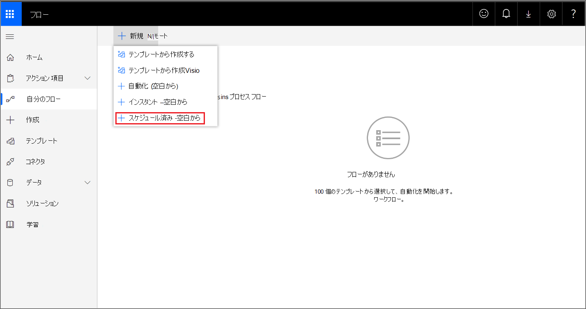
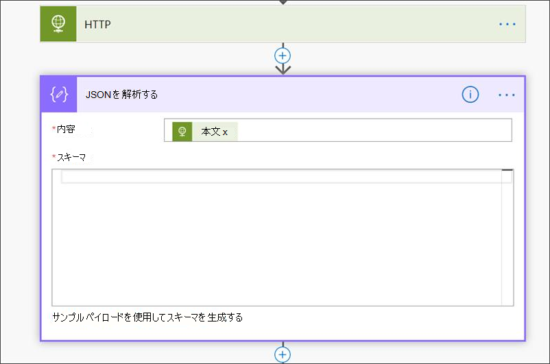
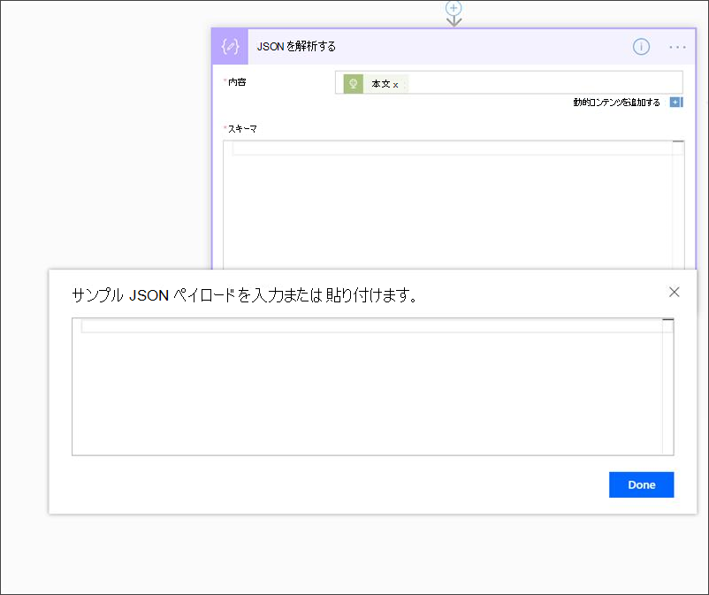
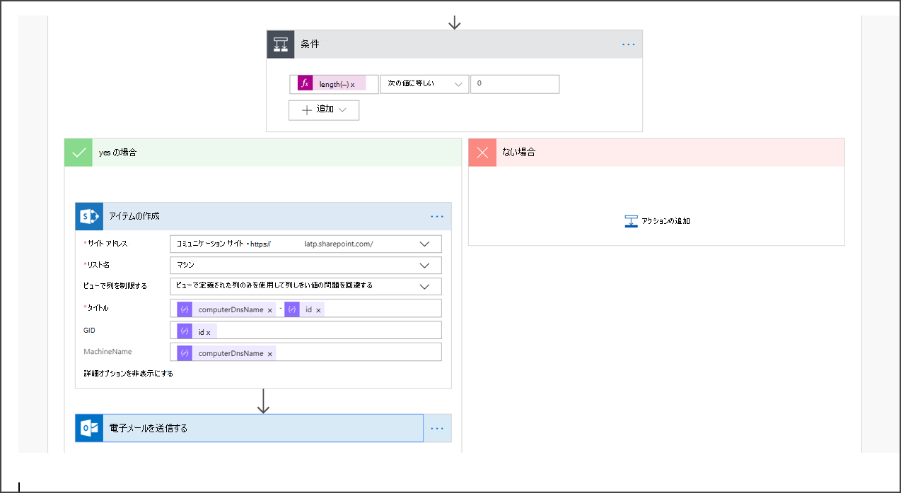

# <a name="create-a-notification-rule-when-a-local-onboarding-or-offboarding-script-is-used"></a>ローカル オンボーディングスクリプトまたはオフボード スクリプトを使用する場合に通知ルールを作成する

[!INCLUDE [Microsoft 365 Defender rebranding](../../includes/microsoft-defender.md)]


**適用対象:**
- [Microsoft Defender for Endpoint Plan 1](https://go.microsoft.com/fwlink/p/?linkid=2154037)
- [Microsoft Defender for Endpoint Plan 2](https://go.microsoft.com/fwlink/p/?linkid=2154037)
- [Microsoft 365 Defender](https://go.microsoft.com/fwlink/?linkid=2118804)

> Microsoft Defender ATP を試してみたいですか? [無料試用版にサインアップしてください。](https://signup.microsoft.com/create-account/signup?products=7f379fee-c4f9-4278-b0a1-e4c8c2fcdf7e&ru=https://aka.ms/MDEp2OpenTrial?ocid=docs-wdatp-exposedapis-abovefoldlink)

[!include[Microsoft Defender for Endpoint API URIs for US Government](../../includes/microsoft-defender-api-usgov.md)]

[!include[Improve request performance](../../includes/improve-request-performance.md)]


ローカルオンボーディングまたはオフボード スクリプトが使用されている場合に通知を受け取る通知ルールを作成します。

## <a name="before-you-begin"></a>はじめに

次のアクセス権が必要です。

- Power Automate (少なくともユーザー単位のプラン)。 詳細については、「価格設定[」Power Automateを参照してください](https://flow.microsoft.com/pricing/)。
- Azure Table または SharePointリストまたはライブラリ/SQL DB。

## <a name="create-the-notification-flow"></a>通知フローの作成

1. In [flow.microsoft.com](https://flow.microsoft.com/).

2. [スケジュール済 **み] の [>のフロー>から] に移動します**。

    

3. スケジュールされたフローを作成します。
   1. フロー名を入力します。
   2. 開始時刻を指定します。
   3. 頻度を指定します。 たとえば、5 分ごとに。

    

4. +ボタンを選択して新しいアクションを追加します。 新しいアクションは、Defender for Endpoint セキュリティ センター デバイス API への HTTP 要求です。 また、既定の "WDATP Connector" (アクション: "Machines - Get list of machines") に置き換えすることもできます。

    

5. 次の HTTP フィールドを入力します。

   - メソッド: デバイスの一覧を取得する値として "GET" を指定します。
   - URI: を入力します `https://api.securitycenter.microsoft.com/api/machines` 。
   - 認証: [Active Directory OAuth] を選択します。
   - テナント: サインインし、[アプリの登録 https://portal.azure.com ] Azure Active Directory >**に移動し**、テナント ID の値を取得します。
   - 対象ユーザー: `https://securitycenter.onmicrosoft.com/windowsatpservice\`
   - クライアント ID: アプリ登録にサインインして、Azure Active Directory >に移動し、クライアント https://portal.azure.com ID の値を取得します。 
   - 資格情報の種類: [シークレット] を選択します。
   - シークレット: サインインして、アプリの登録Azure Active Directory >に移動し、テナント https://portal.azure.com ID の値を取得します。 

    

6. [新しいアクションの追加] を選択して新しい手順を追加 **し** 、[データ操作] を検索 **し** 、[JSON の解析] **を選択します**。

    

7. [コンテンツ] フィールドに **Body を追加** します。

    

8. [サンプル ペイロード **を使用してスキーマを生成する] リンクを選択** します。

    

9. 次の JSON スニペットをコピーして貼り付けます。

    ```json
    {
        "type": "object",
        "properties": {
            "@@odata.context": {
                "type": "string"
            },
            "value": {
                "type": "array",
                "items": {
                    "type": "object",
                    "properties": {
                        "id": {
                            "type": "string"
                        },
                        "computerDnsName": {
                            "type": "string"
                        },
                        "firstSeen": {
                            "type": "string"
                        },
                        "lastSeen": {
                            "type": "string"
                        },
                        "osPlatform": {
                            "type": "string"
                        },
                        "osVersion": {},
                        "lastIpAddress": {
                            "type": "string"
                        },
                        "lastExternalIpAddress": {
                            "type": "string"
                        },
                        "agentVersion": {
                            "type": "string"
                        },
                        "osBuild": {
                            "type": "integer"
                        },
                        "healthStatus": {
                            "type": "string"
                        },
                        "riskScore": {
                            "type": "string"
                        },
                        "exposureScore": {
                            "type": "string"
                        },
                        "aadDeviceId": {},
                        "machineTags": {
                            "type": "array"
                        }
                    },
                    "required": [
                        "id",
                        "computerDnsName",
                        "firstSeen",
                        "lastSeen",
                        "osPlatform",
                        "osVersion",
                        "lastIpAddress",
                        "lastExternalIpAddress",
                        "agentVersion",
                        "osBuild",
                        "healthStatus",
                        "rbacGroupId",
                        "rbacGroupName",
                        "riskScore",
                        "exposureScore",
                        "aadDeviceId",
                        "machineTags"
                    ]
                }
            }
        }
    }

    ```

10. JSON 呼び出しから値を抽出し、オンボードデバイスが /が既に登録されている場合は、SharePointリストに登録されています。

    - はいの場合、通知はトリガーされません
    - いいえの場合は、新しいオンボード デバイスが [SharePoint] リストに登録され、Defender for Endpoint 管理者に通知が送信されます。

    

    

11. [ **条件]** で、次の式を追加します。"length(body('Get_items')?'value']) をクリックし、条件を 0 に設定します。

    
     
     
     

## <a name="alert-notification"></a>アラート通知

次の図は、電子メール通知の例です。


## <a name="tips"></a>ヒント

- lastSeen のみを使用してここでフィルター処理できます。
  - 60 分ごとに:
    - 過去 7 日間に最後に見られたすべてのデバイスを使用します。

- デバイスごとに:
  - 最後に表示されたプロパティが [-7 日、 -7days + 60 分] の 1 時間間隔にある場合は、-> オフボードの可能性を警告します。
  - 最初に表示された場合は、過去 1 時間のオンボーディング>アラートを表示します。

このソリューションでは、重複するアラートが発生しない: 多数のデバイスを持つテナントがあります。 これらのデバイスをすべて取得すると、非常にコストが高く、ページングが必要になる場合があります。

次の 2 つのクエリに分割できます。

1. オフボードの場合は、OData を使用してこの間隔のみを$filter条件が満たされた場合にのみ通知します。
2. 過去 1 時間に最後に見られたすべてのデバイスを使用し、最初に表示されたプロパティを確認します (最初に表示されたプロパティが過去 1 時間の場合は、最後に表示されたプロパティも表示されている必要があります)。
