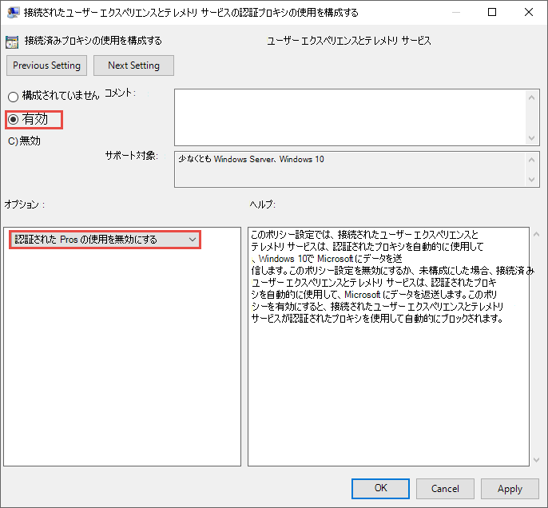
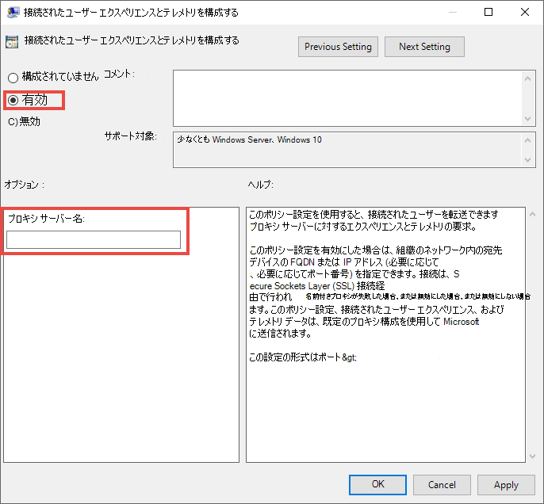

# <a name="set-up-microsoft-defender-for-endpoint-deployment"></a>Microsoft Defender for Endpoint の展開をセットアップする

[!INCLUDE [Microsoft 365 Defender rebranding](../../includes/microsoft-defender.md)]


**適用対象:**
- [Microsoft Defender for Endpoint](https://go.microsoft.com/fwlink/p/?linkid=2154037)
- [Microsoft 365 Defender](https://go.microsoft.com/fwlink/?linkid=2118804)

> Microsoft Defender ATP を試してみたいですか? [無料試用版にサインアップしてください。](https://signup.microsoft.com/create-account/signup?products=7f379fee-c4f9-4278-b0a1-e4c8c2fcdf7e&ru=https://aka.ms/MDEp2OpenTrial?ocid=docs-wdatp-exposedapis-abovefoldlink)

Defender for Endpoint の展開は、次の 3 フェーズプロセスです。

|[](prepare-deployment.md)<br>[フェーズ 1: 準備](prepare-deployment.md) | <br>フェーズ 2: セットアップ | [](onboarding.md)<br>[フェーズ 3: オンボード](onboarding.md)|
|---|---|---|
||*お前はここにいる!*||

現在、セットアップ フェーズに入っている。

この展開シナリオでは、次の手順について説明します。

- ライセンスの検証
- テナント構成
- ネットワーク構成

> [!NOTE]
> 一般的な展開を案内する目的で、このシナリオでは、このシナリオでは、ユーザーの使用のみをMicrosoft Endpoint Configuration Manager。 Defender for Endpoint は、他のオンボーディング ツールの使用をサポートしていますが、展開ガイドではこれらのシナリオについては説明しません。 詳細については、「デバイスを [Microsoft Defender for Endpoint にオンボードする」を参照してください](onboard-configure.md)。

## <a name="check-license-state"></a>ライセンスの状態を確認する

ライセンスの状態を確認し、適切にプロビジョニングされたかどうかを確認するには、管理センターまたはポータルMicrosoft Azure **できます**。

1. ライセンスを表示するには、Microsoft Azureポータルに **移動** し、[Microsoft Azure][セクションに移動します](https://portal.azure.com/#blade/Microsoft_AAD_IAM/LicensesMenuBlade/Products)。

   ![[Azure ライセンス] ページのイメージ。](images/atp-licensing-azure-portal.png)

1. または、管理センターで [課金サブスクリプション]  \> **に移動します**。

    画面に、すべてのプロビジョニング済みライセンスと現在の状態が表示 **されます**。

    

## <a name="cloud-service-provider-validation"></a>クラウド サービス プロバイダーの検証

会社にプロビジョニングされるライセンスにアクセスし、ライセンスの状態を確認するには、管理センターに移動します。

1. パートナー ポータルで **、[サービス** の管理]**を選択> Office 365。**

2. [パートナー ポータル]**リンクをクリック** すると、[代理として管理者] オプションが開き、顧客管理センターにアクセスできます。

   

## <a name="tenant-configuration"></a>テナント構成

エンドポイント用 Microsoft Defender へのオンボーディングは簡単です。 ナビゲーション メニューから、[エンドポイント] セクションの下の任意のアイテムを選択するか、インシデント、ハンティング、アクション センター、脅威分析などの Microsoft 365 Defender 機能を選択してオンボーディング プロセスを開始します。

Web ブラウザーから、セキュリティ センター Microsoft 365<a href="https://go.microsoft.com/fwlink/p/?linkid=2077139" target="_blank">移動します</a>。

## <a name="network-configuration"></a>ネットワーク構成

組織がプロキシを使用してインターネットにアクセスするためにエンドポイントを必要としない場合は、このセクションをスキップします。

Microsoft Defender ATP センサーでは、センサー データをレポートし、Microsoft Defender for Endpoint service サービスと通信するために、Microsoft Windows HTTP (WinHTTP) が必要になります。 埋め込まれた Microsoft Defender for Endpoint センサーは、LocalSystem アカウントを使用してシステム コンテキストで実行されます。 センサーは Microsoft Windows HTTP サービス (WinHTTP) を使用して、Microsoft Defender for Endpoint クラウド サービスとの通信を有効にします。 WinHTTP 構成設定は、Windows インターネット (WinINet) インターネット閲覧プロキシ設定とは独立し、次の検出方法を使用してのみプロキシ サーバーを検出できます。

- **自動検出メソッド**:
  - 透過プロキシ
  - Web プロキシ自動発見プロトコル (WPAD)

  透過プロキシまたは WPAD がネットワーク トポロジに実装されている場合、特別な構成設定は不要です。 プロキシ内の Microsoft Defender for Endpoint URL の除外の[](production-deployment.md#proxy-service-urls)詳細については、このドキュメントの「プロキシ サービス URL の一覧を許可する」または「デバイス プロキシとインターネット接続の設定を構成する」を[参照](configure-proxy-internet.md#enable-access-to-microsoft-defender-for-endpoint-service-urls-in-the-proxy-server)してください。

- **静的プロキシの手動構成**:
  - レジストリ ベースの構成
  - netsh コマンドを使用して構成された WinHTTP

    安定したトポロジ (たとえば、同じプロキシの背後にある企業ネットワーク内のデスクトップ) のデスクトップにのみ適しています。

### <a name="configure-the-proxy-server-manually-using-a-registry-based-static-proxy"></a>レジストリ ベースの静的プロキシを使用して、プロキシ サーバーを手動で構成します。

コンピューターがインターネットへの接続を許可されていない場合、Microsoft Defender for Endpoint センサーだけが診断データを報告し、Microsoft Defender for Endpoint サービスと通信できるレジストリ ベースの静的プロキシを構成します。 静的プロキシは、グループ ポリシー (GP) を使用して構成できます。 グループ ポリシーは次の場所にあります。

- 管理用Windows コンポーネント データ収集とプレビュー ビルド接続ユーザー エクスペリエンスおよびテレメトリ サービスの認証プロキシの使用 \> \> \> を構成する
- [有効] に **設定し、[** 認証された **プロキシの使用を無効にする] を選択します。**

1. グループ ポリシー管理コンソールを開きます。
2. 組織のプラクティスに基づいてポリシーを作成するか、既存のポリシーを編集します。
3. グループ ポリシーを編集し、[管理用テンプレート] Windows コンポーネント データ収集とプレビュー ビルド接続ユーザー エクスペリエンスとテレメトリ サービスの認証プロキシの使用を **\> \> \> 構成します**。

   

4. **[有効]** を選択します。
5. [認証 **されたプロキシの使用を無効にする] を選択します**。
6. [管理用テンプレート] Windows コンポーネント データ収集とプレビュー ビルド 接続されたユーザー エクスペリエンスとテレメトリを **\> \> \> 構成します**。

    

7. **[有効]** を選択します。
8. プロキシ サーバー **名を入力します**。

このポリシーは、レジストリ キー `HKLM\Software\Policies\Microsoft\Windows\DataCollection` の下に 2 つのレジストリ値 `TelemetryProxyServer` を REG_SZ として、`DisableEnterpriseAuthProxy` を REG_DWORD として設定します。

レジストリ値は、 `TelemetryProxyServer` 次の文字列形式を取ります。

```text
<server name or ip>:<port>
```

例: 10.0.0.6:8080

レジストリ値 `DisableEnterpriseAuthProxy` を 1に設定する必要があります。

### <a name="configure-the-proxy-server-manually-using-netsh-command"></a>netsh コマンドを使用してプロキシ サーバーを手動で構成する

netsh を使用して、システム全体の静的プロキシを構成します。

> [!NOTE]
>
> - これは、既定のプロキシで WinHTTP を使用する Windows サービスを含むすべてのアプリケーションに影響します。
> - トポロジを変更しているラップトップ (たとえば、オフィスから自宅) は netsh に誤動作します。 レジストリ ベースの静的プロキシの構成を使用します。

1. 管理者特権でコマンド プロンプトを開きます。
    1. **[スタート]** をクリックし、「**cmd**」と入力します。
    1. **[コマンド プロンプト]** を右クリックして **[管理者として実行]** を選択します。

2. 次のコマンドを入力して、**Enter** キーを押します。

   ```PowerShell
   netsh winhttp set proxy <proxy>:<port>
   ```

   例: netsh winhttp set proxy 10.0.0.6:8080

### <a name="proxy-configuration-for-down-level-devices"></a>ダウンレベル デバイスのプロキシ構成

Down-Level には、Windows 7 SP1 および Windows 8.1 ワークステーション、Windows Server 2008 R2、Windows Server 2012、Windows Server 2012 R2、および Windows Server 2016 のバージョンが含Windows サーバー CB 1803。 これらのオペレーティング システムでは、エンドポイントから Azure への通信を処理するために、Microsoft 管理エージェントの一部としてプロキシが構成されます。 これらのデバイスでのプロキシの構成方法については、「Microsoft Management Agent Fast Deployment Guide」を参照してください。

### <a name="proxy-service-urls"></a>プロキシ サービスの URL

v20 を含む URL は、Windows 10バージョン 1803 または 11 デバイスWindows必要です。 たとえば、 `us-v20.events.data.microsoft.com` デバイスがバージョン 1803 またはバージョン 11 上Windows 10場合にのみWindowsされます。

プロキシまたはファイアウォールが匿名トラフィックをブロックしている場合、Microsoft Defender for Endpoint センサーがシステム コンテキストから接続している場合は、一覧の URL で匿名トラフィックが許可されている必要があります。

次のダウンロード可能なスプレッドシートには、ネットワークが接続できる必要があるサービスと関連付けられている URL が一覧表示されます。 これらの URL へのアクセスを拒否するファイアウォールまたはネットワーク フィルター ルールが存在しないか、許可ルールの作成が必要な場合があります。

<br>

****

|ドメインリストのスプレッドシート|説明|
|---|---|
||サービスの場所、地理的な場所、および OS の特定の DNS レコードのスプレッドシート。 <p> [ここにスプレッドシートをダウンロードします。](https://download.microsoft.com/download/8/a/5/8a51eee5-cd02-431c-9d78-a58b7f77c070/mde-urls.xlsx)|
|

## <a name="next-step"></a>次の手順

 <br> [フェーズ 3: オンボード](onboarding.md): Microsoft Defender for Endpoint サービスがセンサー データを取得できるよう、デバイスをサービスにオンボードします。
