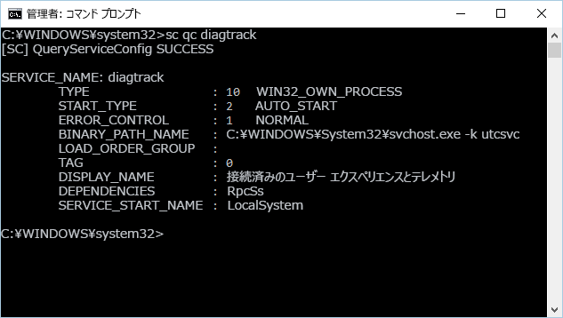
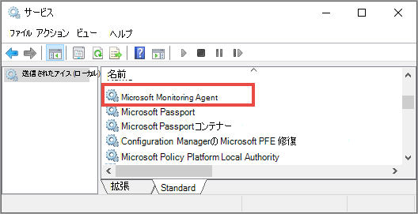
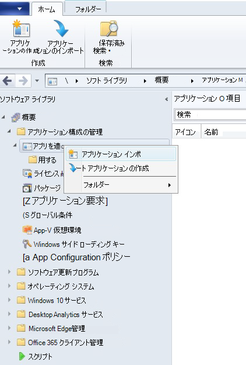
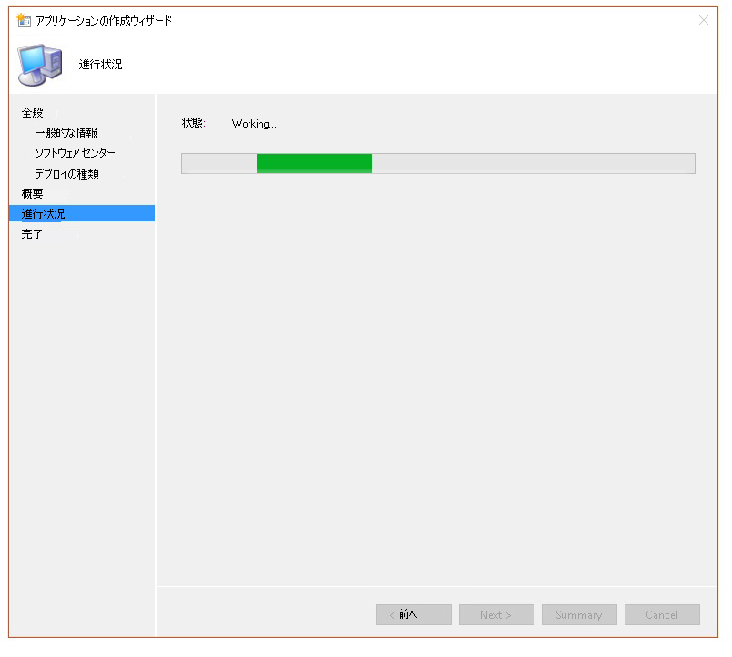

# <a name="troubleshoot-microsoft-defender-for-endpoint-onboarding-issues"></a>Microsoft Defender for Endpoint オンボーディングの問題のトラブルシューティング

[!INCLUDE [Microsoft 365 Defender rebranding](../../includes/microsoft-defender.md)]


**適用対象:**

- [Microsoft Defender for Endpoint](https://go.microsoft.com/fwlink/?linkid=2154037)
- Windows Server 2012 R2
- Windows Server 2016
- [Microsoft 365 Defender](https://go.microsoft.com/fwlink/?linkid=2118804)

> Defender for Endpoint を体験してみませんか? [無料試用版にサインアップしてください。](https://signup.microsoft.com/create-account/signup?products=7f379fee-c4f9-4278-b0a1-e4c8c2fcdf7e&ru=https://aka.ms/MDEp2OpenTrial?ocid=docs-wdatp-pullalerts-abovefoldlink)

問題が発生した場合は、Microsoft Defender for Endpoint オンボーディング プロセスのトラブルシューティングが必要になる場合があります。
このページでは、展開ツールのいずれかを使用して展開するときに発生する可能性のあるオンボーディングの問題と、デバイスで発生する可能性のある一般的なエラーをトラブルシューティングするための詳細な手順を示します。

## <a name="troubleshoot-issues-with-onboarding-tools"></a>オンボーディング ツールに関する問題のトラブルシューティング

オンボーディング プロセスを完了し、1 時間後に [デバイス[](investigate-machines.md)] リストにデバイスが表示されない場合は、オンボーディングまたは接続の問題を示している可能性があります。

### <a name="troubleshoot-onboarding-when-deploying-with-group-policy"></a>グループ ポリシーを使用して展開する場合のオンボーディングのトラブルシューティング

グループ ポリシーによる展開は、デバイスでオンボーディング スクリプトを実行して行います。 グループ ポリシー コンソールは、展開が成功したかどうかを示しません。

オンボーディング プロセスが完了し、1 時間後に [デバイス[](investigate-machines.md)] リストにデバイスが表示されない場合は、デバイス上のスクリプトの出力を確認できます。 詳細については、「スクリプトを使用 [して展開する場合のオンボードのトラブルシューティング」を参照してください](#troubleshoot-onboarding-when-deploying-with-a-script)。

スクリプトが正常に完了した場合は、「[](#troubleshoot-onboarding-issues-on-the-device)デバイスのオンボードの問題のトラブルシューティング」を参照して、発生する可能性がある追加のエラーについて説明します。

### <a name="troubleshoot-onboarding-issues-when-deploying-with-microsoft-endpoint-configuration-manager"></a>アプリケーションを使用して展開する際のオンボーディングの問題のトラブルシューティングMicrosoft Endpoint Configuration Manager

Configuration Manager の次のバージョンを使用してデバイスをオンボーディングする場合:

- Microsoft Endpoint Configuration Manager
- System Center 2012 Configuration Manager
- System Center 2012 R2 構成マネージャー

上記のバージョンの Configuration Manager を使用した展開は、デバイスでオンボーディング スクリプトを実行して行います。 Configuration Manager コンソールで展開を追跡できます。

展開が失敗した場合は、デバイス上のスクリプトの出力を確認できます。

オンボーディングが正常に完了したが、デバイスが 1 時間後に [デバイス] リスト[](#troubleshoot-onboarding-issues-on-the-device)に表示されない場合は、「発生する可能性がある追加のエラーについては、デバイスのオンボードの問題のトラブルシューティング」を参照してください。

### <a name="troubleshoot-onboarding-when-deploying-with-a-script"></a>スクリプトを使用して展開する場合のオンボーディングのトラブルシューティング

**デバイス上のスクリプトの結果を確認します。**

1. [スタート **] ボタンを** クリックし、「 **イベント ビューアー」と入力** し、Enter キーを **押します**。

2. [ログ アプリケーション **Windows] に**  >  **移動します**。

3. **WDATPOnboarding イベント ソースからイベントを** 探します。

スクリプトが失敗し、イベントがエラーである場合は、次の表のイベント ID を確認して、問題のトラブルシューティングに役立ちます。

> [!NOTE]
> 次のイベントの ID は、オンボーディング スクリプトにのみ固有のイベントです。

イベント ID | エラーの種類 | 解決手順
:---:|:---|:---
 `5` | オフボード データが見つかりましたが、削除できなかった | レジストリのアクセス許可を確認する (具体的には)<br> `HKLM\SOFTWARE\Policies\Microsoft\Windows Advanced Threat Protection`.
`10` | オンボード データをレジストリに書き込めなかった |  レジストリのアクセス許可を確認する (具体的には)<br> `HKLM\SOFTWARE\Policies\Microsoft\Windows Advanced Threat Protection`.<br>スクリプトが管理者として実行されたと確認します。
`15` |  SENSE サービスの開始に失敗しました |サービスの正常性 (コマンド) を `sc query sense` 確認します。 中間の状態 *('Pending_Stopped'*、 *'Pending_Running'*) に含めず、(管理者権限を持つ) スクリプトを再度実行してください。 <br> <br> デバイスがバージョン 1607 Windows 10実行してコマンドを実行している場合は、 `sc query sense` `START_PENDING` デバイスを再起動します。 デバイスを再起動しても問題が解決しない場合は、KB4015217 にアップグレードして、もう一度オンボーディングを試してください。
`15` | SENSE サービスの開始に失敗しました | エラーのメッセージが次の場合:システム エラー 577 またはエラー 1058 が発生した場合は、Microsoft Defender ウイルス対策 ELAM ドライバーを有効にする必要があります。手順については[、「Microsoft Defender ウイルス対策](#ensure-that-microsoft-defender-antivirus-is-not-disabled-by-a-policy)がポリシーによって無効にされていないか確認する」を参照してください。
`30` |  スクリプトがサービスの実行を待機できなかった | サービスの開始に時間がかかったか、開始しようとしている間にエラーが発生している可能性があります。 SENSE に関連するイベントとエラーの詳細については、「イベント ビューアーを使用してイベント [とエラーを確認する」を参照してください](event-error-codes.md)。
`35` |  スクリプトが必要なオンボーディング状態レジストリ値を見つけ出すに失敗しました | SENSE サービスが初めて開始されると、オンボード状態がレジストリの場所に書き込み<br>`HKLM\SOFTWARE\Microsoft\Windows Advanced Threat Protection\Status`.<br> スクリプトは数秒後に検索に失敗しました。 手動でテストし、それがそこにあるか確認できます。 SENSE に関連するイベントとエラーの詳細については、「イベント ビューアーを使用してイベント [とエラーを確認する」を参照してください](event-error-codes.md)。
`40` | SENSE サービスオンボーディングの状態が **1 に設定されていない** | SENSE サービスが正しくオンボードに失敗しました。 SENSE に関連するイベントとエラーの詳細については、「イベント ビューアーを使用してイベント [とエラーを確認する」を参照してください](event-error-codes.md)。
`65` | 不十分な特権| 管理者特権でスクリプトを再度実行します。

### <a name="troubleshoot-onboarding-issues-using-microsoft-intune"></a>ユーザー設定を使用してオンボーディングの問題をトラブルシューティングMicrosoft Intune

エラー コードをMicrosoft Intune、問題の原因のトラブルシューティングを試みる場合は、このエラー コードを使用します。

Intune でポリシーを構成し、デバイスに反映されない場合は、MDM の自動登録を構成する必要があります。

オンボーディング中に発生する可能性がある問題の原因を理解するには、次の表を使用します。

- Microsoft Intune コードとエラー OMA-URIs表
- コンプライアンス以外のテーブルに関する既知の問題
- モバイル デバイス管理 (MDM) イベント ログ テーブル

イベント ログとトラブルシューティング手順が機能しない場合は、ポータルの [デバイス管理] セクションからローカル スクリプトをダウンロードし、管理者特権でコマンド プロンプトで実行します。

#### <a name="microsoft-intune-error-codes-and-oma-uris"></a>Microsoft Intuneコードとエラー コードOMA-URIs

エラー コード 16 進数 | エラー コード 12 月 | エラーの説明 | OMA-URI | 考えられる原因とトラブルシューティングの手順
:---:|:---|:---|:---|:---
0x87D1FDE8 | -2016281112 | 修復に失敗しました | オンボード <br> オフボード | **考えられる原因:** 誤った BLOB でオンボーディングまたはオフボードが失敗しました。署名が間違っていたり、PreviousOrgIds フィールドが見つからない場合。 <br><br> **トラブルシューティングの手順:** <br> [デバイス イベント ログのエージェントオンボーディング エラーの表示] セクション [でイベントの ID を確認](#view-agent-onboarding-errors-in-the-device-event-log) します。 <br><br> 次の表の MDM イベント ログを確認するか、「MDM エラーの診断」の手順に従[Windows 10。](/windows/client-management/mdm/diagnose-mdm-failures-in-windows-10)
 | | | | オンボード <br> オフボード <br> SampleSharing | **考えられる原因:** Microsoft Defender for Endpoint Policy レジストリ キーが存在しないか、OMA DM クライアントに書き込み権限が付与されていない。 <br><br> **トラブルシューティングの手順:** 次のレジストリ キーが存在することを確認します。 `HKEY_LOCAL_MACHINE\SOFTWARE\Policies\Microsoft\Windows Advanced Threat Protection` <br> <br> 存在しない場合は、管理者特権でコマンドを開き、キーを追加します。
 | | | | SenseIsRunning <br> OnboardingState <br> OrgId |  **考えられる原因:** 読み取り専用プロパティによる修復の試行。 オンボーディングに失敗しました。 <br><br> **トラブルシューティングの手順:** 「デバイスでのオンボードの問題の [トラブルシューティング」のトラブルシューティング手順を確認します](#troubleshoot-onboarding-issues-on-the-device)。 <br><br> 次の表の MDM イベント ログを確認するか、「MDM エラーの診断」の手順に従[Windows 10。](/windows/client-management/mdm/diagnose-mdm-failures-in-windows-10)
 | | | | すべて | **考えられる原因:** Microsoft Defender for Endpoint をサポートされていない SKU/プラットフォーム (特に Holographic SKU) に展開します。 <br><br> 現在サポートされているプラットフォーム:<br> Enterprise、教育、およびProfessional。<br> サーバーはサポートされていません。
 0x87D101A9 | -2016345687 |SyncML(425): 要求されたコマンドは、送信者が受信者に適切なアクセス制御アクセス許可 (ACL) を持たないので失敗しました。 | すべて |  **考えられる原因:** Microsoft Defender for Endpoint をサポートされていない SKU/プラットフォーム (特に Holographic SKU) に展開します。<br><br> 現在サポートされているプラットフォーム:<br>  Enterprise、教育、およびProfessional。

#### <a name="known-issues-with-non-compliance"></a>コンプライアンスに関する既知の問題

次の表に、コンプライアンス以外の問題に関する情報と、問題に対処する方法を示します。

ケース | 現象 | 考えられる原因とトラブルシューティングの手順
:---:|:---|:---
 `1` | デバイスは SenseIsRunning OMA-URI に準拠しています。 ただし、OrgId、Onboarding、OnboardingState OMA-URI では非準拠です。 | **考えられる原因:** インストールまたはアップグレード後にユーザーが OOBE をWindows確認します。 OOBE オンボーディングを完了できなかったが、SENSE が既に実行されている。<br><br> **トラブルシューティングの手順:** OOBE が完了するのを待ちます。
 `2` |  デバイスは OrgId、Onboarding、および OnboardingState OMA-URI に準拠していますが、SenseIsRunning OMA-URI では非準拠です。 |  **考えられる原因:** センス サービスのスタートアップの種類は、"遅延開始" に設定されます。 これにより、システムのMicrosoft Intune DM セッションが発生すると、サーバーは SenseIsRunning によってデバイスが非準拠として報告される場合があります。 <br><br> **トラブルシューティングの手順:** この問題は、24 時間以内に自動的に修正されるはずです。
 `3` | デバイスが非準拠 | **トラブルシューティングの手順:** オンボーディング ポリシーとオフボード ポリシーが同じデバイスに同時に展開されないことを確認します。

#### <a name="mobile-device-management-mdm-event-logs"></a>モバイル デバイス管理 (MDM) イベント ログ

MDM イベント ログを表示して、オンボーディング中に発生する可能性のある問題のトラブルシューティングを行います。

ログ名: Microsoft\Windows\DeviceManagement-EnterpriseDiagnostics-Provider

チャネル名: 管理者

ID | 緊急度 | イベントの説明 | トラブルシューティングの手順
:---|:---|:---|:---
1819 | Error | エンドポイント CSP 用 Microsoft Defender: ノードの値の設定に失敗しました。 NodeId: (%1), TokenName: (%2), Result: (%3)。 | [1607 年 1607 年Windows 10累積的な更新プログラムをダウンロードします](https://go.microsoft.com/fwlink/?linkid=829760)。

## <a name="troubleshoot-onboarding-issues-on-the-device"></a>デバイスでのオンボーディングの問題のトラブルシューティング

使用する展開ツールがオンボーディング プロセスでエラーを示していないが、デバイスが 1 時間以内にデバイスリストに表示されない場合は、次の検証トピックを参照して、Microsoft Defender for Endpoint エージェントでエラーが発生したかどうかを確認します。

- [デバイス イベント ログでエージェントオンボーディング エラーを表示する](#view-agent-onboarding-errors-in-the-device-event-log)
- [診断データ サービスが有効になっているか確認する](#ensure-the-diagnostics-service-is-enabled)
- [サービスが開始に設定されているのを確認する](#ensure-the-service-is-set-to-start)
- [デバイスにインターネット接続が接続されている必要があります。](#ensure-the-device-has-an-internet-connection)
- [ポリシーによってMicrosoft Defender ウイルス対策が無効にされていないか確認する](#ensure-that-microsoft-defender-antivirus-is-not-disabled-by-a-policy)

### <a name="view-agent-onboarding-errors-in-the-device-event-log"></a>デバイス イベント ログでエージェントオンボーディング エラーを表示する

1. [スタート **] ボタンを** クリックし、「 **イベント ビューアー」と入力** し、Enter キーを **押します**。

2. [イベント **ビューアー (ローカル)] ウィンドウ** で、[**アプリケーション** とサービス ログ]  >  **を展開します。Microsoft** Windows SENSE  >    >  **です**。

   > [!NOTE]
   > SENSE は、Microsoft Defender for Endpoint をサポートする動作センサーを参照するために使用される内部名です。

3. [操作 **] を** 選択してログを読み込む。

4. [操作] **ウィンドウで** 、[現在のログの **フィルター] をクリックします**。

5. [フィルター **] タブの**[イベント レベル] **で、[重大**] 、[警告] **、および**[**エラー**] を選択し **、[OK] をクリックします**。

   

6. [操作] ウィンドウに問題を示すイベント **が表示** されます。 次の表のソリューションに基づいて、トラブルシューティングを試みできます。

イベント ID | メッセージ | 解決手順
:---:|:---|:---
 `5` | Microsoft Defender for Endpoint service が変数でサーバーに接続 _できなかった_ | [デバイスにインターネット アクセス権が設定されている必要があります](#ensure-the-device-has-an-internet-connection)。
 `6` | Microsoft Defender for Endpoint Service はオンボードされていないので、オンボーディング パラメーターが見つかりませんでした。 エラー コード: _変数_ | [オンボーディング スクリプトを再度実行します](configure-endpoints-script.md)。
 `7` | Microsoft Defender for Endpoint service では、オンボーディング パラメーターの読み取りが失敗しました。 エラー コード: _変数_ | [デバイスにインターネット アクセス権が設定されているのを](#ensure-the-device-has-an-internet-connection)確認し、オンボーディング プロセス全体を再度実行します。
 `9` | Microsoft Defender for Endpoint service は、開始の種類を変更できなかった。 エラー コード: 変数 | オンボーディング中にイベントが発生した場合は、再起動し、オンボーディング スクリプトの実行を再試みします。 詳細については、「オンボード スクリプトを [再度実行する」を参照してください](configure-endpoints-script.md)。 <br><br>オフボード中にイベントが発生した場合は、サポートにお問い合わせください。
`10` | Microsoft Defender for Endpoint Service は、オンボーディング情報を保持できなかった。 エラー コード: 変数 | オンボーディング中にイベントが発生した場合は、オンボーディング スクリプトの実行を再試みします。 詳細については、「オンボード スクリプトを [再度実行する」を参照してください](configure-endpoints-script.md)。 <br><br>問題が解決しない場合は、サポートにお問い合わせください。
`15` | Microsoft Defender for Endpoint では、URL 変数を使用してコマンド チャネルを開始 _できません。_ | [デバイスにインターネット アクセス権が設定されている必要があります](#ensure-the-device-has-an-internet-connection)。
`17` | Microsoft Defender for Endpoint service は、接続されたユーザー エクスペリエンスとテレメトリ サービスの場所を変更できなかった。 エラー コード: 変数 | [オンボーディング スクリプトを再度実行します](configure-endpoints-script.md)。 問題が解決しない場合は、サポートにお問い合わせください。
`25` | Microsoft Defender for Endpoint service は、レジストリの正常性状態をリセットできなかった。 エラー コード: _変数_ | サポートに問い合わせてください。
`27` | Microsoft Defender for Endpoint モードを有効にWindows Defender。 オンボーディング プロセスに失敗しました。 エラー コード: 変数 | サポートに問い合わせてください。
`29` | オフボード パラメーターの読み取りに失敗しました。 エラーの種類: %1、エラー コード: %2、説明: %3 | デバイスにインターネット アクセス権が設定されているのを確認し、オフボード プロセス全体を再度実行します。
`30` | Microsoft Defender for Endpoint で $(build.sense.productDisplayName) モードを無効にしました。 エラー コード: %1 | サポートに問い合わせてください。
`32` | $(build.sense.productDisplayName) サービスは、オフボード プロセスの後に自分自身を停止する要求に失敗しました。 エラー コード: %1 | サービスの開始の種類が手動で行い、デバイスを再起動します。
`55` | Secure ETW 自動ロガーの作成に失敗しました。 エラー コード: %1 | デバイスを再起動します。
`63` | 外部サービスの開始の種類を更新します。 名前: %1、実際の開始の種類: %2、予期される開始の種類: %3、終了コード: %4 | 前述のサービスの開始の種類の変更の原因を特定します。 終了コードが 0 ではない場合は、開始の種類を手動で予期される開始の種類に修正します。
`64` | 停止した外部サービスの開始。 名前: %1、終了コード: %2 | イベントが再表示され続ける場合は、サポートにお問い合わせください。
`68` | サービスの開始の種類が予期しない。 サービス名: %1、実際の開始の種類: %2、予期される開始の種類: %3 | 開始の種類の変更の原因を特定します。 前述のサービス開始の種類を修正しました。
`69` | サービスが停止します。 サービス名: %1 | 前述のサービスを開始します。 継続する場合はサポートにお問い合わせください。

<br />

デバイスには、Microsoft Defender for Endpoint エージェントが適切に機能するために依存しているその他のコンポーネントがあります。 Microsoft Defender for Endpoint エージェント イベント ログにオンボード関連のエラーがない場合は、次の手順に進み、追加のコンポーネントが正しく構成されていることを確認します。

<span id="ensure-the-diagnostics-service-is-enabled" />

### <a name="ensure-the-diagnostic-data-service-is-enabled"></a>診断データ サービスが有効になっているか確認する

デバイスが正しく報告されていない場合は、Windows 10 診断データ サービスが自動的に開始するように設定され、デバイスで実行されていることを確認する必要があります。 このサービスは、他のプログラムやユーザー構成の変更によって無効になっている可能性があります。

最初に、Windows の開始時にサービスが自動的に開始されるのを確認してから、サービスが現在実行されている (実行されていない場合は開始する) 必要があります。

### <a name="ensure-the-service-is-set-to-start"></a>サービスが開始に設定されているのを確認する

**コマンド ラインを使用して、診断データ サービスWindows 10の種類を確認します**。

1. デバイスで管理者特権のコマンド ライン プロンプトを開きます。

   a. [スタート **] ボタンを** クリックし **、「cmd」** と入力し、Enter キーを **押します**。

   b. **[コマンド プロンプト]** を右クリックして **[管理者として実行]** を選択します。

2. 次のコマンドを入力し、Enter キーを **押します**。

   ```text
   sc qc diagtrack
   ```

   サービスが有効になっている場合、結果は次のスクリーンショットのようになります。

   

   に設定されていない場合は、自動的に開始するサービス `START_TYPE` `AUTO_START` を設定する必要があります。

**コマンド ラインを使用して、診断データ Windows 10を自動的に開始する設定を行います。**

1. デバイスで管理者特権のコマンド ライン プロンプトを開きます。

   a. [スタート **] ボタンを** クリックし **、「cmd」** と入力し、Enter キーを **押します**。

   b. **[コマンド プロンプト]** を右クリックして **[管理者として実行]** を選択します。

2. 次のコマンドを入力し、Enter キーを **押します**。

   ```text
   sc config diagtrack start=auto
   ```

3. 成功メッセージが表示されます。 次のコマンドを入力して変更を確認し、Enter キーを **押します**。

   ```text
   sc qc diagtrack
   ```

4. サービスを開始します。

   a. コマンド プロンプトで、次のコマンドを入力し **、Enter** キーを押します。

   ```text
   sc start diagtrack
   ```

### <a name="ensure-the-device-has-an-internet-connection"></a>デバイスにインターネット接続が接続されている必要があります。

Microsoft Defender ATP センサーでは、センサー データをレポートし、Microsoft Defender for Endpoint service サービスと通信するために、Microsoft Windows HTTP (WinHTTP) が必要になります。

WinHTTP は、インターネット閲覧プロキシ設定や他のユーザー コンテキスト アプリケーションとは独立しています。特定の環境で使用できるプロキシ サーバーを検出できる必要があります。

センサーがサービス接続を確立するには [、「Microsoft Defender for Endpoint](configure-proxy-internet.md#verify-client-connectivity-to-microsoft-defender-for-endpoint-service-urls) Service URL へのクライアント接続を確認する」のトピックで説明されている手順に従います。

検証が失敗し、環境でプロキシを使用してインターネットに接続している場合は、「プロキシとインターネット接続の設定の構成」のトピックで説明されている手順 [に従](configure-proxy-internet.md) います。

### <a name="ensure-that-microsoft-defender-antivirus-is-not-disabled-by-a-policy"></a>ポリシーによってMicrosoft Defender ウイルス対策が無効にされていないか確認する

> [!IMPORTANT]
> 以下は、2020年 8 月 (バージョン 4.18.2007.8) 更新プログラムを Microsoft Defender ウイルス対策 にまだ受信していないデバイスにのみ適用されます。
>
> この更新プログラムは、システム Microsoft Defender ウイルス対策経由でクライアント デバイスで無効にできないことを確認します。

**問題**: Microsoft Defender for Endpoint サービスは、オンボーディング後に開始されない。

**現象**: オンボードは正常に完了しますが、サービスを開始しようとするときにエラー 577 またはエラー 1058 が表示されます。

**解決策**: デバイスがサードパーティのマルウェア対策クライアントを実行している場合、Microsoft Defender for Endpoint エージェントでは、早期起動マルウェア対策 (ELAM) ドライバーを有効にする必要があります。 システム ポリシーによってオフにされていない必要があります。

- ポリシーの実装に使用するツールによっては、次のポリシーがクリアWindows Defender必要があります。

  - DisableAntiSpyware
  - DisableAntiVirus

  たとえば、グループ ポリシーには、次の値などのエントリはありません。

  - `<Key Path="SOFTWARE\Policies\Microsoft\Windows Defender"><KeyValue Value="0" ValueKind="DWord" Name="DisableAntiSpyware"/></Key>`
  - `<Key Path="SOFTWARE\Policies\Microsoft\Windows Defender"><KeyValue Value="0" ValueKind="DWord" Name="DisableAntiVirus"/></Key>`

> [!IMPORTANT]
> この `disableAntiSpyware` 設定は中止され、2020 年 8 月 (バージョン 4.18.2007.8) の Microsoft Defender ウイルス対策 への更新時に、すべてのクライアント デバイスで無視されます。

- ポリシーをクリアした後、オンボーディング手順を再度実行します。

- 以前のレジストリ キーの値を確認して、レジストリ キーを開いてポリシーが無効になっているか確認することもできます `HKEY_LOCAL_MACHINE\SOFTWARE\Policies\Microsoft\Windows Defender` 。

    

   > [!NOTE]
   > すべての Windows Defender (wdboot、wdfilter、wdnisdrv、wdnissvc、および windefend) は、既定の状態である必要があります。 これらのサービスの起動を変更する機能はサポートされていないため、システムのイメージを再作成する必要があります。
   >
   > WdBoot と WdFilter の既定の構成の例:
   > - `<Key Path="SYSTEM\CurrentControlSet\Services\WdBoot"><KeyValue Value="0" ValueKind="DWord" Name="Start"/></Key>`
   > - `<Key Path="SYSTEM\CurrentControlSet\Services\WdFilter"><KeyValue Value="0" ValueKind="DWord" Name="Start"/></Key>`

## <a name="troubleshoot-onboarding-issues-on-a-server"></a>サーバーでのオンボーディングの問題のトラブルシューティング

>[!NOTE]
>次のトラブルシューティング ガイダンスは、以下のユーザーにのみWindows Server 2016適用されます。

サーバーのオンボード中に問題が発生した場合は、次の検証手順を実行して、考えられる問題に対処します。

- [センサー Microsoft Monitoring Agentをサービスに報告するように、コンピューター (MMA) がインストールおよび構成されていることを確認する](configure-server-endpoints.md)
- [サーバー プロキシとインターネット接続の設定が正しく構成されていることを確認する](configure-server-endpoints.md)

また、次の情報を確認する必要があります。

- タスク マネージャーの [プロセス] タブで Microsoft Defender for Endpoint Service が **実行されている****のを確認します**。 次に例を示します。

    

- イベント **ビューアー アプリケーション**  >  **とサービス ログ操作** マネージャー  >  **をチェックして**、エラーが発生した場合を確認します。

- [**サービス]** で、**サーバー** Microsoft Monitoring Agent実行しているサーバーを確認します。 例えば、

    

- [Microsoft Monitoring Agent   >  **Azure Log Analytics (OMS) で**、ワークスペースを確認し、状態が実行されているのを確認します。

    

- デバイスがポータルの [デバイス] リスト **に反映されているのを** 確認します。

## <a name="confirming-onboarding-of-newly-built-devices"></a>新しく構築されたデバイスのオンボーディングの確認

新しく構築されたデバイスにオンボーディングが展開されているが、完了していない場合は、インスタンスが発生する可能性があります。

以下の手順では、次のシナリオのガイダンスを提供します。

- オンボード パッケージが新しく構築されたデバイスに展開される
- センサーが起動しないのは、アウトオブボックス エクスペリエンス (OOBE) または最初のユーザー ログオンが完了していないためです。
- エンド ユーザーが最初のログオンを実行する前にデバイスがオフまたは再起動される
- このシナリオでは、オンボード パッケージが展開された場合でも、SENSE サービスは自動的に開始されません

> [!NOTE]
> SENSE サービスが 2021 年 4 月 22 日の更新プログラムのロールアップを使用して Windows 10 Version 1809 または Windows Server [2019](https://support.microsoft.com/kb/5001384)以降の Windows バージョンで開始するには、OOBE 後のユーザー ログオンが不要になります。 Windows 10バージョン 1909 と[2021 年 4](https://support.microsoft.com/kb/5001396)月の更新プログラムのロールアップ 。 Windows 10バージョン 2004/20H2 と[2021 年 4 月 28](https://support.microsoft.com/kb/5001391)日の更新プログラムのロールアップ 。 


> [!NOTE]
> 次の手順は、次の手順を使用する場合にのみMicrosoft Endpoint Configuration Manager。 アプリケーションを使用したオンボーディングの詳細については、「Microsoft Endpoint Configuration Manager [Microsoft Defender for Endpoint」を参照してください](/mem/configmgr/protect/deploy-use/windows-defender-advanced-threat-protection)。

1. アプリケーションを作成Microsoft Endpoint Configuration Manager。

    

2. [アプリケーション **情報を手動で指定する] を選択します**。

    

3. アプリケーションに関する情報を指定し、[次へ] を **選択します**。

    

4. ソフトウェア センターに関する情報を指定し、[次へ] を **選択します**。

    

5. [展開 **の種類] で、[** 追加] **を選択します**。

    

6. [展開 **の種類情報を手動で指定する] を選択し**、[次へ] を **選択します**。

    

7. 展開の種類に関する情報を指定し、[次へ] を **選択します**。

    

8. [**コンテンツ インストール**  >  **プログラム] で、** 次のコマンドを指定します `net start sense` 。

    

9. [ **検出方法] で**、[ **ルールを構成してこの** 展開の種類の存在を検出する] を選択し、[句の追加] **を選択します**。

    

10. 次の検出ルールの詳細を指定し **、[OK] を選択します**。

    

11. [検出 **方法] で、[次** へ] **を選択します**。

    

12. [ **ユーザー エクスペリエンス] で**、次の情報を指定し、[次へ] を **選択します**。

    

13. [要件 **] で、[** 次へ] を **選択します**。

    

14. [ **依存関係] で、[** 次へ] を **選択します**。

    

15. [概要 **] で、[** 次へ] を **選択します**。

    

16. [ **完了] で**、[閉じる] **を選択します**。

    

17. [展開 **の種類] で**、[次へ] を **選択します**。

    

18. [概要 **] で、[** 次へ] を **選択します**。

    

    次に、状態が表示されます 

19. [ **完了] で**、[閉じる] **を選択します**。

    

20. これで、アプリを右クリックして [展開] を選択して、アプリケーションを **展開できます**。

    

21. [全般 **] で** 、[ **依存関係のコンテンツを自動的に配布する] と [参照]** を **選択します**。

    

22. [コンテンツ **] で [次** へ] **を選択します**。

    

23. [展開 **の設定] で**、[次へ] を **選択します**。

    

24. [**スケジュール] で****、利用可能な時間の後にできるだけ早く** 選択し、[次へ] を **選択します**。

    

25. [ **ユーザー エクスペリエンス] で**、[期限内またはメンテナンス 期間中に変更をコミットする **] (** 再起動が必要) を選択し、[次へ] を **選択します**。

    

26. [アラート **] で [** 次へ] **を選択します**。

    

27. [概要 **] で、[** 次へ] を **選択します**。

    

    その後、状態が 

28. [ **完了] で**、[閉じる] **を選択します**。

    


## <a name="related-topics"></a>関連トピック

- [Microsoft Defender for Endpoint のトラブルシューティング](troubleshoot-mdatp.md)
- [デバイスのオンボード](onboard-configure.md)
- [デバイス プロキシとインターネット接続の設定を構成する](configure-proxy-internet.md)
