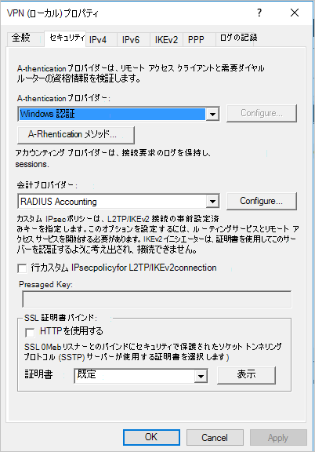
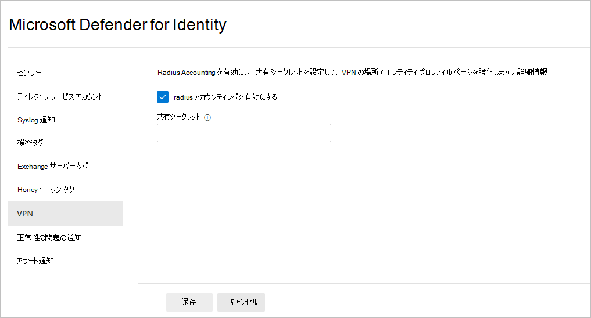

# Defender for Identity VPN integration in Microsoft 365 Defender

**適用対象:**

- Microsoft 365 Defender
- Defender for Identity

この記事では、VPN を Microsoft [Defender for Identity](/defender-for-identity)に統合する方法について説明[Microsoft 365 Defender。](/microsoft-365/security/defender/overview-security-center)

>[!IMPORTANT]
>Id ポータルの Defender の場所Microsoft 365 Defender一部のオプションと詳細が変更されました。 使い慣れた機能と新機能の両方を見つける場所については、以下の詳細をお読みください。

[!INCLUDE [Product long](includes/product-long.md)] VPN ソリューションから会計情報を収集できます。 構成されている場合、ユーザーのプロファイル ページには、接続の発信元の IP アドレスや場所など、VPN 接続からの情報が含まれます。 これにより、ユーザー アクティビティに関する追加情報と、異常な VPN 接続の新しい検出を提供することで、調査プロセスを補完します。 外部 IP アドレスを場所に解決するための呼び出しは匿名です。 この呼び出しでは、個人識別子は送信されません。

[!INCLUDE [Product short](includes/product-short.md)] センサーに転送される RADIUS アカウンティング イベントをリッスンして VPN ソリューションと [!INCLUDE [Product short](includes/product-short.md)] 統合します。 このメカニズムは、標準の RADIUS アカウンティング[(RFC 2866)](https://tools.ietf.org/html/rfc2866)に基づいており、次の VPN ベンダーがサポートされています。

- Microsoft
- F5
- チェック ポイント
- Cisco ASA

## 前提条件

VPN 統合を有効にするには、次のパラメーターを設定してください。

- センサーまたはスタンドアロン センサーでポート UDP 1813 [!INCLUDE [Product short](includes/product-short.md)] [!INCLUDE [Product short](includes/product-short.md)] を開きます。

> [!NOTE]
>
> - Radius Accounting を **有効** にすると、センサーは Sensor と呼ばれる事前にプロビジョニングされたファイアウォール Windowsを有効にして、ポート [!INCLUDE [Product short](includes/product-short.md)] UDP **[!INCLUDE [Product long](includes/product-long.md)]** 1813 で受信 RADIUS アカウンティングを許可します。
> - VPN 統合は、連邦情報処理標準 (FIPS) に準拠している環境ではサポートされません。

次の例では、Microsoft Routing および Remote Access Server (RRAS) を使用して VPN 構成プロセスを説明します。

サードパーティの VPN ソリューションを使用している場合は、RADIUS アカウンティングを有効にする方法の手順については、そのドキュメントを参照してください。

## VPN システムで RADIUS アカウンティングを構成する

RRAS サーバーで次の手順を実行します。

1. [ルーティングと **リモート アクセス] コンソールを開** きます。
1. サーバー名を右クリックし、[プロパティ] を **選択します**。
1. [セキュリティ **] タブの** [アカウンティング プロバイダー **] で、[RADIUS** アカウンティング] を選択 **し、[** 構成] を **選択します**。

    

1. [RADIUS **サーバーの追加]** ウィンドウで、最も近いセンサー (ネットワーク接続を持つ) の [!INCLUDE [Product short](includes/product-short.md)] サーバー名を入力します。 高可用性を実現するには、RADIUS サーバーとして [!INCLUDE [Product short](includes/product-short.md)] 追加のセンサーを追加できます。 [ **ポート]** で、既定の 1813 が構成されていることを確認します。 [ **変更] を** 選択し、英数字の新しい共有シークレット文字列を入力します。 後で構成中に入力する必要がある場合は、新しい共有シークレット文字列に注意 [!INCLUDE [Product short](includes/product-short.md)] してください。 [RADIUS アカウント **の送信] および [アカウンティング** オフ メッセージの送信] ボックスをオンにし、[開いているすべてのダイアログ ボックスで **[OK]** を選択します。

    

## Id の Defender で VPN を構成する

[!INCLUDE [Product short](includes/product-short.md)] コンピューターがネットワークに接続する場所をプロファイルし、疑わしい VPN 接続を検出するのに役立つ VPN データを収集します。

次の手順で VPN データ [!INCLUDE [Product short](includes/product-short.md)] を構成Microsoft 365 Defender。

1. [[Microsoft 365 Defender]](https://security.microsoft.com/)で、[id]**設定** に **移動します**。

    ![[ID] 設定に移動します。](../../media/defender-identity/settings-identities.png)

1. **[VPN] を選択します**。
1. [**半径の会計を有効にする**]を選択し、RRAS VPN Server で以前に構成した共有シークレットを入力します。 その後、**[保存]** を選択します。

    

これを有効にすると、すべての Defender for Identity センサーがポート 1813 で RADIUS アカウンティング イベントをリッスンし、VPN のセットアップが完了します。

Defender for Identity センサーが VPN イベントを受信し、処理のために Defender for Identity クラウド サービスに送信した後、エンティティ プロファイルはアクセスされた VPN の場所を示し、プロファイル内のアクティビティは場所を示します。

## 関連項目

- [[アラートの調査] Microsoft 365 Defender](../defender/investigate-alerts.md)
