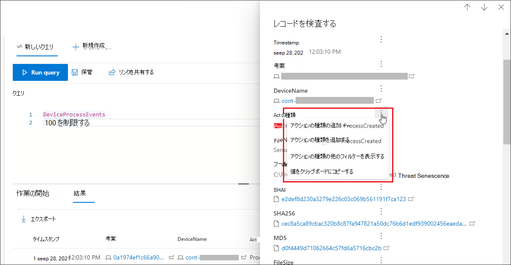

# <a name="work-with-advanced-hunting-query-results"></a>高度な検索クエリの結果を処理する

[!INCLUDE [Microsoft 365 Defender rebranding](../includes/microsoft-defender.md)]


**適用対象:**
- Microsoft 365 Defender
- Microsoft Defender for Endpoint

[!INCLUDE [Prerelease information](../includes/prerelease.md)]

高度な検索クエリを[](advanced-hunting-overview.md)作成して非常に正確な情報を取得することもできますが、クエリの結果を処理して、さらに詳しい分析情報を得て、特定のアクティビティとインジケーターを調査することもできます。 クエリ結果に対して次のアクションを実行できます。

- 結果を表またはグラフとして表示する
- 表とグラフのエクスポート
- 詳細なエンティティ情報にドリルダウンする
- 結果から直接クエリを調整するか、フィルターを適用する

## <a name="view-query-results-as-a-table-or-chart"></a>クエリ結果を表またはグラフとして表示する
既定では、高度な検索ではクエリ結果が表形式データとして表示されます。 グラフと同じデータを表示することもできます。 高度な検索では、次のビューがサポートされています。

| ビューの種類 | 説明 |
| -- | -- |
| **Table** | クエリ結果を表形式で表示する |
| **縦棒グラフ** | X 軸上の一連の一意の項目を、高さが別のフィールドの数値を表す垂直バーとしてレンダリングされます。 |
| **積み上げ列グラフ** | x 軸上の一連の一意のアイテムを、高さが 1 つ以上の他のフィールドの数値を表す積み上げ縦棒としてレンダリングされます。 |
| **円グラフ** | 一意のアイテムを表す断面円グラフをレンダリングします。 各円グラフのサイズは、別のフィールドの数値を表します。 |
| **ドーナツ グラフ** | 一意のアイテムを表す断面円弧をレンダリングします。 各円弧の長さは、別のフィールドの数値を表します。 |
| **折れ線グラフ** | 一連の一意の項目の数値をプロットし、プロットされた値を接続する |
| **散布図** | 一連の一意の項目の数値をプロットする |
| **エリア グラフ** | 一連の一意の項目の数値をプロットし、プロットされた値の下のセクションを塗りつぶし |

### <a name="construct-queries-for-effective-charts"></a>効果的なグラフのクエリを作成する
グラフをレンダリングする場合、高度な検索では、関心のある列と集計する数値が自動的に識別されます。 意味のあるグラフを取得するには、表示する特定の値を返すクエリを作成します。 サンプル クエリと結果のグラフを次に示します。

#### <a name="alerts-by-severity"></a>重大度別のアラート
グラフを `summarize` 作成する値の数値カウントを取得するには、演算子を使用します。 以下のクエリでは、演算子 `summarize` を使用して重大度別のアラート数を取得します。

```kusto
AlertInfo
| summarize Total = count() by Severity
```
結果をレンダリングすると、各重大度値が個別の列として列グラフに表示されます。


*列グラフとして表示される重大度別のアラートのクエリ結果*


#### <a name="phishing-emails-across-top-ten-sender-domains"></a>上位 10 個の送信者ドメインのフィッシングメール
有限ではない値のリストを扱う場合は、演算子を使用して、最も多くのインスタンスを持つ値のみを `Top` グラフ化できます。 たとえば、フィッシングメールが最も多い上位 10 個の送信者ドメインを取得するには、次のクエリを使用します。

```kusto
EmailEvents
| where ThreatTypes has "Phish" 
| summarize Count = count() by SenderFromDomain 
| top 10 by Count
```
円グラフ ビューを使用して、上位ドメイン全体の分布を効果的に表示します。


*上位の送信者ドメイン間でのフィッシングメールの配布を示す円グラフ*

#### <a name="file-activities-over-time"></a>時間の間のファイル アクティビティ
演算子を `summarize` 関数と一緒に使用すると、時間のとともに特定のインジケーター `bin()` に関連するイベントを確認できます。 以下のクエリは、ファイルに関連するイベントを 30 分間隔でカウントして、そのファイルに関連するアクティビティの `invoice.doc` スパイクを表示します。

```kusto
CloudAppEvents
| union DeviceFileEvents
| where FileName == "invoice.doc"
| summarize FileCount = count() by bin(Timestamp, 30m)
```
以下の線グラフは、以下を含むより多くのアクティビティを含む期間を明確に強調表示します `invoice.doc` 。 


*ファイルに関連するイベントの時間の数を示す線グラフ*


## <a name="export-tables-and-charts"></a>表とグラフのエクスポート
クエリを実行した後、[エクスポート] **を選択** して、結果をローカル ファイルに保存します。 選択したビューは、結果のエクスポート方法を決定します。

- **テーブル ビュー** - クエリ結果が表形式でブックとしてエクスポートMicrosoft Excelされます。
- **任意のグラフ** - クエリ結果は、レンダリングされたグラフの JPEG イメージとしてエクスポートされます。

## <a name="drill-down-from-query-results"></a>クエリ結果からドリルダウンする
クエリ結果のレコードをすばやく検査するには、対応する行を選択して [レコードの検査] パネル **を開** きます。 パネルには、選択したレコードに基づいて次の情報が表示されます。

- **アセット** - レコード内にある主な資産 (メールボックス、デバイス、およびユーザー) の要約ビューで、リスクや露出レベルなどの利用可能な情報が充実しています。
- **すべての詳細** - レコード内の列のすべての値  


コンピューター、ファイル、ユーザー、IP アドレス、URL など、クエリ結果内の特定のエンティティに関する詳細情報を表示するには、エンティティ識別子を選択して、そのエンティティの詳細なプロファイル ページを開きます。

## <a name="tweak-your-queries-from-the-results"></a>結果からクエリを絞り込む
[レコードの検査] パネルで、任意の列の右側にある 3 つのドット **を選択** します。 次のようなオプションを使用できます。

- 選択した値 (`==`) を明示的に検索する
- 選択した値をクエリ (`!=`) から除外する 
- クエリに値を追加するためのより高度な演算子 `contains`、`starts with`、および `ends with` を取得する 




>[!NOTE]
>この記事の一部のテーブルは、Microsoft Defender for Endpoint では使用できない場合があります。 [複数のデータ Microsoft 365 Defender](m365d-enable.md)を使用して脅威を検出するには、このオプションをオンにしてください。 高度なハンティング ワークフローを Microsoft Defender for Endpoint から Microsoft 365 Defenderに移動するには、「Advanced Hunting [queries](advanced-hunting-migrate-from-mde.md)を Microsoft Defender for Endpoint から移行する」の手順に従います。

## <a name="related-topics"></a>関連項目
- [高度な追求の概要](advanced-hunting-overview.md)
- [クエリ言語の説明](advanced-hunting-query-language.md)
- [共有クエリを使用する](advanced-hunting-shared-queries.md)
- [デバイス、メール、アプリ、ID 全体で探す](advanced-hunting-query-emails-devices.md)
- [スキーマを理解する](advanced-hunting-schema-tables.md)
- [クエリのベスト プラクティスを適用する](advanced-hunting-best-practices.md)
- [カスタム検出の概要](custom-detections-overview.md)
