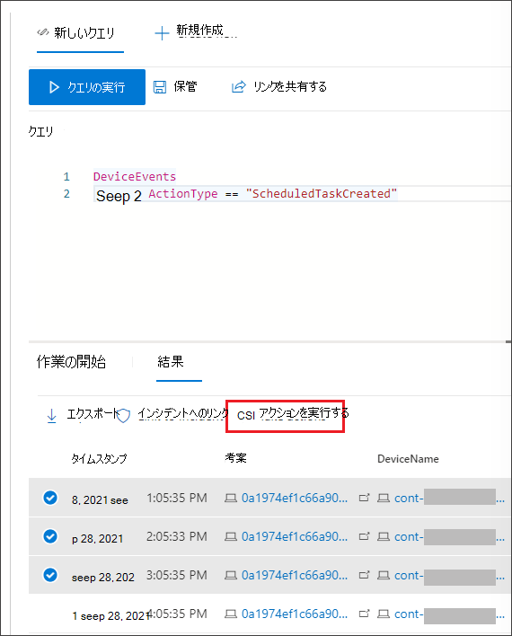

# 高度な検索クエリの結果に対してアクションを実行する

[!INCLUDE [Microsoft 365 Defender rebranding](../includes/microsoft-defender.md)]

**適用対象:**
- Microsoft 365 Defender
- Microsoft Defender for Endpoint

[!INCLUDE [Prerelease information](../includes/prerelease.md)]

強力で包括的なアクション オプションを使用して、高度な狩猟で見つけた脅威を迅速に含め、または侵害された資産に対処できます。 これらのオプションを使用すると、次の機能を使用できます。

- デバイスでさまざまなアクションを実行する
- 検疫ファイル

## 必要なアクセス許可
高度な検索を通じてアクションを実行するには、デバイスに修復アクションを送信するためのアクセス許可を持つ Microsoft Defender for Endpoint の [役割が必要です](/windows/security/threat-protection/microsoft-defender-atp/user-roles#permission-options)。 アクションを実行できない場合は、次のアクセス許可を取得する方法について、グローバル管理者に問い合わせてください。

*脅威と脅威に対>アクティブな脆弱性の管理アクション - 修復処理*

## デバイスでさまざまなアクションを実行する
クエリ結果の列で識別されるデバイスに対して、次 `DeviceId` のアクションを実行できます。

- 影響を受けるデバイスを分離して、感染を含むか、攻撃が横方向に移動しなかっ
- 調査パッケージを収集して、より多くの調査情報を取得する
- ウイルス対策スキャンを実行して、最新のセキュリティ インテリジェンス更新プログラムを使用して脅威を検索および削除する
- 自動調査を開始して、デバイスおよび他の影響を受ける可能性のあるデバイス上の脅威を確認および修復する
- アプリの実行を Microsoft が署名した実行可能ファイルにのみ制限し、マルウェアや他の信頼されていない実行可能ファイルによる後続の脅威アクティビティを防止する

これらの応答アクションが Microsoft Defender for Endpoint を介して実行される方法の詳細については、「デバイスでの応答 [アクション」を参照してください](/windows/security/threat-protection/microsoft-defender-atp/respond-machine-alerts)。
   
## 検疫ファイル
ファイルに検疫アクション *を* 展開すると、ファイルが検出された場合に自動的に検疫されます。 このアクションを選択すると、次の列から選択して、検疫するクエリ結果内のファイルを識別できます。

- `SHA1` — 最も高度な検索テーブルでは、記録されたアクションの影響を受けたファイルの SHA-1 です。 たとえば、ファイルがコピーされた場合、これはコピーされたファイルです。
- `InitiatingProcessSHA1` — 最も高度な検索テーブルでは、記録されたアクションの開始を担当するファイルです。 たとえば、子プロセスが起動された場合、これは親プロセスになります。 
- `SHA256` — これは、列で識別されるファイルに相当する SHA-256 `SHA1` です。
- `InitiatingProcessSHA256` — これは、列で識別されるファイルに相当する SHA-256 `InitiatingProcessSHA1` です。

検疫アクションの実行方法とファイルの復元方法の詳細については、「ファイルに対する応答アクション」 [を参照してください](/windows/security/threat-protection/microsoft-defender-atp/respond-file-alerts)。

>[!NOTE]
>ファイルを検索して検疫するには、クエリ結果に値を `DeviceId` デバイス識別子として含める必要があります。  

## アクションを行う
説明されているアクションのいずれかを実行するには、クエリ結果で 1 つ以上のレコードを選択し、[アクションの実行] **を選択します**。 ウィザードを使用すると、優先するアクションを選択して送信するプロセスを案内します。

## 実行されたアクションを確認する
各アクションは、アクション センターの[履歴] ([アクション センター履歴] ( [ security.microsoft.com/action-center/history] の下のアクション センター  >  [に個別に記録されます](https://security.microsoft.com/action-center/history)。 アクション センターに移動して、各アクションの状態を確認します。
 
>[!NOTE]
>この記事の一部のテーブルは、Microsoft Defender for Endpoint では使用できない場合があります。 [複数のデータ Microsoft 365 Defender](m365d-enable.md)を使用して脅威を検出するには、このオプションをオンにしてください。 高度なハンティング ワークフローを Microsoft Defender for Endpoint から Microsoft 365 Defenderに移動するには、「Advanced Hunting [queries](advanced-hunting-migrate-from-mde.md)を Microsoft Defender for Endpoint から移行する」の手順に従います。

## 関連項目
- [高度な追求の概要](advanced-hunting-overview.md)
- [クエリ言語の説明](advanced-hunting-query-language.md)
- [クエリ結果を操作する](advanced-hunting-query-results.md)
- [スキーマを理解する](advanced-hunting-schema-tables.md)
- [アクション センターの概要](m365d-action-center.md)
