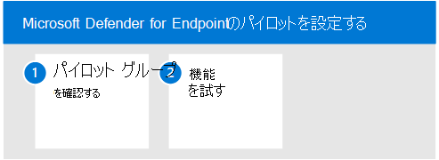

# エンドポイント向け Microsoft Defender のパイロット

この記事では、Microsoft Defender for Endpoint のパイロットを実行するプロセスについて説明します。 

次の手順を使用して、Microsoft Defender for Endpoint のパイロットをセットアップおよび構成します。 

- 手順 1. パイロット グループの確認
- 手順 2。 機能を試す

Microsoft Defender for Endpoint をパイロットする場合は、組織全体をオンボーディングする前に、いくつかのデバイスをサービスにオンボードできます。  

その後、攻撃シミュレーションの実行、Defender for Endpoint による悪意のあるアクティビティの表面化、効率的な応答の実行など、利用可能な機能を試し直します。 

## 手順 1. パイロット グループの確認
[評価を有効にする] セクションで説明されているオンボーディング手順を完了すると、デバイスインベントリリストにデバイスが約 1 時間後に表示されます。 

オンボードデバイスが表示された場合は、機能の試しに進みます。 

## 手順 2。 機能を試す
一部のデバイスのオンボーディングが完了し、サービスに報告されているのを確認したら、使用可能な強力な機能を試して、製品について理解してください。

パイロットの間は、複雑な構成手順を実行せずに、いくつかの機能を試して製品を実際に確認できます。

まず、ダッシュボードをチェックアウトします。

### デバイス インベントリの表示
デバイス インベントリは、ネットワーク内のエンドポイント、ネットワーク デバイス、および IoT デバイスの一覧を表示する場所です。 ネットワーク内のデバイスのビューを提供するだけでなく、ドメイン、リスク レベル、OS プラットフォームなどの詳細な情報を提供し、最も危険にさらされているデバイスを簡単に識別できます。

### 脅威と脅威のダッシュボード脆弱性の管理する 
脅威と脆弱性の管理は、組織にとって最も緊急かつ最もリスクの高い弱点に集中するのに役立ちます。 ダッシュボードから、組織の露出スコア、Microsoft Secure Score for Devices、デバイスの露出分布、トップ セキュリティ推奨事項、脆弱なソフトウェアの上位、トップ修復アクティビティ、および公開されているトップ デバイス データの高レベルのビューを取得します。 

### シミュレーションの実行
Microsoft Defender for Endpoint には、パイロット デバイスで実行できる ["Do It Yourself"](https://securitycenter.windows.com/tutorials) 攻撃シナリオが付属しています。  各ドキュメントには、OS とアプリケーションの要件、および攻撃シナリオに固有の詳細な手順が含まれています。 これらのスクリプトは安全で文書化され、使いやすいです。 これらのシナリオは、Defender for Endpoint の機能を反映し、調査のエクスペリエンスについて説明します。

提供されているシミュレーションのいずれかを実行するには、オンボードデバイスが少なくとも [1 つ必要です](../defender-endpoint/onboard-configure.md)。

1. [**ヘルプ**  >  **シミュレーション] &で**、シミュレートする利用可能な攻撃シナリオを選択します。

   - **シナリオ 1: ドキュメントドロップバックドア** - ソーシャルエンジニアリングされたルアー ドキュメントの配信をシミュレートします。 このドキュメントは、攻撃者に制御を与える特別に細工されたバックドアを起動します。

   - **シナリオ 2: ファイル** レス攻撃の PowerShell スクリプト - PowerShell に依存するファイルレス攻撃をシミュレートし、攻撃表面の縮小と悪意のあるメモリ アクティビティのデバイス学習検出を示します。

   - **シナリオ 3: インシデント** 対応の自動化 - 自動調査がトリガーされ、侵害アーティファクトを自動的にハントして修復してインシデント対応の容量を拡張します。

2. 選択したシナリオで提供される対応するチュートリアル ドキュメントをダウンロードして読み取る。

3. シミュレーション ファイルをダウンロードするか、チュートリアルのヘルプ シミュレーションに移動してシミュレーション  >  **スクリプト&します**。 テスト デバイスでファイルまたはスクリプトをダウンロードすることもできますが、必須ではありません。

4. チュートリアル ドキュメントの指示に従って、テスト デバイスでシミュレーション ファイルまたはスクリプトを実行します。

> [!NOTE]
> シミュレーション ファイルまたはスクリプトは攻撃アクティビティを模倣しますが、実際には良性であり、テスト デバイスに害を及ぼしたり、危険にさらしたりしません。

## 次の手順
[Microsoft Defender for Cloud Apps の評価](eval-defender-mcas-overview.md)

エンドポイントの Microsoft [Defender の評価の概要に戻る](eval-defender-endpoint-overview.md)

[評価とパイロット][の概要に戻Microsoft 365 Defender](eval-overview.md)
