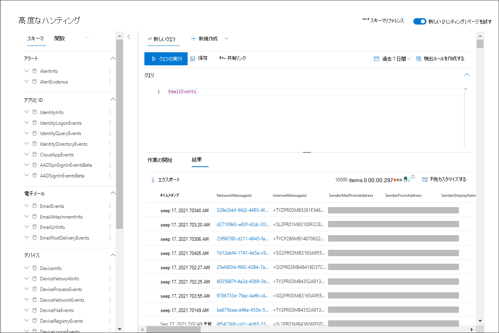
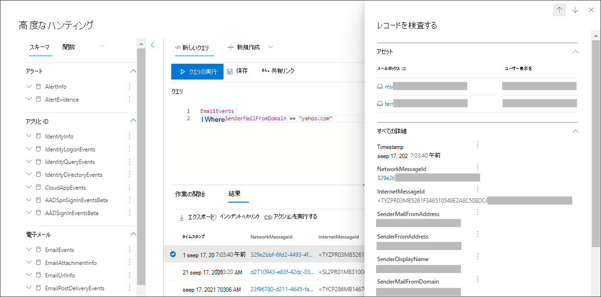

# <a name="try-microsoft-365-defender-incident-response-capabilities-in-a-pilot-environment"></a>パイロットMicrosoft 365 Defenderインシデント対応機能を試す

**適用対象:**
- Microsoft 365 Defender

この記事は[、パイロット環境を使用](eval-defender-investigate-respond.md)してインシデントの調査と対応を実行するプロセスの手順 2 Microsoft 365 Defenderです。 このプロセスの詳細については、概要の記事を [参照](eval-defender-investigate-respond.md) してください。

シミュレートされた攻撃[に対して](eval-defender-investigate-respond-simulate-attack.md)インシデント対応を実行したら、次のMicrosoft 365 Defenderを確認できます。

|機能 |説明 |
|:-------|:-----|
| [インシデントの優先度設定](#prioritize-incidents) | 次に対処するインシデントを決定するには、インシデント キューのフィルター処理と並べ替えを使用します。 |
| [インシデントの管理](#manage-incidents) | インシデント のプロパティを変更して、正しい割り当てを確認し、タグとコメントを追加し、インシデントを解決します。 |
| [自動調査および対応](#examine-automated-investigation-and-response-with-the-action-center) | セキュリティ運用チームが脅威に効率的かつ効果的に対処するのに役立つ、自動調査と応答 (AIR) 機能。 アクション センターは、保留中の修復アクションの承認など、インシデントタスクおよびアラート タスクの "単一ウィンドウ" エクスペリエンスです。 |
| [高度な追求](#advanced-hunting) | ネットワーク内のイベントを積極的に検査し、脅威インジケーターとエンティティを見つけ出すクエリ ベースの脅威検出ツール。 また、インシデントの調査と修復中に高度な検索を使用します。 |


## <a name="prioritize-incidents"></a>インシデントの優先度を設定する

インシデント ポータル (security.microsoft.com)の&でインシデント>アラートからインシデント キューに[Microsoft 365 Defender取得します](https://security.microsoft.com)。 次に例を示します。

:::image type="content" source="../../media/incidents-queue/incidents-ss-incidents.png" alt-text="インシデント キューの例。":::

[ **最新のインシデントと** 通知] セクションには、過去 24 時間に受信したアラートとインシデントが作成された数のグラフが表示されます。

インシデントの一覧を確認し、割り当てと調査の重要度を優先するには、次の方法を実行できます。 

- カスタマイズ可能な列 ([列の **選択**] を選択) を構成して、インシデントまたは影響を受けたエンティティの異なる特性を可視化します。 これにより、分析のためのインシデントの事前設定に関する情報に基づいた意思決定を行う際に役立ちます。

- 特定のシナリオまたは脅威に焦点を当てるには、フィルターを使用します。 インシデント キューにフィルターを適用すると、すぐに注意が必要なインシデントを特定できます。 

既定のインシデント キューから、[フィルター] を **選択して**[フィルター] ウィンドウを表示し、そこから特定のインシデント のセットを指定できます。 次に例を示します。

:::image type="content" source="../../media/incidents-queue/incidents-ss-incidents-filters.png" alt-text="インシデント キューのフィルター ウィンドウの例。":::

詳細については、「インシデントの優先順位付 [け」を参照してください](incident-queue.md)。

## <a name="manage-incidents"></a>インシデントを管理する

インシデントを管理するには、インシデント用の[**インシデントの管理**] ウィンドウから行います。 次に例を示します。

:::image type="content" source="../../media/incidents-queue/incidents-ss-incidents-manage.png" alt-text="インシデントの [インシデントの管理] ウィンドウの例。":::

このウィンドウは、次の [インシデントの **管理** ] リンクから表示できます。

- インシデント キュー内のインシデントのプロパティ ウィンドウ。
- **インシデントの** 概要ページ。

インシデントを管理する方法は次のとおりです。

- インシデント名を編集する

  セキュリティ チームのベスト プラクティスに基づいて、自動的に割り当てられた名前を変更します。
  
- インシデント タグを追加する

  セキュリティ チームがインシデントを分類するために使用するタグを追加します。これは後でフィルター処理できます。
  
- インシデントを自分に割り当てる

  ユーザー アカウント名に割り当て、後でフィルター処理できます。
  
- インシデントの解決

  修復後にインシデントを閉じます。
  
- その分類と決定を設定する

  インシデントを解決するときに脅威の種類を分類して選択します。
  
- コメントを追加する

  セキュリティ チームのベスト プラクティスに基づいて、進行状況、メモ、その他の情報にコメントを使用します。 完全なコメント履歴は、インシデントの詳細 **ページの** [コメントと履歴] オプションから使用できます。

詳細については、「インシデントの管理 [」を参照してください](manage-incidents.md)。

## <a name="examine-automated-investigation-and-response-with-the-action-center"></a>アクション センターで自動調査と対応を確認する

組織の自動調査および対応機能の構成方法に応じて、修復アクションは自動的に実行するか、セキュリティ運用チームによる承認を受けた場合にのみ実行されます。 保留中か完了かに関係ないすべてのアクションは、デバイスの保留中および完了[](m365d-action-center.md)済み修復アクション、電子メール & コラボレーション コンテンツ、および ID を 1 つの場所に一覧表示するアクション センターに一覧表示されます。

次に例を示します。

:::image type="content" source="../../media/m3d-action-center-unified.png" alt-text="[統合アクション] センター (Microsoft 365 Defender)。":::

アクション センターから保留中のアクションを選択し、フライアウト ウィンドウで承認または拒否できます。 次に例を示します。

:::image type="content" source="../../media/air-actioncenter-itemselected.png" alt-text="アクションを承認または拒否します。":::

保留中のアクションをできるだけ早く承認 (または拒否) して、自動化された調査を実行し、時間に合った方法で完了できます。

詳細については、「自動調査と [対応と](m365d-autoir.md) アクション センター」 [を参照してください](m365d-action-center.md)。

## <a name="advanced-hunting"></a>高度な検出

> [!NOTE]
> 高度な狩猟シミュレーションについて説明する前に、次のビデオを見て、高度な狩猟の概念を理解し、ポータルで検索できる場所を確認し、セキュリティ操作でどのように役立つのかをご確認ください。

<br>

> [!VIDEO https://www.microsoft.com/videoplayer/embed/RE4Bp7O]


オプションのファイルレス [PowerShell](eval-defender-investigate-respond-simulate-attack.md#simulate-an-attack-with-an-isolated-domain-controller-and-client-device-optional) 攻撃シミュレーションが、既に資格情報アクセス ステージに達した実際の攻撃である場合は、調査の任意の時点で高度な検索を使用して、生成されたアラートと影響を受けるエンティティから既に知っている情報を使用して、ネットワーク内のイベントやレコードを積極的に検索できます。 

たとえば、User and IP [address reconnaissance (SMB)](eval-defender-investigate-respond-simulate-attack.md#alert-user-and-ip-address-reconnaissance-smb-source-microsoft-defender-for-identity)アラートの情報に基づいて、テーブルを使用してすべての SMB セッション列挙イベントを検索したり、テーブルを使用して Microsoft Defender for Identity データのさまざまなプロトコルで検出アクティビティを見つけたりできます。 `IdentityDirectoryEvents` `IdentityQueryEvents`


### <a name="hunting-environment-requirements"></a>ハンティング環境の要件

このシミュレーションには、内部メールボックスとデバイスが 1 つ必要です。 テスト メッセージを送信するには、外部メール アカウントも必要です。

1. テナントが有効[になっているMicrosoft 365 Defender。](m365d-enable.md#confirm-that-the-service-is-on)
2. 電子メールの受信に使用するターゲット メールボックスを特定します。

   - このメールボックスは、Microsoft Defender によって監視されている必要Office 365

   - 要件 3 のデバイスは、このメールボックスにアクセスする必要があります

3. テスト デバイスを構成します。

    a. バージョン 1903 以降Windows 10を使用してください。

    b. テスト デバイスをテスト ドメインに参加します。

    c. [[オンにする] をWindows Defender ウイルス対策](/windows/security/threat-protection/windows-defender-antivirus/configure-windows-defender-antivirus-features)します。 問題が発生した場合は、このトラブルシューティング Windows Defender ウイルス対策を[参照してください](/windows/security/threat-protection/microsoft-defender-atp/troubleshoot-onboarding#ensure-that-microsoft-defender-antivirus-is-not-disabled-by-a-policy)。

    d. [エンドポイント用 Microsoft Defender にオンボードします](/windows/security/threat-protection/microsoft-defender-atp/configure-endpoints)。

### <a name="run-the-simulation"></a>シミュレーションを実行する

1. 外部メール アカウントから、ハンティング環境の要件セクションの手順 2 で識別されたメールボックスに電子メールを送信します。 既存の電子メール フィルター ポリシーで許可される添付ファイルを含める。 このファイルは、悪意のあるファイルや実行可能ファイルである必要があります。 推奨されるファイルの種類は<i>、.pdf、.exe</i><i>場合</i>)、または Word ファイルなどのOfficeドキュメントの種類です。

2. [ハンティング環境の要件] セクションの手順 3 で定義されているデバイスから送信された電子メールを開きます。 添付ファイルを開くか、ファイルをデバイスに保存します。

#### <a name="go-hunting"></a>Go hunting

1. ポータルを[開Microsoft 365 Defenderします](https://security.microsoft.com/)。

2. ナビゲーション ウィンドウで、[ハンティング と高度な **>を選択します**。

3. 電子メール イベントの収集から始まるクエリを作成します。

   1. [クエリ **の実行] >新規を選択します**。

   1. [高度 **な検索]** の **[メール** グループ] で **、[EmailEvents] をダブルクリックします**。 これはクエリ ウィンドウに表示されます。

      ```console
      EmailEvents
      ```

   1. クエリの時間枠を過去 24 時間に変更します。 上記のシミュレーションを実行した際に送信したメールが過去 24 時間だったと仮定し、それ以外の場合は必要に応じて時間枠を変更します。

   1. **[クエリの実行]** を選択します。 パイロット環境によって結果が異なる場合があります。

      > [!NOTE]
      > データの取得を制限するオプションのフィルター処理については、次の手順を参照してください。

      

        > [!NOTE]
        > 高度な検索では、クエリ結果が表形式のデータとして表示されます。 グラフなどの他の形式のデータを表示することもできます。

   1. 結果を確認し、開いたメールを識別できる場合を確認します。 高度な検索でメッセージが表示されるには、最大 2 時間かかる場合があります。 結果を絞り込むには、クエリにwhere 条件を追加して、SenderMailFromDomain として "yahoo.com" を持つメールのみを検索できます。 次に例を示します。

      ```console
      EmailEvents
      | where SenderMailFromDomain == "yahoo.com"
      ```

   1. クエリの結果の行をクリックして、レコードを検査できます。

      

4. メールが表示されるのを確認したので、添付ファイルのフィルターを追加します。 環境内の添付ファイルを含むすべてのメールに焦点を当てる。 このシミュレーションでは、環境から送信されるメールではなく、受信メールに焦点を当てる必要があります。 追加したフィルターを削除して、メッセージを見つけて "メッセージ" を追加|AttachmentCount **> 0** と **EmailDirection**  ==  **"Inbound""**

   次のクエリは、すべての電子メール イベントに対する最初のクエリよりも短いリストを持つ結果を表示します。

   ```console
   EmailEvents
   | where AttachmentCount > 0 and EmailDirection == "Inbound"
   ```

5. 次に、添付ファイルに関する情報 (ファイル名、ハッシュなど) を結果セットに含める。 これを行うには **、EmailAttachmentInfo テーブルに参加** します。 参加に使用する一般的なフィールドは **、NetworkMessageId** と **RecipientObjectId です**。

   次のクエリには、追加の行 "| **project-rename EmailTimestamp=Timestamp**" は、次の手順で追加するファイルアクションに関連するタイムスタンプとメールに関連したタイムスタンプを識別するのに役立ちます。

   ```console
   EmailEvents
   | where AttachmentCount > 0 and EmailDirection == "Inbound"
   | project-rename EmailTimestamp=Timestamp
   | join EmailAttachmentInfo on NetworkMessageId, RecipientObjectId
   ```

6. 次に **、EmailAttachmentInfo** テーブルの **SHA256** 値を使用して、そのハッシュの **DeviceFileEvents** (エンドポイントで発生したファイル アクション) を検索します。 ここでの共通フィールドは、添付ファイルの SHA256 ハッシュです。

   結果の表には、エンドポイント (Microsoft Defender for Endpoint) の詳細 (デバイス名、実行されたアクション (この場合は FileCreated イベントのみを含むフィルター処理)、ファイルが格納された場所が含まれます。 プロセスに関連付けられたアカウント名も含まれます。

   ```console
   EmailEvents
   | where AttachmentCount > 0 and EmailDirection == "Inbound"
   | project-rename EmailTimestamp=Timestamp
   | join EmailAttachmentInfo on NetworkMessageId, RecipientObjectId
   | join DeviceFileEvents on SHA256
   | where ActionType == "FileCreated"
   ```

   これで、ユーザーが添付ファイルを開いた、または保存した受信メールを識別するクエリを作成しました。 このクエリを絞り込み、特定の送信者ドメイン、ファイル サイズ、ファイルの種類などについてフィルター処理することもできます。

7. 関数は、有病率、署名者、発行者情報などのファイルに関するより多くの TI データを取得できる、特別な種類の結合です。ファイルの詳細を取得するには **、FileProfile() 関数エンリッチメントを** 使用します。

    ```console
    EmailEvents
    | where AttachmentCount > 0 and EmailDirection == "Inbound"
    | project-rename EmailTimestamp=Timestamp
    | join EmailAttachmentInfo on NetworkMessageId, RecipientObjectId
    | join DeviceFileEvents on SHA256
    | where ActionType == "FileCreated"
    | distinct SHA1
    | invoke FileProfile()
    ```

#### <a name="create-a-detection"></a>検出を作成する

将来発生した場合に通知を受け取る情報を識別するクエリを作成したら、クエリからカスタム検出を作成できます。

カスタム検出では、設定した頻度に従ってクエリが実行され、クエリの結果によって、選択した影響を受け取ったアセットに基づいてセキュリティアラートが作成されます。 これらのアラートはインシデントに関連付け、製品の 1 つによって生成される他のセキュリティ アラートとしてトリアージできます。

1. クエリ ページで、Go ハンティング手順の手順 7 で追加された行 7 と 8 を削除し、[検出ルールの作成] **をクリックします**。

   ![高度な検索ページで [検出ルールの作成] をクリックできる場所の例。](../../media/advanced-hunting-incident-response-try-3.png)

   > [!NOTE]
   > [検出ルール **の作成] を** クリックし、クエリに構文エラーがある場合、検出ルールは保存されません。 クエリをダブルクリックして、エラーがないか確認します。

2. 必要なフィールドに、セキュリティ チームがアラートを理解できる情報、アラートが生成された理由、および必要なアクションを入力します。

   

   この検出ルールアラートに関する情報に基づいた決定を次のユーザーに提供するために、フィールドに明確な情報を入力してください。

3. このアラートで影響を受け取るエンティティを選択します。 この場合、[デバイスとメールボックス **] を****選択します**。

   

4. アラートがトリガーされた場合に実行するアクションを決定します。 この場合、ウイルス対策スキャンを実行しますが、他の操作を実行できます。

   

5. アラート ルールのスコープを選択します。 このクエリにはデバイスが含まれるので、デバイス グループは Microsoft Defender for Endpoint コンテキストに従って、このカスタム検出に関連します。 影響を受け取ったエンティティとしてデバイスを含めないカスタム検出を作成する場合、スコープは適用されません。

   

   このパイロットの場合は、このルールを実稼働環境のテスト デバイスのサブセットに制限できます。

6. **[作成]** を選択します。 次に、ナビゲーション **パネルから [カスタム** 検出ルール] を選択します。

   ![メニューの [カスタム検出ルール] オプションの例。](../../media/mtp/fig27a.png)

   

   このページから検出ルールを選択すると、詳細ページが開きます。

   

<!--

### Advanced hunting walk-through exercises

To learn more about advanced hunting, the following webcasts will walk you through the capabilities of advanced hunting within Microsoft 365 Defender to create cross-pillar queries, pivot to entities, and create custom detections and remediation actions.

> [!NOTE]
> Be prepared with your own GitHub account to run the hunting queries in your pilot test lab environment.

|Title|Description|Download MP4|Watch on YouTube|CSL file to use|
|---|---|---|---|---|
|Episode 1: KQL fundamentals|We'll cover the basics of advanced hunting capabilities in Microsoft 365 Defender. Learn about available advanced hunting data and basic KQL syntax and operators.|[MP4](https://aka.ms/MTP15JUL20_MP4)|[YouTube](https://youtu.be/0D9TkGjeJwM)|[Episode 1: CSL file in Git](https://github.com/microsoft/Microsoft-threat-protection-Hunting-Queries/blob/master/Webcasts/TrackingTheAdversary/Episode%201%20-%20KQL%20Fundamentals.csl)|
|Episode 2: Joins|We'll continue learning about data in advanced hunting and how to join tables together. Learn about inner, outer, unique, and semi joins, and the nuances of the default Kusto innerunique join.|[MP4](https://aka.ms/MTP22JUL20_MP4)|[YouTube](https://youtu.be/LMrO6K5TWOU)|[Episode 2: CSL file in Git](https://github.com/microsoft/Microsoft-threat-protection-Hunting-Queries/blob/master/Webcasts/TrackingTheAdversary/Episode%202%20-%20Joins.csl)|
|Episode 3: Summarizing, pivoting, and visualizing data|Now that we're able to filter, manipulate, and join data, it's time to start summarizing, quantifying, pivoting, and visualizing. In this episode, we'll cover the summarize operator and some of the calculations you can perform while diving into additional tables in the advanced hunting schema. We turn our datasets into charts that can help improve analysis.|[MP4](https://aka.ms/MTP29JUL20_MP4)|[YouTube](https://youtu.be/UKnk9U1NH6Y)|[Episode 3: CSL file in Git](https://github.com/microsoft/Microsoft-threat-protection-Hunting-Queries/blob/master/Webcasts/TrackingTheAdversary/Episode%203%20-%20Summarizing%2C%20Pivoting%2C%20and%20Joining.csl)|
|Episode 4: Let's hunt! Applying KQL to incident tracking|Time to track some attacker activity! In this episode, we'll use our improved understanding of KQL and advanced hunting in Microsoft 365 Defender to track an attack. Learn some of the tips and tricks used in the field to track attacker activity, including the ABCs of cybersecurity and how to apply them to incident response.|[MP4](https://aka.ms/MTP5AUG20_MP4)|[YouTube](https://youtu.be/2EUxOc_LNd8)|[Episode 4: CSL file in Git](https://github.com/microsoft/Microsoft-threat-protection-Hunting-Queries/blob/master/Webcasts/TrackingTheAdversary/Episode%204%20-%20Lets%20Hunt.csl)|
|

--> 

### <a name="expert-training-on-advanced-hunting"></a>高度な狩猟に関する専門家のトレーニング

**敵を追跡する方法は** 、新しいセキュリティ アナリストや、新しい脅威ハンター向け Web キャスト シリーズです。 高度な検索の基本を説明し、独自の高度なクエリを作成します。 

詳細については [、「高度な狩猟に関する専門家のトレーニングを受け取る」](advanced-hunting-expert-training.md) を参照してください。

### <a name="navigation-you-may-need"></a>必要なナビゲーション

[評価環境Microsoft 365 Defender作成する](eval-create-eval-environment.md)
