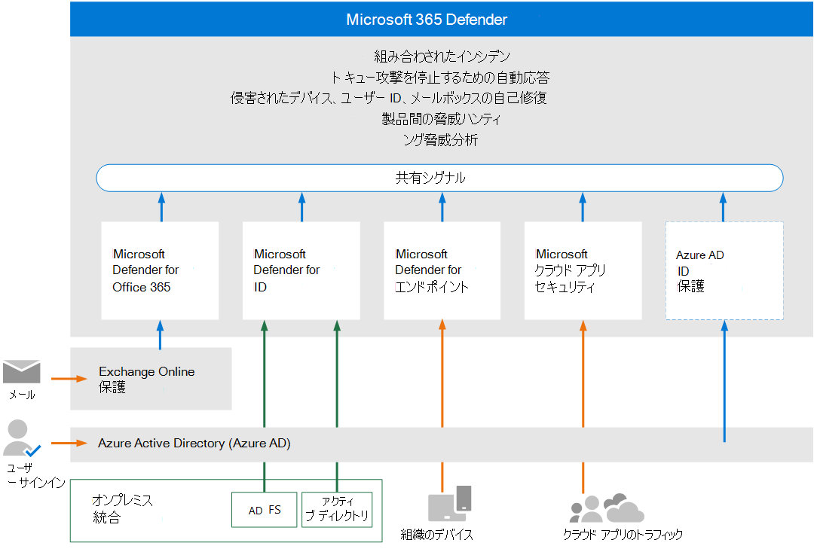

# 評価とパイロットMicrosoft 365 Defender

**適用対象:**

- Microsoft 365 Defender

Microsoft 365 Defenderは、エンドポイント、電子メール、アプリケーション、ID など、Microsoft 365 環境全体からの信号、脅威、およびアラート データを自動的に収集、関連付け、分析する拡張検出および応答 (XDR) ソリューションです。 広範な AI と自動化を活用して、攻撃を自動的に停止し、影響を受ける資産を安全な状態に修復します。 次の記事では、試用版環境をセットアップする手順を説明し、テスト環境の機能と機能を評価Microsoft 365 Defender。 

これらの記事の手順では、各コンポーネントを有効にし、設定を構成し、パイロット グループで監視を開始する方法について説明します。 準備ができたら、評価環境を直接実稼働環境に昇格することで終了できます。 

Microsoft では、既存の製品版サブスクリプションで評価を作成Office 365。 これにより、すぐに実際の分析情報を取得し、環境内の現在の脅威に対して動作する設定を調整できます。 経験を積み、プラットフォームに快適に対応した後は、各コンポーネントを一度に 1 つ、実稼働環境に昇格します。 

## 攻撃の解剖学

Microsoft 365 Defenderは、クラウドベースの統合型、侵害前および侵害後のエンタープライズ防御スイートです。 エンドポイント、ID、アプリ、電子メール、共同作業アプリケーション、およびすべてのデータ間で防止、検出、調査、応答を調整します。 

この図では、攻撃が進行中です。 フィッシングメールは、組織内の従業員の受信トレイに届き、知らず知らずのうちにメールの添付ファイルを開きます。 これによりマルウェアがインストールされ、機密データの盗難で終わる可能性のある一部のイベントが発生します。 ただし、この場合、Defender for Office 365操作中です。

この図について:

- **Exchange Online Protection、Microsoft** Defender for Office 365の一部は、フィッシング メールを検出し、メール フロー ルールを使用して受信トレイに届かなかったことを確認できます。
- **Office 365** 安全な添付ファイルの Defender は添付ファイルをテストし、有害と判断します。そのため、受信したメールはユーザーが操作できないか、ポリシーによってメールが届かないので、メールが全く届かないので、問題ありません。
- **Defender for Endpoint は** 、企業ネットワークに接続し、悪用される可能性のあるデバイスとネットワークの脆弱性を検出するデバイスを管理します。
- **Defender for Identity は** 、特権エスカレーションやリスクの高い横方向の移動など、アカウントの突然の変更に注意します。 また、セキュリティ チームによる修正のために、拘束されていない Kerberos 委任など、簡単に悪用された ID の問題について報告します。
- **Microsoft Cloud App Security、** 移動不可能、資格情報へのアクセス、異常なダウンロード、ファイル共有、メール転送のアクティビティなど、異常な動作に気付き、セキュリティ チームに報告します。

### Microsoft 365 Defenderコンポーネント

Microsoft 365 Defenderは、これらのセキュリティ テクノロジで構成されています。タンデムで動作します。 これらのコンポーネントのすべては、XDR とアプリケーションの機能の恩恵を受ける必要Microsoft 365 Defender。 1 つまたは 2 つを使用して、利益と効率を実現します。 

|コンポーネント  |説明  |参考資料  |
|---------|---------|---------|
|Microsoft Defender for Identity     |      Microsoft Defender for Identity は、Active Directory シグナルを使用して、組織に向けられた高度な脅威、侵害された ID、悪意のあるインサイダーアクションを特定、検出、および調査します。     |     [Microsoft Defender for Identity とは](/defender-for-identity/what-is)   |
|Exchange Online Protection     |      Exchange Online Protectionは、スパムやマルウェアから組織を保護するのに役立つネイティブのクラウドベースの SMTP リレーおよびフィルター サービスです。      |   [Exchange Online Protection (EOP) の概要 - Office 365](../office-365-security/overview.md)     |
|Microsoft Defender for Office 365     |     Microsoft Defender for Office 365、電子メール メッセージ、リンク (URL)、およびコラボレーション ツールによる悪意のある脅威から組織を保護します。      |    [Microsoft Defender for Office 365 - Office 365](../office-365-security/overview.md)    |
|Microsoft Defender for Endpoint     |     Microsoft Defender for Endpoint は、デバイス保護、侵害後の検出、自動調査、推奨される対応のための統合プラットフォームです。      |   [Microsoft Defender for Endpoint - Windows セキュリティ](../defender-endpoint/microsoft-defender-endpoint.md)    |
|Microsoft Cloud App Security     |      Microsoft Cloud App セキュリティは、クラウド アプリに深い可視性、強力なデータ制御、強化された脅威保護をもたらす包括的なクロス SaaS ソリューションです。       |    [Cloud App Security とは](/cloud-app-security/what-is-cloud-app-security)    |
|Azure AD Identity Protection|Azure AD Id Protection は、何十億回ものサインイン試行からのリスク データを評価し、このデータを使用して、環境への各サインインのリスクを評価します。 このデータは、条件付きアクセス AD構成方法に応じて、アカウント アクセスを許可または防止するために Azure ADによって使用されます。 Azure AD ID 保護は、ユーザーのライセンスとは別にMicrosoft 365 Defender。 このファイルは、Azure Active Directory Premium P2。|[Identity Protection とは](/azure/active-directory/identity-protection/overview-identity-protection)|
| | | |

## Microsoft 365 Defenderアーキテクチャ

次の図は、主要なコンポーネントと統合Microsoft 365 Defenderアーキテクチャを示しています。 *各 Defender* コンポーネントの詳細なアーキテクチャ、および使用例のシナリオについては、この一連の記事で説明します。

この図では、次の例を示します。

- Microsoft 365 Defenderすべての Defender コンポーネントからの信号を組み合わせ、ドメイン間で拡張検出と応答 (XDR) を提供します。 これには、統合インシデント キュー、攻撃の停止に対する自動応答、自己修復 (侵害されたデバイス、ユーザー ID、メールボックスの場合)、クロス脅威検出、および脅威分析が含まれます。
- Microsoft Defender は、電子メール メッセージ、リンク (URL)、およびコラボレーション ツールによる悪意のある脅威から組織を保護します。 これらのアクティビティに起因するシグナルを、Microsoft 365 Defender。 Exchange Online Protection (EOP) は、受信メールと添付ファイルに対するエンドツーエンドの保護を提供するために統合されています。
- Microsoft Defender for Identity は、Active Directory フェデレーション サービス (AD FS) およびオンプレミスの Active Directory ドメイン サービス (AD DS) を実行しているサーバーからの信号を収集します。 これらのシグナルを使用して、侵害されたアカウントを使用してオンプレミス環境のワークステーション間を横方向に移動するハッカーからの保護など、ハイブリッド ID 環境を保護します。
- Microsoft Defender for Endpoint は、組織で使用されているデバイスからの信号を収集し、保護します。
- Microsoft Cloud App Security組織によるクラウド アプリの使用から信号を収集し、環境とこれらのアプリの間を流れるデータ (認可されたクラウド アプリと認可されていないクラウド アプリの両方を含む) を保護します。
- Azure AD Id Protection は、何十億回ものサインイン試行からのリスク データを評価し、このデータを使用して、環境への各サインインのリスクを評価します。 このデータは、条件付きアクセス AD構成方法に応じて、アカウント アクセスを許可または防止するために Azure ADによって使用されます。 Azure AD ID 保護は、ユーザーのライセンスとは別にMicrosoft 365 Defender。 このファイルは、Azure Active Directory Premium P2。  

この図に含まれていないその他のオプションのアーキテクチャ コンポーネント:

- すべての Microsoft Defender コンポーネントの詳細な信号データを Azure Sentinel に統合し、他のログ ソースと組み合わせて、SIEM と SOAR の機能と洞察を提供できます。

## 評価プロセス

次に示す順序で、Microsoft 365コンポーネントを有効にしてください。

次の表に、この図を示します。

|      |手順  |説明  |
|------|---------|---------|
|1     | [評価環境の作成](eval-create-eval-environment.md)       |この手順を実行すると、ライセンスの試用版Microsoft 365 Defender。         |
|2     | [Id の Defender を有効にする](eval-defender-identity-overview.md)        | アーキテクチャ要件を確認し、評価を有効にし、さまざまな攻撃の種類を特定して修復するためのチュートリアルを説明します。   |
|3     | [[Defender for Office 365](eval-defender-office-365-overview.md)       | アーキテクチャ要件を満たしていることを確認し、評価を有効にしてから、パイロット環境を作成します。 このコンポーネントには、Exchange Online Protectionが含まれるので、ここで両方を実際に *評価* します。      |
|4      | [エンドポイントの Defender を有効にする ](eval-defender-endpoint-overview.md)       | アーキテクチャ要件を満たしていることを確認し、評価を有効にしてから、パイロット環境を作成します。         |
|5      | [[有効Microsoft Cloud App Security](eval-defender-mcas-overview.md)        |  アーキテクチャ要件を満たしていることを確認し、評価を有効にしてから、パイロット環境を作成します。        |
|6      | [脅威の調査と対応](eval-defender-investigate-respond.md)        |   攻撃をシミュレートし、インシデント対応機能の使用を開始します。      |
|7      | [試用版を製品版に昇格する](eval-defender-promote-to-production.md)        | 1 Microsoft 365コンポーネントを 1 つ 1 つ生産に昇格します。        |
| | | |

これは、通常、機能の展開と構成に必要な労力に基づいて、機能の価値を迅速に得るために設計された一般的に推奨される順序です。 たとえば、Defender for Office 365 Defender for Endpoint のデバイスを登録するために必要なよりもはるかに高速に構成できます。 もちろん、ビジネス ニーズを満たすためにコンポーネントに優先順位を付け、これらを別の順序で有効にすることもできます。

## 次の手順

[評価環境Microsoft 365 Defender作成する](eval-create-eval-environment.md)
