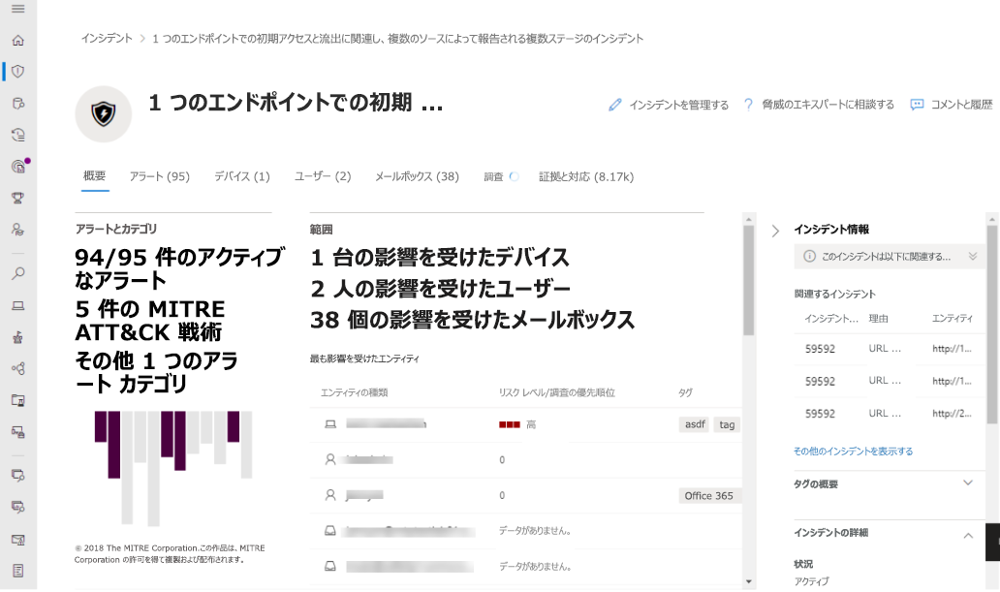

# Microsoft 365 Defender概要

[!INCLUDE [Microsoft 365 Defender rebranding](../includes/microsoft-defender.md)]

**適用対象:**

- [Microsoft 365 Defender](microsoft-365-defender.md)
- [Microsoft Defender for Endpoint](https://go.microsoft.com/fwlink/p/?linkid=2154037)
- [Microsoft Defender for Office 365](/microsoft-365/security/office-365-security/defender-for-office-365)

> Microsoft 365 Defender を体験してみませんか? [ラボ環境で評価する](m365d-evaluation.md?ocid=cx-docs-MTPtriallab)ことも、[実稼働環境でパイロット プロジェクトを実行する](m365d-pilot.md?ocid=cx-evalpilot)こともできます。

**Microsoft 365 Defender** ( ) は、中央ポータルの電子メール、コラボレーション、ID、およびデバイスの脅威に対する保護、検出、調査、および応答を [https://security.microsoft.com](https://security.microsoft.com) 組み合わせたものになります。    

Microsoft 365 Defenderは、既存の Microsoft セキュリティ ポータル (Microsoft Defender セキュリティ センター および Office 365 セキュリティ &コンプライアンス センターなど) から機能を統合します。 セキュリティ センターは、情報への迅速なアクセス、よりシンプルなレイアウト、およびより簡単に使用できるように関連情報をまとめることを重視しています。 このセンターには次のものが含まれます。

- **[Microsoft Defender for Office 365](/microsoft-365/security/office-365-security/defender-for-office-365)** Microsoft Defender for Office 365 は、メールと Office 365 リソースを保護するための一連の防止、検出、調査、およびハンティング機能を使用して、組織が企業を保護するのに役立ちます。
- **[Microsoft Defender for Endpoint](/microsoft-365/security/defender-endpoint/microsoft-defender-advanced-threat-protection)** は、組織内のデバイスに対して、予防的な保護、侵害後の検出、自動調査、および対応を提供します。
- **[Microsoft 365 Defender](microsoft-365-defender.md)** は、Microsoft の *Extended Detection and Response* (XDR) ソリューションの一部であり、Microsoft 365 セキュリティ ポートフォリオを活用して、ドメイン全体の脅威データを自動的に分析し、単一のダッシュボードで攻撃の全体像を構築します。

Office 365 セキュリティ/コンプライアンス センターまたは Microsoft Defender セキュリティ センターからの変更点に関する情報が必要な場合は、以下を参照してください。

- [Microsoft 365 Defender の Defender for Office 365](microsoft-365-security-center-mdo.md)
- [Microsoft 365 Defender の Microsoft Defender for Endpoint](microsoft-365-security-center-mde.md)

> [!NOTE]
> セキュリティ Microsoft 365は、既存の役割ベースのアクセスを使用して適用し、各セキュリティ モデルを統合ポータルに移動します。 各コンバージド ワークロードには、独自のロール ベースのアクセス権があります。 製品に既に存在する役割は、セキュリティ ポータルのMicrosoft 365自動的に統合されます。 ただし、MCAS の役割とアクセス許可は MCAS で引き続き処理されます。

## 想定される変化

Office 365 セキュリティ とコンプライアンス センター (protection.office.com) と Microsoft Defender セキュリティ センター (securitycenter.microsoft.com) で使用するセキュリティ コンテンツはすべて、Microsoft 365 Defender で *確認できます*。

Microsoft 365 Defenderチームは、さまざまなワークロードからのシグナルを一連の統合エクスペリエンスに取り込み、攻撃を調査して対応するのに役立ちます。

- インシデントとアラート
- 検索
- アクション センター
- 脅威の分析

Microsoft 365 Defender、Microsoft Defender  for microsoft Defender for Office 365エンドポイントを統合する場合、統一、明快さ、共通の目標を強調しています。 マージは、以下に示す優先順位に基づいて行われたので、各セキュリティ スイートが次の組み合わせに持ち込んだ機能を犠牲にすることなく行いました。

- 共通の構成要素
- 一般的な用語
- 共通エンティティ
- 他のワークロードとの機能のパリティ

> [!NOTE]
> Microsoft 365 Defender移行手順を実行したり、新しいライセンスを購入したりすることなく、アクセスできます。 たとえば、この新しいポータルは、Microsoft Defender for Office 365 プラン 1 とプラン 2 と同様に、E3 サブスクリプションを持つ管理者がアクセスできます。ただし、Exchange Online Protectionプラン 1 のお客様Office 365 Defender には、サブスクリプション ライセンスでサポートされているセキュリティ機能だけが表示されます。 新しいセンターの目的は、セキュリティを一元化する方法です。

## 統一された調査

セキュリティ センターを統合すると、複数のセキュリティ インシデントを調査する場所が 1 つMicrosoft 365。 主な例は、[**インシデント**] の下の [インシデント **] &の** クイック起動時のアラートMicrosoft 365 Defender。

:::image type="content" source="../../media/converged-incidents-2.png.png" alt-text="[インシデント] ページ (Microsoft 365 Defender)。":::

インシデント名を選択すると、収束セキュリティ センターの値を示すページが表示されます。

:::image type="content" source="../../media/converged-incident-info-3.png" alt-text="インシデントの概要ページの例Microsoft 365 Defender":::

<!--

--> 

インシデント ページの上部には、[概要] タブ、[通知] 、[**デバイス**] 、[**ユーザー**] 、[メールボックス] 、[調査]、および **[証拠**] タブが **表示** されます。 詳細については、次のタブを選択します。 たとえば、[ユーザー]タブには、統合ワークロード (Microsoft Defender for Endpoint、Microsoft Defender for Identity、および Microsoft Cloud App Security) のユーザーの情報と、オンプレミスの Active Directory ドメイン サービス (AD DS)、Azure Active Directory (Azure AD)、サードパーティ ID プロバイダーなどのさまざまなソースが表示されます。 詳細については、「ユーザーの調査 [」を参照してください](investigate-users.md)。

環境内のインシデントを確認し、これらのタブをドリルダウンし、さまざまな種類の脅威に対してインシデントに提供された情報にアクセスする方法について理解を深める方法を実践してください。

詳細については、「インシデント」を参照[Microsoft 365 Defender。](incidents-overview.md)

## 改善されたプロセス

共通のコントロールとコンテンツは、同じ場所に表示されるか、データの 1 つのフィードにまとめられて、見つけやすくなります。 たとえば、統一された設定。

### 統一された設定

![[役割] をクリックして、[設定] ページを開きました。このページには、[全般設定]、[アクセス許可]、[API]、および [ルール] が含まれています。 [アクセス許可]、[役割] の順に開きます。 すべての役割を表示します。](../../media/converged-add-role-9.png)

### アクセス許可と役割

![エンドポイントの役割とグループ、役割、およびデバイス グループを表示する [アクセス許可と役割] ページ。](../../media/converged-roles-5.png)

 グローバル ロールMicrosoft 365 Defenderカスタム ロールを使用してAzure Active Directoryアクセスを構成します。 Defender for Endpoint については、「[Microsoft Defender セキュリティ センターへのユーザー アクセスの割り当て](/microsoft-365/security/defender-endpoint/assign-portal-access)」をご覧ください。 [Defender for Office 365] については、「Microsoft 365 コンプライアンス センター および Microsoft 365 Defender」[を参照してください](../office-365-security/permissions-microsoft-365-compliance-security.md)。

- [Microsoft 365 Defender へのアクセスを管理する](m365d-permissions.md)方法の詳細
- カスタム ロールを作成する[方法の詳細については](custom-roles.md)、Microsoft 365 Defender

> [!NOTE]
> microsoft Defender for Endpoint in Microsoft 365 Defender では[、Microsoft Defender](./mssp-access.md)セキュリティ センターでのアクセス許可と同じ方法で、マネージド セキュリティ サービス プロバイダー [(MSSP)](/windows/security/threat-protection/microsoft-defender-atp/grant-mssp-access)へのアクセス許可をサポートしています。

### 統合レポート

レポートは、レポート内でもMicrosoft 365 Defender。 管理者は、一般的なセキュリティ レポートから始めて、エンドポイント、メール、コラボレーションに関する特定のレポートに分岐できます。 ここでのリンクは、ワークロード構成に基づいて動的に生成されます。

### Microsoft 365 環境をすばやく表示する

**ホーム** ページには、セキュリティ チームが必要とする一般的なカードの多くが表示されます。 カードとデータの構成は、ユーザーの役割によって異なります。 ポータルMicrosoft 365 Defender役割ベースのアクセス制御を使用する場合、役割ごとに、毎日のジョブにとってより意味のあるカードが表示されます。  

この一目でわかる情報は、組織内の最新の活動についていくのに役立ちます。 Microsoft 365 Defender異なるソースからの信号をまとめ、さまざまなソース環境の全体的なMicrosoft 365します。

カードは次のカテゴリに分類されます。

- **ID** - 組織内の ID を監視し、疑わしいまたは危険な行動を追跡します。 [ID 保護の詳細をご覧ください](/azure/active-directory/identity-protection/overview-identity-protection)。
- **データ** - 無許可のデータ開示につながる可能性のあるユーザー アクティビティを追跡するのに役立ちます。
- **デバイス** - デバイス上のアラート、違反アクティビティ、およびその他の脅威に関する最新情報を取得します。
- **アプリ** - 組織でクラウド アプリがどのように使用されているかについての分析情報を得ます。 [Cloud App Security で検出されたアプリの詳細をご覧ください](/cloud-app-security/discovered-apps)。

## より優れたデータ カバレッジを備えた脅威の分析
次の Microsoft 365 Defender 脅威分析統合エクスペリエンスを使用して、新たな脅威を追跡し、対応します。

- Microsoft Defender for Endpoint と Microsoft Defender for Office 365 の間のデータ カバレッジが向上し、インシデント管理、自動調査、修復、およびドメイン全体での予防的または事後対応的な脅威ハンティングの組み合わせが可能になります。 
- Microsoft Defender for Endpoint から既に利用可能なエンドポイント データに加えて、Microsoft Defender for Office 365 からのメール関連の検出と軽減。
- Microsoft Defender for Endpoint と Microsoft Defender for Office 365 全体のエンドツーエンドの攻撃ストーリーにアラートを集約して、作業キューを削減し、調査を簡素化および高速化する、脅威関連のインシデントのビュー。
- Microsoft 365 Defender ソリューションによって検出され、ブロックされた攻撃の試み。 さらなる曝露のリスクを軽減し、回復力を高める予防措置を推進するために使用できるデータもあります。 
- 実用的な情報にスポットライトを当て、緊急に焦点を合わせ、調査し、レポートから活用するデータをすばやく特定できるようにする拡張された設計。

## 一元化されたラーニング ハブ

Microsoft 365 Defenderには、Microsoft セキュリティ ブログ、YouTube の Microsoft セキュリティ コミュニティ、および docs.microsoft.com の公式ドキュメントなどのリソースからの公式ガイダンスを吹き込む学習ハブが含まれています。

学習ハブ内では、Email & Collaboration (Microsoft Defender for Office 365) ガイダンスは、エンドポイント (Microsoft Defender for Endpoint) および Microsoft 365 Defender ラーニング リソースと並べて示されています。

ラーニング ハブは、「Microsoft 365 Defender を使用して調査する方法」 および「Microsoft Defender for Office 365 のベスト プラクティス」などのトピックを中心に編成されたラーニング パスで始まります。 このセクションは現在、Microsoft 内のセキュリティ製品グループによってキュレーションされています。 各ラーニング パスは、概念を理解するのにかかると予想される時間を反映しています。 たとえば、「Microsoft Defender for Office 365 ユーザー アカウントが侵害された場合の手順」は 8 分かかると予想されており、その場で学ぶ価値があります。

コンテンツをクリックした後、このサイトをブックマークして、ブックマークを 'セキュリティ' または 'クリティカル' フォルダーに整理すると便利な場合があります。 すべてのラーニング パスを表示するには、メイン パネルの [すべて表示] リンクをクリックします。

> [!NOTE]
> Microsoft 365 Defender ラーニングハブの上部には、製品 (現在の Microsoft 365 Defender、エンドポイント用 Microsoft Defender、および microsoft Defender for Office 365) を選択できる便利なフィルターがあります。 各セクションの学習リソースの数がリストされていることに注意してください。これは、学習者がトレーニングと学習のために手元にあるリソースの数を追跡するのに役立ちます。
>
> 製品フィルターに沿って、現在のトピック、リソースの種類 (ビデオからウェビナーまで)、セキュリティ領域に関する知識または経験のレベル、セキュリティの役割、および製品の機能が一覧表示されます。

> [!TIP]
> [Microsoft Learn](/e/learn/)には他にも多くの学習機会があります。 コース[MS-500T02-A: 脅威保護の実装など、認定Microsoft 365があります](/learn/certifications/courses/ms-500t02)。

## フィードバックの送信

フィードバックをお寄せください。 私たちは常に改善を目指しています。ご要望がありましたら、[Microsoft 365 Defender のフィードバックを送信してください](https://www.microsoft.com/videoplayer/embed/RE4K5Ci)。

この記事からフィードバックを残すこともできます。 [フィードバックの送信と表示] の下にある最後の [フィードバック] セクションには、オプション *[この製品]* または *[このページ]* があります。

*製品* のフィードバックには、**[この製品]** ボタンを使用してください。

1. 記事の下部にある *[この製品]* を選択します。
    1. これらの指示を読み続ける場合は、ボタンを右クリックして [新しいタブで開く] を選択してください。
2. これにより、**UserVoice フォーラム** に移動します。
3. 2 つのオプションがあります。
    1. テキスト ボックスまで下にスクロール *する コンプライアンス* を改善したり、ユーザーを保護したりするには、次の手順を実行Office 365を貼り *Microsoft 365 Defender。* 結果から自分のようなアイデアを探して賛成票を投じるか、**[新しいアイデアを投稿する]** ボタンを使用できます。
    1. この問題がすでに報告されていると確信し、1 票または複数の票でそのプロファイルを上げたい場合は、UserVoice の右側にある *[フィードバックの送信]* ボックスを使用してください。 [検索] **Microsoft 365 Defender、問題を** 検索し、投票ボタンを使用して状態を上げる。 

記事自体に関するフィードバックは、*[このページ]* を使用してください。 フィードバックしていただき、ありがとうございます。 あなたの声は製品の改善に役立ちます。

### セキュリティ センターが提供するものを調べる

次の機能を引き続き確認Microsoft 365 Defender。

- [インシデントとアラートを管理する](manage-incidents.md)
- [脅威の分析を使用して、新たな脅威を追跡し対応する](threat-analytics.md)
- [アクション センター](m365d-action-center.md)
- [デバイス、メール、アプリ、ID 全体の脅威を探す](./advanced-hunting-query-emails-devices.md)
- [カスタム検出ルール](./custom-detection-rules.md)
- [メールとコラボレーションのアラート](../../compliance/alert-policies.md#default-alert-policies)
- [フィッシング攻撃のシミュレーションを作成し](../office-365-security/attack-simulation-training.md)、[チームをトレーニングするためのペイロードを作成する](/microsoft-365/security/office-365-security/attack-simulation-training-payloads)
 
### 関連情報
- [Microsoft Defender for Office 365 Microsoft 365 Defender](microsoft-365-security-center-mdo.md)
- [Microsoft Defender for Endpoint in Microsoft 365 Defender](microsoft-365-security-center-mde.md)
- [Microsoft Defender for Endpoint からアカウントをユーザーにリダイレクトMicrosoft 365 Defender](microsoft-365-security-mde-redirection.md)