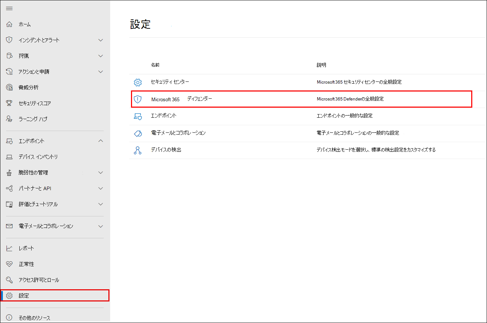
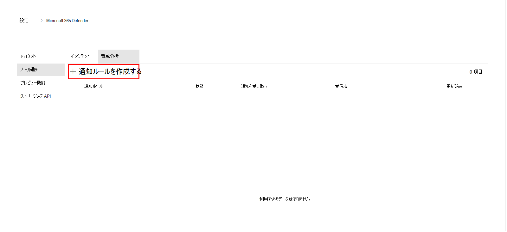
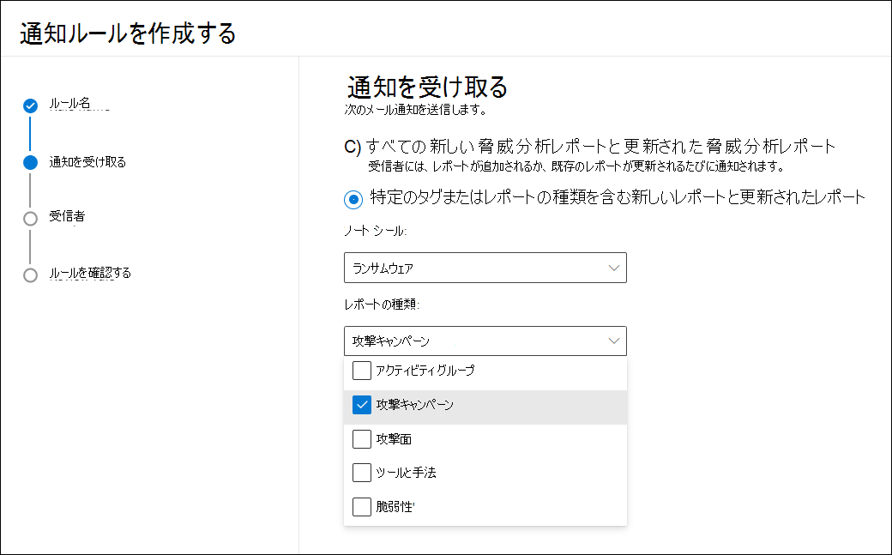
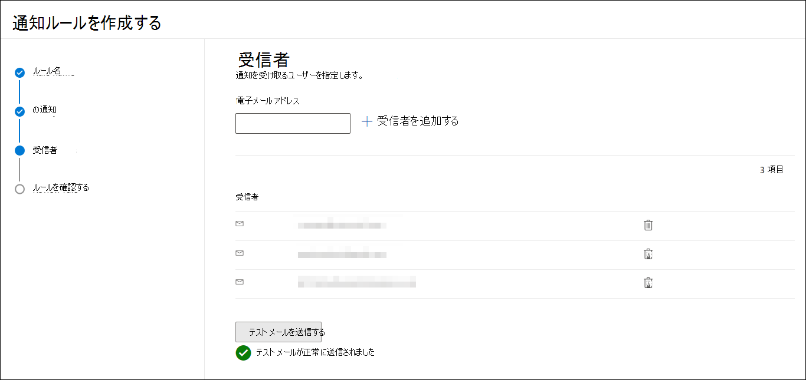
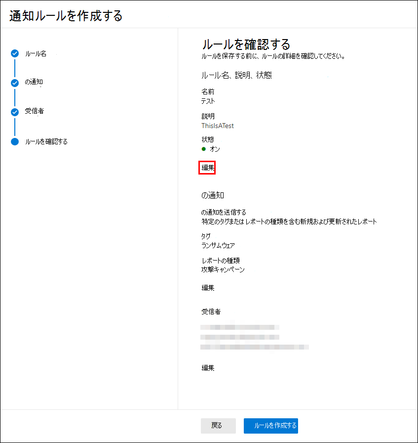

# Microsoft 365 Defenderの脅威分析

[!INCLUDE [Microsoft 365 Defender rebranding](../includes/microsoft-defender.md)]

**適用対象:**

- Microsoft 365 Defender

[!INCLUDE [Prerelease](../includes/prerelease.md)]

脅威分析は、Microsoft の専門家のセキュリティ研究者による製品内脅威インテリジェンス ソリューションです。 次のような新たな脅威に直面しながら、セキュリティ チームが可能な限り効率的になるように設計されています。

- アクティブな脅威アクターとそのキャンペーン
- 一般的な攻撃手法と新しい攻撃手法
- 重大な脆弱性
- 一般的な攻撃対象領域
- 流行しているマルウェア

脅威分析が最新の脅威を追跡して停止する方法の詳細については、この短いビデオをご覧ください。

>[!VIDEO https://www.microsoft.com/en-us/videoplayer/embed/RWwJfU]

脅威分析には、Microsoft 365 セキュリティ ポータルのナビゲーション バーの左上から、または組織に対する最大の脅威を示す専用ダッシュボード カードから、影響の観点と露出の観点からアクセスできます。

:::image type="content" source="../../media/threat-analytics/ta_inlandingpage_mtp.png" alt-text="脅威分析のランディング ページ" lightbox="../../media/threat-analytics/ta_inlandingpage_mtp.png":::

影響の大きい脅威は害を引き起こす可能性が最も高く、露出の高い脅威は資産が最も脆弱な脅威です。 アクティブまたは進行中のキャンペーンの可視性を得て、脅威分析を通じて何をすべきかを知ることは、セキュリティ運用チームに情報に基づいた意思決定を提供するのに役立ちます。

_脅威分析にアクセスする場所_

より高度な敵対者と新しい脅威が頻繁かつ一般的に出現する中で、次のことが迅速に可能になることが重要です。

- 新たな脅威を特定して対応する
- 現在攻撃を受けているかどうかを確認する
- 資産に対する脅威の影響を評価する
- 脅威に対する回復性または脅威にさらされる回復性を確認する
- 脅威を停止または封じ込めるために実行できる軽減策、回復、または防止のアクションを特定する

各レポートでは、追跡された脅威の分析と、その脅威から防御する方法に関する広範なガイダンスが提供されます。 また、ネットワークからのデータも組み込まれており、脅威がアクティブかどうか、および適切な保護が適用されているかどうかを示します。

## 脅威分析ダッシュボードを表示する

脅威分析ダッシュボード ([security.microsoft.com/threatanalytics3](https://security.microsoft.com/threatanalytics3)) では、組織に最も関連するレポートが強調表示されます。 次のセクションの脅威の概要を示します。

- **最新の脅威** - 最近発行または更新された脅威レポートと、アクティブなアラートと解決されたアラートの数を一覧表示します。
- **影響の大きい脅威** - 組織に最も影響を与える脅威を一覧表示します。 このセクションでは、最初にアクティブなアラートと解決済みアラートの数が最も多い脅威の一覧を示します。
- **最も露出が高い** - 最初に最も露出レベルが高い脅威を一覧表示します。 脅威の露出レベルは、脅威に関連する脆弱性の深刻さと、組織内のこれらの脆弱性によって悪用される可能性があるデバイスの数という 2 つの情報を使用して計算されます。

ダッシュボードから脅威を選択して、その脅威のレポートを表示します。

:::image type="content" source="../../media/threat-analytics/ta_dashboard_mtp.png" alt-text="脅威分析ダッシュボード" lightbox="../../media/threat-analytics/ta_dashboard_mtp.png":::

_脅威分析ダッシュボード。読み取る脅威分析レポートに関連するキーワードで、[検索] フィールドを選択してキーを設定することもできます。_

## 脅威分析レポートを表示する

各脅威分析レポートには、いくつかのセクションで情報が提供されます。

- [**概要**](#overview-quickly-understand-the-threat-assess-its-impact-and-review-defenses)
- [**アナリスト レポート**](#analyst-report-get-expert-insight-from-microsoft-security-researchers)
- [**関連するインシデント**](#related-incidents-view-and-manage-related-incidents)
- [**影響を受けた資産**](#impacted-assets-get-list-of-impacted-devices-and-mailboxes)
- [**禁止された電子メールの試行**](#prevented-email-attempts-view-blocked-or-junked-threat-emails)
- [**露出&軽減策**](#exposure-and-mitigations-review-list-of-mitigations-and-the-status-of-your-devices)

### 概要: 脅威をすばやく理解し、その影響を評価し、防御を確認する

[ **概要]** セクションには、詳細なアナリスト レポートのプレビューが表示されます。 また、組織に対する脅威の影響と、不適切な構成とパッチが適用されていないデバイスによる露出を強調するグラフも提供されます。

:::image type="content" source="../../media/threat-analytics/ta_overview_mtp.png" alt-text="脅威分析レポートの概要セクション" lightbox="../../media/threat-analytics/../../media/threat-analytics/ta_overview_mtp.png":::

_脅威分析レポートの [概要] セクション_

#### 組織への影響を評価する

各レポートには、脅威の組織の影響に関する情報を提供するように設計されたグラフが含まれています。

- **関連するインシデント** - 組織に対する追跡された脅威の影響の概要と、次のデータを提供します。
  - アクティブなアラートの数と、それらが関連付けられているアクティブなインシデントの数
  - アクティブなインシデントの重大度
- **時間の経過に伴うアラート** - 時間の経過に伴う関連 **するアクティブ** および **解決済み** アラートの数を示します。 解決されたアラートの数は、組織が脅威に関連付けられたアラートにどれだけ迅速に対応するかを示します。 理想的には、グラフに数日以内に解決されたアラートが表示されている必要があります。
- **影響を受ける資産** - 追跡対象の脅威に関連付けられているアクティブなアラートが少なくとも 1 つ存在する個別のデバイスと電子メール アカウント (メールボックス) の数を示します。 脅威メールを受信したメールボックスに対してアラートがトリガーされます。 脅威メールの配信の原因となる上書きについては、組織レベルとユーザー レベルの両方のポリシーを確認します。
- **禁止された電子メールの試行** - 配信前にブロックされたか、迷惑メール フォルダーに配信された過去 7 日間のメールの数を示します。

#### セキュリティの回復性と体制を確認する

各レポートには、特定の脅威に対する組織の回復性の概要を示すグラフが含まれています。

- **セキュリティで保護された構成状態** - セキュリティ設定が正しく構成されていないデバイスの数を示します。 脅威を軽減するために推奨されるセキュリティ設定を適用します。 デバイスがすべての追跡設定 _を適用した_ 場合、デバイスは **セキュリティで保護** されていると見なされます。
- **脆弱性の修正プログラムの状態** - 脆弱なデバイスの数を示します。 脅威によって悪用される脆弱性に対処するために、セキュリティ更新プログラムまたは修正プログラムを適用します。

#### 脅威タグごとのレポートを表示する

脅威レポートの一覧をフィルター処理し、特定の脅威タグ (カテゴリ) またはレポートの種類に従って最も関連性の高いレポートを表示できます。

- **脅威タグ** — 特定の脅威カテゴリに従って最も関連性の高いレポートを表示するのに役立ちます。 たとえば、ランサムウェアに関連するすべてのレポートです。
- **レポートの種類** - 特定のレポートの種類に従って、最も関連性の高いレポートを表示するのに役立ちます。 たとえば、ツールと手法をカバーするすべてのレポートです。
- **フィルター**— 脅威レポートの一覧を効率的に確認し、特定の脅威タグまたはレポートの種類に基づいてビューをフィルター処理する際に役立ちます。 たとえば、ランサムウェアカテゴリに関連するすべての脅威レポートや、脆弱性をカバーする脅威レポートを確認します。

##### どのような仕組みですか?

Microsoft Threat Intelligence チームは、各脅威レポートに脅威タグを追加しました。

- 次の 4 つの脅威タグを使用できるようになりました。
  - ランサムウェア
  - フィッシング詐欺
  - 脆弱性
  - アクティビティ グループ
- 脅威タグは、脅威分析ページの上部に表示されます。 各タグの下に使用可能なレポートの数のカウンターがあります。

  :::image type="content" source="../../media/threat-analytics/ta-threattags-mtp.png" alt-text="脅威タグ" lightbox="../../media/threat-analytics/ta-threattags-mtp.png":::

- この一覧は、脅威タグで並べ替えることもできます。

  :::image type="content" source="../../media/threat-analytics//ta-taglist-mtp.png" alt-text="[脅威タグ] セクション" lightbox="../../media/threat-analytics//ta-taglist-mtp.png":::

- フィルターは、脅威タグとレポートの種類ごとに使用できます。

  :::image type="content" source="../../media/threat-analytics/ta-threattag-filters-mtp.png" alt-text="[フィルター] ページ" lightbox="../../media/threat-analytics/ta-threattag-filters-mtp.png":::

### アナリスト レポート: Microsoft セキュリティ研究者から専門家の分析情報を取得する

アナリスト **レポート** セクションで、詳細なエキスパートの書き込みを確認します。 ほとんどのレポートでは、MITRE ATT&CK フレームワークにマップされた戦術と手法、推奨事項の網羅リスト、強力な [脅威ハンティング](advanced-hunting-overview.md) ガイダンスなど、攻撃チェーンの詳細な説明が提供されます。

[アナリスト レポートの詳細を確認する](threat-analytics-analyst-reports.md)

### 関連するインシデント: 関連するインシデントを表示および管理する

[ **関連インシデント** ] タブには、追跡された脅威に関連するすべてのインシデントの一覧が表示されます。 インシデントを割り当てたり、各インシデントにリンクされたアラートを管理したりできます。 

:::image type="content" source="../../media/threat-analytics/ta_related_incidents_mtp.png" alt-text="脅威分析レポートの関連するインシデント セクション" lightbox="../../media/threat-analytics/ta_related_incidents_mtp.png":::

_脅威分析レポートの関連インシデント セクション_

### 影響を受ける資産: 影響を受けるデバイスとメールボックスの一覧を取得する

資産は、未解決のアクティブなアラートの影響を受けた場合に影響を受けると見なされます。 [ **影響を受けた資産** ] タブには、次の種類の影響を受けたアセットが一覧表示されます。

- **影響を受けるデバイス** —未解決のMicrosoft Defender for Endpointアラートを持つエンドポイント。 これらのアラートは、通常、既知の脅威インジケーターとアクティビティのサイトで発生します。
- **影響を受けるメールボックス**- アラートをトリガーした電子メール メッセージを受信したメールボックスMicrosoft Defender for Office 365。 通常、アラートをトリガーするほとんどのメッセージはブロックされますが、ユーザーレベルまたは組織レベルのポリシーはフィルターをオーバーライドできます。

:::image type="content" source="../../media/threat-analytics/ta_impacted_assets_mtp.png" alt-text="脅威分析レポートの影響を受けた資産セクション" lightbox="../../media/threat-analytics/ta_impacted_assets_mtp.png":::

_脅威分析レポートの影響を受けた資産セクション_

### 禁止されたメール試行: ブロックまたは迷惑メールを表示する

通常、Microsoft Defender for Office 365は、悪意のあるリンクや添付ファイルなど、既知の脅威インジケーターを含むメールをブロックします。 場合によっては、疑わしいコンテンツをチェックするプロアクティブなフィルター処理メカニズムによって、代わりに迷惑メール フォルダーに脅威メールが送信されます。 どちらの場合も、デバイスで脅威によってマルウェア コードが起動される可能性は低くなります。

[**禁止されたメール試行**] タブには、配信前にブロックされているか、Microsoft Defender for Office 365によって迷惑メール フォルダーに送信されたすべてのメールが一覧表示されます。

:::image type="content" source="../../media/threat-analytics/ta_prevented_email_attempts_mtp.png" alt-text="脅威分析レポートの [禁止されたメール試行] セクション" lightbox="../../media/threat-analytics/ta_prevented_email_attempts_mtp.png":::

_脅威分析レポートの [禁止された電子メールの試行] セクション_

### 露出と軽減策: 軽減策の一覧とデバイスの状態を確認する

[ **公開&軽減策** ] セクションで、脅威に対する組織の回復性を高めるのに役立つ具体的な実用的な推奨事項の一覧を確認します。 追跡対象の軽減策の一覧には、次のものが含まれます。

- **セキュリティ更新プログラム** - オンボードされたデバイスで見つかった脆弱性に対してサポートされているソフトウェア セキュリティ更新プログラムの展開
- **サポートされているセキュリティ構成**
  - クラウドによる保護  
  - 望ましくない可能性があるアプリケーション (PUA) 保護
  - リアルタイム保護

このセクションの軽減策情報には[、脅威と脆弱性の管理](/windows/security/threat-protection/microsoft-defender-atp/next-gen-threat-and-vuln-mgt)からのデータが組み込まれています。また、レポートのさまざまなリンクから詳細なドリルダウン情報も提供されます。

:::image type="content" source="../../media/threat-analytics/ta_mitigations_mtp.png" alt-text="セキュリティで保護された構成の詳細を示す脅威分析レポートの軽減策セクション" lightbox="../../media/threat-analytics/ta_mitigations_mtp.png":::

:::image type="content" source="../../media/threat-analytics/ta_mitigations_mtp2.png" alt-text="脆弱性の詳細を示す脅威分析レポートの軽減策セクション" lightbox="../../media/threat-analytics/ta_mitigations_mtp2.png":::

_脅威分析レポートの[公開&軽減策] セクション_

## レポート更新プログラムの電子メール通知を設定する

脅威分析レポートの更新を送信する電子メール通知を設定できます。

脅威分析レポートの電子メール通知を設定するには、次の手順に従います。

1. Microsoft 365 Defenderサイドバーで **[設定] を** 選択します。 設定 **の** 一覧からMicrosoft 365 Defenderを選択します。
 

2. **Email通知** > **の脅威分析** を選択し、ボタンを選択します。**+ 通知ルールを作成します**。 ポップアップが表示されます。

3. ポップアップに記載されている手順に従います。 まず、新しいルールに名前を付けます。 説明フィールドは省略可能ですが、名前が必要です。 説明フィールドの下にあるチェック ボックスを使用して、ルールのオンとオフを切り替えることができます。

> [!NOTE]
> 新しい通知ルールの名前と説明フィールドは、英語の文字と数字のみを受け入れます。 スペース、ダッシュ、アンダースコア、その他の句読点は受け付けられません。

![すべてのフィールドが入力され、[ルールを有効にする] チェック ボックスがオンになっている名前付け画面のスクリーンショット](../../media/threat-analytics/ta_create_notification_2.png)

4. 通知するレポートの種類を選択します。 新しく発行されたすべてのレポートまたは更新されたレポートについて更新するか、特定のタグまたは種類を持つレポートのみを更新するかを選択できます。

5. 通知メールを受信するために、少なくとも 1 人の受信者を追加します。 この画面を使用して、テスト用メールを送信して、通知の受信方法を確認することもできます。

6. 新しいルールを確認します。 変更したいものがある場合は、各サブセクションの最後にある **[編集]** ボタンを選択します。 レビューが完了したら、[ **ルールの作成** ] ボタンを選択します。

7. おめでとうございます! 新しいルールが正常に作成されました。 **[完了]** ボタンを選択してプロセスを完了し、ポップアップを閉じます。

8. これで、新しいルールが脅威分析電子メール通知の一覧に表示されます。

![[設定] 画面内の電子メール通知ルールの一覧のスクリーンショット](../../media/threat-analytics/ta_create_notification_7.png)

## その他のレポートの詳細と制限事項

> [!NOTE]
> 統合セキュリティ エクスペリエンスの一環として、脅威分析はMicrosoft Defender for Endpointだけでなく、Microsoft Defender for Office E5 ライセンス所有者でも利用できるようになりました。
>
> Microsoft 365 セキュリティ ポータル (Microsoft 365 Defender) を使用していない場合は、Microsoft Defender セキュリティ センター ポータル (Microsoft Defender for Endpoint) にレポートの詳細 (Microsoft Defender for Office データを含まない) も表示されます。

脅威分析レポートにアクセスするには、特定のロールとアクセス許可が必要です。 詳細については、「[Microsoft 365 Defenderのロールベースのアクセス制御のカスタム ロール](custom-roles.md)」を参照してください。

- アラート、インシデント、または影響を受けた資産データを表示するには、Microsoft Defender for Office または Microsoft Defender for Endpoint アラート データまたはその両方に対するアクセス許可が必要です。
- 防止されたメール試行を表示するには、Microsoft Defender for Office ハンティング データに対するアクセス許可が必要です。
- 軽減策を表示するには、Microsoft Defender for Endpointでデータを脅威と脆弱性の管理するアクセス許可が必要です。

脅威分析データを確認するときは、次の要因を覚えておいてください。

- グラフには、追跡される軽減策のみが反映されます。 グラフに表示されないその他の軽減策については、レポートの概要を確認してください。
- 軽減策では、完全な回復性は保証されません。 提供される軽減策は、回復性を向上させるために必要な最善のアクションを反映しています。
- デバイスがサービスにデータを送信していない場合、デバイスは "利用不可" としてカウントされます。
- ウイルス対策関連の統計情報は、Microsoft Defender ウイルス対策の設定に基づいています。 サードパーティのウイルス対策ソリューションを備えたデバイスは、"公開済み" として表示される可能性があります。

## 関連記事

- [高度な捜索で脅威をプロアクティブに見つける](advanced-hunting-overview.md)
- [アナリスト レポート セクションについて理解する](threat-analytics-analyst-reports.md)
- [セキュリティの弱点と露出を評価して解決する](/windows/security/threat-protection/microsoft-defender-atp/next-gen-threat-and-vuln-mgt)
