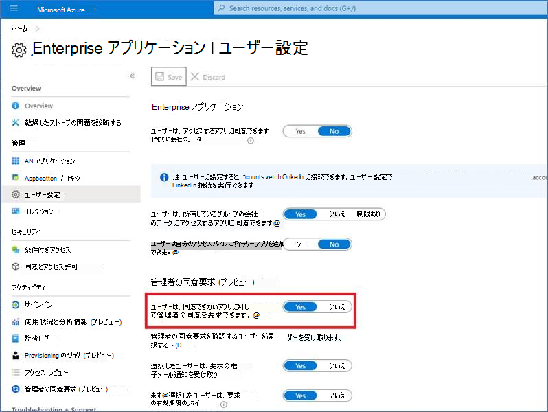
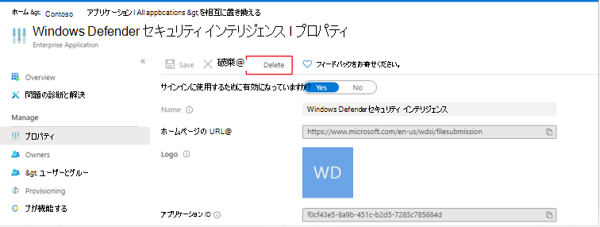
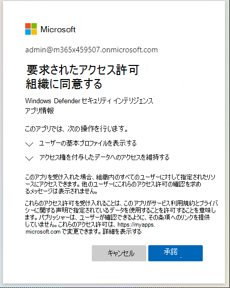

# 管理者ブロックに起因するマルウェア送信エラーのトラブルシューティング

場合によっては、分析のために感染している可能性のあるファイルを [Microsoft Security Intelligence Web サイト](https://www.microsoft.com/wdsi) に送信しようとすると、管理者ブロックによって送信の問題が発生することがあります。 次のプロセスでは、この問題を解決する方法を示します。

## 設定の確認

Azure [Enterprise アプリケーション設定](https://portal.azure.com/#blade/Microsoft_AAD_IAM/StartboardApplicationsMenuBlade/UserSettings/menuId/)を開きます。 **[Enterprise ApplicationsUsers** >   は、自分 **の代わりに会社のデータにアクセスするアプリに同意できます**。[はい] または [いいえ] が選択されているかどうかを確認します。

- **[いいえ]** が選択されている場合は、顧客テナントのAzure AD管理者が組織の同意を提供する必要があります。 Azure ADの構成によっては、ユーザーは同じダイアログ ボックスから直接要求を送信できる場合があります。 管理者の同意を求めるオプションがない場合、ユーザーはこれらのアクセス許可をAzure AD管理者に追加するように要求する必要があります。詳細については、次のセクションを参照してください。

- **[はい]** が選択されている場合は、Windows Defender セキュリティ インテリジェンス アプリの設定 [**ユーザーがサインインできるように有効]** が [Azure で](https://portal.azure.com/#blade/Microsoft_AAD_IAM/ManagedAppMenuBlade/Properties/appId/f0cf43e5-8a9b-451c-b2d5-7285c785684d/objectId/4a918a14-4069-4108-9b7d-76486212d75d) **[はい]** に設定されていることを確認します。 **[いいえ]** が選択されている場合は、Azure AD管理者に有効にするよう要求する必要があります。

## 必須Enterpriseアプリケーションのアクセス許可を実装する

このプロセスには、テナント内のグローバル管理者またはアプリケーション管理者が必要です。

1. [Enterpriseアプリケーション設定を](https://portal.azure.com/#blade/Microsoft_AAD_IAM/ManagedAppMenuBlade/Permissions/appId/f0cf43e5-8a9b-451c-b2d5-7285c785684d/objectId/4a918a14-4069-4108-9b7d-76486212d75d)開きます。
2. [ **組織の管理者の同意を付与する] を選択します**。
3. これを行うことができる場合は、次の図に示すように、このアプリケーションに必要な API アクセス許可を確認します。 テナントの同意を提供します。

    

4. 管理者が手動で同意を提供しようとしているときにエラーを受け取った場合は、可能な回避策として [、オプション 1](#option-1-approve-enterprise-application-permissions-by-user-request) または [オプション 2](#option-2-provide-admin-consent-by-authenticating-the-application-as-an-admin) のいずれかを試してください。

## オプション 1 ユーザー要求によってエンタープライズ アプリケーションのアクセス許可を承認する

> [!NOTE]
> これは現在、プレビュー機能です。

Azure Active Directory管理者は、ユーザーがアプリに対する管理者の同意を要求できるようにする必要があります。 [Enterprise アプリケーション](https://portal.azure.com/#blade/Microsoft_AAD_IAM/StartboardApplicationsMenuBlade/UserSettings/menuId/)で設定が **[はい**] に構成されていることを確認します。

詳細については、 [管理者同意ワークフローの構成](/azure/active-directory/manage-apps/configure-admin-consent-workflow)に関するページを参照してください。

この設定が検証されたら、ユーザーは [Microsoft セキュリティ インテリジェンス](https://www.microsoft.com/wdsi/filesubmission)でエンタープライズのお客様のサインインを通過し、正当な理由を含む管理者の同意を求める要求を送信できます。

管理者は、 [Azure 管理者の同意要求](https://portal.azure.com/#blade/Microsoft_AAD_IAM/StartboardApplicationsMenuBlade/AccessRequests/menuId/)に対するアプリケーションのアクセス許可を確認して承認できます。

同意を提供すると、テナント内のすべてのユーザーがアプリケーションを使用できるようになります。

## オプション 2 アプリケーションを管理者として認証して管理者の同意を提供する

このプロセスでは、グローバル管理者が [Microsoft セキュリティ インテリジェンス](https://www.microsoft.com/wdsi/filesubmission)でEnterprise顧客サインイン フローを通過する必要があります。

次に、管理者がアクセス許可を確認し、 **組織に代わって [同意**] を選択し、[ **同意** する] を選択します。

これで、テナント内のすべてのユーザーがこのアプリケーションを使用できるようになります。

## オプション 3: アプリのアクセス許可を削除して読み取る

どちらのオプションも問題を解決できない場合は、(管理者として) 次の手順を試してください。

1. アプリケーションの以前の構成を削除します。 [Enterpriseアプリケーション](https://portal.azure.com/#blade/Microsoft_AAD_IAM/ManagedAppMenuBlade/Properties/appId/f0cf43e5-8a9b-451c-b2d5-7285c785684d/objectId/982e94b2-fea9-4d1f-9fca-318cda92f90b)に移動し、削除を選択 **します**。

   

2. プロパティから TenantID をキャプチャ [します](https://portal.azure.com/#blade/Microsoft_AAD_IAM/ActiveDirectoryMenuBlade/Properties)。

3. {tenant-id} を、以下の URL でこのアプリケーションに同意を付与する必要がある特定のテナントに置き換えます。 この URL をブラウザーにコピーします。 残りのパラメーターは既に完了しています。
``https://login.microsoftonline.com/{tenant-id}/v2.0/adminconsent?client_id=f0cf43e5-8a9b-451c-b2d5-7285c785684d&state=12345&redirect_uri=https%3a%2f%2fwww.microsoft.com%2fwdsi%2ffilesubmission&scope=openid+profile+email+offline_access``

   

4. アプリケーションに必要なアクセス許可を確認し、[ **同意** する] を選択します。

5. Azure portalでアクセス許可が適用されていることを確認[します](https://portal.azure.com/#blade/Microsoft_AAD_IAM/ManagedAppMenuBlade/Permissions/appId/f0cf43e5-8a9b-451c-b2d5-7285c785684d/objectId/ce60a464-5fca-4819-8423-bcb46796b051)。

   

6. 管理者以外のアカウントを使用してエンタープライズ ユーザーとして [Microsoft セキュリティ インテリジェンス](https://www.microsoft.com/wdsi/filesubmission) にサインインし、アクセス権があるかどうかを確認します。

 これらのトラブルシューティング手順に従っても警告が解決しない場合は、Microsoft サポートに問い合わせてください。