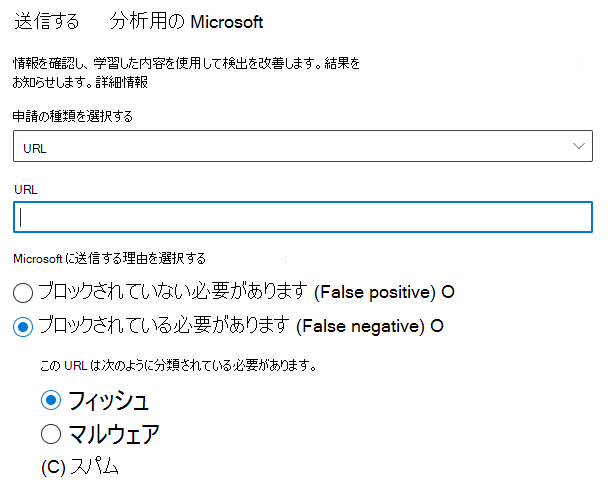
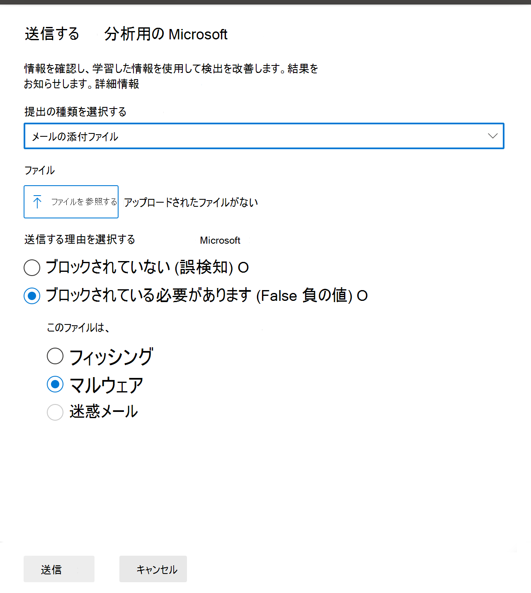
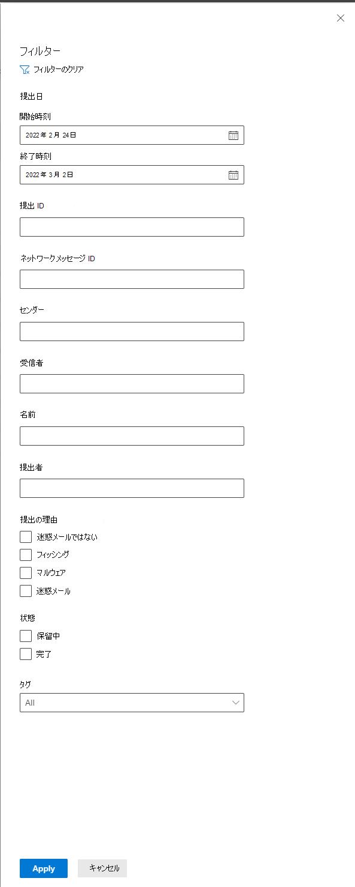
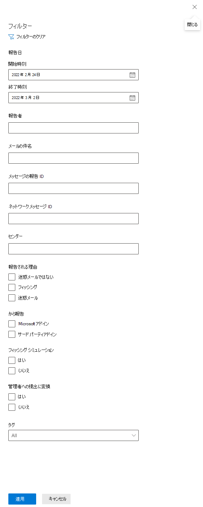

# 申請ポータルを使用して、疑わしいスパム、フィッシング、URL、ファイルを Microsoft に提出する

[!INCLUDE [Microsoft 365 Defender rebranding](../includes/microsoft-defender-for-office.md)]

**適用対象**
- [Exchange Online Protection](exchange-online-protection-overview.md)
- [Microsoft Defender for Office 365 プラン 1 およびプラン 2](defender-for-office-365.md)

Microsoft 365 メールボックスExchange Online組織では、管理者は Microsoft 365 Defender ポータルの申請ポータルを使用して、電子メール メッセージ、URL、添付ファイルを Microsoft に送信してスキャンできます。

分析用に電子メール メッセージを送信すると、次の情報が表示されます。

- **電子メール認証チェック**: 電子メール認証が配信された際に合格または失敗したかどうかの詳細。
- **ポリシーヒット**: テナントへの受信メールを許可またはブロックした可能性があるポリシーに関する情報で、サービス フィルターの評決を上書きします。
- **ペイロード評価/デトレーション**: メッセージ内の URL と添付ファイルの最新の検査。
- **Grader 分析**: メッセージが悪意のあるかどうかを確認するために、人間の採点者が行ったレビュー。

> [!IMPORTANT]
> ペイロード評価/デトナレーションおよび採点者分析は、すべてのテナントで行われるという問題ではありません。 データがコンプライアンスの目的でテナント境界から離れるはずではない場合、情報は組織外に出るのをブロックされます。

電子メール メッセージ、URL、添付ファイルを Microsoft に送信するその他の方法については、「メッセージとファイルを Microsoft に報告する」 [を参照してください](report-junk-email-messages-to-microsoft.md)。

## はじめに把握しておくべき情報

- <https://security.microsoft.com/> で Microsoft 365 Defender ポータルを開きます。 [申請] ページに直接 **移動するには** 、 を使用します <https://security.microsoft.com/reportsubmission>。

- メッセージとファイルを Microsoft に送信するには、次のいずれかの役割グループのメンバーである必要があります。
  - **ポータルの****セキュリティ** 管理者 [またはセキュリティ リーダー Microsoft 365 Defenderします](permissions-microsoft-365-security-center.md)。
  
    この記事で後述するように、カスタム メールボックスへのユーザー申請を表示するには、この役割グループのメンバーシップが必要です。

- 管理者は、メールボックスで引き続き使用できるメッセージであり、ユーザーまたは別の管理者によって削除されない場合は、30 日間の古いメッセージを送信できます。

- 管理者の申請は、次の速度で調整されます。
  - 15 分間の最大提出数: 150 件
  - 24 時間の同じ申請: 3 つの申請
  - 15 分間の同じ提出: 1 提出
  
- ユーザーが Microsoft にメッセージとファイルを送信する方法の詳細については、「メッセージとファイルを Microsoft に報告する」 [を参照してください](report-junk-email-messages-to-microsoft.md)。

## 疑わしいコンテンツを Microsoft に報告する

1. [申請Microsoft 365 Defender] の [<https://security.microsoft.com>アクション] の [提出]  **ページ**\>に移動&**送信します**。 [申請] ページに直接 **移動するには** 、 を使用します <https://security.microsoft.com/reportsubmission>。

2. [**申請] ページ** で、レポートするコンテンツの種類に基づいて [電子メールまたは電子メールの添付ファイルまたは **URL**![] タブが選択されているのを確認し、[分析用に Microsoft に送信] をクリックします。](../../media/m365-cc-sc-create-icon.png) **分析のために Microsoft に提出します**。

3. 次の **セクションで説明するように** 、それぞれの種類のコンテンツ (電子メール、URL、または電子メールの添付ファイル) を送信するために表示される分析用に Microsoft に送信するフライアウトを使用します。

   > [!NOTE]
   > ファイルと URL の申請は、データが環境から離れるのを許可しないクラウドでは使用できません。 [ファイル] または [URL] を選択する機能は灰色で表示されます。

### ポータル内からユーザーに通知する

1. [電子メール Microsoft 365 Defender] <https://security.microsoft.com>ポータルの [投稿] ページに移動し、&**を** \> **送信します**。 [申請] ページに直接 **移動するには** 、 を使用します <https://security.microsoft.com/reportsubmission>。

2. [申請 **] ページで** 、[ **ユーザーが報告** したメッセージ] タブを選択し、マークして通知するメッセージを選択します。

3. [マークを **付け、通知** する] ドロップダウンを選択し、[フィッシングまたは迷惑メールが検出 **された**\>脅威がない **] を****選択します**。

   :::image type="content" alt-text="ポータルからメッセージを送信します。" source="../../media/unified-submission-user-reported-message.png" lightbox="../../media/unified-submission-user-reported-message.png":::

報告されたメッセージは、誤検知または偽陰性としてマークされます。 メール通知は、ポータル内からメッセージを報告したユーザーに自動的に送信されます。

### 疑いがある電子メールを Microsoft に送信する

1. [申請 **の種類の選択] ボックス** で、ドロップダウン リスト **で [メール** ] が選択されているのを確認します。

2. [ネットワーク **メッセージ ID の追加または電子メール** ファイルのアップロード] セクションで、次のいずれかのオプションを使用します。
   - 電子メール ネットワーク メッセージ **ID** を追加します。これは、メッセージの **X-MS-Exchange-Organization-Network-Message-Id** ヘッダー、または検疫済みメッセージの **X-MS-Office365-Filtering-Correlation-Id** ヘッダーで使用できる GUID 値です。
   - **アップロードファイル (.msg または .eml)** をクリックします。[ファイルの参照] **をクリックします**。 開いたダイアログで、.eml または .msg ファイルを見つけて選択し、[開く] をクリック **します**。

3. [問題 **が発生した受信者の選択** ] ボックスで、ポリシー チェックを実行する受信者を指定します。 ポリシー チェックは、ユーザーまたは組織のポリシーが原因で電子メールがスキャンをバイパスしたかどうかを判断します。

4. [Microsoft **に提出する理由の選択] セクション** で、次のいずれかのオプションを選択します。
   - **ブロックされていない必要があります (誤検知)**
   - **ブロックされている必要があります (False 負の値):** 電子メールが表示されるセクションとして分類されている必要があります。次のいずれかの値を選択します (不明な場合は、最善の判断を使用してください)。
     - **フィッシング**
     - **マルウェア**
     - **スパム**

5. 完了したら、**[送信]** をクリックします。

    > [!div class="mx-imgBorder"]
    > 

### 疑わしい URL を Microsoft に送信する

1. [申請 **の種類の選択] ボックス** で、ドロップダウン **リストから [URL** ] を選択します。

2. 表示される **URL** ボックスに、完全な URL (たとえば) を入力します `https://www.fabrikam.com/marketing.html`。

3. [Microsoft **に提出する理由の選択] セクション** で、次のいずれかのオプションを選択します。
   - **ブロックされていない必要があります (誤検知)**
   - **ブロックされている必要があります (False 負の値):** [この **URL** は表示されるセクションとして分類されている必要があります]で、次のいずれかの値を選択します (不明な場合は、最善の判断を使用してください)。
     - **フィッシング**
     - **マルウェア**

4. 完了したら、**[送信]** をクリックします。

    > [!div class="mx-imgBorder"]
    > 

### 疑わしいメール添付ファイルを Microsoft に送信する

1. [申請 **の種類の選択] ボックス** で、ドロップダウン リスト **から [メールの** 添付ファイル] を選択します。

2. 表示される **[ファイル]** セクションで、[ファイルの参照] **をクリックします**。 開いたダイアログで、ファイルを見つけて選択し、[開く] をクリック **します**。

3. [Microsoft **に提出する理由の選択] セクション** で、次のいずれかのオプションを選択します。
   - **ブロックされていない必要があります (誤検知)**
   - ブロックされている必要 **があります (** False 負の値): [このファイルは表示されるセクションとして分類されている必要があります]で、次のいずれかの値を選択します (不明な場合は、最善の判断を使用してください)。
     - **フィッシング**
     - **マルウェア**

4. 完了したら、**[送信]** をクリックします。

    > [!div class="mx-imgBorder"]
    > 

> [!NOTE]
> マルウェア フィルターによってメッセージ添付ファイルが Malware Alert Text.txt ファイルに置き換えられた場合は、元の添付ファイルを含む検疫から元のメッセージを送信する必要があります。 検疫の詳細とマルウェアの誤検知を含むメッセージを解放する方法については、「検疫済みメッセージとファイルを管理者として管理する」 [を参照してください](manage-quarantined-messages-and-files.md)。

## Microsoft への管理者申請の表示

1. [申請Microsoft 365 Defender] の [<https://security.microsoft.com>アクション] の [提出]  **ページ**\>に移動&**送信します**。 [申請] ページに直接 **移動するには** 、 を使用します <https://security.microsoft.com/reportsubmission>。

2. [申請 **] ページで**、[メール、**URL**、または電子メールの添付ファイル] タブが **選択されている必要** があります。

   - 使用可能な列ヘッダーをクリックすると、エントリを並べ替えできます。 [列 **のカスタマイズ] を** クリックして、最大 7 列を表示します。 既定値にはアスタリスク (\*) が付いています。
     - **申請名**\*
     - **[送信者]**\*
     - **[受信者]**
     - **提出日**\*
     - **提出の理由**\*
     - **状態**\*
     - **結果**\*
     - **フィルターの評決**
     - **配信/ブロックの理由**
     - **申請 ID**
     - **ネットワーク メッセージ ID/オブジェクト ID**
     - **方向**
     - [**Sender IP (送信者の IP)**]
     - **バルク準拠レベル (BCL)**
     - **宛先**
     - **ポリシー アクション**
     - **提出者**
     - **フィッシング シミュレーション**
     - **タグ**\*
     - **許可**

     完了したら、**[適用]** をクリックします。

     > [!div class="mx-imgBorder"]
     > ![管理者申請の新しい [列のカスタマイズ] オプション。](../../media/submit-admin-submissios-customize-columns.png)

   - エントリをフィルター処理するには、[フィルター] を **クリックします**。 使用できるフィルターは次のとおりです。
     - **提出日**: **開始日と****終了日**。
     - **申請 ID**: すべての申請に割り当てられている GUID 値。
     - **ネットワーク メッセージ ID**
     - **Sender**
     - **[受信者]**
     - **名前**
     - **提出者**
     - **提出の理由**
     - **状態**
     - **Tags**

     完了したら、**[適用]** をクリックします。

     > [!div class="mx-imgBorder"]
     > 

   - エントリをグループ化するには、[グループ] を **クリック** し、ドロップダウン リストから次のいずれかの値を選択します。
     - **なし**
     - **型**
     - **理由**
     - **状態**
     - **結果**
     - **Tags**

   - エントリをエクスポートするには、[エクスポート] を **クリックします**。 表示されるダイアログで、ファイルを保存.csvします。

### 管理者申請の結果の詳細

管理者の申請で送信されたメッセージは確認され、提出の詳細フライアウトに結果が表示されます。

- 配信時に送信者のメール認証に失敗した場合。
- メッセージのセキュリティ判定に影響を与える、または上書きされる可能性があるポリシー ヒットに関する情報。
- 現在の爆発的な結果により、メッセージに含まれる URL またはファイルが悪意のあるものかが確認されます。
- 成績者からのフィードバック。

オーバーライドが見つかった場合は、数分で結果を使用できます。 メール認証や配信に問題が発生しない場合は、上書きによって影響を受けなかった場合、採点者からのフィードバックは最大で 1 日かかる可能性があります。

## Microsoft へのユーザー申請の表示

レポート メッセージ アドイン、レポート フィッシング アドイン、またはユーザーが [Outlook on the web](report-junk-email-and-phishing-scams-in-outlook-on-the-web-eop.md) で組み込みのレポートを使用している場合は、[ユーザーレポートメッセージ] タブでユーザーが報告している情報を確認できます。

1. Microsoft 365 Defender ポータルの [<https://security.microsoft.com>申請] ページに移動します。[アクション] &**提出** \> **します**。 [申請] ページに直接 **移動するには** 、 を使用します <https://security.microsoft.com/reportsubmission>。

2. [申請 **] ページで** 、[ユーザーが報告した **メッセージ] タブを選択** します。

   - 使用可能な列ヘッダーをクリックすると、エントリを並べ替えできます。 [列 **のカスタマイズ] を** クリックしてオプションを表示します。 既定値にはアスタリスク (\*) が付いています。

     - **メールの件名**\*
     - **報告者**\*
     - **報告日**\*
     - **[送信者]**\*
     - **報告された理由**\*
     - **結果**\*
     - **メッセージの報告 ID**
     - **ネットワーク メッセージ ID**
     - [**Sender IP (送信者の IP)**]
     - **から報告**
     - **フィッシング シミュレーション**
     - **管理者申請に変換**
     - **タグ**\*
     - **としてマーク**\*
     - **マーク付き**
     - **マークされた日付**

     完了したら、**[適用]** をクリックします。

   - エントリをフィルター処理するには、[フィルター] を **クリックします**。 使用できるフィルターは次のとおりです。
     - **報告された日付**: **開始日** と **終了日**。
     - [**レポート作成者**]
     - **メールの件名**
     - **メッセージの報告 ID**
     - **ネットワーク メッセージ ID**
     - **Sender**
     - **報告された理由**: **迷惑メール、****フィッシング、スパム****ではない**
     - **報告先**: **Microsoft アドイン** または **サード パーティ製アドイン**
     - **フィッシング シミュレーション**: **はいまたは****いいえ**
     - **管理者申請に変換**: **はいまたは****いいえ**
     - **Tags**

     完了したら、**[適用]** をクリックします。

     > [!div class="mx-imgBorder"]
     > 

   - エントリをグループ化するには、[グループ] を **クリック** し、ドロップダウン リストから次のいずれかの値を選択します。
     - **なし**
     - **理由**
     - **Sender**
     - [**レポート作成者**]
     - **結果**
     - **から報告**
     - **フィッシング シミュレーション**
     - **管理者申請に変換**
     - **Tags**
   
   - エントリをエクスポートするには、[エクスポート] を **クリックします**。 表示されるダイアログで、ファイルを保存.csvします。

> [!NOTE]
> 組織がユーザー報告メッセージをカスタム メールボックスにのみ送信するように構成されている場合、報告されたメッセージは再スキャンのために送信されません。ユーザーレポートメッセージの結果は常に空になります。

### ユーザー申請の元に戻す

ユーザーが不審なメールをカスタム メールボックスに送信すると、ユーザーと管理者は申請を元に戻すオプションを使用できません。 ユーザーが電子メールを回復する場合は、削除済みアイテムまたは迷惑メール フォルダーで回復できます。

### ユーザーが報告したメッセージをカスタム メールボックスから管理者申請に変換する 

Microsoft にメッセージを送信せずにユーザーが報告したメッセージを傍受するようにカスタム メールボックスを構成している場合は、特定のメッセージを見つけて分析のために Microsoft に送信できます。

[ユーザー **報告メッセージ** ] タブで、一覧でメッセージを選択し、[分析のために **Microsoft** に送信] をクリックし、ドロップダウン リストから次のいずれかの値を選択します。

- **クリーンレポート**
- **フィッシングの報告**
- **マルウェアの報告**
- **スパムを報告する**
- **トリガー調査**

> [!div class="mx-imgBorder"]
> ![[アクション] ボタンの [新しいオプション] をクリックします。](../../media/admin-submission-main-action-button.png)
