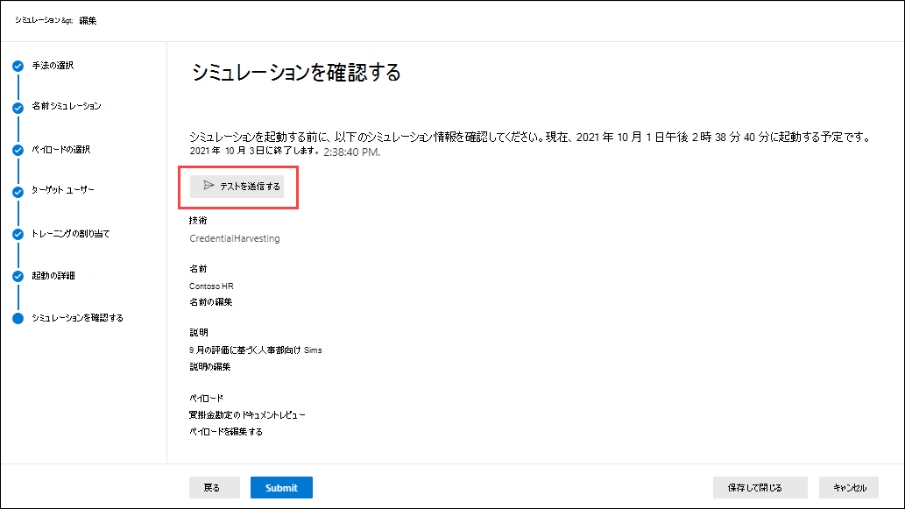

# Defender でフィッシング攻撃をシミュレートOffice 365

**Microsoft** Defender for [Office 365プラン 2 に適用されます](defender-for-office-365.md)

Microsoft Defender で計画 2 または Office 365の攻撃シミュレーション トレーニングMicrosoft 365 E5、組織内で良性のサイバー攻撃シミュレーションを実行できます。 これらのシミュレーションでは、セキュリティ ポリシーとプラクティスをテストし、従業員の意識を高め、攻撃に対する影響を減らします。 この記事では、攻撃シミュレーション トレーニングを使用してシミュレートされたフィッシング攻撃を作成する方法について説明します。

攻撃シミュレーション トレーニングの概要については、「攻撃シミュレーション トレーニングの使用を開始 [する」を参照してください](attack-simulation-training-get-started.md)。

シミュレートされたフィッシング攻撃を起動するには、次の手順を実行します。

1. ポータルの [Microsoft 365 Defender] で、[電子メール] & [攻撃シミュレーション トレーニング シミュレーション] <https://security.microsoft.com>  \>  \> **タブに移動** します。

   [シミュレーション] タブに直接 **移動するには** 、 を使用します <https://security.microsoft.com/attacksimulator?viewid=simulations> 。

2. [シミュレーション] **タブで** 、[シミュレーションの ![ 起動] アイコンを選択します。](../../media/m365-cc-sc-create-icon.png) **シミュレーションを起動します**。

   ![ポータルの攻撃シミュレーション トレーニングの [シミュレーション] タブでシミュレーション ボタンをMicrosoft 365 Defenderします。](../../media/attack-sim-training-simulations-launch.png)

3. シミュレーション作成ウィザードが開きます。 この記事の残りの部分では、ページとページに含まれる設定について説明します。

> [!NOTE]
> シミュレーション作成ウィザードの任意の時点で、[保存して閉じる] をクリックして進行状況を保存し、後でシミュレーションの構成を続行できます。 不完全なシミュレーションには、[ **シミュレーション** ] タブの **[状態** ] 値 **[下書き]** があります。シミュレーションを選択し、[シミュレーションの編集] アイコンをクリックすると、オフにした  **シミュレーションを** 編集します。

## ソーシャル エンジニアリング手法の選択

[テクニック **の選択]** ページで、利用可能なソーシャル エンジニアリング手法を選択します。これは [、MITRE ATT および CK&フレームワーク®します](https://attack.mitre.org/techniques/enterprise/)。 さまざまなペイロードは、さまざまな手法で使用できます。 次のソーシャル エンジニアリング手法を使用できます。

- **資格情報の取得**: ユーザー名とパスワードを送信する入力ボックスを持つよく知られている Web サイトにユーザーを連れて行き、資格情報を収集します。
- **マルウェアの添付** ファイル: 悪意のある添付ファイルをメッセージに追加します。 ユーザーが添付ファイルを開くと、攻撃者がターゲットのデバイスを侵害するのに役立つ任意のコードが実行されます。
- **添付ファイルのリンク**: 資格情報の収集ハイブリッドの種類。 攻撃者は電子メールの添付ファイルに URL を挿入します。 添付ファイル内の URL は、資格情報の取得と同じ手法に従います。
- **マルウェアへのリンク**: 既知のファイル共有サービスでホストされているファイルから任意のコードを実行します。 ユーザーに送信されるメッセージには、この悪意のあるファイルへのリンクが含まれる。 ファイルを開くと、攻撃者はターゲットのデバイスを侵害する可能性があります。
- **Drive-by URL**: メッセージ内の悪意のある URL は、ユーザーのデバイスでコードをサイレントモードで実行および/またはインストールする見慣れた Web サイトにユーザーを連れ出します。

説明の [詳細 **の表示]** リンクをクリックすると、詳細フライアウトが開き、その手法と、その手法から生じ得るシミュレーション手順について説明します。

![[テクニックの選択] ページの資格情報の取得手法の詳細フライアウト。](../../media/attack-sim-training-simulations-select-technique-sim-steps.png)

完了したら、**[次へ]** をクリックします。

## シミュレーションの名前と説明

[名前シミュレーション **] ページで** 、次の設定を構成します。

- **名前**: シミュレーションの一意でわかりやすい名前を入力します。
- **説明**: シミュレーションのオプションの詳細な説明を入力します。

完了したら、**[次へ]** をクリックします。

## ペイロードの選択

[ペイロード **の選択] ページ** で、リストから既存のペイロードを選択するか、新しいペイロードを作成する必要があります。

次の詳細は、選択に役立つペイロードの一覧に表示されます。

- **[名前]**
- **言語**: ペイロード コンテンツの言語。 Microsoft のペイロード カタログ (グローバル) は、10 以上の言語でペイロードを提供し、フィルター処理も可能です。
- **クリック率**: このペイロードをクリックしたユーザー数。
- **予測された妥協** 率: このペイロードによって侵害される人の割合を予測する、Microsoft 365全体のペイロードの履歴データ。
- **起動されたシミュレーションは** 、このペイロードが他のシミュレーションで使用された回数をカウントします。

[検索 ![ ] アイコンをクリックします。](../../media/m365-cc-sc-search-icon.png) **[** 検索] ボックスに、ペイロード名の一部を入力し、Enter キーを押して結果をフィルター処理できます。

[フィルター] を **クリックすると**、次のフィルターを使用できます。

- **複雑さ**: 攻撃の可能性を示すペイロード内のインジケーターの数 (スペル ミス、緊急度など) に基づいて計算されます。 より多くのインジケーターを攻撃として識別し、より複雑さを示す方が簡単です。 使用できる値は次のとおりです:
  - **低**
  - [ **Medium**]
  - **高**
- **ソース**: ペイロードが組織で作成されたのか、Microsoft の既存のペイロード カタログの一部であるかどうかを示します。 有効な値は次のとおりです。
  - **グローバル** (組み込み)
  - **テナント** (カスタム)
  - **All**
- **言語**: 使用可能な値は、中国語 (簡体字) 、中国語(繁体字 **)**、英語 、フランス語 、ドイツ語 、**イタリア** 語、**日本語**、**韓国語**、**ポルトガル** 語、ロシア語、**スペイン** 語、オランダ語 **です**。 
- **タグの追加**
- テーマによるフィルター : 使用可能な値は、アカウントのアクティブ化、アカウントの検証、請求、メールのクリーンアップ、ドキュメント受信、経費 **、FAX、** 財務レポート、受信 **メッセージ**、**請求書**、受信アイテム、ログイン通知、メール受信、**パスワード**、給与、個人設定されたオファー、**検疫****です。リモート作業** **、メッセージの確認**、**セキュリティ更新** プログラム、**サービス** の中断、署名が必要、メールボックス ストレージのアップグレード **メールボックス** の確認、**ボイス** メール **、その他**。 
- **ブランド** によるフィルター : 使用可能な値は、American **Express**、 **Capital One**、 **DHL** 、 **DocuSign**、 **Dropbox**、 **Facebook**、 First **American**、 **Microsoft**、 **Netflix**、 **Scotiabank**、 **SendGrid** **、** スチュワート タイトル 、**テスコ**、 **Wells Fargo**、 **Syrinx Cloud**、および Other です。
- **業界別** のフィルター : 利用可能な値は、銀行、**ビジネス** サービス、コンシューマーサービス、教育、エネルギー 、建設、**コンサルティング**、金融サービス、政府機関、ホスピタリティ、保険、法務、クーリエ サービス **、IT** 、**ヘルスケア**、製造、小売、テレコム 、**不動産** です。     および **Other**.
- **現在のイベント**: 使用可能な値は **Yes** または **No です**。
- **論争 :** 使用可能な値は **Yes** または No **です**。

フィルターの構成が完了したら、[適用]、[**キャンセル**]、または [フィルターのクリア]**をクリックします**。

リストからペイロードを選択すると、ペイロードの詳細がフライアウトに表示されます。

- [ **概要]** タブには、ペイロードの例と他の詳細が含まれています。
- [**シミュレーションの起動] タブには**、[**シミュレーション** 名]、[クリック率 **]、[** 侵害率]、および [アクション] が **含まれます**。

名前をクリックしてリストからペイロードを選択した場合は、[テスト ペイロードの送信 ![ ] アイコンをクリックします。](../../media/m365-cc-sc-create-icon.png) **メイン ページに [テスト** の送信] ボタンが表示され、ペイロード 電子メールのコピーを自分 (現在ログインしているユーザー) に送信して検査を行います。

独自のペイロードを作成するには、[ペイロード アイコン ![ の作成] をクリックします。](../../media/m365-cc-sc-create-icon.png) **ペイロードを作成します**。 詳細については、「Create [custom payloads for Attack Simulation training」を参照してください](attack-simulation-training-payloads.md)。

完了したら、**[次へ]** をクリックします。

## 対象ユーザー

[ターゲット ユーザー **] ページで** 、シミュレーションを受け取るユーザーを選択します。 次のいずれかの設定を構成します。

- **組織内のすべてのユーザーを含める**: 影響を受けるユーザーは 10 のリストに表示されます。 ユーザーの一覧の直 **下にある**[次へ] ボタンと [前へ] ボタンを使用して、リストをスクロールできます。 検索アイコンを  **ページ** 上の検索アイコンを使用して、影響を受けるユーザーを検索します。
- **特定のユーザーとグループのみを含める**: 次のいずれかのオプションを選択します。
  - ![[ユーザーの追加] アイコン。](../../media/m365-cc-sc-create-icon.png) **ユーザーの追加**: 表示 **される [ユーザーの追加]** フライアウトで、次の条件に基づいてユーザーとグループを検索できます。
    - **ユーザーまたはグループ**: [ユーザーと ![ グループの検索] アイコンで指定します。](../../media/m365-cc-sc-search-icon.png) **[ユーザーとグループの検索**] ボックスに、ユーザーまたはグループの **[名前**] または [電子メール アドレス] の一部を入力し、Enter キーを押します。 結果の一部またはすべてを選択できます。 完了したら、[x ユーザーの追加 **] をクリックします**。

      > [!NOTE]
      > [フィルターの追加 **]** ボタンをクリックして[カテゴリ別にユーザーをフィルター処理] オプションに戻すと、検索結果で選択したユーザーまたはグループがクリアされます。

    - **カテゴリでユーザーをフィルター処理** する : 次のオプションの一部またはすべてから選択します。
      - **推奨されるユーザー グループ**: 次の値から選択します。
        - **すべての推奨ユーザー グループ**
        - **過去 3 か月間にシミュレーションの対象とされないユーザー**
        - **繰り返し犯罪者**
      - **部門**: 次のオプションを使用します。
        - **検索**: [部門別 ![ 検索] アイコンで検索します。](../../media/m365-cc-sc-search-icon.png) **[部署で検索]** ボックスに、部門の値の一部を入力し、Enter キーを押します。 結果の一部またはすべてを選択できます。
        - [すべての **部署を選択]**
        - 既存の部署の値を選択します。
      - **Title**: 次のオプションを使用します。
        - **検索**: [タイトルで ![ 検索] アイコンをクリックします。](../../media/m365-cc-sc-search-icon.png) **[タイトルで検索** ] ボックスに、Title 値の一部を入力し、Enter キーを押します。 結果の一部またはすべてを選択できます。
        - [すべての **タイトルを選択]**
        - 既存の Title 値を選択します。

      ![ポータルの攻撃シミュレーション トレーニングの [ターゲット ユーザー] ページのユーザー フィルター Microsoft 365 Defenderします。](../../media/attack-sim-training-simulations-target-users-filter-by-category.png)

      条件を特定すると、影響を受けるユーザーが表示される[ユーザー一覧] セクションに表示され、検出された受信者の一部またはすべてを選択できます。

      完了したら **、[Apply(x)] をクリックし、[x** ユーザーの追加 **] をクリックします**。

  メインの [ターゲット ユーザー **] ページに** 戻り、[検索] アイコン  **影響を** 受けるユーザーを検索する検索ボックス。 [ユーザーの削除]  **特定の** ユーザーを削除するには、削除します。

-  **インポート**: 開くダイアログで、1 行に 1 つのメール アドレスを含む CSV ファイルを指定します。

  CSV ファイルを選択すると、ユーザーの一覧がインポートされ、[対象ユーザー] ページ **に表示** されます。 [検索] アイコン  **影響を** 受けるユーザーを検索する検索ボックス。 [対象ユーザーの削除 ![ ] アイコンをクリックすることもできます。](../../media/m365-cc-sc-delete-icon.png) **特定の** ユーザーを削除するには、削除します。

完了したら、**[次へ]** をクリックします。

## トレーニングの割り当て

[トレーニングの **割り当て** ] ページで、シミュレーションのトレーニングを割り当てできます。 トレーニングを行う従業員が同様の攻撃を受けにくいので、シミュレーションごとにトレーニングを割り当てすることをお勧めします。 次の設定を使用できます。

- **[トレーニング コンテンツの基本設定を選択** する]: 次のいずれかのオプションを選択します。
  - **Microsoft トレーニング エクスペリエンス**: これは、構成する次の関連付けられたオプションを持つ既定値です。
    - 以下のいずれかのオプションを選択します。
      - **トレーニングを割り当てる**: これは既定の値と推奨値です。 ユーザーの以前のシミュレーションとトレーニング結果に基づいてトレーニングを割り当て、ウィザードの次の手順で選択内容を確認できます。
      - **トレーニング コースとモジュール** を自分で選択する : この値を選択すると、ウィザードの次の手順で、推奨されるコンテンツと利用可能なすべてのコースとモジュールを表示できます。
    - **期限 :** 次のいずれかの値を選択します。
      - **シミュレーションが終了した 30 日後**: これは既定値です。
      - **シミュレーションが終了した 15 日後**
      - **シミュレーションが終了した 7 日後**
  - **カスタム URL へのリダイレクト**: この値には、構成する次の関連オプションがあります。
    - **カスタム トレーニング URL** (必須)
    - **カスタム トレーニング名** (必須)
    - **カスタム トレーニングの説明**
    - **カスタム トレーニング期間 (分単位)**: 既定値は 0 で、トレーニングの期間は指定されていません。
    - **期限 :** 次のいずれかの値を選択します。
      - **シミュレーションが終了した 30 日後**: これは既定値です。
      - **シミュレーションが終了した 15 日後**
      - **シミュレーションが終了した 7 日後**
  - **トレーニングなし**: この値を選択した場合、ページの唯一のオプションは、[ランディング ページ] ページに移動する [次へ][**ボタン**](#landing-page)です。

![ポータルの攻撃シミュレーション トレーニングの [トレーニングの割り当て] ページに、推奨されるトレーニングMicrosoft 365 Defender追加します。](../../media/attack-sim-training-simulations-assign-training-add-recommended-training.png)

### トレーニングの割り当て

> [!NOTE]
> [**トレーニングの割り当** て] ページは、前のページで **[自分** でトレーニング コースとモジュールを選択する] を選択した場合 \> にのみ使用できます。

[トレーニングの **割り当** て] ページで、[トレーニングの追加] アイコンをクリックして、シミュレーションに追加するトレーニング  **トレーニングを追加します**。

表示される **[トレーニングの追加** ] フライアウトで、使用可能な次のタブで使用するトレーニングを選択できます。

- **[** 推奨] タブ: シミュレーション構成に基づいて推奨される組み込みトレーニングを表示します。 これらは、前のページで [トレーニングの割り当て]を選択した場合に割り当てられたトレーニングと同じです。
- **[すべてのトレーニング]** タブ: 使用可能なすべての組み込みトレーニングが表示されます。

  トレーニングごとに次の情報が表示されます。

  - **トレーニング名**
  - **ソース**: 値はグローバル **です**。
  - **期間 (分)**
  - **プレビュー**: [プレビュー] **ボタンをクリック** してトレーニングを表示します。

  [検索 ![ ] アイコンをクリックします。](../../media/m365-cc-sc-search-icon.png) **[** 検索] ボックスに、トレーニング名の一部を入力して Enter キーを押して、現在のタブで結果をフィルター処理できます。

  現在のタブから含めるすべてのトレーニングを選択し、[追加] を **クリックします**。

メインの [トレーニングの **割り当て** ] ページに戻り、選択したトレーニングが表示されます。 トレーニングごとに次の情報が表示されます。

- **トレーニング名**
- **Source**
- **期間 (分)**

リスト内の各トレーニングについて、[割り当て先] 列で値を選択して、トレーニングを受け取るユーザーを **選択する必要** があります。

- **すべてのユーザー**

  または次の値の 1 つまたは両方。

- **クリックされたペイロード**
- **侵害された**

表示されているトレーニングを使用しない場合は、[トレーニングの削除] アイコン  **Delete**

完了したら、**[次へ]** をクリックします。

### ランディング ページ

[ランディング **ページ] ページ** で、シミュレーションでペイロードを開いた場合にユーザーが取得する Web ページを構成します。

Microsoft が選択したランディング ページは、中国語 (簡体字)、中国語 (繁体字)、英語、フランス語、ドイツ語、イタリア語、日本語、韓国語、ポルトガル語、ロシア語、スペイン語、オランダ語の 12 言語で利用できます。

- **[ランディング ページの設定を選択する**]: 使用可能な値は次のとおりです。
  - **Microsoft の既定のランディング ページを使用** する : これは、構成する次の関連付けられたオプションを持つ既定値です。
    - **[ランディング ページ レイアウトを選択**]: 使用可能なテンプレートのいずれかを選択します。
    - **ロゴの追加**: [ **参照]** をクリックして、.png.jpeg、またはファイルを.gifします。 ロゴを削除するには、[削除] を **クリックします**。
    - **メールにペイロード インジケーターを追加** する : [テクニックの選択]ページで[マルウェアの添付ファイル] または [マルウェアへのリンク] を以前に選択した場合、この設定 [は使用](#select-a-social-engineering-technique)できません。

      [ **メールにペイロードインジケーターを追加する** ] を選択して、ユーザーがフィッシング メッセージを識別する方法について学習します。

    結果をプレビューするには、ページの下部にある **[プレビュー** パネルを開く] ボタンをクリックします。

  - **カスタム URL を使用** する : [テクニックの選択]ページで[マルウェアの添付ファイル] または [マルウェアへのリンク] を以前に選択した場合、この設定 [は使用](#select-a-social-engineering-technique)できません。

    [カスタム URL を **使用する] を** 選択した場合は、表示される [カスタム ランディング ページ URL の入力] ボックスに **URL** を追加する必要があります。 ページで他のオプションを使用できません。

  - **独自のランディング ページを作成する**: この値には、構成する次の関連オプションがあります。
    - **メールにペイロード インジケーターを追加** する : [テクニックの選択]ページで[マルウェアの添付ファイル] または [マルウェアへのリンク] を以前に選択した場合、この設定 [は使用](#select-a-social-engineering-technique)できません。

      [ **メールにペイロードインジケーターを追加する** ] を選択して、ユーザーがフィッシング メッセージを識別する方法について学習します。

    - ページ コンテンツ: 次の 2 つのタブを使用できます。
      - **テキスト**: リッチ テキスト エディターを使用してランディング ページを作成できます。 一般的なフォントと書式設定の設定に加えて、次の設定を使用できます。
        - **動的タグ**: 次のタグから選択します。
          - **Username**
          - **電子メールの送信者名**
          - **送信者のメール アドレス**
          - **メールの件名**
          - **メール コンテンツ**
        - **既定から使用**: 使用できるテンプレートを選択します。 編集領域でテキストとレイアウトを変更できます。 ランディング ページをテンプレートの既定のテキストとレイアウトに戻す場合は、[既定にリセット] **をクリックします**。
    - **コード**: HTML コードを直接表示および変更できます。

    結果をプレビューするには、ページの中央にある **[** プレビュー パネルを開く] ボタンをクリックします。

完了したら、**[次へ]** をクリックします。

> [!NOTE]
> 特定の商標、ロゴ、記号、記号、その他のソース識別子は、地方、州、および連邦の法令および法律の下で保護を強化します。 このようなインジケーターを不正に使用すると、刑事罰金を含む罰則がユーザーに科される可能性があります。 広範なリストではありませんが、これには、大統領、副大統領、および議会のシール、CIA、FBI、社会保障、メディケアとメディケイド、米国内歳入サービス、およびオリンピックが含まれます。 これらの商標のカテゴリを超えて、サードパーティの商標の使用と変更は、固有のリスクを伴います。 ペイロードで独自の商標とロゴを使用すると、リスクが低く、特に組織が使用を許可している場合はリスクが低い可能性があります。 ペイロードを作成または構成する際に、何が適切か、または適切ではないかについてさらに質問がある場合は、法務アドバイザーに相談してください。

## エンド ユーザー通知の選択

[エンド **ユーザー通知の選択] ページ** で、次の通知オプションから選択します。

- **通知を配信しない**: 表示 **される通知** ダイアログで [続行] をクリックします。 このオプションを選択すると、[次へ] をクリック [すると、 起動の詳細] ページが **表示されます**。

- **Microsoft の既定の通知 (推奨)**: ページで次の追加設定を使用できます。
  - **既定の** 言語の選択: 使用可能な値は、中国語 (簡体字) 、中国語 **(** 繁体字 **)**、英語 、フランス語 、**ドイツ** 語、**イタリア** 語、**日本語**、**韓国語**、**ポルトガル** 語、**ロシア** 語、**スペイン** 語、オランダ語 **です。**
  - 既定では、選択できる通知は Microsoft 正の補強 **通知のみです**。 通知に使用できる情報は次のとおりです。
    - **通知** (名前): 値は Microsoft の **既定の正の配筋通知です**。
    - **言語**: 通知に複数の翻訳が含まれている場合、最初の 2 つの言語が直接表示されます。 残りの言語を表示するには、数値アイコン (たとえば **、+10) の上にマウス ポインターを置きます**。
    - **Type**: 値は正 **の配筋です**。
    - **配信の基本設定**: 次の値から選択します。
      - **配信しない**
      - **キャンペーン終了後に配信する**
      - **キャンペーン中に配信する**
    - **配信 :** 値は **適用できません**。
    - **アクション**: [表示] アイコンを  **[表示** ] アイコンを **クリックすると、[通知** の確認] ページが表示され、次の情報が表示されます。
      - **[プレビュー** ] タブ: 通知メッセージを表示します。 異なる言語でメッセージを表示するには、[言語の選択 **] ボックスを使用** します。
      - **[詳細** ] タブ: 通知の詳細を表示します。
        - **通知の説明**
        - **ソース**: 組み込みの通知の場合、値はグローバル **です**。 カスタム通知の場合、値は **Tenant です**。
        - **通知の種類**
        - **変更者**
        - **最終更新日時**

        完了したら、**[閉じる]** をクリックします。

  このオプションを選択すると、[次へ] をクリック [すると、 起動の詳細] ページが **表示されます**。

- **カスタマイズされたエンド** ユーザー通知 : [次へ] をクリックすると、次のセクションの説明に従って[正の強化通知] ページに移動し、既存の通知から選択するか、新しい通知を作成できます。

完了したら、**[次へ]** をクリックします。

### 正の強化通知

[**正の強化通知]** ページは、前のページで [カスタマイズされたエンド ユーザー通知] を選択した場合にのみ使用できます。

- **配信の基本設定**: 次のいずれかの値を選択します。
  - **配信しない**
  - **ユーザーがフィッシングとキャンペーンの終了を報告した後に配信する**
  - **ユーザーがフィッシングを報告した直後に配信する**

- **正の配筋通知を選択** する: 既存の通知を選択するか、次の種類の正補強通知を使用して新 **しい通知を** 作成できます。
  - 既存の通知を選択するには、通知名の横にある空白の領域をクリックします。 通知名をクリックすると、通知が選択され、プレビュー の飛び出しが表示されます。 通知の選択を解除するには、通知の横にあるチェック ボックスをオフにします。
  - 既存の通知を検索するには、[検索] アイコン  **名前** を検索する検索ボックス。
  - 新しい通知を作成するには、[新しいアイコンの ![ 作成] をクリックします。](../../media/m365-cc-sc-create-icon.png) **新しいを作成します**。
  - 既存のカスタム通知を変更するには、その通知を選択し、[通知アイコンの編集 ![ ] をクリックします。](../../media/m365-cc-sc-edit-icon.png) **通知を編集します**。

#### 新しい通知ウィザードの作成

[新しいアイコンの作成 ![ ] をクリックした場合。](../../media/m365-cc-sc-create-icon.png) **[正の** 配筋通知] **ページで** 新規を作成すると、通知作成ウィザードが開きます。

作成手順は、「Create [end-user notifications」の説明と同じです](attack-simulation-traning-end-user-notifications.md#create-end-user-notifications)。

> [!NOTE]
> [詳細の **定義] ページ** で、[通知の種類の選択] で [正 **の配筋** 通知] の値を選択 **してください**。 [シミュレーション通知] **を選択しない**。

完了すると、[正の配筋通知] ページに戻り、作成した通知が [正の配筋通知の選択] リストに **表示** されます。

- 新しい通知を作成するには、 .
- 通知を変更したり、翻訳を追加したりするには、一覧から通知を選択し、[通知アイコンの編集]  **通知を編集** して、前述のように通知ウィザードを開始します (ほとんどの値が既に入力されています)。 12 のサポートされている言語の翻訳が通知に既に存在する場合は、それ以上の翻訳を追加できます。

使用する通知を選択し、[次へ] を **クリックします**。

## 起動の詳細

[起動 **の詳細] ページ** で、シミュレーションを起動する時間とシミュレーションを終了する時間を選択します。 指定した終了日後に、このシミュレーションとの対話のキャプチャを停止します。

次の設定を使用できます。

- 次のいずれかの値を選択します。
  - **完了したらすぐにこのシミュレーションを起動する**
  - **このシミュレーションを後で起動するスケジュールを設定する**: この値には、構成する次の関連オプションがあります。
    - **起動日の選択**
    - **起動時間の選択**
- **シミュレーションを終了する日数を構成します。** 既定値は 2 です。
- **地域対応タイム ゾーン配信を有効** にする: 地域に基づいて、勤務時間中にシミュレートされた攻撃メッセージを従業員に配信します。

完了したら、**[次へ]** をクリックします。

## シミュレーションの確認

[シミュレーション **の確認] ページ** で、シミュレーションの詳細を確認できます。

[テストの ![ 送信] アイコンをクリックします。](../../media/m365-cc-sc-send-icon.png) **テスト ボタンを送信** して、ペイロード 電子メールのコピーを自分 (現在ログインしているユーザー) に送信して検査します。

各セクションで **[編集]** を選択して、そのセクション内の設定を変更することができます。 または、**[戻る]** をクリックするか、ウィザードで特定のページを選択します。

完了したら、**[送信]** をクリックします。

