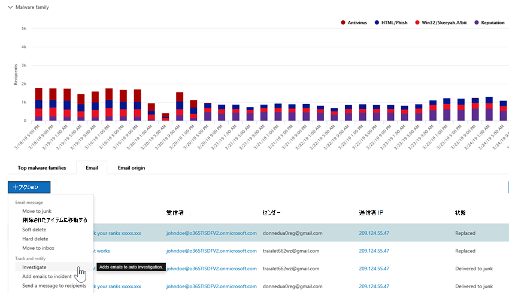

# Microsoft Defender での自動調査と対応の仕組みOffice 365

[!INCLUDE [Microsoft 365 Defender rebranding](../includes/microsoft-defender-for-office.md)]

**適用対象**
- [Microsoft Defender for Office 365 プラン 2](defender-for-office-365.md)
- [Microsoft 365 Defender](../defender/microsoft-365-defender.md)

セキュリティアラートがトリガーされると、セキュリティ運用チームがこれらのアラートを確認し、組織を保護するための手順を実行する必要があります。 場合によっては、セキュリティ運用チームがトリガーされるアラートの量に圧倒される場合があります。 Microsoft Defender の自動調査と応答 (AIR) 機能は、Office 365役立ちます。

AIR を使用すると、セキュリティ運用チームは、より効率的かつ効果的に運用できます。 AIR 機能には、現在存在する既知の脅威に対応する自動調査プロセスが含まれます。 適切な修復アクションは承認を待ち、セキュリティ運用チームが検出された脅威に対応できます。

この記事では、いくつかの例を通して AIR がどのように動作するのかについて説明します。 AIR の使用を開始する準備ができたら、「脅威を自動的に調査 [して対応する」を参照してください](office-365-air.md)。

- [例 1: ユーザーが報告したフィッシング メッセージが調査プレイブックを起動する](#example-a-user-reported-phish-message-launches-an-investigation-playbook)
- [例 2: セキュリティ管理者が脅威エクスプローラーから調査をトリガーする](#example-a-security-administrator-triggers-an-investigation-from-threat-explorer)
- [例 3: セキュリティ運用チームは、セキュリティ管理アクティビティ API を使用して AIR と SIEM を統合Office 365します。](#example-a-security-operations-team-integrates-air-with-their-siem-using-the-office-365-management-activity-api)

## 例: ユーザーから報告されたフィッシング メッセージによる調査プレイブックの起動

組織内のユーザーがフィッシング詐欺の試みと思うメールを受信したとします。 このようなメッセージを報告するトレーニングを受けたユーザーは、レポート メッセージ アドインまたはレポート フィッシング アドインを使用して、分析のために Microsoft に送信します。 申請はシステムにも送信され、[申請] ビュー (以前はユーザーレポート ビューと呼ばば) の **エクスプローラーに表示** されます。 さらに、ユーザーが報告したメッセージによってシステムベースの情報アラートがトリガーされ、調査プレイブックが自動的に起動されます。

ルート調査フィーズでは、メールのさまざまな側面が評価されます。 これらの側面は次のとおりです。

- 可能性のある脅威の種類の特定
- 誰が送信したか
- メールはどこから送信されたか (送信元のインフラストラクチャ)
- メールの他のインスタンスは、配信されたのか、それともブロックされたのか
- Microsoft のアナリストによる評価
- メールが既知のキャンペーンと関連するものかどうか
- その他

ルート調査が完了すると、元のメールとそれに関連付けられているエンティティに対する推奨処理の一覧がプレイブックにより提供されます。

次に、脅威の調査と捜索のための手順がいくつか実行されます。

- 同様の電子メール メッセージは、電子メール クラスター検索を介して識別されます。
- 信号は、Microsoft Defender for Endpoint などの [他のプラットフォームと共有されます](/windows/security/threat-protection/microsoft-defender-atp/microsoft-defender-advanced-threat-protection)。
- 不審なメール メッセージ内の悪意のあるリンクをユーザーがクリックしたかどうかが判断されます。
- ユーザーによって報告される他の同様のメッセージExchange Online Protection ([EOP](exchange-online-protection-overview.md)) と ([Microsoft Defender for Office 365](defender-for-office-365.md)) の間でチェックが行われます。
- ユーザーに対する侵害があったかどうかがチェックされます。 このチェックでは、関連するユーザー アクティビティの異常をOffice 365、Microsoft Cloud App Security、Azure Active Directoryの信号を活用します。 

捜索フェーズでは、リスクと脅威がさまざまな捜索手順に割り当てられます。

修復は、プレイブックの最後のフェーズです。 このフェーズでは、調査および捜索フェーズに基づいて、修復手順が実行されます。

## 例: セキュリティ管理者が脅威エクスプローラーから調査を開始する

アラートによってトリガーされる自動調査に加えて、組織のセキュリティ運用チームは、脅威エクスプローラーのビューから自動調査 [をトリガーできます](threat-explorer.md)。  また、この調査によってアラートが作成され、Microsoft Defender Incidents と外部 SIEM ツールは、この調査がトリガーされたと確認できます。

たとえば、エクスプローラーでマルウェア ビューを **使用すると** します。 グラフの下のタブを使用して、[メール] タブ **を選択** します。リストで 1 つ以上のアイテムを選択すると **、[+ アクション] ボタンが** アクティブ化されます。

[アクション] **メニューを** 使用して、[調査のトリガー **] を選択できます**。

![選択したメッセージの [アクション] メニュー。](../../media/explorer-malwareview-selectedemails-actions.jpg)

アラートによってトリガーされるプレイブックと同様、エクスプローラーのビューからトリガーされる自動調査には、ルート調査、脅威を特定して相関関連を特定するための手順、これらの脅威を軽減するための推奨処置が含まれます。

## 例: セキュリティ運用チームは、セキュリティ管理アクティビティ API を使用して AIR と SIEM Office 365統合します。

Microsoft Defender for Office 365の AIR 機能には、&を監視および対処するためにセキュリティ運用チームが使用できる詳細に関するレポートが含まれます。 ただし、AIR 機能を他のソリューションと統合できます。 たとえば、セキュリティ情報とイベント管理 (SIEM) システム、ケース管理システム、またはカスタム レポート ソリューションがあります。 これらの種類の統合は、管理アクティビティ API Office 365[使用して実行できます](/office/office-365-management-api/office-365-management-activity-api-reference)。

たとえば、最近、組織はセキュリティ運用チームが AIR によって既に処理されたユーザーが報告したフィッシングアラートを表示する方法をセットアップしました。 ソリューションは、関連するアラートを組織の SIEM サーバーとそのケース管理システムと統合します。 このソリューションは、セキュリティ運用チームが実際の脅威に時間と労力を集中できるよう、誤検知の数を大幅に削減します。 このカスタム ソリューションの詳細については、「Tech Community blog: Improve the EFFECTIVENESS of your [SOC with Microsoft Defender for Office 365」および「O365 Management API」](https://techcommunity.microsoft.com/t5/microsoft-security-and/improve-the-effectiveness-of-your-soc-with-office-365-atp-and/ba-p/1525185)を参照してください。

## 次の手順

- [AIR の使用を開始する](office-365-air.md)
- [保留中または完了した修復アクションの表示](air-review-approve-pending-completed-actions.md)