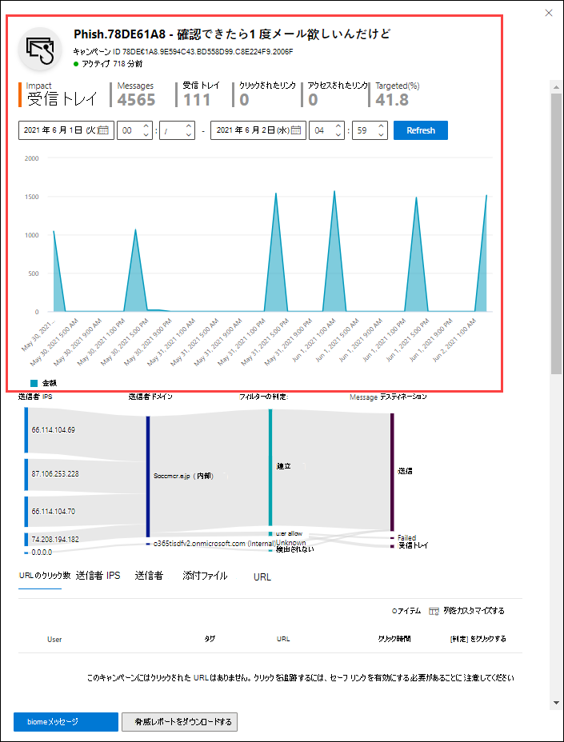

# Microsoft Defender のキャンペーン ビュー (Office 365

[!INCLUDE [Microsoft 365 Defender rebranding](../includes/microsoft-defender-for-office.md)]

**適用対象**
- [Microsoft Defender for Office 365 プラン 2](defender-for-office-365.md)

キャンペーン ビューは、Microsoft Defender for Office 365 プラン 2 の機能です (たとえば、Microsoft 365 E5 または Office 365 プラン 2 アドオンの Defender を持つ組織)。 ポータルのキャンペーン ビュー Microsoft 365 Defender、サービス内のフィッシング攻撃を識別して分類します。 キャンペーン ビューは、次の目的に使用できます。

- フィッシング攻撃を効率的に調査し、対処する。
- 攻撃対象を正確に理解する。
- 意思決定者に価値を示す。

キャンペーン ビューを使用すると、人間には真似できない速さと完全さで攻撃の全体像を把握できます。

## キャンペーンとは

キャンペーンとは、1 つまたは複数の組織に対する組織的なメール攻撃のことです。 資格情報と会社のデータを盗む電子メール攻撃は、大規模で収益性の高い業界です。 攻撃を止めようとするテクノロジが増加する中、攻撃者は継続的な成功を確実に実現するためにメソッドを変更します。

Microsoft は、サービス全体で膨大な量のフィッシング対策、スパム対策、マルウェア対策データを活用して、キャンペーンの特定に役立ちます。 攻撃情報を分析し、いくつかの要因に従って分類します。 次に例を示します。

- **攻撃元**: 送信元 IP アドレスと送信者メール ドメイン。
- **メッセージのプロパティ**: メッセージのコンテンツ、スタイル、トーン。
- **メッセージ受信者**: 受信者の関連付け方法。 たとえば、受信者ドメイン、受信者のジョブ機能 (管理者、役員など)、会社の種類 (大、小規模、パブリック、プライベートなど)、業種などです。
- **攻撃ペイロード**: メッセージ内の悪意のあるリンク、添付ファイル、または他のペイロード。

キャンペーンの期間が短い場合や、アクティブな期間と非アクティブな期間がある数日、数週間、または数か月に及んでいる可能性があります。 特定の組織に対してキャンペーンが開始される場合や、組織が複数の企業で大規模なキャンペーンに参加している可能性があります。

## Microsoft 365 Defender ポータルのキャンペーン ビュー

キャンペーン ビューは、Microsoft 365 Defenderポータル ( ) の [メール &] で、または直接 <https://security.microsoft.com>  \> . <https://security.microsoft.com/campaigns>

![[キャンペーン] ポータルのMicrosoft 365 Defender概要。](../../media/campaigns-overview.png)

また、次の場所からキャンペーン ビューを取得できます。

- **メール&コラボレーション** \>**エクスプローラー** \>**表示** \>**キャンペーン**
- **メール&コラボレーション** \>**エクスプローラー** \>**表示** \>**すべてのメール** \>**[キャンペーン**] タブ
- **メール&コラボレーション** \>**エクスプローラー** \>**表示** \>**フィッシング** \>**[キャンペーン**] タブ
- **メール&コラボレーション** \>**エクスプローラー** \>**表示** \>**マルウェア** \>**[キャンペーン**] タブ

キャンペーン ビューにアクセスするには、組織の管理、セキュリティ管理者、またはセキュリティリーダーの役割グループのメンバーである必要があります。Microsoft 365 Defenderします。  詳細については、「[Microsoft 365 Defender ポータルのアクセス許可](permissions-microsoft-365-security-center.md)」を参照してください。

## キャンペーンの概要

[概要] ページには、すべてのキャンペーンに関する情報が表示されます。

既定の [ **キャンペーン] タブ** の [ **キャンペーン** の種類] 領域には、1 日あたりの受信者数を示す棒グラフが表示されます。 既定では、グラフにはフィッシング データと **マルウェア データの****両方が表示** されます。

> [!TIP]
> キャンペーン データが表示しない場合は、日付範囲またはフィルターを変更 [してみてください](#filters-and-settings)。

概要ページのグラフの下の表に、[キャンペーン] タブに次の情報 **が表示** されます。

- [**Name (名前)**]

- [**Sample subject (件名のサンプル)**]: キャンペーンのいずれかのメッセージの件名行。 キャンペーン内のすべてのメッセージに、必ずしも同じ件名が設定されているわけではない点に注意してください。

- **対象**: (組織内のキャンペーン受信者の数) / (サービス内のすべての組織のキャンペーン内の受信者の総数) で計算される割合。 この値は、キャンペーンが組織にのみ向けられる度合い (より高い値) と、サービス内の他の組織 (より低い値) に向けられる度合いを示します。

- **種類**: この値は、**フィッシングまたはマルウェア****のいずれかです**。

- **サブ** タイプ : この値には、キャンペーンの詳細が含まれる。 次に例を示します。
  - **フィッシング**: 利用可能な場合は、このキャンペーンによってフィッシングされているブランド。 たとえば `Microsoft` `365` `Unknown` 、、、、、、、 `Outlook` `DocuSign` などです。
  - **マルウェア**: たとえば、 `HTML/PHISH` または `HTML/<MalwareFamilyName>` .

  利用可能な場合、このキャンペーンによってフィッシングされているブランド。 検出が Defender によって実行され、Office 365される場合は、プレフィックス **ATP-** がサブタイプ値に追加されます。

- [**Recipients (受信者)**]: このキャンペーンの攻撃対象となったユーザーの数。

- **受信トレイ**: 受信トレイでこのキャンペーンからメッセージを受信したユーザーの数 (迷惑メール フォルダーに配信されません)。

- **クリック :** URL をクリックしたユーザーまたはフィッシング メッセージで添付ファイルを開いたユーザーの数。

- **クリック率**: " Clicked Inboxed " によって **計算された**  /  **割合**。 この値は、キャンペーンの効果を示す指標です。 つまり、受信者がメッセージをフィッシングとして識別できた場合、およびペイロード URL をクリックしなかった場合。

  マルウェア キャンペーン **では** クリック率は使用されません。

- **アクセス数**: ペイロード Web サイトに実際にアクセスしたユーザーの数。 クリックされた値 **が含** まれるが、[リンクセーフ Web サイトへのアクセスがブロックされている場合、この値は 0 になります。

[ **キャンペーンの発生元** ] タブには、世界の地図にメッセージ ソースが表示されます。

### フィルターと設定

[キャンペーン] ページ **の上部** には、特定のキャンペーンを見つけて特定するのに役立つフィルターとクエリの設定がいくつかあります。

最も基本的なフィルター処理は、開始日/時刻と終了日時です。

ビューをさらにフィルター処理するには、[キャンペーンの種類] ボタンをクリックして選択し、[更新]をクリックして、複数の値をフィルター処理する単一のプロパティを **実行できます**。

[キャンペーンの種類] ボタンで使用できるフィルター可能なキャンペーン **プロパティについては** 、次の一覧で説明します。

- **基本**:
  - **キャンペーンの種類**: [マルウェア **] または [フィッシング]** **を選択します**。 選択範囲をクリアすると、両方を選択した場合と同じ結果になります。
  - **キャンペーン名**
  - **キャンペーンのサブタイプ**
  - **送信者**
  - **受信者**
  - **送信元ドメイン**
  - **[件名]**
  - **添付ファイルの名前**
  - **マルウェア ファミリ**
  - **タグ**: 指定したユーザー タグが適用されているユーザーまたはグループ (優先度アカウントを含む)。 ユーザー タグの詳細については、「ユーザー タグ」 [を参照してください](user-tags.md)。
  - **配信アクション**
  - **その他のアクション**
  - **方向性**
  - **検出テクノロジ**
  - **元の配信場所**
  - **最新の配信場所**
  - **システムオーバーライド**

- **Advanced**:
  - **インターネット メッセージ ID**: メッセージ ヘッダー **の [Message-ID** ヘッダー] フィールドで使用できます。 値の例は `<08f1e0f6806a47b4ac103961109ae6ef@server.domain>` 次のようになります (角かっこに注意してください)。
  - **ネットワーク メッセージ ID:** メッセージ ヘッダーの **X-MS-Exchange-Organization-Network-Message-Id** ヘッダー フィールドで使用できる GUID 値。
  - [**Sender IP (送信者の IP)**]
  - **添付ファイル SHA256**: ファイルの SHA256 ハッシュ値を Windows で検索するには、コマンド プロンプトで次のコマンドを実行します `certutil.exe -hashfile "<Path>\<Filename>" SHA256` 。
  - **クラスター ID**
  - **アラート ID**
  - **アラート ポリシー ID**
  - **キャンペーン ID**
  - **ZAP URL シグナル**

- **URL**:
  - **URL ドメイン**
  - **URL ドメインとパス**
  - **URL**
  - **URL パス**
  - **[評決] をクリックします。**

複数のプロパティによるフィルター処理など、より高度なフィルター処理を行う場合は、[高度なフィルター] ボタンをクリックしてクエリを作成できます。 同じキャンペーン プロパティを使用できますが、次の機能拡張が追加されています。

- [条件の追加 **] をクリックして、** 複数の条件を選択できます。
- 条件の間で **And** 演算子または **Or** 演算子を選択できます。
- 条件リストの下部 **にある条件グループ** 項目を選択して、複雑な複合条件を形成できます。

完了したら、[クエリ] ボタン **をクリック** します。

基本フィルターまたは高度なフィルターを作成した後は、[クエリの保存] または [クエリを名前を付けて保存]**を使用して保存できます**。 その後、[キャンペーン] ページに戻 **った** 場合は、[保存済みクエリ設定] をクリックして、保存済みフィルター **を読み込みできます**。

グラフまたはキャンペーンのリストをエクスポートするには、[エクスポート]をクリックし、[グラフ データのエクスポート] または [キャンペーン リスト **のエクスポート] を選択します**。

Microsoft Defender for Endpoint サブスクリプションをお持ちの場合は **、[MDE** 設定] をクリックして、Microsoft Defender for Endpoint でキャンペーン情報を接続または切断できます。 詳細については[、「Integrate Microsoft Defender for Office 365 Microsoft Defender for Endpoint」を参照してください](integrate-office-365-ti-with-mde.md)。

## キャンペーンの詳細

キャンペーンの名前をクリックすると、キャンペーンの詳細がフライアウトに表示されます。

### キャンペーン情報

キャンペーンの詳細ビューの上部には、次のキャンペーン情報があります。

- **キャンペーン ID**: 一意のキャンペーン識別子。
- **アクティビティ**: キャンペーンの期間とアクティビティ。
- 選択した (またはタイムラインで選択した) 日付範囲フィルターの次のデータ。
- **影響**
- **メッセージ**: 受信者の総数。
- **受信トレイ**: 迷惑メール フォルダーではなく、受信トレイに配信されたメッセージの数。
- **クリックされたリンク**: フィッシング メッセージ内の URL ペイロードをクリックしたユーザーの数。
- **アクセスしたリンク**: URL にアクセスしたユーザーの数。
- **Targeted(%)**: (組織内のキャンペーン受信者の数) / (サービス内のすべての組織のキャンペーン内の受信者の総数) で計算される割合。 この値はキャンペーンの有効期間全体で計算され、日付フィルターに基づいて変更されません。
- 次のセクションで説明するように、キャンペーン フローの開始日時および終了データ/時刻フィルター。
- キャンペーンアクティビティのインタラクティブなタイムライン: タイムラインには、キャンペーンの有効期間全体のアクティビティが表示されます。 グラフ内のデータ ポイントにカーソルを合わせると、検出されたメッセージの量を確認できます。

### キャンペーン フロー

キャンペーンの詳細ビューの中央に、キャンペーンに関する重要な詳細が水平方向のフロー図 (サンキー図と呼ばれる) _に表示_ されます。 これらの詳細情報は、キャンペーンの要素および組織に与えている可能性のある影響を理解する上で役立ちます。

> [!TIP]
> フロー図に表示される情報は、前のセクションで説明したように、タイムラインの日付範囲フィルターによって制御されます。

図内の横方向の帯にマウスのポインターを合わせると、関連するさまざまなメッセージが表示されます (特定のソース IP からのメッセージ、指定した送信者ドメインを使用した、特定のソース IP からのメッセージなど)。

図には、次の情報が含まれます。

- [**Sender IPs (送信者の IP)**]
- [**Sender domains (送信者のドメイン)**]
- **フィルターの評決**: Verdict 値は、「スパム対策メッセージ ヘッダー」の説明に従って、使用可能なフィッシングおよびスパム フィルターの評決 [に関連しています](anti-spam-message-headers.md)。 使用可能な値については、次の表で説明します。

   

  ****

  |値|スパム フィルターの評決|説明|
  |---|---|---|
  |**可**|`SFV:SKN` 
 `SFV:SKI`|このメッセージは、スパム フィルターによって評価される前に、スパムではない、またはスキップされたフィルター処理としてマークされました。 たとえば、メッセージはメール フロー ルール (トランスポート ルールとも呼ばれる) によってスパムではないとマークされました。 
 メッセージは、他の理由でスパム フィルター処理をスキップしました。 たとえば、送信者と受信者は同じ組織内にあると見なされます。|
  |**ブロック済み**|`SFV:SKS`|メッセージは、スパム フィルターによって評価される前にスパムとしてマークされました。 たとえば、メール フロー ルールによって指定します。|
  |[**Detected (検出済み)**]|`SFV:SPM`|スパム フィルタリングによって、メッセージがスパムとしてマークされました。|
  |**検出されない**|`SFV:NSPM`|このメッセージは、スパム フィルターによってスパムではないとマークされています。|
  |**リリースされた**|`SFV:SKQ`|メッセージは検疫から解放されたため、スパム フィルター処理をスキップしました。|
  |**テナント許可**\*|`SFV:SKA`|スパム対策ポリシーの設定のため、メッセージはスパム フィルター処理をスキップしました。 たとえば、送信者が許可されている送信者リストまたは許可されたドメイン リストに含めらたとします。|
  |**テナント ブロック**\*\*|`SFV:SKA`|スパム対策ポリシーの設定により、スパム フィルターによってメッセージがブロックされました。 たとえば、送信者が許可されている送信者リストまたは許可されたドメイン リストに含めらたとします。|
  |**ユーザー許可**\*|`SFV:SFE`|送信者がユーザーの [送信者] リストに含セーフスキップされました。|
  |**ユーザー ブロック**\*\*|`SFV:BLK`|送信者がユーザーの [送信者のブロック] リストに含っていたため、メッセージはスパム フィルターによってブロックされました。|
  |**ZAP**|該当なし|[ゼロ時間自動削除 (ZAP) は](zero-hour-auto-purge.md) 、配信されたメッセージを迷惑メール フォルダーまたは検疫に移動しました。 スパム対策ポリシーでアクション [を構成します](configure-your-spam-filter-policies.md)。|
  |

  \* 許可されたメッセージがサービスによってブロックされている可能性が高いので、スパム対策ポリシーを確認します。

  \*\* これらのメッセージは検疫され、配信されないので、スパム対策ポリシーを確認します。

- **メッセージの** 宛先 : メッセージ内のペイロード URL をユーザーがクリックしなかった場合でも、受信者 (受信トレイまたは迷惑メール フォルダー) に配信されたメッセージを調査する必要があります。 検疫済みメッセージを検疫から削除することもできます。 詳細については [、「EOP の検疫済み電子メール メッセージ」を参照してください](quarantine-email-messages.md)。
  - **フォルダーの削除**
  - **ドロップ**
  - **外部**: 受信者は、ハイブリッド環境のオンプレミスの電子メール組織にあります。
  - **Failed**
  - **Forwarded**
  - [**Inbox (受信トレイ)**]
  - [**Junk folder (迷惑メール フォルダー)**]
  - [**Quarantine (検疫)**]
  - **不明**

- **URL クリック**: これらの値については、次のセクションで説明します。

> [!NOTE]
> 10 を超えるアイテムを含むすべてのレイヤーで、上位 10 のアイテムが表示され、残りは [その他] にまとめて表示 **されます**。

#### URL のクリック

フィッシング メッセージが受信者の受信トレイまたは迷惑メール フォルダーに配信される場合、ユーザーがペイロード URL をクリックする可能性は常にあります。 URL をクリックしないのは成功の小さな手段ですが、フィッシング メッセージがメールボックスに配信された理由を判断する必要があります。

ユーザーがフィッシング メッセージのペイロード URL をクリックすると、アクションがキャンペーンの詳細ビューの図の **URL** クリック領域に表示されます。

- **可**
- **BlockPage**: 受信者がペイロード URL をクリックしましたが、悪意のある Web サイトへのアクセスは、組織内の セーフ [リンク ポリシー](safe-links.md)によってブロックされました。
- **BlockPageOverride**: 受信者はメッセージ内のペイロード URL をクリックし、セーフ Links はブロックを停止しようとしましたが、ブロックを上書きできます。 [リンク][セーフポリシー](set-up-safe-links-policies.md)を調して、ユーザーがリンクの評価を上書きして悪意のある web サイトに進セーフ許可される理由を確認します。
- **PendingDetonationPage**: セーフ Office 365 用 Microsoft Defender の添付ファイルは、仮想コンピューター環境でペイロード URL を開いて調査中です。
- **PendingDetonationPageOverride**: 受信者は、ペイロードのデトレーション プロセスを上書きし、結果を待たずに URL を開く許可を受け取りました。

### タブ

キャンペーンの詳細ビューのタブを使用すると、キャンペーンをさらに調査できます。

> [!TIP]
> タブに表示される情報は、[キャンペーン情報] セクションの説明に従って、タイムラインの日付範囲フィルター [によって制御](#campaign-information) されます。

- **URL クリック**: メッセージ内のペイロード URL をユーザーがクリックしなかった場合、このセクションは空白になります。 ユーザーが URL をクリックできた場合、次の値が設定されます。
  - [**User**\*]
  - [**URL**\*]
  - **クリック時間**
  - **[評決] をクリックします。**

- [**Sender IPs (送信者の IP)**]
  - [**Sender IP (送信者の IP)**\*]
  - **合計カウント**
  - **受信トレイ**
  - **受信トレイに入ってない**
  - **SPF が渡** されました: 送信者は Sender [Policy Framework (SPF) によって認証されました](how-office-365-uses-spf-to-prevent-spoofing.md)。 SPF 検証に合格しない送信者は、認証されていない送信者、またはメッセージが正当な送信者をスプーフィングすることを示します。

- [**Senders (送信者)**]
  - **Sender**: これは SMTP MAIL FROM コマンドの実際の送信者アドレスで、ユーザーが電子メール クライアントに表示する差出人: 電子メール アドレスとは限りません。
  - **合計カウント**
  - **受信トレイ**
  - **受信トレイに入ってない**
  - **DKIM が渡されました**: 送信者がドメイン キー識別 [メール (DKIM) によって認証されました](support-for-validation-of-dkim-signed-messages.md)。 DKIM 検証に合格しない送信者は、認証されていない送信者、またはメッセージが正当な送信者をスプーフィングすることを示します。
  - **DMARC が渡** されました: 送信者は、ドメイン ベースのメッセージ認証、レポート、および [準拠 (DMARC) によって認証されました](use-dmarc-to-validate-email.md)。 DMARC 検証に合格しない送信者は、認証されていない送信者、またはメッセージが正当な送信者をスプーフィングすることを示します。

- **添付ファイル**
  - **Filename**
  - **SHA256**
  - **マルウェア ファミリ**
  - **合計カウント**

- **URL**
  - [**URL**\*]
  - [**Total Count (総数)**]

\* この値をクリックすると、指定したアイテム (ユーザー、URL など) についての詳細情報を含む新しいポップアップがキャンペーンの詳細ビューの上に開きます。 キャンペーンの詳細ビューに戻るには、表示されたフライアウトで [**Done (完了)**] をクリックします。

### ボタン

キャンペーンの詳細ビューの下部にあるボタンを使用すると、キャンペーンの詳細を調査して記録できます。

- **メッセージの検索**: 脅威エクスプローラーの機能を使用して、キャンペーンをさらに調査します。
  - **すべてのメッセージ**: キャンペーン ID の値を検索フィルターとして使用して、新しい **[脅威** エクスプローラー] 検索タブを開きます。
  - **受信トレイメッセージ**: [キャンペーン **ID]** と [配信場所 **: 受信** トレイ] を検索フィルターとして使用して、新しい [脅威エクスプローラー] 検索タブを開きます。
  - **内部メッセージ**: [キャンペーン **ID]** と [方向性 **:** 組織内] を検索フィルターとして使用して、新しい [脅威エクスプローラー] 検索タブを開きます。

- **脅威レポートをダウンロード** する: キャンペーンの詳細を Word ドキュメントにダウンロードします (既定では、名前は CampaignReport.docx)。 ダウンロードには、キャンペーンの有効期間全体に関する詳細が含まれています (選択したフィルターの日付だけではありません)。
