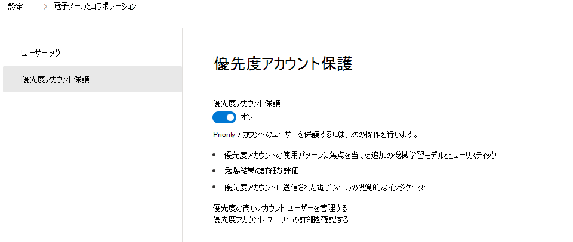
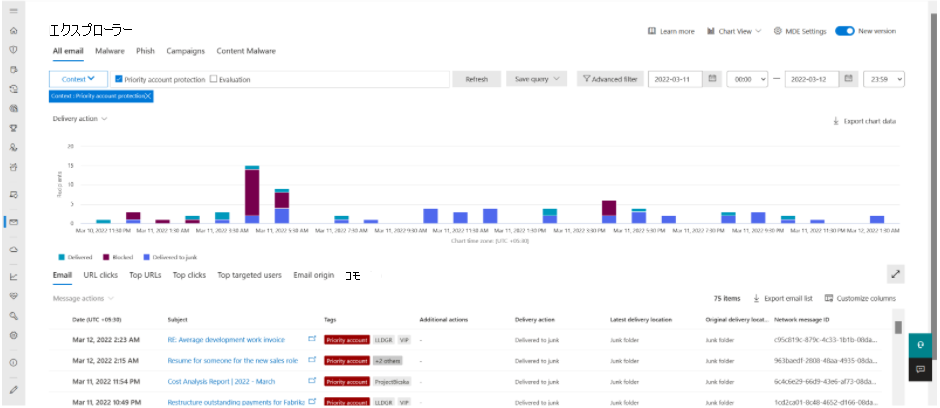

# Microsoft Defender for Office 365で優先度アカウントを構成して確認する

[!INCLUDE [Microsoft 365 Defender rebranding](../includes/microsoft-defender-for-office.md)]

**適用対象**
- [Microsoft Defender for Office 365 プラン 1 およびプラン 2](defender-for-office-365.md)
- [Microsoft 365 Defender](../defender/microsoft-365-defender.md)

どの組織でも、重要な人物 (エグゼクティブ、リーダー、マネージャー、その他のユーザーなど) が、機密性の高い、独自の、または優先度の高い情報にアクセスできます。 Microsoft Defender for Office 365内でこれらのユーザーに優先度アカウントとしてタグを付けることができます。これにより、セキュリティ チームはこれらの重要な個人に重点を置くことができます。 優先度アカウントの区別された保護により、優先度アカウントとしてタグ付けされたユーザーは、脅威に対するより高いレベルの保護を受けます。

優先度の高いアカウントは、攻撃者の対象となる頻度が高く、一般に、より高度な手法で攻撃されます。 優先度アカウントの差別化された保護は、この特定のユーザー セットに焦点を当て、強化された機械学習モデルを使用してより高いレベルの保護を提供します。 学習とメッセージ処理におけるこの区別は、これらのアカウントに対して最高レベルの保護を提供し、偽陽性率が高いほど、これらのユーザーに悪影響を及ぼす可能性があるため、低い偽陽性率を維持するのに役立ちます。

## 優先度アカウント保護を構成する

優先度アカウント保護は、事前に特定された重要なユーザーに対して既定で有効になっています。 ただし、組織のセキュリティ管理者は、次の手順に従って、優先度の高いアカウント保護を有効にすることもできます。

1. Microsoft 365 Defender ポータルの <https://security.microsoft.com>**[設定** **電子メール &** \> コラボレーション\>**の優先度アカウント保護**] に移動します。 

2. **優先度アカウント保護** を有効にします。 

    > [!div class="mx-imgBorder"]
    > 

> [!NOTE]
> 優先度の高いアカウント保護を無効または無効にすることはお勧めしません。  

### 優先度アカウント タグを有効にする

Microsoft Defender for Office 365は、アラート、レポート、および調査のフィルターとして使用できるタグとして優先度アカウントをサポートしています。

詳細については、「[Microsoft Defender for Office 365のユーザー タグ](user-tags.md)」を参照してください。

## 脅威の保護状態レポート、脅威エクスプローラー、および電子メール エンティティ ページで区別された保護を確認する

### 脅威保護の状態レポート

脅威の保護状態レポートは、悪意のあるコンテンツと、Microsoft Defender for Office 365によって検出およびブロックされた悪意のあるメールに関する情報をまとめた単一のビューです。 

Microsoft 365 Defender ポータルでレポートを表示するには、**レポート** \> **メール & コラボレーション** \> **メール & コラボレーション レポート** に移動します。 [ **電子メール & コラボレーション レポート** ] ページで、[ **脅威の保護の状態**] を探し、[ **詳細の表示**] を選択します。 **[スパム] ビュー**、**[フィッシング] ビュー**、または **[マルウェア] ビュー** のいずれかに移動し、フィルター アイコンを使用して **[優先度アカウント保護**] を選択します。

### 脅威エクスプローラー 

脅威エクスプローラー内のコンテキスト フィルターは、優先度アカウント保護がメッセージの検出に関与していた電子メールを検索するのに役立ちます。 これにより、セキュリティ運用チームは、この保護によって提供される値を確認できます。 引き続き、優先度アカウント タグでメッセージをフィルター処理して、特定のユーザー セットのすべてのメッセージを検索できます。 

追加の保護を表示するには、Microsoft 365 Defender ポータルで[**電子メール & コラボレーション** \> **エクスプローラー**] に移動し、ドロップダウンから **[コンテキスト**] を選択し、[**優先度アカウント保護**] の横にあるチェック ボックスをオンにします。 

> [!div class="mx-imgBorder"]
> 

### [メール エンティティ] ページ

電子メール エンティティ ページは、電子 **メール & コラボレーション** \> **エクスプローラー** のMicrosoft 365 Defender ポータルで<https://security.microsoft.com>利用できます。 **エクスプローラーで**、調査しているメールの件名を選択します。 そのメールの電子メール ポップアップの上部にゴールド バーが表示されます。 選択すると、新しいページが表示されます。

エンティティ ページの上部にあるタブを使用すると、電子メールを効率的に調査できます。 [ **分析** ] タブをクリックします。[脅威 **の検出の詳細**] に[優先度のアカウント保護]が表示されるようになりました。 

## 詳細

- [Microsoft Defender for Office 365のユーザー タグ](user-tags.md)
- [優先アカウントを管理および監視する](../../admin/setup/priority-accounts.md)
