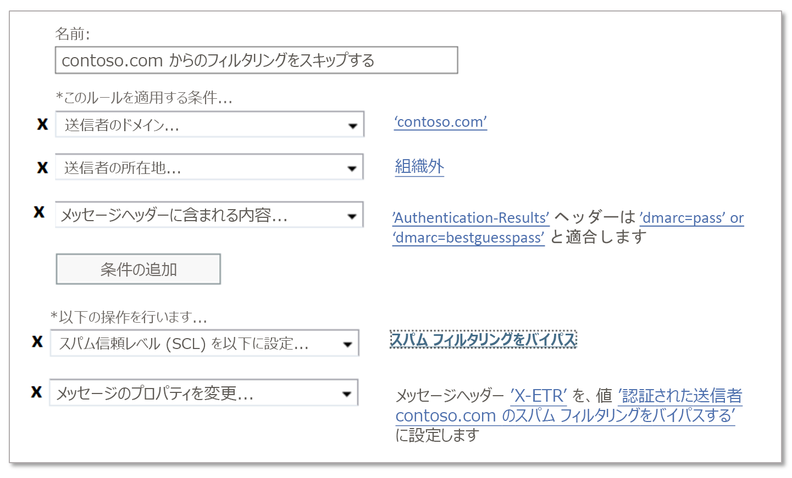

# EOP で安全な差出人のリストを作成する

[!INCLUDE [Microsoft 365 Defender rebranding](../includes/microsoft-defender-for-office.md)]

**適用対象**
- [Exchange Online Protection](exchange-online-protection-overview.md)
- [Microsoft Defender for Office 365 プラン 1 およびプラン 2](defender-for-office-365.md)
- [Microsoft 365 Defender](../defender/microsoft-365-defender.md)

Exchange Online のメールボックスを持つMicrosoft 365 のお客様、または Exchange Online メールボックスを持たないスタンドアロンの Exchange Online Protection (EOP) のお客様の場合、EOP では、信頼できる送信者からメールを確実に受け取る複数の方法が提供されます。 これらのオプションには、Exchange メール フロー ルール (トランスポート ルールとも呼ばれます)、Outlook の信頼できる差出人、IP 許可一覧 (接続フィルター処理)、スパム対策ポリシーの許可された送信者リストまたは許可されたドメイン リストが含まれます。 これらをまとめて、_信頼できる送信者リスト_ と考えることができます。

利用可能な信頼できる差出人リストは、次の一覧で最も推奨される人から最も推奨されていない人の順に記載されています。

1. メール フロー ルール
2. Outlook の信頼できる差出人。
3. IP 許可一覧 (接続フィルター ポリシー)。
4. 許可された送信者リストや許可されたドメイン リスト (スパム対策ポリシー)。

メール フロー ルールを使用すると、最も柔軟に適切なメッセージのみを許可できます。 スパム対策ポリシーで許可されている送信者と許可されたドメイン リストは、送信者のメール ドメインが簡単にスプーフィングされるため、IP 許可リストほどセキュリティで保護されてはいません。 ただし、IP 許可一覧にもリスクがあります。これは、その IP アドレスから送信される _すべて_ の ドメインからのメールは、スパム フィルターをバイパスするためです。

> [!IMPORTANT]
>
> - マルウェアまたは信頼度の高いフィッシングとして識別されたメッセージは、お使いの [信頼できる送信者リスト] オプションに関係なく、常に検疫されます。
>
> - 信頼できる差出人リストを使用してスパム フィルター処理を行う *すべて* の例外を注意深く監視してください。
>
> - 信頼できる差出人リストを使用して誤検知 (不良とマークされた適切なメール) を救済できますが、可能であれば、信頼できる差出人リストの使用を、回避する必要がある一時的な解決策として検討する必要があります。 スパム フィルター処理の例外により、組織がスプーフィングやその他のセキュリティ攻撃を受ける可能性があるため、信頼できる差出人リストを使用して誤検知を管理することはお勧めしません。 信頼できる差出人リストを使用して誤検知を管理することを強く求める場合は、警戒を怠らず、トピック[報告メッセージとファイルを Microsoft に対して](report-junk-email-messages-to-microsoft.md)常に準備しておく必要があります。
>
> - ドメインが認証されていないメールを送信できるようにする (スプーフィング対策保護をバイパスする) が、スパム対策とマルウェア対策のチェックをバイパスしないようにするには、[スプーフィング インテリジェンス分析](learn-about-spoof-intelligence.md) と [テナント許可/禁止リスト](tenant-allow-block-list.md) を使用できます。
>
> - EOP と Outlook は、さまざまなメッセージ プロパティを調べて、メッセージの送信者を特定します。 詳細については、この記事で後述する「[バルク メールの考慮事項](#considerations-for-bulk-email)」セクションを参照してください。
>

これに対し、_受信拒否リスト_ を使用して、特定のソースからのメールブロックするオプションがいくつかあります。 詳細については、「[EOP での受信拒否リストの作成](create-block-sender-lists-in-office-365.md)」を参照してください。

## (推奨)メール フロー ルールを使用する

> [!NOTE]
> メッセージ ヘッダーとメール フロー ルールを使用して、内部送信者を信頼できる差出人として指定することはできません。 このセクションの手順は、外部送信者に対してのみ適用します。

Exchange Online およびスタンドアロン EOP のメール フロー ルールでは、条件と例外を使用してメッセージとアクションを識別し、それらのメッセージに対して何を実行するかを指定します。 詳細については、「[Mail flow rules (transport rules) in Exchange Online](/Exchange/security-and-compliance/mail-flow-rules/mail-flow-rules)」を参照してください。

次の例では、contoso.com からのメールが、スパム フィルターをスキップする必要があると想定しています。 次の設定を構成します。

1. **条件**: **送信者**\>**ドメインは** \>contoso.com です。

2. 次のいずれかの設定を構成します。

   - **メール フロー ルールの条件**: **メッセージ ヘッダー**\>**には、次のいずれかの単語が含まれています**\>**ヘッダー名**: `Authentication-Results`\>**ヘッダー値**: `dmarc=pass`または `dmarc=bestguesspass`します。

     この条件は、送信側ドメインの電子メール認証状態をチェックして、送信側ドメインがスプーフィングされていないことを確認します。 メール認証の詳細については、[SPF](set-up-spf-in-office-365-to-help-prevent-spoofing.md)、[DKIM](use-dkim-to-validate-outbound-email.md)、および [DMARC](use-dmarc-to-validate-email.md) を参照してください。

   - **IP 許可リスト**: 接続フィルター ポリシーで送信元 IP アドレスまたはアドレス範囲を指定します。

     送信側ドメインがメール認証を使用しない場合は、この設定を使用します。 IP 許可一覧のソース IP アドレスに関しては、可能な限り制限を厳しくしてください。 IP アドレスの範囲は /24 以下 (低い方が良い) をお勧めします。 コンシューマー サービス (outlook.com など) または共有インフラストラクチャに属する IP アドレス範囲は使用しないでください。

   > [!IMPORTANT]
   >
   > - スパム フィルターをスキップする条件として送信者ドメイン *のみ* を使用して、メール フロー ルールを構成しないでください。 これにより、攻撃者が送信ドメインをスプーフィングする (または完全なメール アドレスを偽装する) 可能性が *大幅に* 増加し、すべてのスパム フィルター処理をスキップし、送信者認証チェックをスキップして、メッセージが受信者の受信トレイに届く可能性が大幅に高くなります。
   >
   > - メール フロー ルールの条件として、所有しているドメイン (承認済みドメインとも呼ばれます) または一般的なドメイン (microsoft.com など) を使用しないでください。 これを行うと、攻撃者が本来ならフィルター処理されるはずのメールを送信する機会が生まれるため、高リスクと見なされます。
   >
   > - ネットワーク アドレス変換 (NAT) ゲートウェイの背後にある IP アドレスを許可する場合は、IP 許可一覧のスコープを把握するために、NAT プールに関係するサーバーを把握する必要があります。 IP アドレスと NAT 参加者は変更できます。 標準的なメンテナンス手順の一環として、IP 許可一覧エントリを定期的に確認する必要があります。

3. **オプション条件**:

   - **送信者** \>**が内部 /外部** \>**組織外**: この条件は暗黙的です。 正しく構成されていない可能性があるオンプレミスのメール サーバーを考慮するために使用しても問題ありません。

   - **件名または本文**\>**件名または本文に次のいずれかの単語が含まれています**\>\<keywords\>: 件名行またはメッセージ本文のキーワードまたは語句でメッセージをさらに制限できる場合は、その単語を条件として使用できます。

4. **アクション**: ルールで次の両方のアクションを構成します。

   a. **メッセージプロパティの変更** \>**スパム信頼度レベル (SCL) の設定** \>**スパム フィルター処理をバイパスする**。

   b. **メッセージのプロパティの変更**\>**メッセージ ヘッダーの設定**:**メッセージ ヘッダーの設定** \<CustomHeaderName\> **この値に対して** \<CustomHeaderValue\>。

      たとえば、`X-ETR: Bypass spam filtering for authenticated sender 'contoso.com'` などです。 ルールに複数のドメインがある場合は、必要に応じてヘッダー テキストをカスタマイズできます。

      メール フロー ルールが原因でメッセージがスパム フィルター処理をスキップすると、値 `SFV:SKN`値が **X-Forefront-Antispam-Report** ヘッダーにスタンプされます。 メッセージが IP 許可一覧にあるソースからのメッセージの場合、値 `IPV:CAL`も追加されます。 これらの値は、トラブルシューティングに役立ちます。

## Outlook の信頼できる差出人を使用する

> [!CAUTION]
> この方法では、本来ならフィルター処理されるはずのメールを攻撃者が受信トレイに問題なく配信する危険性が高くなります。ただし、ユーザーの信頼できる差出人または安全なドメインの一覧は、マルウェアや信頼度の高いフィッシング メッセージがフィルター処理されるのを防ぐわけではありません。

組織の設定の代わりに、ユーザーまたは管理者は、メールボックスの信頼できる差出人リストに送信者のメール アドレスを追加できます。 詳細については、「[Office 365 で Exchange Online のメールボックスの迷惑メール設定を構成する](configure-junk-email-settings-on-exo-mailboxes.md)」を参照してください。 ほとんどの場合、送信者はフィルター スタックの一部をバイパスするため、これは望ましくありません。 送信者は信頼できる場合でも、送信者が侵害され、悪意のあるコンテンツを送信する可能性があります。 すべてのメッセージを確認するために必要な処理をフィルターで実行し、もしフィルターが間違っている場合は、[誤検知/否定を Microsoft に報告](report-junk-email-messages-to-microsoft.md)することをお勧めします。 フィルター スタックをバイパスすると、[ZAP](zero-hour-auto-purge.md)にも干渉します。

ユーザーの信頼できる差出人リストが原因でメッセージがスパム フィルター処理をスキップする場合、**X-Forefront-Antispam-Report** ヘッダー フィールドには `SFV:SFE`があるはずです。これは、 スパム、スプーフィング、フィッシングのフィルター処理がバイパスされたことを示す値です。

## IP 許可一覧を使用する

前述のようにメール フロー ルールを使用できない場合、次に最適なオプションは、接続フィルター ポリシーの IP 許可リストに送信元のメール サーバーまたはサーバーを追加することです。 詳細については、「[EOP での接続フィルター処理の構成](configure-the-connection-filter-policy.md)」 を参照してください。

**注**:

- 許可される IP アドレスの数を最小限に抑える必要があるため、可能な限り IP アドレス範囲全体を使用しないようにしてください。

- コンシューマー サービス (outlook.com など) または共有インフラストラクチャに属する IP アドレス範囲は使用しないでください。

- IP 許可一覧のエントリを定期的に確認し、不要になったエントリを削除します。

> [!CAUTION]
> メール フロー ルールなどの追加の検証がない場合、IP 許可リスト内のソースからのメールは、スパム フィルター処理と送信者認証 (SPF、DKIM、DMARC) チェックをスキップします。 これにより、本来ならフィルター処理されるはずのメールを攻撃者が受信トレイに問題なく配信する危険性が高くなります。ただし、IP 許可一覧では、マルウェアや信頼度の高いフィッシング メッセージがフィルター処理されるのを防ぐわけではありません。

## 許可された送信者リストまたは許可されたドメイン リストを使用する

最も望ましくないオプションは、スパム対策ポリシーで許可される送信者の一覧または許可されたドメインの一覧を使用することです。 もし可能な場合は、このオプション *を避ける必要があります。* なぜなら、送信者がすべてのスパム、スプーフィング、フィッシングからの保護、送信者認証 (SPF、DKIM、DMARC) をバイパスするからです。 この方法は、一時的なテストのみに最適です。 詳細な手順については、「[EOP でのスパム対策ポリシーの構成](configure-your-spam-filter-policies.md)」のトピックを参照してください。

これらのリストの上限は約 1,000 エントリです。ただし、ポータルには 30 個までしかエントリできません。 30 を超えるエントリを追加するには、PowerShell を使用する必要があります。

> [!CAUTION]
>
> - この方法では、本来ならフィルター処理されるはずのメールを攻撃者が受信トレイに問題なく配信する危険性が高くなります。ただし、許可された差出人または許可されたドメインの一覧は、マルウェアや信頼度の高いフィッシング メッセージがフィルター処理されるのを防ぐわけではありません。
>
> - 自分が所有するドメイン (承認済みドメインとも呼ばれます) または一般的なドメイン (microsoft.com など) は、許可されたドメイン リストで使用しないでください。

## バルク メールに関する考慮事項

標準的な SMTP 電子メール メッセージは、*メッセージ エンベロープ* とメッセージのコンテンツで構成されます。 メッセージ エンベロープには、SMTP サーバー間でのメッセージの送信と配信に必要な情報が含まれています。 メッセージのコンテンツには、総称して "*メッセージ ヘッダー*" と呼ばれるメッセージ ヘッダー フィールドと、メッセージ本文があります。 メッセージ エンベロープは RFC 5321 で定義され、メッセージ ヘッダーは RFC 5322 で定義されます。 メッセージ エンベロープはメッセージ送信プロセスによって生成されるもので、実際にはメッセージの一部ではないため、受信者がメッセージ エンベロープを目にすることはありません。

- `5321.MailFrom`アドレス (**MAIL FROM** アドレス、P1 送信者、またはエンベロープ送信者とも呼ばれます) は、メッセージの SMTP 送信で使用されるメール アドレスです。 このメール アドレスは通常、メッセージ ヘッダーの **Return-Path** ヘッダー フィールドに記録されます (ただし、送信者は別の **Return-Path** メール アドレスを指定できます)。 メッセージを配信できない場合は、配信不能レポート (NDR またはバウンス メッセージとも呼ばれます) を受信します。

- `5322.From` (**差出人** アドレスまたは P2 送信者とも呼ばれます) は、[**差出人** ヘッダー] フィールドのメール アドレスであり、メール クライアントに表示される送信者のメール アドレスです。

多くの場合、`5321.MailFrom`と`5322.From`のアドレスは同じです (対人通信)。 ただし、他のユーザーに代わってメールが送信される場合は、これらのアドレスが異なるのが普通です。 大部分のバルク メール メッセージでは、ほとんどの場合にそのようになります。

たとえば、Blue Yonder Airlines がメール広告を送信するために Margie's Travel を採用したとします。 受信トレイで受信するメッセージには、次のプロパティがあります。

- `5321.MailFrom`アドレスが blueyonder.airlines@margiestravel.com です。

- `5322.From`アドレスが blueyonder@news.blueyonderairlines.com として Outlook に表示されます。

EOP のスパム対策ポリシーの信頼できる差出人リストと安全なドメイン リストは、`5322.From`アドレスのみを検査します。これは、`5322.From`アドレスを使用する Outlook の信頼できる差出人と同様です。

このメッセージがフィルター処理されないようにするには、次の手順を実行します。

- Blueyonder@news.blueyonderairlines.com (`5322.From`アドレス) を Outlook の信頼できる差出人として追加します。

- [メール フロー ルールを使用します](#recommended-use-mail-flow-rules)blueyonder@news.blueyonderairlines.com からのメッセージを検索する条件を指定します (`5322.From`アドレス、 blueyonder.airlines@margiestravel.com (`5321.MailFrom`)、またはその両方。

詳細については、「[EOP での信頼できる差出人リストの作成](create-safe-sender-lists-in-office-365.md)」を参照してください。
